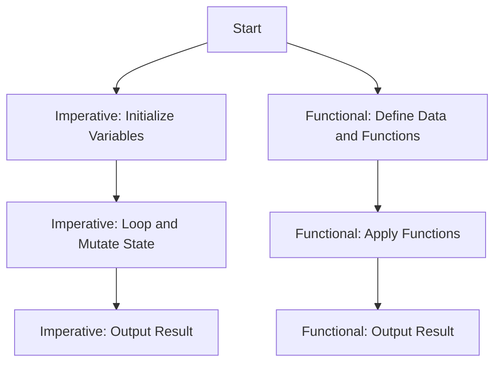

## 1.1 From Imperative to Functional Programming

The journey from imperative to functional programming represents a significant paradigm shift. In imperative programming, exemplified by languages like Java, code is written as a sequence of commands that change program state. Developers are accustomed to managing mutable variables, using loops for iteration, and relying heavily on object-oriented principles.

Functional programming, on the other hand, emphasizes:

- **Immutability**: Data structures that cannot be modified after creation.
- **Pure Functions**: Functions that always produce the same output given the same input and have no side effects.
- **First-Class Functions**: Functions that can be treated like any other variable—passed as arguments, returned from other functions, and stored in data structures.
- **Declarative Style**: Focusing on what needs to be done rather than how to do it, leading to more concise and expressive code.

This shift requires a new way of thinking about code structure and state management. Embracing functional programming can lead to more predictable, testable, and maintainable codebases.

### Understanding the Imperative Paradigm

In Java, the imperative paradigm is characterized by explicit instructions that modify the program's state. Let's consider a simple example of calculating the sum of an array of integers:

```java
// Java: Sum of an array using imperative style
int[] numbers = {1, 2, 3, 4, 5};
int sum = 0;
for (int number : numbers) {
    sum += number; // Mutating the sum variable
}
System.out.println("Sum: " + sum);
```

In this example, we see a loop iterating over the array, with the `sum` variable being mutated at each step. This approach is straightforward but can lead to complex state management as applications grow.

### Embracing Functional Programming

Functional programming in Clojure offers a different approach. It encourages the use of immutable data structures and pure functions, which can lead to more robust and maintainable code. Here's how you would calculate the sum of an array in Clojure:

```clojure
;; Clojure: Sum of a collection using functional style
(def numbers [1 2 3 4 5])
(def sum (reduce + numbers)) ; Using reduce to calculate the sum
(println "Sum:" sum)
```

In this Clojure example, we use the `reduce` function to accumulate the sum without mutating any variables. The `+` function is passed as an argument to `reduce`, demonstrating the use of first-class functions.

### Key Concepts in Functional Programming

#### Immutability

Immutability is a cornerstone of functional programming. In Clojure, once a data structure is created, it cannot be changed. This immutability simplifies reasoning about code and enhances concurrency, as there are no race conditions or side effects from shared mutable state.

**Example of Immutability in Clojure:**

```clojure
;; Clojure: Immutable data structures
(def original-list [1 2 3])
(def new-list (conj original-list 4)) ; Creates a new list with 4 added
(println "Original List:" original-list) ; [1 2 3]
(println "New List:" new-list) ; [1 2 3 4]
```

In this example, `conj` returns a new list with the additional element, leaving the original list unchanged.

#### Pure Functions

Pure functions are functions where the output is determined only by the input values, without observable side effects. This predictability makes them easier to test and reason about.

**Example of a Pure Function:**

```clojure
;; Clojure: Pure function example
(defn add [a b]
  (+ a b))

(println "Result:" (add 2 3)) ; Always returns 5
```

The `add` function is pure because it always returns the same result for the same inputs and does not modify any external state.

#### First-Class Functions

In Clojure, functions are first-class citizens, meaning they can be passed as arguments, returned from other functions, and assigned to variables.

**Example of First-Class Functions:**

```clojure
;; Clojure: Passing functions as arguments
(defn apply-function [f x]
  (f x))

(println "Square of 4:" (apply-function #(* % %) 4)) ; Passing a lambda function
```

Here, `apply-function` takes a function `f` and a value `x`, applying `f` to `x`. The lambda function `#(* % %)` is passed to square the number.

### Declarative vs. Imperative

Functional programming encourages a declarative style, focusing on what needs to be done rather than how to do it. This can lead to more concise and expressive code.

**Imperative vs. Declarative Example:**

```java
// Java: Imperative style to filter even numbers
List<Integer> numbers = Arrays.asList(1, 2, 3, 4, 5);
List<Integer> evens = new ArrayList<>();
for (int number : numbers) {
    if (number % 2 == 0) {
        evens.add(number);
    }
}
System.out.println("Even numbers: " + evens);
```

```clojure
;; Clojure: Declarative style to filter even numbers
(def numbers [1 2 3 4 5])
(def evens (filter even? numbers)) ; Using filter with a predicate
(println "Even numbers:" evens)
```

In the Clojure example, the `filter` function is used declaratively to select even numbers, making the code more readable and concise.

### Visualizing the Paradigm Shift

To better understand the transition from imperative to functional programming, let's visualize the flow of data and control in both paradigms.



**Diagram Caption:** This diagram illustrates the flow of control in imperative vs. functional programming. In imperative programming, the focus is on mutating state through loops, while functional programming emphasizes defining and applying functions to data.

### Try It Yourself

To deepen your understanding, try modifying the Clojure examples:

1. **Modify the Sum Example**: Change the collection to include negative numbers and observe how `reduce` handles them.
2. **Create a New Pure Function**: Write a function that multiplies two numbers and test it with different inputs.
3. **Experiment with First-Class Functions**: Pass different lambda functions to `apply-function` and see the results.

### Exercises

1. **Refactor Java Code to Clojure**: Take a simple Java program that uses loops and mutable variables, and refactor it into Clojure using functional programming principles.
2. **Implement a Pure Function**: Write a Clojure function that calculates the factorial of a number using recursion and ensure it is pure.
3. **Explore Immutability**: Create a Clojure program that demonstrates the benefits of immutability in a multithreaded environment.

### Key Takeaways

- **Immutability** and **pure functions** are fundamental to functional programming, offering benefits in predictability and concurrency.
- **First-class functions** enable powerful abstractions and code reuse.
- The **declarative style** of functional programming leads to more concise and expressive code.
- Transitioning from Java to Clojure involves embracing these functional concepts to create more robust and maintainable applications.

For further reading, explore the [Official Clojure Documentation](https://clojure.org/reference/documentation) and [ClojureDocs](https://clojuredocs.org/).

---

## Quiz: Understanding the Shift from Imperative to Functional Programming



### What is a key characteristic of functional programming?

- [x] Immutability
- [ ] Mutable state
- [ ] Object-oriented design
- [ ] Procedural loops

> **Explanation:** Functional programming emphasizes immutability, where data structures cannot be modified after creation.

### Which of the following is a pure function?

- [x] A function that returns the same output for the same input without side effects
- [ ] A function that modifies a global variable
- [ ] A function that reads from a file
- [ ] A function that logs to the console

> **Explanation:** A pure function always returns the same output for the same input and does not cause side effects.

### How does Clojure handle data structures?

- [x] Immutably
- [ ] Mutably
- [ ] Through pointers
- [ ] By reference

> **Explanation:** Clojure handles data structures immutably, meaning they cannot be changed after creation.

### What is a first-class function?

- [x] A function that can be passed as an argument, returned from another function, and assigned to a variable
- [ ] A function that is defined at the top of a file
- [ ] A function that cannot be nested
- [ ] A function that is only used once

> **Explanation:** First-class functions can be passed around like any other variable, allowing for flexible and reusable code.

### Which style does functional programming encourage?

- [x] Declarative
- [ ] Imperative
- [ ] Procedural
- [ ] Object-oriented

> **Explanation:** Functional programming encourages a declarative style, focusing on what needs to be done rather than how to do it.

### What is the benefit of using pure functions?

- [x] Predictability and ease of testing
- [ ] Increased complexity
- [ ] More side effects
- [ ] Less code reuse

> **Explanation:** Pure functions are predictable and easy to test because they always produce the same output for the same input.

### How does Clojure's `reduce` function work?

- [x] It accumulates a result by applying a function to each element of a collection
- [ ] It modifies each element of a collection in place
- [ ] It sorts a collection
- [ ] It filters a collection

> **Explanation:** The `reduce` function in Clojure applies a function to each element of a collection to accumulate a result.

### What is a key difference between Java and Clojure?

- [x] Java uses mutable state, while Clojure emphasizes immutability
- [ ] Java is a functional language, while Clojure is imperative
- [ ] Java does not support object-oriented programming
- [ ] Clojure does not support functional programming

> **Explanation:** Java typically uses mutable state, whereas Clojure emphasizes immutability and functional programming.

### Which of the following is NOT a feature of functional programming?

- [ ] Immutability
- [ ] Pure functions
- [x] Mutable state
- [ ] First-class functions

> **Explanation:** Mutable state is not a feature of functional programming; instead, it emphasizes immutability.

### True or False: In functional programming, functions can be treated as data.

- [x] True
- [ ] False

> **Explanation:** In functional programming, functions are first-class citizens and can be treated as data, allowing them to be passed around and manipulated like any other data type.


