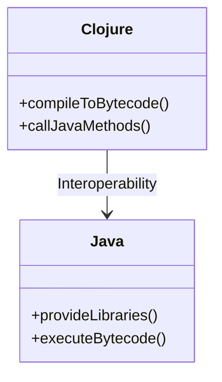
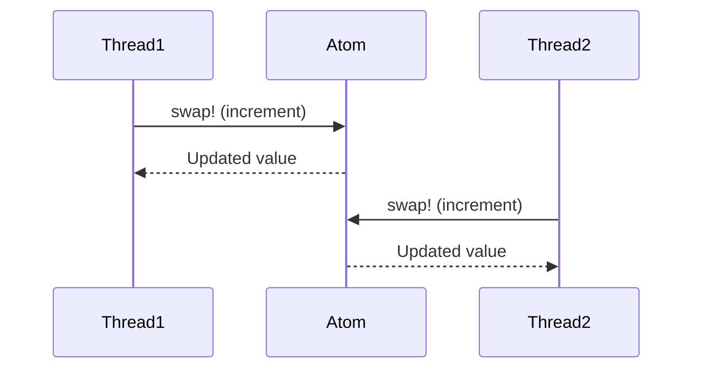
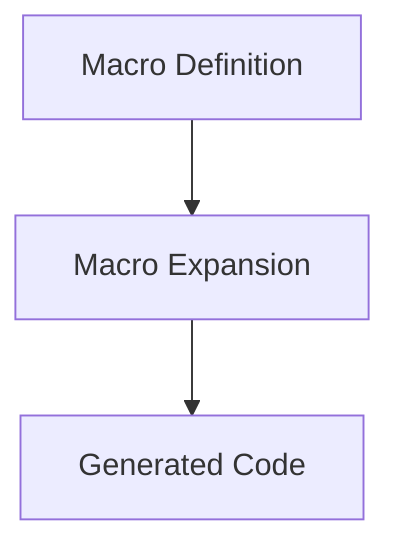

## 1.2 Why Clojure for Java Developers?

As a Java developer, you are already familiar with the power and flexibility of the Java Virtual Machine (JVM). Clojure, a modern Lisp dialect, offers a compelling reason to explore functional programming while leveraging your existing Java knowledge. In this section, we will delve into why Clojure is an excellent choice for Java developers, focusing on its JVM compatibility, simplicity, concurrency support, and rich feature set.

### Clojure on the JVM: Seamless Integration

One of the most significant advantages of Clojure is its ability to run on the JVM. This means that Clojure compiles to Java bytecode, allowing you to seamlessly integrate it with existing Java code and libraries. You can utilize the vast Java ecosystem while enjoying Clojure's functional programming features.

#### Code Example: Interoperability with Java

Let's look at a simple example of calling a Java method from Clojure:

```clojure
(ns example.core)

;; Importing Java classes
(import '(java.util Date))

(defn current-time []
  ;; Creating a new Date object
  (let [now (Date.)]
    ;; Calling a method on the Java object
    (.toString now)))

;; Usage
(println (current-time))
```

In this example, we import the `java.util.Date` class and use it within a Clojure function. The `(.toString now)` syntax demonstrates how you can call Java methods directly from Clojure.

#### Diagram: Clojure and Java Interoperability



*Diagram 1: This diagram illustrates the interoperability between Clojure and Java, highlighting how Clojure compiles to bytecode and interacts with Java libraries.*

### Simplicity and Power: A Modern Lisp

Clojure's syntax is simple yet powerful, drawing from the Lisp family of languages. Its minimalist design reduces boilerplate code and emphasizes developer productivity. This simplicity allows you to focus on solving problems rather than wrestling with complex syntax.

#### Code Example: Simple Clojure Syntax

Consider the following Clojure code that calculates the sum of a list of numbers:

```clojure
(defn sum [numbers]
  ;; Using reduce to sum the numbers
  (reduce + numbers))

;; Usage
(println (sum [1 2 3 4 5]))  ;; Output: 15
```

This example demonstrates how Clojure's concise syntax allows you to express complex operations with minimal code. The `reduce` function is a higher-order function that applies the `+` operator across the list of numbers.

### Concurrency Support: Simplifying Multi-threaded Programming

Concurrency is a critical aspect of modern software development, and Clojure excels in this area. Its core language features are designed with concurrency in mind, providing immutable data structures and concurrency primitives that simplify multi-threaded programming.

#### Code Example: Using Atoms for Concurrency

Atoms in Clojure provide a way to manage shared, mutable state in a thread-safe manner. Here's an example:

```clojure
(def counter (atom 0))

(defn increment-counter []
  ;; Using swap! to update the atom's value
  (swap! counter inc))

;; Usage
(increment-counter)
(println @counter)  ;; Output: 1
```

In this example, we use an atom to manage a counter's state. The `swap!` function safely updates the atom's value, ensuring thread safety.

#### Diagram: Concurrency with Atoms



*Diagram 2: This sequence diagram illustrates how multiple threads can safely update an atom's value using the `swap!` function.*

### Rich Set of Features: Macros, Protocols, and More

Clojure includes sophisticated features like macros for metaprogramming, protocols for polymorphism, and a robust standard library for data manipulation. These features provide powerful abstractions that enhance your ability to write expressive and efficient code.

#### Code Example: Defining a Macro

Macros in Clojure allow you to extend the language by defining new syntactic constructs. Here's a simple macro example:

```clojure
(defmacro unless [condition & body]
  ;; Expanding into an if expression
  `(if (not ~condition)
     (do ~@body)))

;; Usage
(unless false
  (println "This will print because the condition is false."))
```

In this example, the `unless` macro expands into an `if` expression, providing a more intuitive way to express conditional logic.

#### Diagram: Macro Expansion



*Diagram 3: This diagram shows the process of macro expansion, where a macro definition is transformed into executable code.*

### Leveraging Java Knowledge: Gradual Adoption

By leveraging your existing Java knowledge, you can gradually adopt Clojure in your projects. You can intermix Java and Clojure code, incrementally reaping the benefits of functional programming. This approach allows you to transition smoothly without a complete overhaul of your existing codebase.

#### Code Example: Mixing Java and Clojure

Here's an example of a Clojure function that uses a Java library for logging:

```clojure
(ns example.logging
  (:import (org.slf4j LoggerFactory)))

(def logger (LoggerFactory/getLogger "example"))

(defn log-message [message]
  ;; Using a Java logging library
  (.info logger message))

;; Usage
(log-message "Hello from Clojure!")
```

In this example, we import the `org.slf4j.LoggerFactory` class and use it to log messages from Clojure. This demonstrates how you can leverage existing Java libraries within your Clojure code.

### Try It Yourself: Experiment with Clojure

Now that we've explored why Clojure is an excellent choice for Java developers, let's encourage you to try it yourself. Modify the code examples provided to experiment with Clojure's features. For instance, try creating a new macro or using a different Java library within your Clojure code.

### Exercises

1. **Interoperability Exercise**: Modify the `current-time` function to format the date using Java's `SimpleDateFormat` class.
2. **Concurrency Exercise**: Create a Clojure function that uses an atom to manage a shared list of tasks. Implement functions to add and remove tasks concurrently.
3. **Macro Exercise**: Define a macro that logs the execution time of a block of code. Use this macro to measure the performance of a Clojure function.

### Key Takeaways

- **JVM Compatibility**: Clojure runs on the JVM, allowing seamless integration with Java code and libraries.
- **Simplicity and Power**: Clojure's minimalist syntax and powerful abstractions enhance developer productivity.
- **Concurrency Support**: Clojure's immutable data structures and concurrency primitives simplify multi-threaded programming.
- **Rich Features**: Macros, protocols, and a robust standard library provide powerful tools for writing expressive code.
- **Gradual Adoption**: Leverage your Java knowledge to gradually adopt Clojure in your projects.

By embracing Clojure, you can enhance your development skills and explore the benefits of functional programming on the JVM.

For further reading, check out the [Official Clojure Documentation](https://clojure.org/) and [ClojureDocs](https://clojuredocs.org/).

## Quiz: Test Your Understanding of Clojure for Java Developers



### What is one of the main advantages of Clojure running on the JVM?

- [x] Seamless integration with Java libraries
- [ ] Faster execution than Java
- [ ] Automatic memory management
- [ ] Built-in GUI support

> **Explanation:** Clojure's ability to run on the JVM allows it to integrate seamlessly with existing Java libraries and code.

### How does Clojure's syntax compare to Java's?

- [x] Clojure has a simpler and more concise syntax
- [ ] Clojure is more verbose than Java
- [ ] Clojure syntax is identical to Java
- [ ] Clojure requires more boilerplate code

> **Explanation:** Clojure's syntax is simpler and more concise, reducing boilerplate and enhancing productivity.

### What feature of Clojure helps simplify multi-threaded programming?

- [x] Immutable data structures
- [ ] Dynamic typing
- [ ] Object-oriented design
- [ ] Built-in GUI libraries

> **Explanation:** Clojure's immutable data structures and concurrency primitives simplify multi-threaded programming.

### What is a macro in Clojure?

- [x] A tool for metaprogramming that allows code transformation
- [ ] A data structure for storing key-value pairs
- [ ] A function for handling exceptions
- [ ] A library for GUI development

> **Explanation:** Macros in Clojure are used for metaprogramming, allowing developers to transform code.

### How can Java developers gradually adopt Clojure?

- [x] By intermixing Java and Clojure code
- [ ] By rewriting all Java code in Clojure at once
- [ ] By using Clojure only for GUI development
- [ ] By avoiding Java libraries

> **Explanation:** Java developers can gradually adopt Clojure by intermixing Java and Clojure code, leveraging existing Java libraries.

### What is the purpose of the `swap!` function in Clojure?

- [x] To update the value of an atom safely
- [ ] To define a new function
- [ ] To create a new namespace
- [ ] To handle exceptions

> **Explanation:** The `swap!` function is used to safely update the value of an atom in Clojure.

### Which of the following is a concurrency primitive in Clojure?

- [x] Atoms
- [ ] Classes
- [ ] Interfaces
- [ ] Threads

> **Explanation:** Atoms are a concurrency primitive in Clojure used to manage shared, mutable state.

### What does the `reduce` function do in Clojure?

- [x] It applies a function across a collection to produce a single result
- [ ] It creates a new collection from existing elements
- [ ] It filters elements from a collection
- [ ] It sorts a collection

> **Explanation:** The `reduce` function in Clojure applies a function across a collection to produce a single result.

### What is the role of protocols in Clojure?

- [x] To provide polymorphism
- [ ] To manage memory allocation
- [ ] To handle exceptions
- [ ] To define GUI components

> **Explanation:** Protocols in Clojure provide polymorphism, allowing different data types to implement the same interface.

### True or False: Clojure can only be used for backend development.

- [ ] True
- [x] False

> **Explanation:** False. Clojure can be used for both backend and frontend development, especially with ClojureScript for the frontend.


