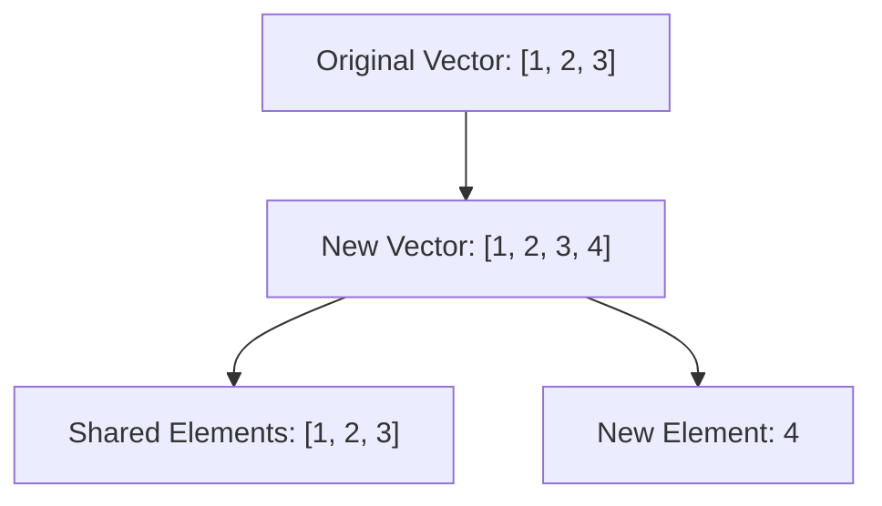

## 1.3.1 Immutable Data Structures

As experienced Java developers, you're likely accustomed to mutable data structures where changes are made in place. In contrast, Clojure's immutable data structures offer a paradigm shift that enhances code safety, simplifies concurrency, and improves maintainability. Let's delve into the world of immutability in Clojure, exploring its benefits and how it compares to Java's mutable approach.

### Understanding Immutability

In Clojure, core data structures—**lists**, **vectors**, **maps**, and **sets**—are immutable by default. This means that once a data structure is created, it cannot be changed. Instead of modifying data in place, operations on these structures produce new versions with the desired changes. This immutability leads to safer code with fewer side effects, simplifying reasoning about program behavior and enhancing concurrency safety.

#### Why Immutability?

Immutability offers several advantages:

- **Predictability**: Since data structures cannot change, functions that operate on them are easier to reason about.
- **Concurrency**: Immutable data structures eliminate the need for locks, reducing the complexity of concurrent programming.
- **Safety**: With no side effects, functions are less likely to introduce bugs related to unintended data modifications.

### Immutable Data Structures in Clojure

Let's explore Clojure's immutable data structures and how they compare to Java's mutable counterparts.

#### Lists

Clojure lists are linked lists, optimized for sequential access. They are similar to Java's `LinkedList`, but immutable.

```clojure
(def my-list '(1 2 3)) ; Define an immutable list
(def new-list (cons 0 my-list)) ; Add an element to the front
```

In Java, you might use a `LinkedList` and modify it directly:

```java
List<Integer> myList = new LinkedList<>(Arrays.asList(1, 2, 3));
myList.add(0, 0); // Modifies the list in place
```

#### Vectors

Vectors in Clojure are similar to Java's `ArrayList`, providing efficient random access and updates.

```clojure
(def my-vector [1 2 3]) ; Define an immutable vector
(def new-vector (conj my-vector 4)) ; Add an element to the end
```

In Java, an `ArrayList` is mutable:

```java
List<Integer> myVector = new ArrayList<>(Arrays.asList(1, 2, 3));
myVector.add(4); // Modifies the list in place
```

#### Maps

Clojure maps are akin to Java's `HashMap`, but immutable.

```clojure
(def my-map {:a 1 :b 2}) ; Define an immutable map
(def new-map (assoc my-map :c 3)) ; Add a key-value pair
```

In Java, a `HashMap` is mutable:

```java
Map<String, Integer> myMap = new HashMap<>();
myMap.put("a", 1);
myMap.put("b", 2);
myMap.put("c", 3); // Modifies the map in place
```

#### Sets

Clojure sets are similar to Java's `HashSet`, providing unique elements.

```clojure
(def my-set #{1 2 3}) ; Define an immutable set
(def new-set (conj my-set 4)) ; Add an element
```

In Java, a `HashSet` is mutable:

```java
Set<Integer> mySet = new HashSet<>(Arrays.asList(1, 2, 3));
mySet.add(4); // Modifies the set in place
```

### Structural Sharing and Performance

One might wonder how Clojure achieves efficiency with immutable data structures. The answer lies in **structural sharing**. When a new version of a data structure is created, it shares as much of the existing structure as possible, minimizing memory usage and improving performance.

#### Example of Structural Sharing

Consider adding an element to a vector:

```clojure
(def original-vector [1 2 3])
(def new-vector (conj original-vector 4)) ; [1 2 3 4]
```

Here, `new-vector` shares the first three elements with `original-vector`, only adding the new element to the end.

### Visualizing Immutability

To better understand how immutability and structural sharing work, let's visualize the process using a diagram.



**Diagram Explanation**: The diagram illustrates how the new vector shares elements with the original vector, only adding the new element separately.

### Immutability in Practice

Let's explore a practical example to see how immutability can simplify code.

#### Example: Managing a Shopping Cart

Imagine a shopping cart application where items can be added or removed. In Java, you might use a mutable list to manage the cart:

```java
List<String> cart = new ArrayList<>();
cart.add("Apple");
cart.add("Banana");
cart.remove("Apple");
```

In Clojure, you can achieve the same functionality with immutable data structures. Below are two approaches depending on your needs:

1) Using a Vector (order preserved, duplicates allowed):
```clojure
;; Start with an empty vector
(def cart [])

;; conj appends items to the vector
(def updated-cart (conj cart "Apple" "Banana"))
;; => ["Apple" "Banana"]

;; To remove an item by value, use 'remove' and re-wrap into a vector
(def final-cart (vec (remove #(= % "Apple") updated-cart)))
;; => ["Banana"]
```

2) Using a Set (unique items, no ordering):
```clojure
;; Start with an empty set
(def cart #{})

;; conj adds items to the set
(def updated-cart (conj cart "Apple" "Banana"))
;; => #{"Apple" "Banana"}

;; disj removes items from a set
(def final-cart (disj updated-cart "Apple"))
;; => #{"Banana"}
```
--------------------------------------------------------------------------------

In the vector-based approach, remove returns a lazy sequence, so wrapping it with vec is a convenient way to keep the result as a vector. If you prefer unique items and are okay without a strict order, a set plus conj/disj is the simplest.


**Try It Yourself**: Modify the Clojure example to add more items to the cart and observe how the original `cart` remains unchanged.

### Comparing Immutability in Java and Clojure

While Java has introduced immutable collections in recent versions, Clojure's immutability is more deeply integrated into the language's design. This integration encourages a functional programming style, leading to more predictable and maintainable code.

#### Java's Immutable Collections

Java's `Collections.unmodifiableList` provides a way to create immutable views of collections:

```java
List<String> list = new ArrayList<>(Arrays.asList("a", "b", "c"));
List<String> immutableList = Collections.unmodifiableList(list);
```

However, this approach only prevents modifications through the immutable view. The underlying list remains mutable.

### Exercises and Practice Problems

1. **Exercise**: Create a Clojure map representing a student's grades. Add a new subject and grade, and verify that the original map remains unchanged.
2. **Challenge**: Implement a function that takes a vector of numbers and returns a new vector with each number incremented by one, without modifying the original vector.

### Key Takeaways

- Clojure's immutable data structures provide a safer, more predictable programming model.
- Immutability simplifies concurrency by eliminating the need for locks.
- Structural sharing ensures that immutable operations are efficient.
- While Java offers immutable collections, Clojure's immutability is more deeply integrated, promoting a functional programming style.

### Further Reading

- [Official Clojure Documentation](https://clojure.org/reference/data_structures)
- [ClojureDocs: Immutable Data Structures](https://clojuredocs.org/quickref#ImmutableDataStructures)
- [GitHub: Clojure Source Code](https://github.com/clojure/clojure)

Now that we've explored how immutable data structures work in Clojure, let's apply these concepts to manage state effectively in your applications.

## Quiz: Mastering Immutable Data Structures in Clojure



### What is a key advantage of immutable data structures in Clojure?

- [x] They simplify reasoning about code.
- [ ] They allow direct modification of data.
- [ ] They require more memory.
- [ ] They are slower than mutable structures.

> **Explanation:** Immutable data structures simplify reasoning about code by ensuring that data cannot change unexpectedly.

### How does Clojure achieve efficiency with immutable data structures?

- [x] Through structural sharing.
- [ ] By copying the entire data structure.
- [ ] By using mutable elements.
- [ ] By avoiding data structures altogether.

> **Explanation:** Clojure uses structural sharing to minimize memory usage and improve performance when creating new versions of data structures.

### Which Clojure data structure is similar to Java's `ArrayList`?

- [x] Vector
- [ ] List
- [ ] Map
- [ ] Set

> **Explanation:** Clojure's vector is similar to Java's `ArrayList`, providing efficient random access and updates.

### What happens when you add an element to a Clojure vector?

- [x] A new vector is created with the added element.
- [ ] The original vector is modified.
- [ ] The element is ignored.
- [ ] An error is thrown.

> **Explanation:** In Clojure, adding an element to a vector creates a new vector, leaving the original unchanged.

### How can you create an immutable view of a list in Java?

- [x] Using `Collections.unmodifiableList()`
- [ ] Using `ArrayList`
- [ ] Using `LinkedList`
- [ ] Using `HashMap`

> **Explanation:** Java's `Collections.unmodifiableList()` creates an immutable view of a list, preventing modifications through the view.

### What is structural sharing?

- [x] Reusing parts of a data structure to create new versions efficiently.
- [ ] Copying the entire data structure for each change.
- [ ] Modifying data in place.
- [ ] Avoiding data structures.

> **Explanation:** Structural sharing involves reusing parts of a data structure to create new versions efficiently, minimizing memory usage.

### Which Clojure data structure provides unique elements similar to Java's `HashSet`?

- [x] Set
- [ ] List
- [ ] Vector
- [ ] Map

> **Explanation:** Clojure's set provides unique elements, similar to Java's `HashSet`.

### What is a benefit of immutability in concurrent programming?

- [x] It eliminates the need for locks.
- [ ] It increases the complexity of code.
- [ ] It requires more synchronization.
- [ ] It makes code less predictable.

> **Explanation:** Immutability eliminates the need for locks in concurrent programming, simplifying code and reducing complexity.

### How does Clojure's immutability compare to Java's?

- [x] Clojure's immutability is more deeply integrated into the language.
- [ ] Java's immutability is more deeply integrated into the language.
- [ ] Both languages have the same level of immutability integration.
- [ ] Neither language supports immutability.

> **Explanation:** Clojure's immutability is more deeply integrated into the language, promoting a functional programming style.

### True or False: In Clojure, operations on data structures modify them in place.

- [ ] True
- [x] False

> **Explanation:** False. In Clojure, operations on data structures create new versions, leaving the original unchanged.


