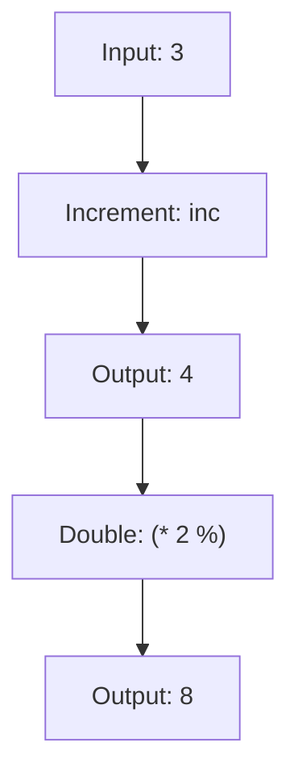

## 1.3.2 First-Class and Higher-Order Functions

In Clojure, functions are first-class citizens, meaning they can be treated like any other data type. This concept is a cornerstone of functional programming, allowing functions to be passed as arguments, returned from other functions, and stored in variables or data structures. This capability leads to the creation of higher-order functions—functions that take other functions as arguments or return them as results. Higher-order functions enable powerful abstractions and promote code reuse, making your code more expressive and concise.

### Understanding First-Class Functions

First-class functions are functions that can be treated as values. In Clojure, this means you can assign functions to variables, pass them as arguments to other functions, and return them from functions. This flexibility allows for a more modular and reusable codebase.

#### Key Characteristics of First-Class Functions

- **Assignment to Variables**: Functions can be assigned to variables, allowing them to be passed around like any other data type.
- **Function Arguments**: Functions can be passed as arguments to other functions, enabling dynamic behavior.
- **Return Values**: Functions can return other functions, allowing for the creation of complex operations through composition.

#### Example: Assigning Functions to Variables

```clojure
(def add-one inc) ; Assigning the 'inc' function to 'add-one'
(add-one 5) ; Returns 6
```

In this example, we assign the `inc` function, which increments a number by one, to the variable `add-one`. We can then use `add-one` just like any other function.

### Higher-Order Functions

Higher-order functions are functions that operate on other functions. They can take functions as arguments, return functions, or both. This concept is fundamental in Clojure and functional programming in general, as it allows for the creation of flexible and reusable code.

#### Example: A Simple Higher-Order Function

```clojure
(defn apply-twice [f x]
  (f (f x)))

(apply-twice inc 5) ; Returns 7
```

In this example, `apply-twice` is a higher-order function that takes a function `f` and a value `x` as arguments. It applies `f` to `x` twice. When we call `(apply-twice inc 5)`, it increments 5 twice, resulting in 7.

### Comparing with Java

In Java, functions are not first-class citizens. However, with the introduction of lambda expressions in Java 8, Java developers can achieve similar functionality. Let's compare how you might implement a similar concept in Java.

#### Java Example: Using Lambda Expressions

```java
import java.util.function.Function;

public class HigherOrderFunctionExample {
    public static void main(String[] args) {
        Function<Integer, Integer> inc = x -> x + 1;
        System.out.println(applyTwice(inc, 5)); // Outputs 7
    }

    public static Integer applyTwice(Function<Integer, Integer> f, Integer x) {
        return f.apply(f.apply(x));
    }
}
```

In this Java example, we use a `Function` interface to create a lambda expression that increments a number. The `applyTwice` method takes a function and a value, applying the function twice to the value.

### Advantages of First-Class and Higher-Order Functions

- **Code Reusability**: Functions can be reused across different parts of your application, reducing duplication.
- **Modularity**: Functions can be composed to create complex operations from simple building blocks.
- **Expressiveness**: Code becomes more expressive and easier to understand, as operations can be abstracted into higher-order functions.

### Common Higher-Order Functions in Clojure

Clojure provides several built-in higher-order functions that are commonly used for data manipulation and transformation.

#### `map`: Transforming Collections

The `map` function applies a given function to each element of a collection, returning a new collection of the results.

```clojure
(map inc [1 2 3 4]) ; Returns (2 3 4 5)
```

In this example, `map` applies the `inc` function to each element of the vector `[1 2 3 4]`, resulting in a new sequence `(2 3 4 5)`.

#### `reduce`: Aggregating Data

The `reduce` function applies a function of two arguments cumulatively to the elements of a collection, from left to right, so as to reduce the collection to a single value.

```clojure
(reduce + [1 2 3 4]) ; Returns 10
```

Here, `reduce` uses the `+` function to sum the elements of the vector `[1 2 3 4]`, resulting in 10.

#### `filter`: Selecting Elements

The `filter` function returns a sequence of the items in a collection for which a predicate function returns true.

```clojure
(filter even? [1 2 3 4]) ; Returns (2 4)
```

In this example, `filter` selects the even numbers from the vector `[1 2 3 4]`.

### Function Composition

Function composition is the process of combining two or more functions to produce a new function. In Clojure, you can use the `comp` function to compose functions.

#### Example: Composing Functions

```clojure
(def add-one-and-double (comp #(* 2 %) inc))
(add-one-and-double 3) ; Returns 8
```

In this example, `add-one-and-double` is a composed function that first increments a number and then doubles it. When applied to 3, it returns 8.

### Visualizing Function Composition

Below is a diagram illustrating the flow of data through the composed function `add-one-and-double`.



**Diagram Caption:** This diagram shows how the input value 3 is first incremented to 4 and then doubled to 8 through function composition.

### Try It Yourself

To deepen your understanding, try modifying the examples above:

- Change the function passed to `apply-twice` to a different operation, such as squaring a number.
- Use `map` with a custom function that performs a more complex transformation.
- Experiment with composing more than two functions using `comp`.

### Exercises

1. Write a higher-order function `apply-n-times` that applies a function `n` times to a value.
2. Use `map` to convert a list of strings to uppercase.
3. Implement a function that filters out all odd numbers from a list and then sums the remaining even numbers using `filter` and `reduce`.

### Key Takeaways

- **First-Class Functions**: In Clojure, functions can be treated as values, allowing for flexible and reusable code.
- **Higher-Order Functions**: Functions that operate on other functions enable powerful abstractions and code reuse.
- **Function Composition**: Combining functions to create new functions allows for expressive and concise code.

By mastering first-class and higher-order functions, you'll be able to write more modular and expressive Clojure code, leveraging the full power of functional programming.

### Further Reading

For more information on first-class and higher-order functions in Clojure, check out the following resources:

- [Official Clojure Documentation on Functions](https://clojure.org/reference/functions)
- [ClojureDocs: Higher-Order Functions](https://clojuredocs.org/quickref#Higher-Order%20Functions)
- [Functional Programming in Clojure](https://www.braveclojure.com/)

---

## Quiz: Test Your Understanding of First-Class and Higher-Order Functions



### What is a first-class function?

- [x] A function that can be treated as a value
- [ ] A function that is defined at the top of a file
- [ ] A function that is only used for mathematical operations
- [ ] A function that cannot be passed as an argument

> **Explanation:** A first-class function can be treated as a value, meaning it can be assigned to variables, passed as arguments, and returned from other functions.

### What does the `map` function do in Clojure?

- [x] Applies a function to each element of a collection
- [ ] Reduces a collection to a single value
- [ ] Filters elements of a collection based on a predicate
- [ ] Composes two functions into one

> **Explanation:** The `map` function applies a given function to each element of a collection, returning a new collection of the results.

### Which of the following is an example of a higher-order function?

- [x] A function that takes another function as an argument
- [ ] A function that returns a string
- [ ] A function that calculates the square of a number
- [ ] A function that prints a message to the console

> **Explanation:** A higher-order function is one that takes another function as an argument or returns a function as a result.

### How does the `reduce` function work?

- [x] It applies a function cumulatively to the elements of a collection
- [ ] It filters elements of a collection based on a predicate
- [ ] It maps a function over each element of a collection
- [ ] It composes two functions into one

> **Explanation:** The `reduce` function applies a function of two arguments cumulatively to the elements of a collection, reducing it to a single value.

### What is the result of `(apply-twice inc 5)`?

- [x] 7
- [ ] 6
- [ ] 10
- [ ] 5

> **Explanation:** The `apply-twice` function applies the `inc` function twice to the number 5, resulting in 7.

### What is function composition?

- [x] Combining two or more functions to produce a new function
- [ ] Writing a function that returns a string
- [ ] Creating a function that prints a message
- [ ] Defining a function that calculates the square of a number

> **Explanation:** Function composition is the process of combining two or more functions to produce a new function.

### Which function is used to compose functions in Clojure?

- [x] `comp`
- [ ] `map`
- [ ] `reduce`
- [ ] `filter`

> **Explanation:** The `comp` function is used to compose functions in Clojure.

### What is a key advantage of higher-order functions?

- [x] They enable code reuse and abstraction
- [ ] They make code harder to read
- [ ] They are only useful for mathematical operations
- [ ] They cannot be used with collections

> **Explanation:** Higher-order functions enable code reuse and abstraction, making code more modular and expressive.

### What does the `filter` function do?

- [x] Returns a sequence of items for which a predicate returns true
- [ ] Applies a function to each element of a collection
- [ ] Reduces a collection to a single value
- [ ] Composes two functions into one

> **Explanation:** The `filter` function returns a sequence of the items in a collection for which a predicate function returns true.

### True or False: In Clojure, functions can be returned from other functions.

- [x] True
- [ ] False

> **Explanation:** In Clojure, functions are first-class citizens, meaning they can be returned from other functions.


