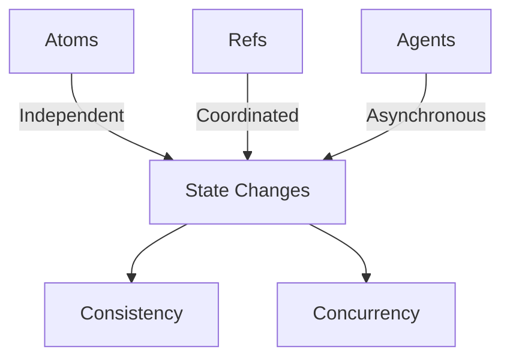

## 1.3.4 Concurrency Primitives

Concurrency is a fundamental aspect of modern software development, especially in a world where applications must handle multiple tasks simultaneously. For Java developers, concurrency often involves dealing with threads, locks, and synchronization, which can be complex and error-prone. Clojure, however, offers a different approach with its concurrency primitives: **Atoms**, **Refs**, and **Agents**. These tools simplify the process of managing state changes in concurrent programs, allowing developers to focus on the logic rather than the intricacies of thread management.

### Understanding Clojure's Concurrency Model

Clojure's concurrency model is built on the principles of immutability and functional programming. By default, data structures in Clojure are immutable, meaning they cannot be changed once created. This immutability is a key factor in Clojure's approach to concurrency, as it eliminates many of the issues associated with shared mutable state.

#### Atoms: Managing Independent, Synchronous State Changes

Atoms in Clojure are used for managing independent, synchronous state changes. They provide a way to hold mutable state that can be safely changed by multiple threads. Atoms ensure that updates are atomic, meaning they are completed in a single, indivisible operation.

**Key Features of Atoms:**
- **Atomic Updates**: Changes to an atom are atomic, ensuring consistency.
- **Synchronous**: Updates are applied immediately.
- **Independent State**: Atoms are best used for state that does not require coordination with other state changes.

**Clojure Code Example:**

```clojure
;; Define an atom with an initial value
(def counter (atom 0))

;; Increment the counter atomically
(swap! counter inc)

;; Retrieve the current value of the atom
@counter ;; => 1
```

In this example, we define an atom `counter` initialized to `0`. The `swap!` function is used to apply a function (`inc` in this case) to the current value of the atom, updating it atomically.

**Comparison with Java:**

In Java, managing a simple counter across threads might involve using `AtomicInteger`:

```java
import java.util.concurrent.atomic.AtomicInteger;

AtomicInteger counter = new AtomicInteger(0);
counter.incrementAndGet();
int value = counter.get();
```

While both approaches provide atomic updates, Clojure's atoms integrate seamlessly with its functional programming paradigm, allowing for more expressive and concise code.

#### Refs: Coordinated, Synchronous State Changes with STM

Refs in Clojure are used for coordinated, synchronous state changes. They leverage Software Transactional Memory (STM) to manage changes to multiple refs in a consistent manner. STM allows you to group changes to multiple refs into a single transaction, ensuring that all changes are applied atomically.

**Key Features of Refs:**
- **Transactional Updates**: Changes to refs are made within transactions, ensuring consistency.
- **Coordination**: Ideal for state that requires coordination with other state changes.
- **Automatic Retry**: Transactions are automatically retried in case of conflicts.

**Clojure Code Example:**

```clojure
;; Define refs for bank account balances
(def account-a (ref 100))
(def account-b (ref 200))

;; Transfer money between accounts using a transaction
(dosync
  (alter account-a - 50)
  (alter account-b + 50))

;; Check balances
[@account-a @account-b] ;; => [50 250]
```

In this example, we define two refs `account-a` and `account-b`. The `dosync` block ensures that the transfer operation is atomic and consistent, even if multiple threads attempt to perform transfers simultaneously.

**Comparison with Java:**

In Java, similar functionality might require explicit locks and careful management of synchronization:

```java
import java.util.concurrent.locks.Lock;
import java.util.concurrent.locks.ReentrantLock;

Lock lock = new ReentrantLock();
lock.lock();
try {
    // Perform operations on shared state
} finally {
    lock.unlock();
}
```

Clojure's STM abstracts away the complexity of locks, providing a more declarative and less error-prone approach to managing coordinated state changes.

#### Agents: Independent, Asynchronous State Changes

Agents in Clojure are designed for managing independent, asynchronous state changes. They allow you to perform updates in the background, without blocking the calling thread. Agents are ideal for tasks that can be performed independently and do not require immediate feedback.

**Key Features of Agents:**
- **Asynchronous Updates**: Changes are applied asynchronously.
- **Independent State**: Suitable for tasks that do not require coordination.
- **Error Handling**: Agents provide mechanisms for handling errors in asynchronous tasks.

**Clojure Code Example:**

```clojure
;; Define an agent with an initial value
(def agent-counter (agent 0))

;; Increment the agent asynchronously
(send agent-counter inc)

;; Retrieve the current value of the agent
@agent-counter ;; => 0 (initially, as the update is asynchronous)

;; Wait for all agent actions to complete
(await agent-counter)
@agent-counter ;; => 1
```

In this example, we define an agent `agent-counter` initialized to `0`. The `send` function is used to apply a function (`inc`) to the agent's value asynchronously. The `await` function ensures that all pending actions are completed before retrieving the value.

**Comparison with Java:**

In Java, asynchronous tasks might be handled using `ExecutorService`:

```java
import java.util.concurrent.ExecutorService;
import java.util.concurrent.Executors;

ExecutorService executor = Executors.newSingleThreadExecutor();
executor.submit(() -> {
    // Perform asynchronous task
});
executor.shutdown();
```

While Java provides powerful concurrency utilities, Clojure's agents offer a more integrated and functional approach to managing asynchronous state changes.

### Visualizing Clojure's Concurrency Primitives

To better understand how these concurrency primitives work, let's visualize their interactions using a Mermaid.js diagram.



**Diagram Explanation:**
- **Atoms**: Handle independent state changes synchronously.
- **Refs**: Manage coordinated state changes using STM.
- **Agents**: Perform asynchronous state changes independently.
- **Consistency and Concurrency**: All primitives contribute to maintaining consistency and enabling concurrency in Clojure applications.

### Try It Yourself

To deepen your understanding of Clojure's concurrency primitives, try modifying the code examples above. For instance, experiment with different functions in `swap!` for atoms, or create more complex transactions with refs. Observe how agents handle errors by introducing deliberate exceptions and handling them gracefully.

### Further Reading

For more information on Clojure's concurrency primitives, consider exploring the following resources:
- [Official Clojure Documentation](https://clojure.org/reference/atoms)
- [ClojureDocs](https://clojuredocs.org/)
- [Clojure Programming by Chas Emerick, Brian Carper, and Christophe Grand](https://www.oreilly.com/library/view/clojure-programming/9781449310387/)

### Exercises

1. **Atomic Counter**: Implement an atomic counter using atoms and compare its performance with a similar implementation using Java's `AtomicInteger`.
2. **Bank Transactions**: Simulate a banking system where multiple threads perform transactions on shared accounts using refs.
3. **Background Processing**: Use agents to perform background processing tasks, such as logging or data aggregation, and handle potential errors.

### Key Takeaways

- **Atoms** are ideal for managing independent, synchronous state changes.
- **Refs** provide a mechanism for coordinated, synchronous state changes using STM.
- **Agents** enable independent, asynchronous state changes.
- Clojure's concurrency primitives simplify the management of state changes in concurrent programs, reducing complexity and improving code clarity.

Now that we've explored Clojure's concurrency primitives, let's apply these concepts to manage state effectively in your applications. By leveraging atoms, refs, and agents, you can write concurrent programs that are both robust and easy to understand.

## Quiz: Mastering Clojure's Concurrency Primitives



### What is the primary use of atoms in Clojure?

- [x] Managing independent, synchronous state changes
- [ ] Coordinating state changes across multiple variables
- [ ] Performing asynchronous state changes
- [ ] Handling errors in concurrent tasks

> **Explanation:** Atoms are used for managing independent, synchronous state changes in Clojure.

### How do refs in Clojure ensure consistency?

- [x] By using Software Transactional Memory (STM)
- [ ] By locking threads during updates
- [ ] By performing updates asynchronously
- [ ] By using atomic operations

> **Explanation:** Refs use Software Transactional Memory (STM) to ensure consistency during coordinated state changes.

### What is the role of agents in Clojure?

- [x] Managing independent, asynchronous state changes
- [ ] Coordinating state changes across multiple variables
- [ ] Performing synchronous state changes
- [ ] Handling errors in concurrent tasks

> **Explanation:** Agents are used for managing independent, asynchronous state changes in Clojure.

### Which Clojure primitive is best suited for tasks that require immediate feedback?

- [x] Atoms
- [ ] Refs
- [ ] Agents
- [ ] Futures

> **Explanation:** Atoms are best suited for tasks that require immediate feedback due to their synchronous nature.

### How do agents handle errors in Clojure?

- [x] By providing mechanisms for error handling in asynchronous tasks
- [ ] By retrying failed transactions automatically
- [ ] By locking threads during updates
- [ ] By using atomic operations

> **Explanation:** Agents provide mechanisms for handling errors in asynchronous tasks.

### What is a key advantage of using refs over traditional locks in Java?

- [x] Automatic retry of transactions in case of conflicts
- [ ] Synchronous updates
- [ ] Asynchronous state changes
- [ ] Independent state management

> **Explanation:** Refs automatically retry transactions in case of conflicts, unlike traditional locks in Java.

### Which Clojure primitive would you use for background processing tasks?

- [x] Agents
- [ ] Atoms
- [ ] Refs
- [ ] Vars

> **Explanation:** Agents are suitable for background processing tasks due to their asynchronous nature.

### What is the main benefit of using Clojure's concurrency primitives?

- [x] Simplifying the management of state changes in concurrent programs
- [ ] Increasing the complexity of concurrent programming
- [ ] Reducing the need for functional programming
- [ ] Eliminating the need for immutability

> **Explanation:** Clojure's concurrency primitives simplify the management of state changes in concurrent programs.

### How do atoms ensure atomic updates?

- [x] By completing updates in a single, indivisible operation
- [ ] By using Software Transactional Memory (STM)
- [ ] By performing updates asynchronously
- [ ] By locking threads during updates

> **Explanation:** Atoms ensure atomic updates by completing them in a single, indivisible operation.

### True or False: Clojure's concurrency primitives eliminate the need for immutability.

- [ ] True
- [x] False

> **Explanation:** Clojure's concurrency primitives work in conjunction with immutability to manage state changes effectively.


