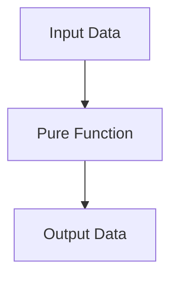
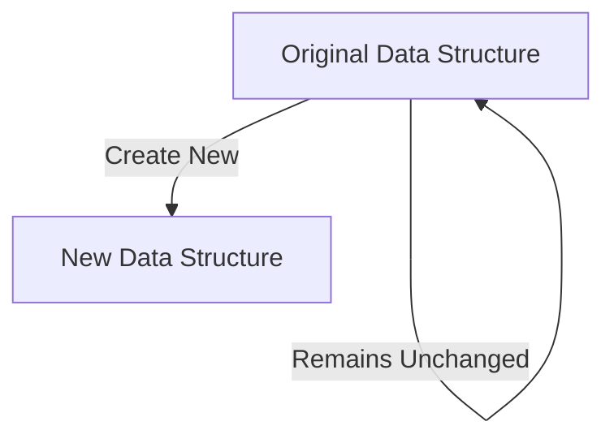

## 1.4.2 Improved Testability

In the world of software development, testability is a crucial aspect that determines the reliability and maintainability of code. For experienced Java developers transitioning to Clojure, understanding how functional programming enhances testability is essential. In this section, we will explore the concept of improved testability in Clojure, focusing on how its functional programming paradigm, immutability, and pure functions contribute to writing more reliable and maintainable tests.

### The Essence of Testability

Testability in software development refers to the ease with which software can be tested to ensure it behaves as expected. It involves writing tests that are easy to understand, execute, and maintain. In Java, testability can sometimes be hindered by mutable state, side effects, and complex dependencies. Clojure, with its functional programming paradigm, offers a different approach that inherently improves testability.

### Pure Functions: The Cornerstone of Testability

One of the key features of Clojure that enhances testability is the use of **pure functions**. A pure function is a function where the output is determined solely by its input values, without any observable side effects. This means that given the same input, a pure function will always produce the same output, making it predictable and easy to test.

#### Example of a Pure Function in Clojure

```clojure
;; A simple pure function that adds two numbers
(defn add [a b]
  (+ a b))

;; Testing the pure function
(println (add 2 3)) ;; Output: 5
```

In this example, the `add` function is pure because it does not rely on or modify any external state. It simply takes two arguments and returns their sum. Testing such functions is straightforward because there are no side effects to consider.

#### Comparing with Java

In Java, achieving pure functions can be more challenging due to the prevalence of mutable state and object-oriented design. Consider the following Java method:

```java
public int add(int a, int b) {
    return a + b;
}
```

While this Java method is also pure, Java developers often deal with methods that interact with mutable objects or external systems, complicating testing.

### Immutability: A Testability Booster

Clojure's emphasis on **immutability** further enhances testability. Immutable data structures ensure that once a data structure is created, it cannot be changed. This eliminates a whole class of bugs related to state changes and makes it easier to reason about code behavior.

#### Example of Immutability in Clojure

```clojure
;; Creating an immutable vector
(def my-vector [1 2 3])

;; Attempting to change the vector
(def new-vector (conj my-vector 4))

;; Testing immutability
(println my-vector) ;; Output: [1 2 3]
(println new-vector) ;; Output: [1 2 3 4]
```

In this example, `my-vector` remains unchanged even after attempting to add an element. This immutability ensures that functions using `my-vector` can be tested without worrying about unintended modifications.

#### Immutability in Java

In Java, achieving immutability often requires additional effort, such as using final fields or creating defensive copies. Clojure's default immutable data structures simplify this process, making it easier to write tests that do not depend on mutable state.

### Simplifying Dependency Management

Functional programming in Clojure encourages the use of **higher-order functions** and **function composition**, which can simplify dependency management in tests. By passing functions as arguments, you can easily replace dependencies with mock functions during testing.

#### Example of Higher-Order Functions in Clojure

```clojure
;; A higher-order function that applies a function to a list of numbers
(defn apply-to-list [f lst]
  (map f lst))

;; Testing with a mock function
(defn mock-function [x]
  (* x 2))

(println (apply-to-list mock-function [1 2 3])) ;; Output: (2 4 6)
```

In this example, `apply-to-list` is a higher-order function that takes another function `f` as an argument. During testing, you can easily replace `f` with a mock function, simplifying the testing process.

#### Java's Approach to Dependency Management

In Java, dependency injection frameworks like Spring are often used to manage dependencies. While effective, these frameworks can add complexity to the testing process. Clojure's functional approach offers a simpler alternative by leveraging higher-order functions and immutability.

### Testing Side Effects

While pure functions are easy to test, real-world applications often involve side effects, such as I/O operations or database interactions. Clojure provides mechanisms to isolate and manage side effects, improving testability.

#### Managing Side Effects with Atoms

Clojure's **atoms** provide a way to manage mutable state in a controlled manner. Atoms allow you to perform state changes atomically, making it easier to test functions that involve state changes.

```clojure
;; Using an atom to manage state
(def counter (atom 0))

(defn increment-counter []
  (swap! counter inc))

;; Testing the function
(increment-counter)
(println @counter) ;; Output: 1
```

In this example, the `increment-counter` function uses an atom to manage state changes. Testing this function is straightforward because the state changes are isolated and controlled.

#### Java's Approach to Side Effects

In Java, managing side effects often involves using mocks or stubs to simulate external dependencies. While effective, this approach can add complexity to the testing process. Clojure's use of atoms and other concurrency primitives offers a simpler alternative.

### Try It Yourself

To deepen your understanding of Clojure's testability features, try modifying the code examples provided. For instance, experiment with creating your own pure functions and testing them. Consider how you might handle side effects in a Clojure application and compare this to your approach in Java.

### Diagrams and Visualizations

To further illustrate the concepts discussed, let's explore some diagrams that highlight the flow of data through pure functions and the role of immutability in Clojure.

#### Flow of Data Through Pure Functions



*Diagram 1: This diagram illustrates the flow of data through a pure function, where the output is solely determined by the input.*

#### Immutability and Persistent Data Structures



*Diagram 2: This diagram shows how immutability works in Clojure, with the original data structure remaining unchanged while a new one is created.*

### Exercises and Practice Problems

To reinforce your understanding of improved testability in Clojure, try the following exercises:

1. **Create a Pure Function**: Write a pure function that calculates the factorial of a number and test it with various inputs.
2. **Manage State with Atoms**: Implement a simple counter using atoms and write tests to verify its behavior.
3. **Handle Side Effects**: Write a function that reads from a file and processes its content. Consider how you would test this function in Clojure.

### Key Takeaways

- **Pure Functions**: Clojure's use of pure functions enhances testability by ensuring predictable behavior.
- **Immutability**: Immutable data structures eliminate bugs related to state changes, simplifying testing.
- **Higher-Order Functions**: Clojure's functional programming paradigm simplifies dependency management in tests.
- **Managing Side Effects**: Clojure provides mechanisms to isolate and manage side effects, improving testability.

By embracing Clojure's functional programming paradigm, you can write tests that are more reliable, maintainable, and easier to understand. As you continue your journey in Clojure, consider how these principles can be applied to improve the testability of your applications.

### Further Reading

For more information on Clojure's testability features, consider exploring the following resources:

- [Official Clojure Documentation](https://clojure.org/)
- [ClojureDocs](https://clojuredocs.org/)
- [Functional Programming in Clojure](https://www.braveclojure.com/)

---

## Quiz: Test Your Knowledge on Improved Testability in Clojure



### What is a pure function in Clojure?

- [x] A function that returns the same output for the same input without side effects
- [ ] A function that modifies global state
- [ ] A function that interacts with external systems
- [ ] A function that relies on mutable data

> **Explanation:** A pure function in Clojure is one that consistently returns the same output for the same input and does not cause any side effects.

### How does immutability enhance testability in Clojure?

- [x] By ensuring data structures cannot be changed, reducing bugs
- [ ] By allowing data structures to be modified freely
- [ ] By making it difficult to track state changes
- [ ] By increasing the complexity of data management

> **Explanation:** Immutability ensures that data structures cannot be changed, which reduces bugs related to state changes and simplifies testing.

### What is the role of higher-order functions in improving testability?

- [x] They allow functions to be passed as arguments, simplifying dependency management
- [ ] They make functions more complex and harder to test
- [ ] They require additional frameworks for testing
- [ ] They increase the need for mocks and stubs

> **Explanation:** Higher-order functions allow functions to be passed as arguments, which simplifies dependency management and testing.

### How do atoms help manage side effects in Clojure?

- [x] By providing a way to manage mutable state atomically
- [ ] By allowing uncontrolled state changes
- [ ] By requiring complex synchronization mechanisms
- [ ] By making state changes unpredictable

> **Explanation:** Atoms provide a way to manage mutable state atomically, making it easier to test functions that involve state changes.

### What is a key advantage of using pure functions in testing?

- [x] Predictable behavior due to consistent input-output mapping
- [ ] Increased complexity in test setup
- [ ] Dependence on external systems
- [ ] Need for extensive mocking

> **Explanation:** Pure functions offer predictable behavior because they consistently map the same input to the same output, simplifying testing.

### Which of the following is a benefit of immutability in Clojure?

- [x] Elimination of bugs related to state changes
- [ ] Increased difficulty in managing data
- [ ] Need for defensive copying
- [ ] Requirement for complex synchronization

> **Explanation:** Immutability eliminates bugs related to state changes, making it easier to reason about and test code.

### How does Clojure's functional programming paradigm simplify dependency management?

- [x] By using higher-order functions and immutability
- [ ] By requiring dependency injection frameworks
- [ ] By increasing the need for complex configurations
- [ ] By making dependencies more rigid

> **Explanation:** Clojure's functional programming paradigm simplifies dependency management through the use of higher-order functions and immutability.

### What is a common challenge when testing side effects in Java?

- [x] Managing mocks and stubs for external dependencies
- [ ] Ensuring immutability of data structures
- [ ] Using higher-order functions
- [ ] Writing pure functions

> **Explanation:** In Java, managing side effects often involves using mocks or stubs to simulate external dependencies, which can add complexity to testing.

### How does Clojure handle side effects differently from Java?

- [x] By using atoms and other concurrency primitives
- [ ] By relying on dependency injection frameworks
- [ ] By requiring extensive mocking
- [ ] By making side effects unpredictable

> **Explanation:** Clojure handles side effects using atoms and other concurrency primitives, offering a simpler alternative to Java's approach.

### True or False: Clojure's immutability requires additional effort to achieve compared to Java.

- [ ] True
- [x] False

> **Explanation:** Clojure's immutability is a default feature, simplifying the process compared to Java, where achieving immutability often requires additional effort.


