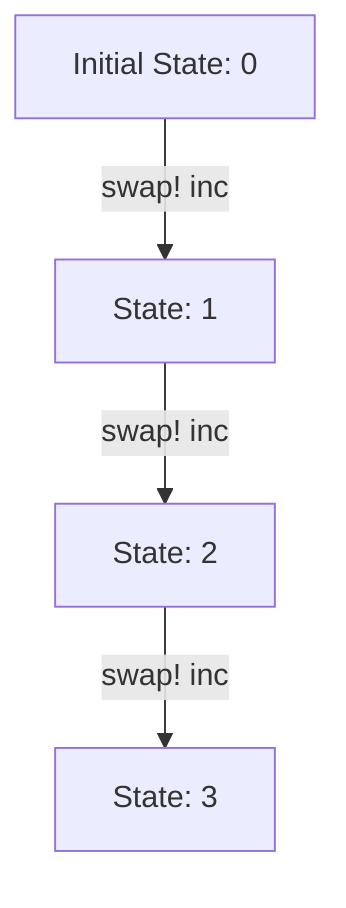
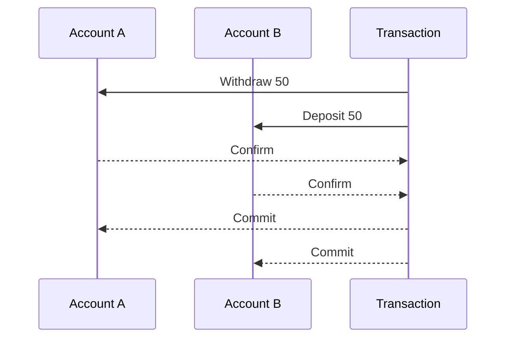

## 1.4.3 Concurrency Made Easier

Concurrency is a challenging aspect of software development, especially in languages like Java, where shared mutable state can lead to complex bugs and race conditions. Clojure, with its emphasis on immutability and functional programming, offers a fresh perspective on concurrency, making it easier and more intuitive. In this section, we will explore how Clojure's design and concurrency primitives simplify writing thread-safe code, providing a robust foundation for concurrent programming.

### Understanding Concurrency Challenges in Java

Before diving into Clojure's concurrency model, let's briefly review the challenges faced in Java:

- **Shared Mutable State**: Java applications often rely on shared mutable state, which can lead to race conditions and require complex synchronization mechanisms.
- **Locks and Synchronization**: Java provides `synchronized` blocks and `Lock` objects to manage access to shared resources, but these can lead to deadlocks and are difficult to reason about.
- **Thread Management**: Managing threads manually can be error-prone and resource-intensive.

### Clojure's Approach to Concurrency

Clojure addresses these challenges by embracing immutability and providing powerful concurrency primitives. Let's explore these concepts:

#### Immutability as a Foundation

In Clojure, data structures are immutable by default. This means that once a data structure is created, it cannot be changed. Instead, operations on data structures return new versions with the desired changes. This immutability eliminates issues with shared mutable state, a common source of bugs in concurrent programs.

**Example: Immutable Data Structures**

```clojure
(def my-list [1 2 3 4 5])

;; Adding an element returns a new list
(def new-list (conj my-list 6))

;; my-list remains unchanged
(println my-list)  ; Output: [1 2 3 4 5]
(println new-list) ; Output: [1 2 3 4 5 6]
```

**Try It Yourself**: Modify the code to add different elements to `my-list` and observe how the original list remains unchanged.

#### Concurrency Primitives in Clojure

Clojure provides several concurrency primitives that simplify managing state changes in a concurrent environment:

- **Atoms**: For managing independent, synchronous state changes.
- **Refs**: For coordinated, synchronous state changes using Software Transactional Memory (STM).
- **Agents**: For asynchronous state changes.

Let's explore each of these primitives in detail.

### Atoms: Managing Independent State

Atoms are used for managing independent, synchronous state changes. They provide a way to safely update a value without locks, using atomic compare-and-swap operations.

**Example: Using Atoms**

```clojure
(def counter (atom 0))

;; Increment the counter
(swap! counter inc)

(println @counter) ; Output: 1
```

In this example, `swap!` is used to apply the `inc` function to the current value of the atom, ensuring thread-safe updates.

**Try It Yourself**: Create an atom to manage a list of tasks and use `swap!` to add and remove tasks.

#### Visualizing Atom Operations



*Diagram Caption*: This diagram illustrates the state transitions of an atom as it is incremented using `swap!`.

### Refs and Software Transactional Memory (STM)

Refs are used for coordinated, synchronous state changes. They leverage Software Transactional Memory (STM) to ensure consistency across multiple state changes.

**Example: Using Refs**

```clojure
(def account-a (ref 100))
(def account-b (ref 200))

;; Transfer money between accounts
(dosync
  (alter account-a - 50)
  (alter account-b + 50))

(println @account-a) ; Output: 50
(println @account-b) ; Output: 250
```

In this example, `dosync` creates a transaction, ensuring that both `alter` operations are applied atomically.

**Try It Yourself**: Modify the code to simulate a bank transfer between multiple accounts and observe how STM ensures consistency.

#### Visualizing Ref Transactions



*Diagram Caption*: This sequence diagram shows the transaction process of transferring money between two accounts using refs.

### Agents: Asynchronous State Changes

Agents are used for managing asynchronous state changes. They allow you to perform state updates in the background, without blocking the main thread.

**Example: Using Agents**

```clojure
(def logger (agent []))

;; Log a message asynchronously
(send logger conj "Log entry 1")

;; Wait for the agent to process actions
(await logger)

(println @logger) ; Output: ["Log entry 1"]
```

In this example, `send` is used to queue an update to the agent, and `await` ensures that all queued actions are processed before proceeding.

**Try It Yourself**: Use agents to manage a log of events in a multi-threaded application.

#### Visualizing Agent Operations

```mermaid
graph TD;
    A[Initial State: []] -->|send conj "Log entry 1"| B[State: ["Log entry 1"]];
    B -->|send conj "Log entry 2"| C[State: ["Log entry 1", "Log entry 2"]];
```

*Diagram Caption*: This diagram illustrates the state transitions of an agent as log entries are added asynchronously.

### Comparing Clojure and Java Concurrency

Let's compare Clojure's concurrency model with Java's traditional approach:

| Feature                  | Java                          | Clojure                        |
|--------------------------|-------------------------------|--------------------------------|
| **State Management**     | Mutable, requires locks       | Immutable, no locks needed     |
| **Concurrency Primitives** | Locks, synchronized blocks   | Atoms, Refs, Agents            |
| **Thread Management**    | Manual, complex               | Simplified with agents         |
| **Consistency**          | Manual synchronization        | Automatic with STM             |

### Best Practices for Concurrency in Clojure

- **Embrace Immutability**: Use immutable data structures to avoid shared mutable state.
- **Choose the Right Primitive**: Use atoms for independent updates, refs for coordinated updates, and agents for asynchronous updates.
- **Leverage STM**: Use STM for complex transactions that require consistency across multiple state changes.
- **Avoid Blocking**: Use agents and asynchronous operations to prevent blocking the main thread.

### Exercises and Practice Problems

1. **Atom Exercise**: Create an atom to manage a shopping cart and implement functions to add and remove items.
2. **Ref Exercise**: Simulate a simple banking system with multiple accounts using refs and STM.
3. **Agent Exercise**: Implement a logging system that processes log entries asynchronously using agents.

### Key Takeaways

- Clojure's immutability and concurrency primitives simplify writing thread-safe code.
- Atoms, refs, and agents provide powerful tools for managing state changes in a concurrent environment.
- Embracing Clojure's concurrency model can lead to more robust and maintainable applications.

By understanding and leveraging Clojure's concurrency features, we can write more efficient and reliable concurrent programs. Now that we've explored how Clojure simplifies concurrency, let's apply these concepts to build scalable and responsive applications.

## SEO optimized quiz title



### What is the primary benefit of immutability in Clojure?

- [x] Eliminates issues with shared mutable state
- [ ] Increases code verbosity
- [ ] Requires more memory
- [ ] Slows down execution

> **Explanation:** Immutability eliminates issues with shared mutable state, making concurrent programming easier and safer.

### Which Clojure primitive is used for independent, synchronous state changes?

- [x] Atom
- [ ] Ref
- [ ] Agent
- [ ] Var

> **Explanation:** Atoms are used for managing independent, synchronous state changes in Clojure.

### What does the `dosync` block do in Clojure?

- [x] Creates a transaction for refs
- [ ] Synchronizes threads
- [ ] Blocks asynchronous operations
- [ ] Increments an atom

> **Explanation:** `dosync` creates a transaction for refs, ensuring atomic updates across multiple state changes.

### How do agents in Clojure handle state changes?

- [x] Asynchronously
- [ ] Synchronously
- [ ] With locks
- [ ] With transactions

> **Explanation:** Agents handle state changes asynchronously, allowing non-blocking updates.

### Which concurrency primitive should you use for coordinated state changes?

- [ ] Atom
- [x] Ref
- [ ] Agent
- [ ] Var

> **Explanation:** Refs are used for coordinated state changes, leveraging Software Transactional Memory (STM).

### What is the purpose of `swap!` in Clojure?

- [x] Atomically update an atom's value
- [ ] Create a new ref
- [ ] Send a message to an agent
- [ ] Synchronize threads

> **Explanation:** `swap!` is used to atomically update an atom's value in Clojure.

### What is a key advantage of using agents in Clojure?

- [x] Non-blocking state updates
- [ ] Requires manual synchronization
- [ ] Slows down execution
- [ ] Increases memory usage

> **Explanation:** Agents provide non-blocking state updates, allowing asynchronous processing.

### How does Clojure's STM ensure consistency?

- [x] By using transactions
- [ ] By locking threads
- [ ] By blocking operations
- [ ] By using synchronized blocks

> **Explanation:** Clojure's STM ensures consistency by using transactions, allowing atomic updates across multiple refs.

### Which of the following is a common challenge in Java concurrency?

- [x] Shared mutable state
- [ ] Immutable data structures
- [ ] Asynchronous processing
- [ ] Functional programming

> **Explanation:** Shared mutable state is a common challenge in Java concurrency, leading to race conditions and bugs.

### True or False: Clojure requires manual thread management for concurrency.

- [ ] True
- [x] False

> **Explanation:** Clojure simplifies concurrency with its primitives, reducing the need for manual thread management.


