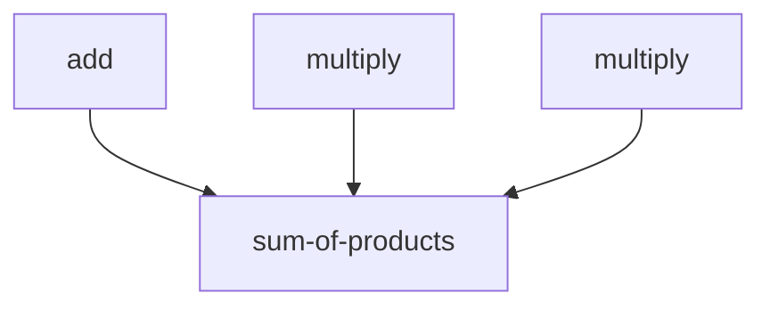

## 1.4.4 Modularity and Reusability

As experienced Java developers, you're likely familiar with the principles of modularity and reusability in object-oriented programming. In Clojure, these concepts are taken to a new level through functional programming paradigms. By leveraging small, composable functions, Clojure promotes a modular codebase that enhances reusability and simplifies maintenance. Let's delve into how Clojure achieves this and how it compares to Java.

### Understanding Modularity in Clojure

Modularity in Clojure is about breaking down a program into smaller, manageable pieces. These pieces, or functions, are designed to perform a single task and can be composed together to build more complex functionality. This approach contrasts with Java, where modularity often involves classes and interfaces.

#### Key Concepts of Modularity

1. **Small Functions**: In Clojure, functions are the primary building blocks. Each function should ideally perform one task, making it easier to test, debug, and reuse.

2. **Namespaces**: Clojure uses namespaces to organize functions and variables, similar to packages in Java. This organization helps manage dependencies and avoid naming conflicts.

3. **Function Composition**: Functions can be composed together to create new functions, allowing for flexible and reusable code.

4. **Immutability**: By default, data structures in Clojure are immutable, which means they cannot be changed after creation. This immutability supports modularity by ensuring that functions do not have side effects that alter shared state.

#### Comparing with Java

In Java, modularity is often achieved through classes and interfaces. While this approach is effective, it can lead to complex hierarchies and tightly coupled code. Clojure's focus on functions and immutability simplifies the design and enhances modularity.

### Reusability in Clojure

Reusability is a natural outcome of modularity. When functions are small and focused, they can be reused in different parts of a program or even in different projects. Clojure's functional nature encourages this reusability.

#### Key Concepts of Reusability

1. **Higher-Order Functions**: Functions that take other functions as arguments or return functions as results. This capability allows for flexible and reusable code.

2. **Pure Functions**: Functions that do not have side effects and always produce the same output for the same input. Pure functions are inherently reusable.

3. **Macros**: Clojure's macros allow developers to extend the language and create reusable code patterns.

4. **Libraries and Community**: Clojure has a rich ecosystem of libraries that promote code reuse. The community encourages sharing and reusing code through open-source projects.

#### Comparing with Java

In Java, reusability is often achieved through inheritance and interfaces. While effective, these mechanisms can lead to rigid designs. Clojure's emphasis on functions and immutability provides a more flexible approach to reusability.

### Code Examples

Let's explore some code examples to illustrate these concepts.

#### Modularity with Functions

In Clojure, we can define small functions that perform specific tasks:

```clojure
;; Define a function to add two numbers
(defn add [x y]
  (+ x y))

;; Define a function to multiply two numbers
(defn multiply [x y]
  (* x y))

;; Compose functions to calculate the sum of products
(defn sum-of-products [a b c d]
  (add (multiply a b) (multiply c d)))

;; Usage
(sum-of-products 2 3 4 5) ;; => 26
```

In this example, `add` and `multiply` are small, focused functions. The `sum-of-products` function composes these functions to achieve a more complex task.

#### Reusability with Higher-Order Functions

Higher-order functions allow us to create reusable code patterns:

```clojure
;; Define a higher-order function that applies a function to a list of numbers
(defn apply-to-list [f lst]
  (map f lst))

;; Usage with different functions
(apply-to-list inc [1 2 3 4]) ;; => (2 3 4 5)
(apply-to-list #(* % 2) [1 2 3 4]) ;; => (2 4 6 8)
```

The `apply-to-list` function is reusable with any function that takes a single argument. This flexibility is a hallmark of functional programming.

### Diagrams and Visualizations

To better understand how modularity and reusability work in Clojure, let's look at some diagrams.

#### Function Composition Diagram



*Caption*: This diagram illustrates how the `sum-of-products` function composes the `add` and `multiply` functions to achieve its task.

#### Higher-Order Function Flow

```mermaid
graph TD;
    A[apply-to-list] --> B[inc];
    A --> C[multiply];
    B --> D[Result: (2 3 4 5)];
    C --> E[Result: (2 4 6 8)];
```

*Caption*: This diagram shows how the `apply-to-list` function can be used with different functions (`inc`, `multiply`) to produce different results.

### Try It Yourself

Experiment with the code examples provided. Try modifying the `sum-of-products` function to include division or subtraction. Use the `apply-to-list` function with a custom function of your choice.

### Exercises

1. **Exercise 1**: Create a function `average` that calculates the average of a list of numbers. Use this function in a higher-order function to calculate the average of multiple lists.

2. **Exercise 2**: Define a macro that logs the execution time of a function. Use this macro to measure the performance of different functions.

3. **Exercise 3**: Refactor a Java class with multiple methods into a set of Clojure functions. Focus on creating small, reusable functions.

### Key Takeaways

- **Modularity**: Clojure's focus on small, composable functions enhances modularity, making code easier to manage and understand.
- **Reusability**: The functional nature of Clojure promotes reusability through higher-order functions and pure functions.
- **Comparison with Java**: While Java achieves modularity and reusability through classes and interfaces, Clojure offers a more flexible and concise approach.
- **Practical Application**: By applying these concepts, you can create more efficient and maintainable codebases.

### Further Reading

For more information on Clojure's modularity and reusability, check out the [Official Clojure Documentation](https://clojure.org/reference/documentation) and [ClojureDocs](https://clojuredocs.org/).

---

## Quiz: Mastering Modularity and Reusability in Clojure



### What is a key benefit of using small, composable functions in Clojure?

- [x] Enhanced modularity and reusability
- [ ] Increased complexity
- [ ] Reduced performance
- [ ] Greater memory usage

> **Explanation:** Small, composable functions enhance modularity and reusability by allowing code to be easily reused and maintained.


### How does Clojure's immutability support modularity?

- [x] By ensuring functions do not alter shared state
- [ ] By allowing direct modification of data structures
- [ ] By increasing the complexity of data handling
- [ ] By requiring more memory allocation

> **Explanation:** Immutability ensures that functions do not have side effects, which supports modularity by preventing unintended changes to shared state.


### What is a higher-order function in Clojure?

- [x] A function that takes other functions as arguments or returns a function
- [ ] A function that only performs arithmetic operations
- [ ] A function that modifies global variables
- [ ] A function that is defined within a class

> **Explanation:** Higher-order functions take other functions as arguments or return functions, allowing for flexible and reusable code patterns.


### How does Clojure's approach to reusability differ from Java's?

- [x] Clojure uses functions and immutability, while Java often uses inheritance and interfaces
- [ ] Clojure relies on class hierarchies, while Java uses functions
- [ ] Clojure does not support code reuse
- [ ] Java does not support code reuse

> **Explanation:** Clojure emphasizes functions and immutability for reusability, whereas Java often relies on inheritance and interfaces.


### What is the purpose of namespaces in Clojure?

- [x] To organize functions and variables and avoid naming conflicts
- [ ] To increase the complexity of the codebase
- [ ] To allow direct access to global variables
- [ ] To define class hierarchies

> **Explanation:** Namespaces organize functions and variables, helping manage dependencies and avoid naming conflicts.


### Which of the following is a characteristic of pure functions?

- [x] They do not have side effects
- [ ] They modify global state
- [ ] They depend on external input
- [ ] They produce different outputs for the same input

> **Explanation:** Pure functions do not have side effects and always produce the same output for the same input, making them inherently reusable.


### What is a macro in Clojure?

- [x] A construct that allows developers to extend the language and create reusable code patterns
- [ ] A function that performs arithmetic operations
- [ ] A variable that holds a constant value
- [ ] A class that encapsulates data

> **Explanation:** Macros allow developers to extend Clojure's language capabilities and create reusable code patterns.


### How can higher-order functions enhance reusability?

- [x] By allowing functions to be passed as arguments or returned as results
- [ ] By increasing the complexity of function definitions
- [ ] By limiting the number of functions in a program
- [ ] By requiring more memory allocation

> **Explanation:** Higher-order functions enhance reusability by allowing functions to be passed as arguments or returned as results, enabling flexible code patterns.


### What is a benefit of using pure functions in Clojure?

- [x] They simplify testing and debugging
- [ ] They increase the complexity of code
- [ ] They require more memory allocation
- [ ] They depend on external state

> **Explanation:** Pure functions simplify testing and debugging because they do not have side effects and always produce the same output for the same input.


### True or False: Clojure's modularity and reusability principles can lead to more maintainable codebases.

- [x] True
- [ ] False

> **Explanation:** True. Clojure's modularity and reusability principles promote maintainable codebases by encouraging small, composable functions and reducing complexity.




