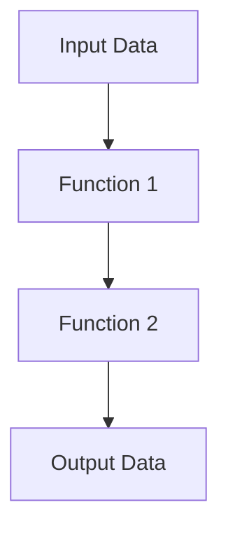
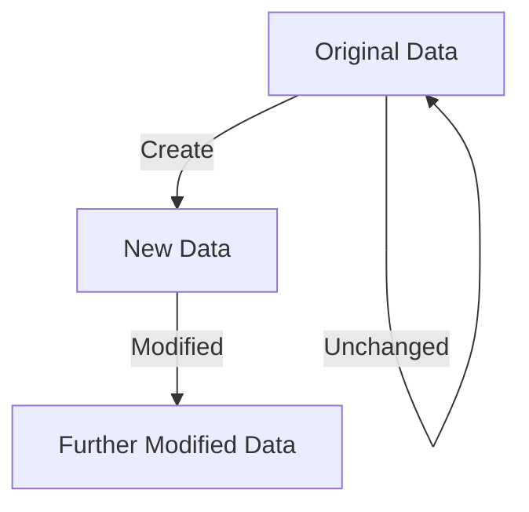

## 1.4 The Benefits of Functional Programming

Embracing functional programming with Clojure offers several advantages that can significantly enhance your development process. As experienced Java developers, you may find these benefits particularly compelling as you transition to Clojure. Let's explore these advantages in detail.

### Enhanced Code Readability and Maintainability

Functional programming emphasizes writing clear and concise code. In Clojure, functions are the primary building blocks, and their purity ensures that they are easy to understand and reason about. This clarity is a stark contrast to the often verbose and complex nature of Java code.

#### Clojure Example: Pure Function

```clojure
(defn add [a b]
  "Adds two numbers."
  (+ a b))

;; Usage
(add 3 5) ; => 8
```

In this example, the `add` function is pure, meaning it has no side effects and always produces the same output for the same input. This simplicity makes it easy to read and maintain.

#### Java Example: Method with Side Effects

```java
public class Calculator {
    private int lastResult;

    public int add(int a, int b) {
        lastResult = a + b; // Side effect: modifying state
        return lastResult;
    }
}
```

In Java, methods often involve side effects, such as modifying object state, which can complicate understanding and maintenance.

**Key Takeaway:** Clojure's emphasis on pure functions leads to code that is easier to read and maintain, reducing the cognitive load on developers.

### Improved Testability

Testing is a crucial aspect of software development, and functional programming in Clojure makes it more straightforward. Pure functions are inherently easier to test because they do not depend on external state.

#### Clojure Example: Testing a Pure Function

```clojure
(ns myapp.core-test
  (:require [clojure.test :refer :all]
            [myapp.core :refer :all]))

(deftest test-add
  (testing "Addition of two numbers"
    (is (= 8 (add 3 5)))))
```

In this test, we simply verify that the `add` function returns the expected result. There are no concerns about state or side effects.

#### Java Example: Testing with Mocking

```java
import static org.junit.Assert.assertEquals;
import org.junit.Test;

public class CalculatorTest {
    @Test
    public void testAdd() {
        Calculator calc = new Calculator();
        assertEquals(8, calc.add(3, 5));
    }
}
```

In Java, testing often involves setting up and tearing down state, which can complicate the testing process.

**Key Takeaway:** Clojure's pure functions simplify testing by eliminating the need for complex state management and mocking.

### Concurrency Made Easier

Concurrency is a challenging aspect of software development, but Clojure's functional paradigm offers powerful tools to manage it effectively. Clojure's immutable data structures and concurrency primitives, such as atoms and refs, provide a robust foundation for concurrent programming.

#### Clojure Example: Using Atoms

```clojure
(def counter (atom 0))

(defn increment-counter []
  (swap! counter inc))

;; Concurrently increment the counter
(doseq [_ (range 1000)]
  (future (increment-counter)))

@counter ; => 1000 (eventually)
```

In this example, we use an atom to manage state changes safely across multiple threads.

#### Java Example: Synchronized Method

```java
public class Counter {
    private int count = 0;

    public synchronized void increment() {
        count++;
    }

    public int getCount() {
        return count;
    }
}
```

In Java, managing concurrency often involves using synchronized methods or locks, which can be error-prone and difficult to reason about.

**Key Takeaway:** Clojure's concurrency primitives simplify concurrent programming by providing safe and easy-to-use abstractions.

### Modularity and Reusability

Functional programming encourages the development of small, reusable functions. In Clojure, functions are first-class citizens, meaning they can be passed as arguments, returned from other functions, and composed to build complex behavior.

#### Clojure Example: Function Composition

```clojure
(defn square [x] (* x x))
(defn add-one [x] (+ x 1))

(defn square-and-add-one [x]
  (-> x
      square
      add-one))

(square-and-add-one 3) ; => 10
```

Here, we compose two simple functions to create a new function, demonstrating modularity and reusability.

#### Java Example: Method Composition

```java
public class MathUtils {
    public static int square(int x) {
        return x * x;
    }

    public static int addOne(int x) {
        return x + 1;
    }

    public static int squareAndAddOne(int x) {
        return addOne(square(x));
    }
}
```

In Java, method composition is possible but often less flexible and more verbose.

**Key Takeaway:** Clojure's support for function composition promotes modularity and reusability, leading to cleaner and more maintainable code.

### Try It Yourself

Experiment with the Clojure code examples provided. Try modifying the `add` function to subtract or multiply numbers. Explore how changing the order of function composition affects the result in the `square-and-add-one` function.

### Diagrams and Visualizations

To further illustrate these concepts, let's use some diagrams.

#### Data Flow in Higher-Order Functions



*Diagram 1: This diagram shows the flow of data through a series of higher-order functions, highlighting the modularity and reusability of functional programming.*

#### Immutability and Persistent Data Structures



*Diagram 2: This diagram illustrates how immutable data structures work, with new data being created without altering the original.*

### Exercises

1. **Refactor Java Code:** Take a simple Java class with mutable state and refactor it into a Clojure function using immutable data structures.
2. **Concurrency Challenge:** Implement a concurrent counter in Clojure using atoms and compare it with a Java implementation using synchronized methods.
3. **Function Composition:** Create a series of small functions in Clojure and compose them to perform a complex calculation.

### Summary and Key Takeaways

- **Enhanced Readability:** Clojure's pure functions lead to clearer and more maintainable code.
- **Improved Testability:** Testing is simplified due to the absence of side effects.
- **Easier Concurrency:** Clojure's concurrency primitives provide safe and straightforward abstractions.
- **Modularity and Reusability:** Function composition promotes clean and reusable code.

By embracing these benefits, you can leverage Clojure's strengths to build robust and maintainable applications. Now that we've explored how functional programming enhances your development process, let's apply these concepts to manage state effectively in your applications.

### Further Reading

- [Official Clojure Documentation](https://clojure.org/)
- [ClojureDocs](https://clojuredocs.org/)
- [Functional Programming in Clojure](https://www.braveclojure.com/)

## Quiz: Test Your Understanding of Functional Programming Benefits



### What is a key advantage of pure functions in Clojure?

- [x] They have no side effects.
- [ ] They are always faster than Java methods.
- [ ] They require more memory.
- [ ] They are only used in Clojure.

> **Explanation:** Pure functions have no side effects, making them easier to test and reason about.

### How does Clojure handle concurrency differently from Java?

- [x] It uses immutable data structures and concurrency primitives like atoms.
- [ ] It relies on synchronized methods.
- [ ] It uses only single-threaded execution.
- [ ] It does not support concurrency.

> **Explanation:** Clojure uses immutable data structures and concurrency primitives like atoms to manage concurrency safely.

### What is a benefit of function composition in Clojure?

- [x] It promotes modularity and reusability.
- [ ] It makes code longer and more complex.
- [ ] It is only useful for mathematical operations.
- [ ] It requires more memory.

> **Explanation:** Function composition allows for building complex behavior from simple, reusable functions.

### Why is testing easier in Clojure compared to Java?

- [x] Clojure's pure functions eliminate the need for complex state management.
- [ ] Clojure has fewer testing tools.
- [ ] Java does not support unit testing.
- [ ] Clojure tests are always faster.

> **Explanation:** Pure functions in Clojure simplify testing by eliminating the need for complex state management and mocking.

### What is a characteristic of immutable data structures?

- [x] They cannot be changed once created.
- [ ] They are slower than mutable structures.
- [ ] They are only used in Clojure.
- [ ] They require more memory.

> **Explanation:** Immutable data structures cannot be changed once created, ensuring data consistency.

### How does Clojure's approach to concurrency improve safety?

- [x] By using immutable data structures and safe concurrency primitives.
- [ ] By using synchronized methods.
- [ ] By avoiding concurrency altogether.
- [ ] By using only single-threaded execution.

> **Explanation:** Clojure's use of immutable data structures and safe concurrency primitives like atoms enhances concurrency safety.

### What is a benefit of using higher-order functions?

- [x] They allow functions to be passed as arguments and returned from other functions.
- [ ] They are only used for mathematical operations.
- [ ] They make code longer and more complex.
- [ ] They require more memory.

> **Explanation:** Higher-order functions enable functions to be passed as arguments and returned from other functions, promoting code flexibility.

### What is a common challenge in Java concurrency?

- [x] Managing shared mutable state.
- [ ] Using immutable data structures.
- [ ] Implementing pure functions.
- [ ] Avoiding function composition.

> **Explanation:** Managing shared mutable state is a common challenge in Java concurrency, often leading to errors.

### How does Clojure's immutability benefit concurrent programming?

- [x] It ensures data consistency across threads.
- [ ] It makes code longer and more complex.
- [ ] It is only useful for mathematical operations.
- [ ] It requires more memory.

> **Explanation:** Immutability ensures data consistency across threads, making concurrent programming safer.

### True or False: Clojure's functional programming model simplifies code maintenance.

- [x] True
- [ ] False

> **Explanation:** Clojure's functional programming model, with its emphasis on pure functions and immutability, simplifies code maintenance.


