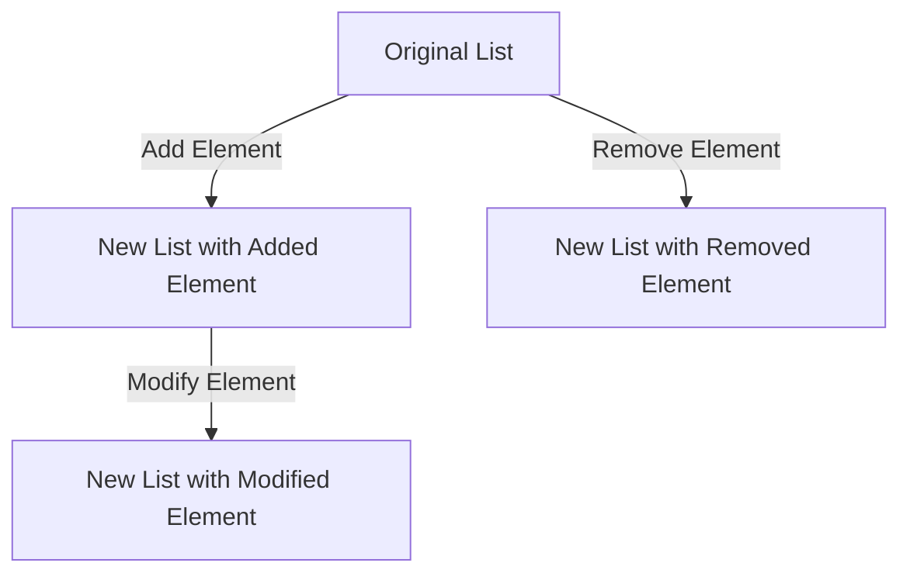

## 1.5 Setting Expectations for This Journey

Embarking on the journey from Java to Clojure is both an exciting and challenging endeavor. As experienced Java developers, you bring a wealth of knowledge and skills that will serve as a strong foundation. However, transitioning to a functional programming language like Clojure requires a shift in mindset and approach. This section aims to set clear expectations for this journey, highlighting the key areas of focus and the challenges you may encounter along the way.

### Embracing the Functional Paradigm

One of the most significant shifts you'll experience is moving from an imperative to a functional programming paradigm. In Java, you are accustomed to writing code that specifies a sequence of commands to change the program's state. In contrast, Clojure emphasizes **transformations over data** and encourages you to think in terms of **functions and expressions**.

#### Key Concepts in Functional Programming

- **Pure Functions**: Functions that always produce the same output for the same input and have no side effects. This predictability enhances testability and reasoning about code.
- **Immutability**: Data structures in Clojure are immutable by default, meaning they cannot be changed after creation. This leads to safer, more predictable code.
- **Higher-Order Functions**: Functions that can take other functions as arguments or return them as results, enabling powerful abstractions and code reuse.

#### Java vs. Clojure: A Conceptual Comparison

In Java, you might write a loop to iterate over a list and modify its elements. In Clojure, you would use a higher-order function like `map` to transform each element without altering the original list.

**Java Example:**

```java
List<Integer> numbers = Arrays.asList(1, 2, 3, 4, 5);
List<Integer> doubled = new ArrayList<>();
for (Integer number : numbers) {
    doubled.add(number * 2);
}
```

**Clojure Example:**

```clojure
(def numbers [1 2 3 4 5])
(def doubled (map #(* 2 %) numbers))
;; doubled is now (2 4 6 8 10)
```

> **Try It Yourself**: Modify the Clojure example to triple each number instead of doubling it. Observe how the immutability of `numbers` ensures it remains unchanged.

### Understanding Immutability

Immutability is a core tenet of Clojure and functional programming. It means that once a data structure is created, it cannot be altered. Instead of modifying data, you create new data structures with the desired changes. This approach eliminates many common bugs related to shared mutable state and makes concurrent programming more straightforward.

#### Benefits of Immutability

- **Thread Safety**: Immutable data structures can be shared freely between threads without synchronization.
- **Predictability**: Functions that operate on immutable data are easier to reason about since they don't produce side effects.
- **Ease of Testing**: Testing becomes simpler when functions don't depend on or alter external state.

#### Clojure's Persistent Data Structures

Clojure provides **persistent data structures** that are both immutable and efficient. They use structural sharing to minimize the overhead of creating new versions of data structures.

**Diagram: Persistent Data Structures**



*Caption: This diagram illustrates how Clojure's persistent data structures create new versions of lists while sharing unchanged parts.*

### Mastering Concurrency

Concurrency is a complex aspect of programming that Clojure simplifies through its unique concurrency primitives. Unlike Java, which relies heavily on locks and synchronization, Clojure offers a more declarative approach.

#### Clojure's Concurrency Primitives

- **Atoms**: Provide a way to manage shared, synchronous, and independent state changes.
- **Refs**: Use Software Transactional Memory (STM) to manage coordinated, synchronous state changes.
- **Agents**: Handle asynchronous state changes, allowing you to perform background tasks without blocking.

**Java vs. Clojure: Concurrency Example**

In Java, you might use synchronized blocks to manage shared state:

```java
public class Counter {
    private int count = 0;

    public synchronized void increment() {
        count++;
    }

    public synchronized int getCount() {
        return count;
    }
}
```

In Clojure, you can achieve the same with an atom:

```clojure
(def counter (atom 0))

(defn increment []
  (swap! counter inc))

(defn get-count []
  @counter)
```

> **Try It Yourself**: Experiment with the Clojure example by adding a decrement function. Notice how the atom ensures thread safety without explicit synchronization.

### The Learning Curve

Transitioning to Clojure involves a learning curve, especially if you're new to functional programming. Here are some tips to help you navigate this journey:

- **Be Patient**: Adjusting to a new syntax and unlearning certain habits takes time. Be patient with yourself as you adapt to Clojure's syntax and functional concepts.
- **Practice is Key**: Engage with the exercises and code examples actively. Experimentation reinforces learning.
- **Mindset Shift**: Embrace the functional paradigm by thinking in terms of transformations over data rather than sequences of commands.
- **Utilize Resources**: Don't hesitate to consult the appendices, community forums, and additional resources provided.

### Leveraging Java Knowledge

Your experience with Java is invaluable as you learn Clojure. Many concepts, such as object-oriented design patterns, can be adapted to functional programming. Additionally, Clojure's seamless interoperability with Java allows you to leverage existing libraries and frameworks.

#### Java Interoperability

Clojure runs on the Java Virtual Machine (JVM), enabling you to call Java methods and use Java libraries directly from Clojure code. This interoperability allows you to gradually integrate Clojure into existing Java projects.

**Clojure Calling Java Example:**

```clojure
(import '(java.util Date))

(defn current-time []
  (.toString (Date.)))
```

> **Try It Yourself**: Modify the example to format the date using Java's `SimpleDateFormat` class. This exercise will help you practice Java interoperability.

### Engaging with the Community

The Clojure community is known for its welcoming and supportive nature. Engaging with the community can provide valuable insights, support, and opportunities for collaboration. Consider participating in forums, attending meetups, and contributing to open-source projects.

### Exercises and Practice Problems

To reinforce your learning, here are some exercises and practice problems:

1. **Transform a List**: Write a Clojure function that takes a list of numbers and returns a new list with each number squared.
2. **Immutable Data Structures**: Create a Clojure map representing a person's profile. Add a new key-value pair without modifying the original map.
3. **Concurrency with Atoms**: Implement a simple bank account system using atoms to manage account balances.
4. **Java Interoperability**: Use Clojure to read a file using Java's `BufferedReader` class.

### Summary and Key Takeaways

As you progress through this guide, you'll gain not only proficiency in Clojure but also a new perspective on programming that can enhance your development skills across languages. Remember to:

- Embrace the functional paradigm and its benefits.
- Leverage your Java knowledge to ease the transition.
- Engage actively with exercises and the community.
- Be patient and persistent in your learning journey.

By setting realistic expectations and embracing the challenges ahead, you'll be well-equipped to harness the power of Clojure and functional programming.

## Quiz: Setting Expectations for Your Clojure Journey



### What is a key characteristic of pure functions in functional programming?

- [x] They always produce the same output for the same input.
- [ ] They can modify global state.
- [ ] They rely on external variables.
- [ ] They are inherently impure.

> **Explanation:** Pure functions always produce the same output for the same input and have no side effects, making them predictable and easy to test.

### How does Clojure handle data immutability?

- [x] By using persistent data structures.
- [ ] By allowing direct modification of data.
- [ ] By using mutable collections.
- [ ] By relying on external libraries.

> **Explanation:** Clojure uses persistent data structures that are immutable by default, ensuring data safety and predictability.

### What is a higher-order function?

- [x] A function that takes other functions as arguments or returns them as results.
- [ ] A function that only operates on numbers.
- [ ] A function that modifies global state.
- [ ] A function that is inherently impure.

> **Explanation:** Higher-order functions can take other functions as arguments or return them as results, enabling powerful abstractions.

### What is the primary benefit of immutability in Clojure?

- [x] Thread safety without synchronization.
- [ ] Increased memory usage.
- [ ] Slower performance.
- [ ] Complexity in code.

> **Explanation:** Immutability ensures thread safety without the need for synchronization, making concurrent programming easier.

### How does Clojure's `atom` differ from Java's synchronized blocks?

- [x] Atoms provide a way to manage shared state without explicit synchronization.
- [ ] Atoms require locks for state management.
- [x] Atoms are immutable by default.
- [ ] Atoms are slower than synchronized blocks.

> **Explanation:** Atoms in Clojure manage shared state without explicit synchronization and are immutable by default, unlike Java's synchronized blocks.

### What is a common challenge when transitioning to Clojure from Java?

- [x] Adjusting to a new syntax and unlearning certain habits.
- [ ] Lack of community support.
- [ ] Limited library availability.
- [ ] Incompatibility with Java.

> **Explanation:** Transitioning to Clojure involves adjusting to a new syntax and unlearning certain imperative habits.

### How can Java developers leverage their existing knowledge when learning Clojure?

- [x] By using Java interoperability to call Java methods from Clojure.
- [ ] By avoiding Java concepts entirely.
- [x] By adapting object-oriented design patterns to functional programming.
- [ ] By ignoring Java libraries.

> **Explanation:** Java developers can leverage their knowledge by using Java interoperability and adapting design patterns to functional programming.

### What is a benefit of engaging with the Clojure community?

- [x] Gaining valuable insights and support.
- [ ] Avoiding collaboration.
- [ ] Working in isolation.
- [ ] Ignoring community feedback.

> **Explanation:** Engaging with the Clojure community provides valuable insights, support, and collaboration opportunities.

### What is a persistent data structure in Clojure?

- [x] An immutable data structure that shares unchanged parts.
- [ ] A mutable data structure.
- [ ] A data structure that changes frequently.
- [ ] A data structure that relies on external libraries.

> **Explanation:** Persistent data structures in Clojure are immutable and share unchanged parts, ensuring efficiency and safety.

### True or False: Clojure's concurrency primitives eliminate the need for locks and synchronization.

- [x] True
- [ ] False

> **Explanation:** Clojure's concurrency primitives, such as atoms and refs, provide a declarative approach to concurrency, eliminating the need for locks and synchronization.


