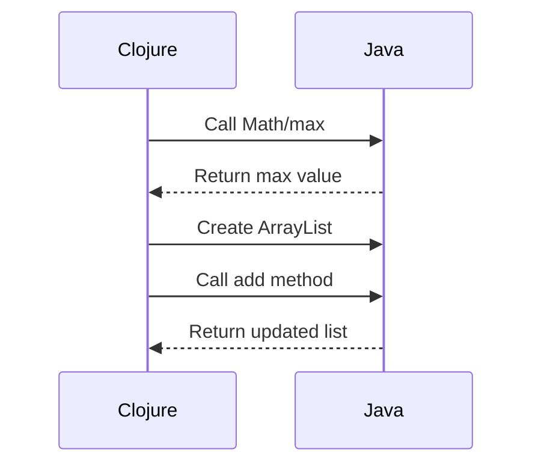

## 10.1.1 Java Interop Syntax

As experienced Java developers, you are already familiar with the robust ecosystem and extensive libraries that Java offers. Clojure, being a language that runs on the Java Virtual Machine (JVM), allows seamless interoperability with Java. This capability enables you to leverage existing Java libraries and frameworks while enjoying the benefits of Clojure's functional programming paradigm. In this section, we will explore the syntax for interacting with Java from Clojure, focusing on calling static and instance methods, accessing fields, and handling Java objects.

### Understanding Java Interoperability in Clojure

Clojure's interoperability with Java is one of its standout features, allowing developers to call Java methods, create Java objects, and access Java fields directly from Clojure code. This integration is achieved through a concise and expressive syntax that bridges the gap between the two languages.

#### Calling Static Methods

In Java, static methods are called using the class name followed by the method name. In Clojure, the syntax is similar but uses a forward slash (`/`) to separate the class name from the method name. Here's how you can call a static method in Clojure:

```clojure
;; Java: Math.max(10, 20)
(def max-value (Math/max 10 20))
(println "The maximum value is:" max-value)
```

**Explanation:**

- **`Math/max`**: This is the Clojure syntax for calling the `max` static method from the `Math` class.
- **`10, 20`**: These are the arguments passed to the `max` method.
- **`def`**: This keyword is used to define a new variable, `max-value`, which stores the result of the method call.

#### Calling Instance Methods

Instance methods in Java are called on an object instance using the dot (`.`) operator. In Clojure, you can call instance methods using two different syntaxes:

1. **Dot Before Method Name**: `(.methodName instance args)`
2. **Dot Before Instance**: `(. instance methodName args)`

Let's see both syntaxes in action:

```clojure
;; Java: String str = "Hello, World!";
;;       int length = str.length();

(def str "Hello, World!")

;; Using dot before method name
(def length-1 (.length str))

;; Using dot before instance
(def length-2 (. str length))

(println "The length of the string is:" length-1)
```

**Explanation:**

- **`(.length str)`** and **`(. str length)`**: Both expressions call the `length` method on the `str` instance.
- **`def`**: Used to define variables `length-1` and `length-2` to store the result of the method calls.

#### Accessing Fields

Accessing fields in Java is straightforward, using the dot operator. In Clojure, you can access fields using the same dot syntax:

```clojure
;; Java: System.out.println(System.out);

(println "System.out:" System/out)
```

**Explanation:**

- **`System/out`**: Accesses the `out` field of the `System` class, which is a static field.

### Creating Java Objects

Creating Java objects in Clojure is similar to Java, but with a slightly different syntax. You use the `new` keyword followed by the class name and constructor arguments:

```clojure
;; Java: ArrayList<String> list = new ArrayList<>();

(def list (new java.util.ArrayList))
(.add list "Clojure")
(.add list "Java")

(println "List contents:" list)
```

**Explanation:**

- **`new java.util.ArrayList`**: Creates a new instance of `ArrayList`.
- **`(.add list "Clojure")`**: Calls the `add` method on the `list` instance to add elements.

### Handling Java Exceptions

Clojure provides a way to handle Java exceptions using the `try` and `catch` constructs, similar to Java's exception handling mechanism:

```clojure
;; Java: try { ... } catch (Exception e) { ... }

(try
  (let [result (/ 10 0)]
    (println "Result:" result))
  (catch ArithmeticException e
    (println "Caught an exception:" (.getMessage e))))
```

**Explanation:**

- **`try`**: Begins a block of code that may throw an exception.
- **`catch`**: Catches exceptions of a specified type (`ArithmeticException` in this case).
- **`(.getMessage e)`**: Calls the `getMessage` method on the exception object `e`.

### Comparing Java and Clojure Syntax

To better understand the differences and similarities between Java and Clojure syntax, let's compare some common operations:

#### Static Method Call

- **Java**: `Math.max(10, 20)`
- **Clojure**: `(Math/max 10 20)`

#### Instance Method Call

- **Java**: `str.length()`
- **Clojure**: `(.length str)` or `(. str length)`

#### Object Creation

- **Java**: `new ArrayList<>()`
- **Clojure**: `(new java.util.ArrayList)`

#### Exception Handling

- **Java**: 
  ```java
  try {
      // code
  } catch (Exception e) {
      // handle exception
  }
  ```
- **Clojure**:
  ```clojure
  (try
    ;; code
    (catch Exception e
      ;; handle exception))
  ```

### Try It Yourself

To deepen your understanding, try modifying the code examples above:

- Change the static method call to use a different method from the `Math` class, such as `Math.min`.
- Experiment with calling different instance methods on the `String` class, like `toUpperCase`.
- Create a different Java object, such as `HashMap`, and add key-value pairs to it.

### Diagrams and Visual Aids

To visualize the flow of data and method calls between Clojure and Java, consider the following sequence diagram:



**Diagram Description**: This sequence diagram illustrates the interaction between Clojure and Java when calling a static method and creating an object.

### Further Reading

For more information on Clojure's Java interoperability, consider exploring the following resources:

- [Official Clojure Documentation on Java Interop](https://clojure.org/reference/java_interop)
- [ClojureDocs Java Interop Examples](https://clojuredocs.org/quickref#Java%20Interop)
- [GitHub Repository with Clojure and Java Interop Examples](https://github.com/clojure/java-interop-examples)

### Exercises

1. **Exercise 1**: Write a Clojure function that uses Java's `Random` class to generate a random number between 1 and 100.
2. **Exercise 2**: Create a Clojure program that reads a file using Java's `BufferedReader` and prints its contents.
3. **Exercise 3**: Implement a Clojure function that uses Java's `HashMap` to store and retrieve key-value pairs.

### Key Takeaways

- Clojure provides a seamless way to interact with Java, allowing you to call static and instance methods, create objects, and handle exceptions.
- The syntax for Java interop in Clojure is concise and expressive, making it easy to leverage existing Java libraries.
- Understanding the differences and similarities between Java and Clojure syntax is crucial for effective interoperability.

Now that we've explored the syntax for interacting with Java from Clojure, let's apply these concepts to build powerful applications that combine the strengths of both languages.

## Java Interop Syntax Quiz: Test Your Knowledge



### What is the correct syntax for calling a static method in Clojure?

- [x] `ClassName/staticMethod`
- [ ] `ClassName.staticMethod`
- [ ] `ClassName->staticMethod`
- [ ] `ClassName:staticMethod`

> **Explanation:** In Clojure, static methods are called using the `ClassName/staticMethod` syntax.

### How do you call an instance method using the dot before the method name syntax?

- [x] `(.methodName instance args)`
- [ ] `(instance.methodName args)`
- [ ] `(. instance methodName args)`
- [ ] `(methodName.instance args)`

> **Explanation:** The syntax `(.methodName instance args)` is used to call an instance method in Clojure.

### Which of the following is the correct way to create a new Java object in Clojure?

- [x] `(new ClassName args)`
- [ ] `new ClassName(args)`
- [ ] `(ClassName.new args)`
- [ ] `ClassName.new(args)`

> **Explanation:** In Clojure, you create a new Java object using the `(new ClassName args)` syntax.

### How do you access a static field in Clojure?

- [x] `ClassName/fieldName`
- [ ] `ClassName.fieldName`
- [ ] `ClassName->fieldName`
- [ ] `ClassName:fieldName`

> **Explanation:** Static fields in Clojure are accessed using the `ClassName/fieldName` syntax.

### What is the correct syntax for handling exceptions in Clojure?

- [x] `(try ... (catch ExceptionType e ...))`
- [ ] `try { ... } catch (ExceptionType e) { ... }`
- [ ] `(catch ExceptionType e ... (try ...))`
- [ ] `try ... catch ExceptionType e ...`

> **Explanation:** Clojure uses the `(try ... (catch ExceptionType e ...))` syntax for exception handling.

### Which syntax is used to call an instance method with the dot before the instance?

- [x] `(. instance methodName args)`
- [ ] `(.methodName instance args)`
- [ ] `(instance.methodName args)`
- [ ] `(methodName.instance args)`

> **Explanation:** The syntax `(. instance methodName args)` is used to call an instance method in Clojure.

### How do you call the `max` method from the `Math` class in Clojure?

- [x] `(Math/max 10 20)`
- [ ] `Math.max(10, 20)`
- [ ] `(Math:max 10 20)`
- [ ] `Math/max(10, 20)`

> **Explanation:** The correct syntax in Clojure is `(Math/max 10 20)` to call the `max` method.

### What is the Clojure equivalent of Java's `new ArrayList<>()`?

- [x] `(new java.util.ArrayList)`
- [ ] `new java.util.ArrayList()`
- [ ] `(java.util.ArrayList.new)`
- [ ] `java.util.ArrayList.new()`

> **Explanation:** In Clojure, you use `(new java.util.ArrayList)` to create a new `ArrayList`.

### How do you catch an `ArithmeticException` in Clojure?

- [x] `(catch ArithmeticException e ...)`
- [ ] `catch (ArithmeticException e) { ... }`
- [ ] `(try ... (catch ArithmeticException e ...))`
- [ ] `catch ArithmeticException e ...`

> **Explanation:** The correct syntax is `(catch ArithmeticException e ...)` within a `try` block.

### True or False: Clojure can directly call Java methods without any additional libraries.

- [x] True
- [ ] False

> **Explanation:** Clojure can directly call Java methods using its built-in interop syntax without additional libraries.


