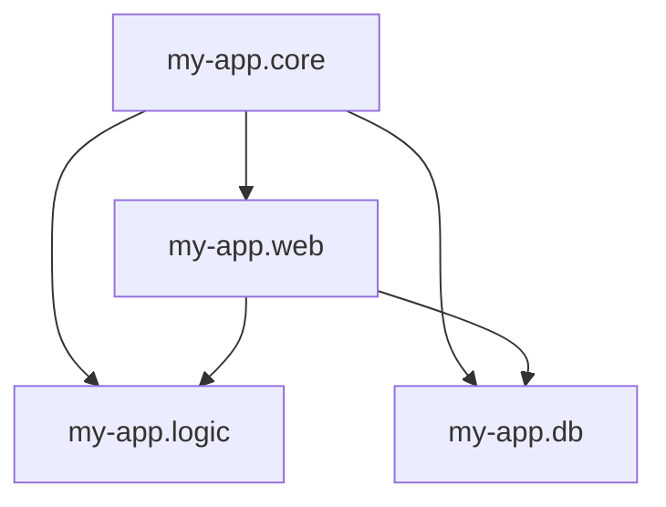

## 10.1.2 Creating and Switching Namespaces

As a Java developer venturing into the world of Clojure, understanding how to effectively manage namespaces is crucial for organizing your code and ensuring modularity. In this section, we will delve into the intricacies of creating and switching namespaces in Clojure, providing you with the knowledge to structure your projects efficiently.

### Introduction to Namespaces

Namespaces in Clojure serve a similar purpose to packages in Java. They provide a way to group related functions and variables, avoiding name clashes and facilitating code organization. By using namespaces, you can create modular and maintainable codebases, a practice that is especially beneficial in larger projects.

### Declaring a Namespace

To declare a namespace in a Clojure file, you use the `ns` macro. This is typically the first form in your Clojure source file. Here's a simple example:

```clojure
(ns my-app.core)
```

In this example, `my-app.core` is the name of the namespace. The `ns` macro not only declares the namespace but also allows you to specify dependencies, import Java classes, and set up aliases, making it a powerful tool for managing your code environment.

#### Anatomy of the `ns` Macro

The `ns` macro can include several options, such as requiring other namespaces, importing Java classes, and setting metadata. Let's break down a more complex example:

```clojure
(ns my-app.core
  (:require [clojure.string :as str]
            [my-app.utils :refer [helper-fn]])
  (:import (java.util Date)))
```

- **`:require`**: This option is used to include other Clojure namespaces. In the example, `clojure.string` is required and aliased as `str`, allowing you to use functions from `clojure.string` with the `str` prefix. The `my-app.utils` namespace is also required, with `helper-fn` being referred directly.

- **`:import`**: This option is used to import Java classes. Here, `java.util.Date` is imported, enabling you to use the `Date` class directly in your Clojure code.

#### Best Practices for Namespace Declaration

1. **Consistency**: Maintain a consistent naming convention for your namespaces. Typically, namespaces are named using lowercase letters and hyphens, mirroring the directory structure of your project.

2. **Modularity**: Group related functionalities into separate namespaces to enhance modularity and readability.

3. **Dependencies**: Only require and import what is necessary to keep your namespace declarations clean and efficient.

### Switching Namespaces in the REPL

Working in the REPL (Read-Eval-Print Loop) is an integral part of Clojure development. Switching namespaces in the REPL allows you to test and interact with different parts of your application seamlessly.

To switch to a different namespace in the REPL, use the `in-ns` function:

```clojure
(in-ns 'my-app.core)
```

This command changes the current namespace to `my-app.core`, allowing you to interact with the functions and variables defined there.

#### Practical Tips for REPL Namespace Management

- **Initialization**: When starting a new REPL session, initialize it by switching to the desired namespace using `in-ns`.

- **Namespace Aliases**: Use aliases for frequently accessed namespaces to reduce typing and improve efficiency.

- **Namespace Reloading**: If you make changes to a namespace, use `(require 'my-app.core :reload)` to reload it in the REPL.

### Advanced Namespace Features

Clojure's namespace system offers advanced features that can further enhance your development workflow.

#### Dynamic Namespace Management

Clojure allows for dynamic namespace creation and manipulation, which can be useful in certain scenarios, such as testing or scripting.

```clojure
(create-ns 'temporary.namespace)
(in-ns 'temporary.namespace)
```

This creates a new namespace `temporary.namespace` and switches to it. Dynamic namespaces are often used in testing environments to isolate test cases.

#### Metadata and Namespaces

Namespaces can have metadata associated with them, providing additional context or information. You can set metadata using the `with-meta` function:

```clojure
(with-meta (create-ns 'my-app.core) {:author "John Doe"})
```

This associates the metadata `{:author "John Doe"}` with the `my-app.core` namespace.

### Common Pitfalls and Optimization Tips

While working with namespaces, developers may encounter certain pitfalls. Here are some tips to avoid them:

- **Name Clashes**: Avoid using common names for your namespaces to prevent clashes with existing libraries.

- **Circular Dependencies**: Be cautious of circular dependencies between namespaces, as they can lead to complex and hard-to-debug issues.

- **Performance Considerations**: Excessive use of `require` and `import` can impact performance. Only include what is necessary.

### Code Examples and Use Cases

Let's explore a practical example that demonstrates creating and switching namespaces in a real-world scenario.

#### Example: Modular Web Application

Consider a web application with separate namespaces for handling requests, business logic, and data access.

```clojure
(ns my-app.web
  (:require [my-app.logic :as logic]
            [my-app.db :as db]))

(defn handle-request [request]
  (let [data (logic/process-request request)]
    (db/save-data data)))
```

In this example, the `my-app.web` namespace handles incoming requests, processes them using functions from the `my-app.logic` namespace, and saves the data using the `my-app.db` namespace.

#### Switching Namespaces in the REPL

To test the `handle-request` function in the REPL, switch to the `my-app.web` namespace:

```clojure
(in-ns 'my-app.web)
(handle-request {:param "value"})
```

This workflow allows you to interactively develop and test your application components.

### Diagrams and Visual Aids

To further illustrate the concept of namespaces, let's use a diagram to visualize the relationship between different namespaces in a project.



This diagram shows the `my-app.core` namespace as the central hub, with `my-app.web`, `my-app.logic`, and `my-app.db` as interconnected components.

### Conclusion

Namespaces are a fundamental aspect of Clojure programming, providing a robust mechanism for organizing code and managing dependencies. By mastering namespace creation and switching, you can enhance the modularity and maintainability of your Clojure projects.

As you continue your journey in Clojure, remember to leverage namespaces to their full potential, ensuring your code remains clean, efficient, and easy to navigate.

## Quiz Time!



### What is the primary purpose of namespaces in Clojure?

- [x] To group related functions and variables
- [ ] To execute code in parallel
- [ ] To compile Clojure code to Java bytecode
- [ ] To manage memory allocation

> **Explanation:** Namespaces in Clojure are used to group related functions and variables, similar to packages in Java, to avoid name clashes and organize code.

### How do you declare a namespace in a Clojure file?

- [x] Using the `ns` macro
- [ ] Using the `def` macro
- [ ] Using the `import` statement
- [ ] Using the `package` keyword

> **Explanation:** The `ns` macro is used to declare a namespace in a Clojure file, allowing you to specify dependencies and imports.

### Which option is used with the `ns` macro to include other Clojure namespaces?

- [x] `:require`
- [ ] `:import`
- [ ] `:include`
- [ ] `:use`

> **Explanation:** The `:require` option is used with the `ns` macro to include other Clojure namespaces.

### How do you switch to a different namespace in the REPL?

- [x] Using the `in-ns` function
- [ ] Using the `switch-ns` function
- [ ] Using the `change-ns` function
- [ ] Using the `set-ns` function

> **Explanation:** The `in-ns` function is used to switch to a different namespace in the REPL.

### What is the correct syntax to import a Java class in a namespace?

- [x] `(:import (java.util Date))`
- [ ] `(:require (java.util Date))`
- [ ] `(:use (java.util Date))`
- [ ] `(:include (java.util Date))`

> **Explanation:** The `:import` option is used to import Java classes in a Clojure namespace.

### What is a common pitfall when working with namespaces?

- [x] Circular dependencies
- [ ] Excessive use of comments
- [ ] Using too many functions
- [ ] Lack of variable declarations

> **Explanation:** Circular dependencies between namespaces can lead to complex and hard-to-debug issues.

### How can you reload a namespace in the REPL after making changes?

- [x] `(require 'namespace :reload)`
- [ ] `(reload 'namespace)`
- [ ] `(reset 'namespace)`
- [ ] `(refresh 'namespace)`

> **Explanation:** The `(require 'namespace :reload)` command is used to reload a namespace in the REPL after making changes.

### What is the benefit of using aliases in namespaces?

- [x] Reduces typing and improves efficiency
- [ ] Increases code complexity
- [ ] Enhances memory usage
- [ ] Compiles code faster

> **Explanation:** Using aliases in namespaces reduces typing and improves efficiency by allowing you to use shorter prefixes for frequently accessed namespaces.

### Which function is used to create a new namespace dynamically?

- [x] `create-ns`
- [ ] `new-ns`
- [ ] `make-ns`
- [ ] `init-ns`

> **Explanation:** The `create-ns` function is used to create a new namespace dynamically in Clojure.

### True or False: The `ns` macro can only be used at the beginning of a Clojure file.

- [x] True
- [ ] False

> **Explanation:** The `ns` macro is typically used at the beginning of a Clojure file to declare the namespace and set up dependencies and imports.


