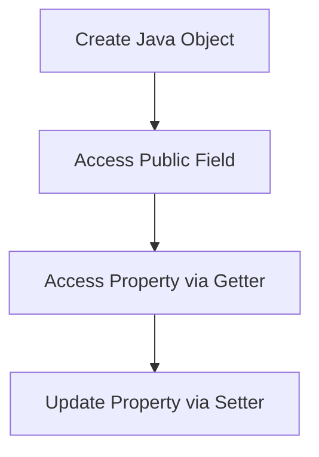

## 10.1.2 Accessing Fields and Properties

In this section, we will explore how to access Java fields and properties from Clojure. As experienced Java developers, you are already familiar with accessing fields and properties using Java's syntax. Clojure provides a straightforward way to interact with Java objects, allowing you to leverage your existing Java knowledge while embracing the functional programming paradigm. Let's dive into the details of accessing fields and properties in Clojure.

### Understanding Java Fields and Properties

In Java, fields are variables that belong to a class or an instance of a class. They can be accessed directly if they are public, or through getter and setter methods if they follow the JavaBeans convention. Properties, on the other hand, are typically accessed through these getter and setter methods, providing a level of abstraction over the underlying fields.

### Accessing Java Fields in Clojure

Clojure provides a simple syntax for accessing Java fields using the `(.field instance)` notation. This syntax allows you to directly access public fields of a Java object. Let's look at an example:

```java
// Java class with a public field
public class Person {
    public String name;

    public Person(String name) {
        this.name = name;
    }
}
```

To access the `name` field of a `Person` object in Clojure, you can use the following code:

```clojure
;; Create a new instance of the Person class
(def person (Person. "Alice"))

;; Access the public field 'name'
(def name (.name person))

(println "Name:" name) ;; Output: Name: Alice
```

In this example, we create an instance of the `Person` class and access its `name` field using the `(.name person)` syntax. This is similar to accessing a public field in Java using the dot notation.

### Working with Java Properties in Clojure

Java properties are typically accessed through getter and setter methods. Clojure provides a convenient way to call these methods using the `(.methodName instance)` syntax. Let's consider a Java class with a property:

```java
// Java class with a property
public class Car {
    private String model;

    public Car(String model) {
        this.model = model;
    }

    public String getModel() {
        return model;
    }

    public void setModel(String model) {
        this.model = model;
    }
}
```

To access the `model` property of a `Car` object in Clojure, you can use the following code:

```clojure
;; Create a new instance of the Car class
(def car (Car. "Tesla"))

;; Access the property using the getter method
(def model (.getModel car))

(println "Model:" model) ;; Output: Model: Tesla

;; Set a new value for the property using the setter method
(.setModel car "Ford")

;; Verify the updated property value
(def updated-model (.getModel car))

(println "Updated Model:" updated-model) ;; Output: Updated Model: Ford
```

In this example, we use the `(.getModel car)` syntax to call the `getModel` method and retrieve the `model` property. Similarly, we use `(.setModel car "Ford")` to update the property value.

### Comparing Clojure and Java Syntax

Let's compare the Clojure syntax for accessing fields and properties with the equivalent Java syntax. This comparison will help you understand the similarities and differences between the two languages.

#### Accessing Fields

**Java Syntax:**

```java
Person person = new Person("Alice");
String name = person.name;
```

**Clojure Syntax:**

```clojure
(def person (Person. "Alice"))
(def name (.name person))
```

#### Accessing Properties

**Java Syntax:**

```java
Car car = new Car("Tesla");
String model = car.getModel();
car.setModel("Ford");
```

**Clojure Syntax:**

```clojure
(def car (Car. "Tesla"))
(def model (.getModel car))
(.setModel car "Ford")
```

As you can see, the Clojure syntax is concise and leverages your existing knowledge of Java's method invocation patterns.

### Try It Yourself

To deepen your understanding, try modifying the code examples above. Here are a few suggestions:

- Add more fields and properties to the `Person` and `Car` classes and access them from Clojure.
- Experiment with different data types for fields and properties, such as integers and booleans.
- Create a new Java class with both public fields and properties, and access them in Clojure.

### Diagrams and Visualizations

To further illustrate the concepts, let's use a diagram to show the flow of accessing fields and properties in Clojure:



**Diagram Caption**: This flowchart illustrates the process of creating a Java object, accessing a public field, and interacting with a property using getter and setter methods in Clojure.

### Key Takeaways

- Clojure provides a straightforward syntax for accessing Java fields and properties, allowing you to leverage your Java knowledge.
- Use `(.field instance)` to access public fields and `(.methodName instance)` to call getter and setter methods for properties.
- The concise Clojure syntax simplifies interaction with Java objects while maintaining familiarity with Java's method invocation patterns.

### Further Reading

For more information on Clojure's interoperability with Java, you can explore the following resources:

- [Official Clojure Documentation on Java Interop](https://clojure.org/reference/java_interop)
- [ClojureDocs: Java Interop Examples](https://clojuredocs.org/clojure.core/dot)
- [GitHub: Clojure Java Interop Examples](https://github.com/clojure/java-interop-examples)

### Exercises

To reinforce your learning, try the following exercises:

1. Create a Java class with multiple fields and properties. Access and modify them from Clojure.
2. Implement a Clojure function that takes a Java object as an argument and prints all its fields and properties.
3. Write a Clojure script that interacts with a Java library of your choice, accessing fields and properties as needed.

By practicing these exercises, you'll gain confidence in using Clojure's interop features to work with Java objects effectively.

## SEO optimized quiz title



### What syntax does Clojure use to access a public field of a Java object?

- [x] `(.field instance)`
- [ ] `instance.field`
- [ ] `instance->field`
- [ ] `field(instance)`

> **Explanation:** Clojure uses the `(.field instance)` syntax to access public fields of a Java object.

### How do you call a getter method for a Java property in Clojure?

- [x] `(.getMethodName instance)`
- [ ] `instance.getMethodName()`
- [ ] `getMethodName(instance)`
- [ ] `instance->getMethodName`

> **Explanation:** In Clojure, you call a getter method using the `(.getMethodName instance)` syntax.

### What is the Clojure equivalent of Java's `car.setModel("Ford")`?

- [x] `(.setModel car "Ford")`
- [ ] `car.setModel("Ford")`
- [ ] `setModel(car, "Ford")`
- [ ] `car->setModel("Ford")`

> **Explanation:** The Clojure equivalent of setting a property in Java is `(.setModel car "Ford")`.

### Which of the following is true about accessing Java fields in Clojure?

- [x] You can access public fields directly using `(.field instance)`.
- [ ] You must always use getter methods to access fields.
- [ ] Fields cannot be accessed from Clojure.
- [ ] Clojure does not support Java field access.

> **Explanation:** Clojure allows direct access to public fields using the `(.field instance)` syntax.

### What is the purpose of getter and setter methods in Java?

- [x] To provide controlled access to private fields
- [ ] To directly access public fields
- [x] To encapsulate field access
- [ ] To replace constructors

> **Explanation:** Getter and setter methods provide controlled access to private fields and encapsulate field access.

### How does Clojure handle method invocation for Java objects?

- [x] Using the `(.methodName instance)` syntax
- [ ] Using `instance.methodName()`
- [ ] Using `methodName(instance)`
- [ ] Using `instance->methodName`

> **Explanation:** Clojure uses the `(.methodName instance)` syntax for method invocation on Java objects.

### What is the benefit of using properties over public fields in Java?

- [x] Properties provide encapsulation and control over field access.
- [ ] Properties are faster to access than fields.
- [x] Properties allow validation logic in getters and setters.
- [ ] Properties are always public.

> **Explanation:** Properties provide encapsulation, control, and allow validation logic, unlike public fields.

### Which Clojure syntax is used to update a Java property?

- [x] `(.setProperty instance value)`
- [ ] `instance.setProperty(value)`
- [ ] `setProperty(instance, value)`
- [ ] `instance->setProperty(value)`

> **Explanation:** Clojure uses the `(.setProperty instance value)` syntax to update a Java property.

### What is the main advantage of Clojure's interop with Java?

- [x] Seamless integration with existing Java code
- [ ] Faster execution than Java
- [ ] No need for Java knowledge
- [ ] Automatic conversion of Java code to Clojure

> **Explanation:** Clojure's interop allows seamless integration with existing Java code, leveraging Java knowledge.

### True or False: Clojure can only access public fields of Java objects.

- [x] True
- [ ] False

> **Explanation:** Clojure can directly access only public fields of Java objects; private fields require getter methods.


