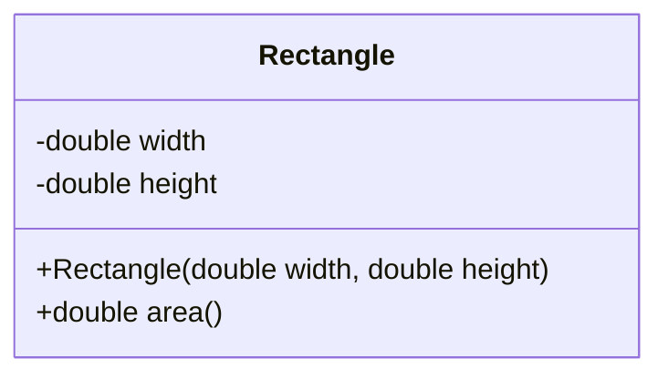

## 10.1.3 Constructors and Object Creation

In this section, we'll explore how to create Java objects in Clojure using constructors. As experienced Java developers, you're familiar with the `new` keyword and the process of object instantiation. We'll build on that knowledge to understand how Clojure handles object creation, drawing parallels and highlighting differences between the two languages.

### Understanding Object Creation in Java

In Java, creating an object involves using the `new` keyword followed by a call to a constructor. Constructors are special methods that initialize new objects. Here's a simple Java example:

```java
// Java code to create a new String object
String greeting = new String("Hello, World!");
```

In this example, the `new` keyword is used to create a new instance of the `String` class, and the constructor initializes the object with the provided string.

### Object Creation in Clojure

Clojure, being a functional language, doesn't have its own object system. Instead, it leverages the Java Virtual Machine (JVM) and its object-oriented capabilities. This means you can create Java objects directly from Clojure using a similar approach to Java, but with some syntactic differences.

#### Using the `new` Keyword in Clojure

In Clojure, the `new` keyword is used in conjunction with the class name to create a new object. Here's how you can create a `String` object in Clojure:

```clojure
;; Clojure code to create a new String object
(def greeting (new String "Hello, World!"))
```

Alternatively, you can use the `.` (dot) operator, which is more idiomatic in Clojure:

```clojure
;; Clojure code using the dot operator
(def greeting (. String (new "Hello, World!")))
```

Both approaches achieve the same result, but the dot operator is often preferred for its conciseness and readability.

### Constructors with Arguments

Just like in Java, you can pass arguments to constructors in Clojure. Let's consider a more complex example with a Java class that has multiple constructors:

```java
// Java class with multiple constructors
public class Person {
    private String name;
    private int age;

    // Constructor with one argument
    public Person(String name) {
        this.name = name;
        this.age = 0; // default age
    }

    // Constructor with two arguments
    public Person(String name, int age) {
        this.name = name;
        this.age = age;
    }
}
```

In Clojure, you can create instances of this class using either constructor:

```clojure
;; Using the one-argument constructor
(def person1 (new Person "Alice"))

;; Using the two-argument constructor
(def person2 (new Person "Bob" 30))
```

### Practical Example: Creating Java Objects in Clojure

Let's create a practical example to illustrate object creation in Clojure. We'll use a simple Java class representing a `Rectangle` with width and height:

```java
// Java class for a Rectangle
public class Rectangle {
    private double width;
    private double height;

    // Constructor
    public Rectangle(double width, double height) {
        this.width = width;
        this.height = height;
    }

    // Method to calculate area
    public double area() {
        return width * height;
    }
}
```

In Clojure, you can create a `Rectangle` object and call its methods as follows:

```clojure
;; Clojure code to create a Rectangle object
(def rect (new Rectangle 5.0 10.0))

;; Calling the area method
(def area (.area rect))

(println "The area of the rectangle is:" area)
```

### Comparing Clojure and Java Object Creation

Let's compare the object creation process in Clojure and Java to highlight the similarities and differences:

- **Syntax**: Clojure uses the `new` keyword or the dot operator, while Java uses only the `new` keyword.
- **Method Calls**: In Clojure, methods are called using the dot operator, similar to Java.
- **Functional Paradigm**: Clojure's functional nature encourages immutability, so while you can create objects, it's often better to use immutable data structures when possible.

### Try It Yourself

To deepen your understanding, try modifying the `Rectangle` class to include additional methods, such as `perimeter`, and call these methods from Clojure. Experiment with different constructors and see how Clojure handles them.

### Diagrams and Visualizations

To better understand the flow of object creation in Clojure, let's visualize the process using a class diagram:



*Diagram 1: Class diagram of the Rectangle class, showing its fields and methods.*

### Key Takeaways

- **Object Creation**: Clojure allows you to create Java objects using the `new` keyword or the dot operator.
- **Constructor Arguments**: You can pass arguments to constructors in Clojure, just like in Java.
- **Method Invocation**: Clojure uses the dot operator to call methods on Java objects.
- **Functional Paradigm**: While Clojure supports object creation, it encourages the use of immutable data structures.

### Exercises

1. **Modify the Rectangle Class**: Add a method to calculate the perimeter of the rectangle and call it from Clojure.
2. **Create a Java Class with Multiple Constructors**: Write a Java class with multiple constructors and create instances of it in Clojure.
3. **Explore Java Libraries**: Use a Java library of your choice and create objects from it in Clojure. Experiment with calling different methods.

### Further Reading

- [Official Clojure Documentation](https://clojure.org/reference/java_interop)
- [ClojureDocs: Java Interop](https://clojuredocs.org/quickref#Java%20Interop)
- [Java Constructors](https://docs.oracle.com/javase/tutorial/java/javaOO/constructors.html)

By understanding how to create Java objects in Clojure, you can leverage the vast ecosystem of Java libraries and frameworks while enjoying the benefits of Clojure's functional programming paradigm. Now that we've explored constructors and object creation, let's continue our journey into the world of Clojure and Java interoperability.

## Quiz: Mastering Java Object Creation in Clojure



### What is the primary keyword used in Clojure to create a new Java object?

- [x] new
- [ ] create
- [ ] make
- [ ] instantiate

> **Explanation:** In Clojure, the `new` keyword is used to create a new Java object, similar to Java.

### How can you call a method on a Java object in Clojure?

- [x] Using the dot operator
- [ ] Using the call method
- [ ] Using the invoke function
- [ ] Using the execute keyword

> **Explanation:** The dot operator is used in Clojure to call methods on Java objects.

### Which of the following is a correct way to create a new String object in Clojure?

- [x] (new String "Hello")
- [ ] (String.new "Hello")
- [ ] (create String "Hello")
- [ ] (make String "Hello")

> **Explanation:** The correct syntax to create a new String object in Clojure is `(new String "Hello")`.

### What is the advantage of using the dot operator in Clojure for object creation?

- [x] It provides a more concise and readable syntax
- [ ] It is the only way to create objects
- [ ] It automatically handles exceptions
- [ ] It is faster than using the new keyword

> **Explanation:** The dot operator provides a more concise and readable syntax for object creation in Clojure.

### Can you pass arguments to constructors in Clojure?

- [x] Yes
- [ ] No

> **Explanation:** Just like in Java, you can pass arguments to constructors in Clojure.

### What is the purpose of constructors in Java?

- [x] To initialize new objects
- [ ] To destroy objects
- [ ] To create interfaces
- [ ] To compile code

> **Explanation:** Constructors are special methods in Java used to initialize new objects.

### How does Clojure's functional paradigm influence object creation?

- [x] It encourages the use of immutable data structures
- [ ] It requires all objects to be mutable
- [ ] It prohibits object creation
- [ ] It mandates the use of classes

> **Explanation:** Clojure's functional paradigm encourages the use of immutable data structures, even when creating objects.

### Which of the following is a benefit of using Clojure for Java interoperability?

- [x] Access to Java's extensive libraries and frameworks
- [ ] Automatic conversion of all Java code to Clojure
- [ ] Elimination of all Java dependencies
- [ ] Native support for JavaFX

> **Explanation:** Clojure allows access to Java's extensive libraries and frameworks, enhancing interoperability.

### What is a common use case for creating Java objects in Clojure?

- [x] Leveraging existing Java libraries
- [ ] Replacing all Java code
- [ ] Avoiding functional programming
- [ ] Implementing C++ features

> **Explanation:** A common use case for creating Java objects in Clojure is to leverage existing Java libraries.

### True or False: Clojure can only create objects from Java classes.

- [x] True
- [ ] False

> **Explanation:** Clojure can create objects from Java classes, as it runs on the JVM and leverages Java's object-oriented capabilities.


