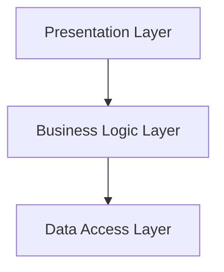
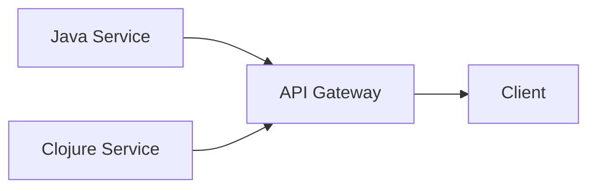

## 10.10.1 Code Organization

As experienced Java developers transitioning to Clojure, understanding how to effectively organize code when mixing these two languages is crucial. This section will guide you through best practices for code organization, focusing on separating concerns, establishing clear module boundaries, and maintaining consistent naming conventions. By the end of this guide, you'll be equipped to create clean, maintainable, and efficient codebases that leverage the strengths of both Java and Clojure.

### Understanding the Challenges of Mixed-Language Projects

When working with both Java and Clojure, developers face unique challenges. These include differences in language paradigms, data structures, and idiomatic practices. Java is an object-oriented language, while Clojure is a functional language. This fundamental difference requires careful consideration when organizing code to ensure that both languages complement each other effectively.

#### Key Challenges:

- **Paradigm Differences**: Java's object-oriented approach contrasts with Clojure's functional style, requiring a shift in mindset.
- **Data Structure Compatibility**: Ensuring seamless data exchange between Java's mutable collections and Clojure's immutable data structures.
- **Interoperability Complexity**: Managing the intricacies of calling Java from Clojure and vice versa.

### Best Practices for Code Organization

#### 1. **Separate Concerns**

Separating concerns is a fundamental principle in software design that helps manage complexity by dividing a program into distinct sections, each handling a specific aspect of the application. In a mixed-language project, this means clearly delineating which parts of the codebase are implemented in Java and which are in Clojure.

- **Java for Performance-Intensive Tasks**: Use Java for tasks that require high performance or low-level system access, such as file I/O or complex algorithms.
- **Clojure for Business Logic**: Leverage Clojure's expressive syntax and functional capabilities for business logic and data transformation tasks.

##### Example:

```java
// Java: Performance-intensive task
public class FileProcessor {
    public static String readFile(String filePath) {
        // Code to read file efficiently
    }
}
```

```clojure
;; Clojure: Business logic
(ns myapp.core
  (:require [clojure.java.io :as io]))

(defn process-file [file-path]
  (let [content (FileProcessor/readFile file-path)]
    ;; Process content using Clojure's functional capabilities
    ))
```

#### 2. **Establish Clear Module Boundaries**

Modules should encapsulate functionality and expose only what is necessary. This encapsulation is crucial in mixed-language projects to prevent unnecessary dependencies and maintain a clean architecture.

- **Use Namespaces in Clojure**: Organize Clojure code into namespaces that reflect the functionality and domain of the code.
- **Package Structure in Java**: Follow Java's package conventions to group related classes and interfaces.

##### Example:

```clojure
;; Clojure: Namespace declaration
(ns myapp.utils.string
  (:require [clojure.string :as str]))

(defn capitalize-words [s]
  (str/capitalize s))
```

```java
// Java: Package declaration
package com.myapp.utils.string;

public class StringUtils {
    public static String capitalizeWords(String s) {
        // Implementation
    }
}
```

#### 3. **Consistent Naming Conventions**

Consistent naming conventions improve code readability and maintainability. When mixing Java and Clojure, it's important to adhere to the conventions of each language while maintaining a coherent naming strategy across the codebase.

- **Clojure Naming Conventions**: Use kebab-case for function and variable names.
- **Java Naming Conventions**: Use camelCase for methods and variables, and PascalCase for classes.

##### Example:

```clojure
;; Clojure: Function name in kebab-case
(defn calculate-total [prices]
  (reduce + prices))
```

```java
// Java: Method name in camelCase
public class Calculator {
    public static int calculateTotal(int[] prices) {
        // Implementation
    }
}
```

### Code Organization Strategies

#### 1. **Layered Architecture**

A layered architecture separates concerns into different layers, each responsible for a specific part of the application. This approach is particularly useful in mixed-language projects, as it allows for clear separation between Java and Clojure components.

- **Presentation Layer**: Handle user interface and interaction, potentially using JavaFX or ClojureScript.
- **Business Logic Layer**: Implement core application logic, leveraging Clojure's functional strengths.
- **Data Access Layer**: Manage data persistence and retrieval, using Java for database interactions if necessary.

##### Diagram: Layered Architecture



*Diagram Caption*: A layered architecture separates concerns into distinct layers, facilitating clear organization in mixed-language projects.

#### 2. **Microservices Architecture**

For larger applications, a microservices architecture can be beneficial. This approach involves breaking down the application into small, independent services, each responsible for a specific functionality. This separation allows for using the best language for each service.

- **Java Microservices**: Use Java for services that require high performance or integration with existing Java systems.
- **Clojure Microservices**: Use Clojure for services that benefit from functional programming, such as data processing or analytics.

##### Diagram: Microservices Architecture



*Diagram Caption*: A microservices architecture allows for using Java and Clojure in separate services, optimizing each for its strengths.

### Practical Tips for Code Organization

#### 1. **Use Interfaces for Interoperability**

Interfaces provide a contract that both Java and Clojure can implement, facilitating seamless interoperability. Define interfaces in Java and implement them in Clojure where appropriate.

##### Example:

```java
// Java: Interface definition
public interface PaymentProcessor {
    void processPayment(double amount);
}
```

```clojure
;; Clojure: Implementing a Java interface
(ns myapp.payment
  (:gen-class
   :implements [com.myapp.PaymentProcessor]))

(defn -processPayment [this amount]
  ;; Implementation in Clojure
  )
```

#### 2. **Leverage Clojure's REPL for Rapid Development**

Clojure's Read-Eval-Print Loop (REPL) is a powerful tool for interactive development. Use the REPL to test and refine Clojure code quickly, integrating with Java components as needed.

- **Experiment with Code**: Use the REPL to try out new ideas and test Java interoperability.
- **Debugging**: Quickly identify and fix issues by evaluating expressions in the REPL.

#### 3. **Document Interoperability Points**

Clearly document areas where Java and Clojure interact. This documentation should include details on data exchange formats, method signatures, and any assumptions made about the interoperability.

### Try It Yourself

To reinforce these concepts, try organizing a small project that involves both Java and Clojure. Implement a simple application with a Java backend for data processing and a Clojure frontend for data visualization. Consider the following:

- Define clear module boundaries and separate concerns.
- Use consistent naming conventions across both languages.
- Document the interoperability points and data flow between Java and Clojure components.

### Exercises

1. **Refactor a Java Application**: Take an existing Java application and refactor parts of it into Clojure, focusing on business logic and data transformation.
2. **Design a Layered Architecture**: Create a simple application using a layered architecture, with Java handling data access and Clojure managing business logic.
3. **Implement a Microservice**: Develop a microservice in Clojure that interacts with a Java-based service, ensuring clear module boundaries and interoperability.

### Key Takeaways

- **Separate Concerns**: Clearly delineate responsibilities between Java and Clojure components.
- **Establish Module Boundaries**: Use namespaces and packages to encapsulate functionality.
- **Consistent Naming**: Adhere to language-specific naming conventions for clarity and maintainability.
- **Leverage Strengths**: Use Java for performance-critical tasks and Clojure for expressive business logic.

By following these best practices, you'll be well-equipped to organize code effectively in projects that leverage both Java and Clojure, creating robust and maintainable software solutions.

## Quiz: Mastering Code Organization in Clojure and Java Interoperability



### What is a key challenge when mixing Java and Clojure in a project?

- [x] Paradigm differences between object-oriented and functional programming
- [ ] Lack of available libraries
- [ ] Inability to use Java classes in Clojure
- [ ] Difficulty in setting up a development environment

> **Explanation:** The primary challenge is the paradigm difference between Java's object-oriented approach and Clojure's functional style.

### Which layer in a layered architecture is best suited for Clojure?

- [ ] Presentation Layer
- [x] Business Logic Layer
- [ ] Data Access Layer
- [ ] Infrastructure Layer

> **Explanation:** Clojure is well-suited for the Business Logic Layer due to its expressive syntax and functional capabilities.

### What is the benefit of using interfaces for interoperability?

- [x] They provide a contract that both Java and Clojure can implement.
- [ ] They eliminate the need for documentation.
- [ ] They automatically convert data types between Java and Clojure.
- [ ] They simplify the build process.

> **Explanation:** Interfaces define a contract that can be implemented in both Java and Clojure, facilitating interoperability.

### What naming convention does Clojure use for functions?

- [ ] camelCase
- [x] kebab-case
- [ ] snake_case
- [ ] PascalCase

> **Explanation:** Clojure uses kebab-case for naming functions and variables.

### How can Clojure's REPL be used effectively?

- [x] For rapid development and debugging
- [ ] To compile Java code
- [ ] To manage project dependencies
- [ ] To generate documentation

> **Explanation:** Clojure's REPL is a powerful tool for rapid development and debugging, allowing developers to test code interactively.

### What is a benefit of separating concerns in a mixed-language project?

- [x] It helps manage complexity by dividing the program into distinct sections.
- [ ] It reduces the need for testing.
- [ ] It eliminates the need for version control.
- [ ] It simplifies the user interface design.

> **Explanation:** Separating concerns helps manage complexity by dividing the program into distinct sections, each handling a specific aspect of the application.

### Which architecture is beneficial for larger applications using both Java and Clojure?

- [ ] Monolithic Architecture
- [ ] Layered Architecture
- [x] Microservices Architecture
- [ ] Client-Server Architecture

> **Explanation:** A microservices architecture is beneficial for larger applications, allowing for the use of Java and Clojure in separate services.

### What should be documented in a mixed-language project?

- [x] Interoperability points and data flow
- [ ] Only the Java components
- [ ] Only the Clojure components
- [ ] The entire codebase in detail

> **Explanation:** Documenting interoperability points and data flow is crucial to ensure clear understanding and maintenance of the project.

### What is a key advantage of using Clojure for business logic?

- [x] Its expressive syntax and functional capabilities
- [ ] Its ability to handle low-level system access
- [ ] Its built-in support for object-oriented programming
- [ ] Its compatibility with JavaFX

> **Explanation:** Clojure's expressive syntax and functional capabilities make it ideal for implementing business logic.

### True or False: Consistent naming conventions are not important in mixed-language projects.

- [ ] True
- [x] False

> **Explanation:** Consistent naming conventions are crucial for improving code readability and maintainability in mixed-language projects.


