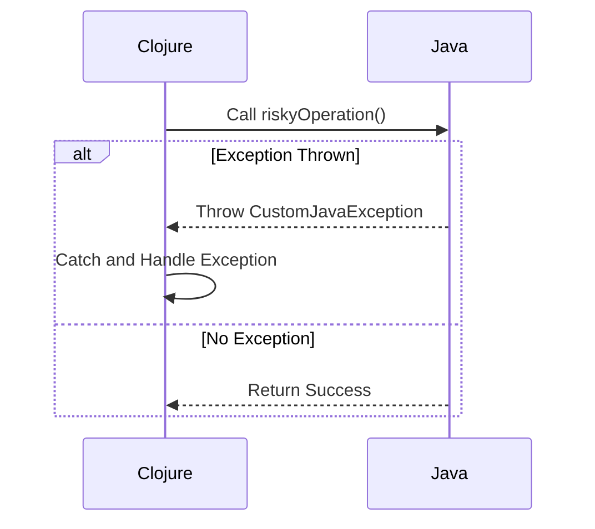

## 10.10.2 Exception Handling Across Languages

In the realm of software development, handling exceptions effectively is crucial for building robust applications. When working with Clojure and Java, two languages that often coexist in the same ecosystem, it becomes essential to manage exceptions across language boundaries seamlessly. This section will guide you through best practices for exception handling when integrating Clojure with Java, ensuring that exceptions are appropriately translated and do not leak implementation details.

### Understanding Exception Handling in Java and Clojure

Before diving into cross-language exception handling, let's briefly review how exceptions are managed in Java and Clojure.

#### Java Exception Handling

Java uses a structured approach to exception handling with `try`, `catch`, `finally`, and `throw` constructs. Java exceptions are categorized into checked exceptions, which must be declared or handled, and unchecked exceptions, which are subclasses of `RuntimeException`.

```java
try {
    // Code that may throw an exception
} catch (SpecificExceptionType e) {
    // Handle specific exception
} catch (Exception e) {
    // Handle any other exceptions
} finally {
    // Code that executes regardless of an exception
}
```

#### Clojure Exception Handling

Clojure, being a Lisp dialect, handles exceptions using `try`, `catch`, and `finally` as well, but it treats all exceptions as unchecked. This aligns with its functional programming paradigm, where side effects (including exceptions) are minimized.

```clojure
(try
  ;; Code that may throw an exception
  (do-something-risky)
  (catch Exception e
    ;; Handle exception
    (println "An error occurred:" (.getMessage e)))
  (finally
    ;; Code that executes regardless of an exception
    (println "Cleanup actions")))
```

### Cross-Language Exception Handling

When integrating Clojure and Java, exceptions can cross language boundaries. It's crucial to ensure that exceptions are handled consistently and that implementation details are not exposed inadvertently.

#### Translating Exceptions

One of the key challenges is translating exceptions between Clojure and Java. This involves converting exceptions thrown in one language into meaningful exceptions in the other.

**Java to Clojure:**

When a Java method throws an exception, it can be caught in Clojure using the `catch` clause. You can then decide whether to rethrow it as a Clojure exception or handle it directly.

```clojure
(try
  (java-method-that-may-throw)
  (catch java.lang.Exception e
    ;; Translate or handle the exception
    (throw (ex-info "Java exception occurred" {:cause e}))))
```

**Clojure to Java:**

When a Clojure function throws an exception, it can be caught in Java. You may choose to wrap it in a Java exception or handle it directly.

```java
try {
    clojureFunctionThatMayThrow();
} catch (Exception e) {
    // Translate or handle the Clojure exception
    throw new CustomJavaException("Clojure exception occurred", e);
}
```

### Best Practices for Exception Handling Across Languages

To ensure robust exception handling across Clojure and Java, consider the following best practices:

#### 1. Consistent Exception Hierarchy

Maintain a consistent exception hierarchy across both languages. Define custom exceptions in Java that can be mirrored in Clojure, ensuring that exceptions are meaningful and easily identifiable.

#### 2. Avoid Leaking Implementation Details

When translating exceptions, avoid exposing internal details of one language to the other. Use generic messages and wrap exceptions with additional context if necessary.

#### 3. Use `ex-info` in Clojure

Clojure's `ex-info` function allows you to create exceptions with additional context. This is useful for adding metadata to exceptions, which can be accessed in Java.

```clojure
(throw (ex-info "An error occurred" {:code 500 :details "Invalid input"}))
```

#### 4. Log Exceptions Appropriately

Ensure that exceptions are logged appropriately in both languages. Use logging frameworks that support both Java and Clojure, such as SLF4J or Log4j, to maintain consistent logging practices.

#### 5. Test Exception Handling

Thoroughly test exception handling across language boundaries. Write unit tests in both Java and Clojure to ensure that exceptions are caught, translated, and handled correctly.

#### 6. Document Exception Contracts

Clearly document the exception contracts between Clojure and Java components. This includes specifying which exceptions may be thrown and how they should be handled.

### Code Example: Handling Exceptions Across Clojure and Java

Let's look at a practical example of handling exceptions across Clojure and Java.

**Java Code:**

```java
public class JavaComponent {
    public void riskyOperation() throws CustomJavaException {
        // Simulate a risky operation
        if (Math.random() > 0.5) {
            throw new CustomJavaException("Something went wrong in Java");
        }
    }
}
```

**Clojure Code:**

```clojure
(ns myapp.core
  (:import [myapp JavaComponent CustomJavaException]))

(defn call-java-component []
  (let [component (JavaComponent.)]
    (try
      (.riskyOperation component)
      (catch CustomJavaException e
        (println "Caught Java exception:" (.getMessage e))
        (throw (ex-info "Handled in Clojure" {:cause e})))
      (catch Exception e
        (println "Caught unexpected exception:" (.getMessage e))))))
```

### Diagram: Exception Flow Between Clojure and Java

Below is a diagram illustrating the flow of exceptions between Clojure and Java components.



*Diagram Caption: This sequence diagram shows how exceptions flow from Java to Clojure and how they are handled.*

### Try It Yourself

To deepen your understanding, try modifying the code examples:

- **Change the exception type** thrown in Java and see how it affects the Clojure handling.
- **Add additional context** to the exceptions using `ex-info` in Clojure.
- **Log exceptions** using a logging framework and observe the output.

### Further Reading

For more information on exception handling in Clojure and Java, consider the following resources:

- [Official Clojure Documentation on Exception Handling](https://clojure.org/reference/try)
- [Java Exception Handling Tutorial](https://docs.oracle.com/javase/tutorial/essential/exceptions/)
- [ClojureDocs: ex-info](https://clojuredocs.org/clojure.core/ex-info)

### Exercises

1. **Translate a Java exception** to a Clojure exception with additional metadata.
2. **Write a unit test** in Clojure to verify that a Java exception is correctly caught and handled.
3. **Implement a logging mechanism** that logs exceptions from both Java and Clojure components.

### Key Takeaways

- **Consistent exception handling** across languages is crucial for robust applications.
- **Translate exceptions** appropriately to avoid leaking implementation details.
- **Use `ex-info`** in Clojure to add context to exceptions.
- **Log exceptions** consistently using a unified logging framework.
- **Test exception handling** thoroughly to ensure reliability.

By following these guidelines, you can effectively manage exceptions across Clojure and Java, ensuring seamless interoperability and robust error management.

## Quiz: Mastering Exception Handling Across Clojure and Java



### What is a key difference between Java and Clojure exception handling?

- [x] Java has checked exceptions, while Clojure treats all exceptions as unchecked.
- [ ] Clojure has checked exceptions, while Java treats all exceptions as unchecked.
- [ ] Both Java and Clojure have checked exceptions.
- [ ] Neither Java nor Clojure has checked exceptions.

> **Explanation:** Java distinguishes between checked and unchecked exceptions, requiring checked exceptions to be declared or handled. Clojure treats all exceptions as unchecked, aligning with its functional paradigm.

### How can you add context to exceptions in Clojure?

- [x] Use the `ex-info` function to add metadata.
- [ ] Use the `throw` function with additional arguments.
- [ ] Use the `catch` clause to add context.
- [ ] Use the `finally` block to add context.

> **Explanation:** The `ex-info` function in Clojure allows you to create exceptions with additional metadata, providing context that can be accessed when handling the exception.

### What is a best practice for logging exceptions across Clojure and Java?

- [x] Use a unified logging framework like SLF4J or Log4j.
- [ ] Log exceptions only in Java.
- [ ] Log exceptions only in Clojure.
- [ ] Use separate logging frameworks for each language.

> **Explanation:** Using a unified logging framework like SLF4J or Log4j ensures consistent logging practices across both Clojure and Java components.

### Why is it important to avoid leaking implementation details in exceptions?

- [x] To maintain abstraction and security.
- [ ] To make debugging easier.
- [ ] To increase performance.
- [ ] To reduce code complexity.

> **Explanation:** Avoiding the leakage of implementation details in exceptions helps maintain abstraction and security, preventing exposure of internal logic or sensitive information.

### How can you handle a Clojure exception in Java?

- [x] Catch the exception in Java and wrap it in a custom Java exception.
- [ ] Use the `throw` keyword in Java.
- [ ] Use the `finally` block in Java.
- [ ] Use the `try` block in Java without a `catch` clause.

> **Explanation:** When a Clojure exception is caught in Java, it can be wrapped in a custom Java exception to provide additional context or translation.

### What should you document regarding exception handling between Clojure and Java?

- [x] Exception contracts, including which exceptions may be thrown and how they should be handled.
- [ ] Only the exceptions thrown by Java components.
- [ ] Only the exceptions thrown by Clojure components.
- [ ] No documentation is necessary for exception handling.

> **Explanation:** Documenting exception contracts between Clojure and Java components ensures clarity on which exceptions may be thrown and how they should be handled.

### What is the purpose of the `finally` block in exception handling?

- [x] To execute code regardless of whether an exception is thrown.
- [ ] To catch exceptions.
- [ ] To throw exceptions.
- [ ] To log exceptions.

> **Explanation:** The `finally` block is used to execute code that should run regardless of whether an exception is thrown, such as cleanup actions.

### How can you test exception handling across language boundaries?

- [x] Write unit tests in both Java and Clojure to ensure exceptions are caught and handled correctly.
- [ ] Only test exceptions in Java.
- [ ] Only test exceptions in Clojure.
- [ ] Testing is not necessary for exception handling.

> **Explanation:** Writing unit tests in both Java and Clojure ensures that exceptions are caught, translated, and handled correctly across language boundaries.

### What is a common challenge when handling exceptions across languages?

- [x] Translating exceptions without leaking implementation details.
- [ ] Catching exceptions in Clojure.
- [ ] Catching exceptions in Java.
- [ ] Logging exceptions.

> **Explanation:** A common challenge is translating exceptions between languages without leaking implementation details, ensuring that exceptions are meaningful and secure.

### True or False: Clojure's `ex-info` function can be used to add metadata to exceptions.

- [x] True
- [ ] False

> **Explanation:** True. Clojure's `ex-info` function allows you to create exceptions with additional metadata, providing context that can be accessed when handling the exception.


