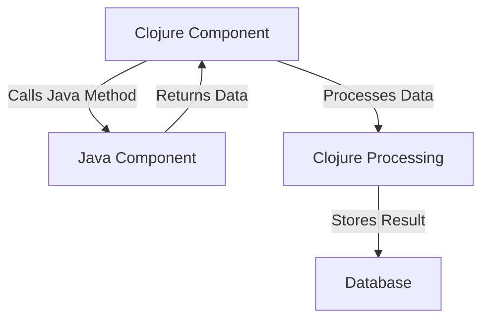

## 10.10.4 Maintaining Interoperable Systems

As experienced Java developers transitioning to Clojure, you are likely familiar with the challenges of maintaining systems that integrate multiple programming languages. In this section, we will explore best practices for maintaining systems that include both Clojure and Java code. We will focus on key areas such as dependency management, documentation, and team collaboration. By the end of this guide, you will have a comprehensive understanding of how to effectively manage and maintain interoperable systems, leveraging the strengths of both languages.

### Understanding Interoperability

Interoperability between Clojure and Java is a powerful feature that allows developers to leverage the strengths of both languages. Clojure, being a JVM language, can seamlessly interact with Java code, enabling developers to use existing Java libraries and frameworks while benefiting from Clojure's functional programming paradigms.

#### Key Concepts

- **Java Interop Syntax**: Clojure provides a straightforward syntax for calling Java methods, accessing fields, and creating objects. This allows developers to integrate Java code into Clojure projects with minimal friction.
- **Data Type Conversion**: Understanding how to convert data types between Java and Clojure is crucial for seamless interoperability. Clojure provides functions to convert between Java collections and Clojure data structures.
- **Error Handling**: Handling exceptions across language boundaries requires careful consideration. Clojure provides mechanisms to catch and throw Java exceptions, allowing for robust error handling in interoperable systems.

### Dependency Management

Managing dependencies is a critical aspect of maintaining interoperable systems. Both Clojure and Java have their own dependency management tools, and understanding how to use them effectively is essential for maintaining a stable and reliable codebase.

#### Clojure Dependency Management

Clojure uses tools like Leiningen and tools.deps for dependency management. These tools allow developers to specify dependencies in a declarative manner, making it easy to manage and update libraries.

- **Leiningen**: A popular build tool for Clojure projects, Leiningen uses a `project.clj` file to define dependencies. It supports a wide range of plugins and is well-suited for traditional Clojure projects.
- **tools.deps**: A newer tool that provides a more flexible approach to dependency management. It uses an `deps.edn` file to specify dependencies and is ideal for projects that require fine-grained control over dependency resolution.

#### Java Dependency Management

Java developers typically use tools like Maven or Gradle for dependency management. These tools provide robust mechanisms for managing dependencies, building projects, and integrating with other tools.

- **Maven**: A widely-used build automation tool that uses an `pom.xml` file to define project dependencies. Maven's extensive plugin ecosystem makes it a powerful choice for Java projects.
- **Gradle**: A flexible build tool that uses a `build.gradle` file to define dependencies. Gradle's incremental build capabilities and support for multiple languages make it a popular choice for modern Java projects.

#### Integrating Clojure and Java Dependencies

When maintaining interoperable systems, it's important to ensure that dependencies are managed consistently across both Clojure and Java components. Here are some best practices:

- **Unified Dependency Management**: Use a single tool, such as Maven or Gradle, to manage dependencies for both Clojure and Java components. This simplifies the build process and ensures consistency across the codebase.
- **Version Compatibility**: Ensure that the versions of shared libraries are compatible across both languages. This may require careful coordination and testing to avoid conflicts.
- **Dependency Isolation**: Use tools like Docker or virtual environments to isolate dependencies and prevent conflicts between different projects or environments.

### Documentation

Clear and comprehensive documentation is essential for maintaining interoperable systems. It ensures that team members can understand and work with both Clojure and Java components, reducing the risk of errors and improving collaboration.

#### Best Practices for Documentation

- **Code Comments**: Use comments to explain complex logic, especially when integrating Clojure and Java code. This helps team members understand the purpose and functionality of the code.
- **API Documentation**: Generate API documentation for both Clojure and Java components using tools like Javadoc or Clojure's `codox`. This provides a clear reference for developers working with the codebase.
- **Architecture Diagrams**: Create diagrams to illustrate the architecture of the system, highlighting the interactions between Clojure and Java components. This provides a visual overview of the system and helps identify potential areas for improvement.

*Diagram 1: Interaction between Clojure and Java components in an interoperable system.*

#### Maintaining Up-to-Date Documentation

- **Regular Updates**: Ensure that documentation is updated regularly to reflect changes in the codebase. This includes updating API documentation, code comments, and architecture diagrams.
- **Documentation Reviews**: Conduct regular reviews of documentation to ensure accuracy and completeness. This can be done as part of code reviews or as a separate process.
- **Collaborative Tools**: Use collaborative tools like Confluence or GitHub Wikis to maintain and share documentation. This allows team members to contribute to and access documentation easily.

### Team Collaboration

Effective collaboration is key to maintaining interoperable systems. It ensures that team members can work together effectively, leveraging the strengths of both Clojure and Java to deliver high-quality software.

#### Best Practices for Team Collaboration

- **Cross-Training**: Encourage team members to learn both Clojure and Java, fostering a shared understanding of the codebase. This can be done through workshops, pair programming, or online courses.
- **Communication Tools**: Use communication tools like Slack or Microsoft Teams to facilitate collaboration and knowledge sharing. This allows team members to ask questions, share insights, and resolve issues quickly.
- **Agile Practices**: Adopt agile practices like daily stand-ups, sprint planning, and retrospectives to improve collaboration and ensure alignment across the team.

#### Managing Code Contributions

- **Code Reviews**: Conduct regular code reviews to ensure code quality and consistency. This provides an opportunity for team members to share feedback and learn from each other.
- **Version Control**: Use version control systems like Git to manage code contributions and track changes. This allows team members to collaborate effectively and maintain a history of changes.
- **Continuous Integration**: Implement continuous integration (CI) to automate testing and deployment. This ensures that changes are tested and integrated into the codebase quickly and reliably.

### Try It Yourself

To reinforce your understanding of maintaining interoperable systems, try the following exercises:

1. **Dependency Management**: Set up a new project that includes both Clojure and Java components. Use Maven or Gradle to manage dependencies and ensure compatibility between the two languages.

2. **Documentation**: Create API documentation for a Clojure component that interacts with Java code. Use tools like Javadoc or Codox to generate the documentation.

3. **Team Collaboration**: Organize a code review session with your team to review a piece of interoperable code. Discuss the integration points between Clojure and Java and identify areas for improvement.

### Key Takeaways

- **Interoperability**: Clojure's seamless integration with Java allows developers to leverage the strengths of both languages, enabling the use of existing Java libraries and frameworks.
- **Dependency Management**: Effective dependency management is crucial for maintaining interoperable systems. Use tools like Maven or Gradle to manage dependencies consistently across both Clojure and Java components.
- **Documentation**: Clear and comprehensive documentation is essential for maintaining interoperable systems. Use code comments, API documentation, and architecture diagrams to ensure team members can understand and work with the codebase.
- **Team Collaboration**: Effective collaboration is key to maintaining interoperable systems. Encourage cross-training, use communication tools, and adopt agile practices to improve collaboration and ensure alignment across the team.

By following these best practices, you can effectively maintain systems that integrate Clojure and Java, leveraging the strengths of both languages to deliver high-quality software.

## Quiz: Maintaining Interoperable Systems



### What is a key benefit of Clojure's interoperability with Java?

- [x] It allows developers to leverage existing Java libraries and frameworks.
- [ ] It eliminates the need for dependency management.
- [ ] It simplifies error handling across language boundaries.
- [ ] It automatically generates documentation for Java components.

> **Explanation:** Clojure's interoperability with Java allows developers to leverage existing Java libraries and frameworks, enabling them to use familiar tools and resources while benefiting from Clojure's functional programming paradigms.

### Which tool is commonly used for dependency management in Clojure projects?

- [ ] Maven
- [x] Leiningen
- [ ] Gradle
- [ ] Ant

> **Explanation:** Leiningen is a popular build tool for Clojure projects, used for dependency management and project automation.

### What is a best practice for managing dependencies in interoperable systems?

- [x] Use a single tool to manage dependencies for both Clojure and Java components.
- [ ] Use separate tools for Clojure and Java dependencies.
- [ ] Avoid using dependency management tools.
- [ ] Manually update dependencies for each component.

> **Explanation:** Using a single tool to manage dependencies for both Clojure and Java components simplifies the build process and ensures consistency across the codebase.

### Why is documentation important in maintaining interoperable systems?

- [x] It ensures that team members can understand and work with both Clojure and Java components.
- [ ] It eliminates the need for code comments.
- [ ] It automatically updates the codebase.
- [ ] It replaces the need for version control.

> **Explanation:** Documentation is important in maintaining interoperable systems because it ensures that team members can understand and work with both Clojure and Java components, reducing the risk of errors and improving collaboration.

### What is a recommended practice for team collaboration in interoperable systems?

- [x] Encourage cross-training in both Clojure and Java.
- [ ] Use separate communication tools for Clojure and Java teams.
- [ ] Avoid agile practices.
- [ ] Limit code reviews to Java components.

> **Explanation:** Encouraging cross-training in both Clojure and Java fosters a shared understanding of the codebase and improves collaboration among team members.

### Which tool can be used to generate API documentation for Clojure components?

- [ ] Javadoc
- [x] Codox
- [ ] Swagger
- [ ] Doxygen

> **Explanation:** Codox is a tool used to generate API documentation for Clojure components, providing a clear reference for developers working with the codebase.

### What is a benefit of using continuous integration (CI) in interoperable systems?

- [x] It automates testing and deployment, ensuring changes are integrated quickly and reliably.
- [ ] It eliminates the need for version control.
- [ ] It replaces the need for code reviews.
- [ ] It automatically generates documentation.

> **Explanation:** Continuous integration (CI) automates testing and deployment, ensuring that changes are tested and integrated into the codebase quickly and reliably.

### What is a key consideration when managing dependencies in interoperable systems?

- [x] Ensuring version compatibility across both Clojure and Java components.
- [ ] Using separate dependency management tools for each language.
- [ ] Avoiding the use of shared libraries.
- [ ] Manually resolving dependency conflicts.

> **Explanation:** Ensuring version compatibility across both Clojure and Java components is crucial to avoid conflicts and maintain a stable and reliable codebase.

### What is a recommended practice for maintaining up-to-date documentation?

- [x] Conduct regular reviews of documentation to ensure accuracy and completeness.
- [ ] Update documentation only when major changes occur.
- [ ] Use documentation as a substitute for code comments.
- [ ] Limit documentation to API references.

> **Explanation:** Conducting regular reviews of documentation ensures accuracy and completeness, keeping it up-to-date with changes in the codebase.

### True or False: Using a single tool for dependency management in interoperable systems simplifies the build process.

- [x] True
- [ ] False

> **Explanation:** Using a single tool for dependency management in interoperable systems simplifies the build process and ensures consistency across the codebase.


