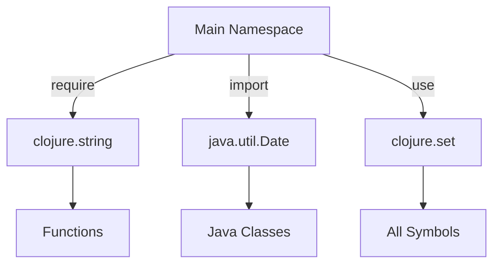

## 10.2.1 Using `require`, `use`, and `import`

In the realm of Clojure programming, managing namespaces and accessing external libraries and classes are crucial skills for building robust applications. This section delves into the intricacies of using `require`, `use`, and `import`—three pivotal constructs that facilitate namespace management and Java interoperability in Clojure. Understanding these tools will empower you to organize your code efficiently, leverage existing libraries, and seamlessly integrate Java classes into your Clojure projects.

### Understanding Namespaces in Clojure

Namespaces in Clojure serve as containers for organizing code, similar to packages in Java. They help avoid naming conflicts and make code more modular and maintainable. A namespace can contain functions, variables, macros, and other definitions. By default, when you start a Clojure REPL, you are in the `user` namespace. However, as your projects grow, you'll need to define and manage multiple namespaces.

### The `require` Function

The `require` function is used to load and access other namespaces within your Clojure code. It allows you to bring in functions and definitions from other namespaces without polluting your current namespace with all of their symbols. This is akin to importing specific classes in Java rather than entire packages.

#### Basic Usage of `require`

The basic syntax for `require` involves specifying the namespace you want to load. You can also use aliases to simplify access to the functions within the required namespace.

```clojure
(require '[clojure.string :as str])
```

In this example, the `clojure.string` namespace is loaded, and an alias `str` is created. This allows you to call functions from `clojure.string` using the `str` prefix, such as `str/upper-case`.

#### Advanced `require` Options

The `require` function offers several options to customize how namespaces are loaded:

- **Aliases**: As shown above, using `:as` allows you to create a shorthand alias for the namespace.
- **Refer**: The `:refer` option lets you bring specific symbols into the current namespace.
  
  ```clojure
  (require '[clojure.string :refer [upper-case lower-case]])
  ```

  This brings only the `upper-case` and `lower-case` functions into the current namespace, allowing you to use them directly without a prefix.

- **Refer-All**: The `:refer :all` option imports all symbols from a namespace, similar to `use`, but it's generally discouraged due to potential naming conflicts.

  ```clojure
  (require '[clojure.string :refer :all])
  ```

#### Best Practices for `require`

- **Use Aliases**: Prefer using aliases to keep your code clear and avoid naming conflicts.
- **Limit Refers**: Only refer specific symbols when necessary to maintain namespace clarity.
- **Avoid `:refer :all`**: This can lead to unexpected behavior due to symbol clashes.

### The `use` Function

The `use` function is similar to `require` but with a key difference: it automatically refers all symbols from the specified namespace into the current namespace. While this might seem convenient, it can lead to naming conflicts and is generally less preferred in modern Clojure code.

#### Basic Usage of `use`

```clojure
(use 'clojure.string)
```

This statement imports all symbols from `clojure.string` into the current namespace, allowing you to use them directly.

#### Why `use` is Less Preferred

- **Namespace Pollution**: By importing all symbols, `use` can clutter your namespace, making it harder to track where functions originate.
- **Potential Conflicts**: If multiple namespaces have functions with the same name, `use` can cause conflicts and unexpected behavior.

#### Alternatives to `use`

Instead of `use`, consider using `require` with specific refers or aliases to maintain clarity and control over your namespace.

### The `import` Function

The `import` function is used to bring Java classes into a Clojure namespace. This is essential for leveraging Java's extensive libraries and frameworks within your Clojure applications.

#### Basic Usage of `import`

```clojure
(import 'java.util.Date)
```

This statement imports the `Date` class from the `java.util` package, allowing you to create and manipulate `Date` objects in your Clojure code.

#### Importing Multiple Classes

You can import multiple classes from the same package in a single statement:

```clojure
(import '(java.util Date Calendar))
```

This imports both `Date` and `Calendar` classes from `java.util`.

#### Best Practices for `import`

- **Group Imports**: Use the grouped form `(package (Class1 Class2))` for cleaner code when importing multiple classes from the same package.
- **Limit Imports**: Only import classes you need to avoid unnecessary dependencies.

### Practical Examples and Use Cases

#### Example 1: String Manipulation

Let's explore a practical example where we use `require` to perform string manipulation:

```clojure
(ns myapp.core
  (:require [clojure.string :as str]))

(defn process-string [s]
  (-> s
      (str/trim)
      (str/upper-case)))
```

In this example, we define a function `process-string` that trims and converts a string to uppercase using functions from the `clojure.string` namespace.

#### Example 2: Java Interoperability

Here's an example of using `import` to work with Java classes:

```clojure
(ns myapp.date
  (:import (java.util Date Calendar)))

(defn current-date []
  (Date.))

(defn add-days [date days]
  (let [cal (Calendar/getInstance)]
    (.setTime cal date)
    (.add cal Calendar/DATE days)
    (.getTime cal)))
```

This code defines functions to get the current date and add days to a date using Java's `Date` and `Calendar` classes.

### Common Pitfalls and Optimization Tips

- **Avoid Overusing `use`**: As mentioned, `use` can lead to namespace pollution. Prefer `require` with specific refers or aliases.
- **Be Mindful of Conflicts**: When using `require` with `:refer`, ensure that the symbols you import do not conflict with existing ones in your namespace.
- **Optimize Imports**: Only import Java classes you need to keep your codebase lean and efficient.

### Visualizing Namespace Management

To better understand how `require`, `use`, and `import` work together in a Clojure project, consider the following diagram:



In this diagram, the main namespace uses `require` to access specific functions from `clojure.string`, `import` to bring in Java classes, and `use` to refer all symbols from `clojure.set`.

### Conclusion

Mastering `require`, `use`, and `import` is essential for effective namespace management and Java interoperability in Clojure. By understanding these constructs, you can organize your codebase efficiently, leverage existing libraries, and seamlessly integrate Java classes. Remember to follow best practices, such as using aliases and limiting imports, to maintain clean and maintainable code.

## Quiz Time!



### What is the primary purpose of the `require` function in Clojure?

- [x] To load another namespace and optionally create an alias.
- [ ] To import all symbols from another namespace.
- [ ] To import Java classes.
- [ ] To define a new namespace.

> **Explanation:** The `require` function is used to load another namespace and optionally create an alias for it, allowing you to access its functions and definitions.

### Which of the following is a reason why `use` is less preferred in modern Clojure code?

- [x] It can lead to namespace pollution and naming conflicts.
- [ ] It requires more code to use than `require`.
- [ ] It does not support aliases.
- [ ] It cannot be used with Java classes.

> **Explanation:** The `use` function imports all symbols from a namespace, which can lead to namespace pollution and naming conflicts, making it less preferred.

### How do you import multiple Java classes from the same package in Clojure?

- [x] `(import '(java.util Date Calendar))`
- [ ] `(import 'java.util.Date 'java.util.Calendar)`
- [ ] `(require '[java.util :as util])`
- [ ] `(use 'java.util.Date 'java.util.Calendar)`

> **Explanation:** The grouped form `(import '(java.util Date Calendar))` is used to import multiple classes from the same package in a clean and efficient manner.

### What is the effect of using `:refer :all` with `require`?

- [x] It imports all symbols from the specified namespace.
- [ ] It creates an alias for the namespace.
- [ ] It imports Java classes.
- [ ] It defines a new namespace.

> **Explanation:** Using `:refer :all` with `require` imports all symbols from the specified namespace into the current namespace.

### Which of the following is a best practice when using `require`?

- [x] Use aliases to avoid naming conflicts.
- [ ] Always use `:refer :all` for convenience.
- [ ] Avoid using `require` and prefer `use`.
- [ ] Import all Java classes with `require`.

> **Explanation:** Using aliases with `require` helps avoid naming conflicts and keeps the code clear and maintainable.

### What does the `import` function do in Clojure?

- [x] It imports Java classes into a Clojure namespace.
- [ ] It loads another Clojure namespace.
- [ ] It refers all symbols from a namespace.
- [ ] It creates a new namespace.

> **Explanation:** The `import` function is used to bring Java classes into a Clojure namespace, allowing you to use them in your code.

### How can you bring specific symbols from a namespace into the current namespace using `require`?

- [x] `(require '[clojure.string :refer [upper-case lower-case]])`
- [ ] `(use 'clojure.string)`
- [ ] `(import 'clojure.string)`
- [ ] `(require '[clojure.string :as str])`

> **Explanation:** The `:refer` option in `require` allows you to bring specific symbols into the current namespace.

### What is a potential drawback of using `:refer :all` with `require`?

- [x] It can lead to unexpected behavior due to symbol clashes.
- [ ] It requires more code to use.
- [ ] It does not support aliases.
- [ ] It cannot be used with Java classes.

> **Explanation:** Using `:refer :all` can lead to unexpected behavior due to symbol clashes, as it imports all symbols from a namespace.

### Which function would you use to load a Clojure namespace and create an alias for it?

- [x] `require`
- [ ] `use`
- [ ] `import`
- [ ] `def`

> **Explanation:** The `require` function is used to load a Clojure namespace and create an alias for it.

### True or False: The `use` function is the preferred way to import Java classes in Clojure.

- [ ] True
- [x] False

> **Explanation:** The `import` function, not `use`, is used to import Java classes in Clojure.


