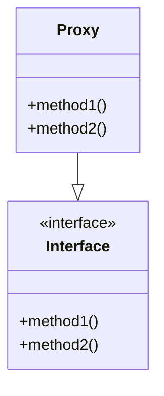

## 10.2.1 Implementing Interfaces with `proxy`

In this section, we delve into the powerful `proxy` macro in Clojure, which allows you to create anonymous classes that implement Java interfaces or extend classes. This capability is crucial for Java developers transitioning to Clojure, as it provides a seamless way to integrate Clojure code with existing Java libraries and frameworks.

### Understanding the `proxy` Macro

The `proxy` macro in Clojure is a tool that allows you to create instances of anonymous classes that can implement one or more interfaces or extend a class. This is particularly useful when you need to interact with Java APIs that require you to implement specific interfaces or extend classes.

#### Syntax of `proxy`

The basic syntax of the `proxy` macro is as follows:

```clojure
(proxy [interface-or-class-name] [constructor-args]
  (method-name [args] method-body)
  ...)
```

- **interface-or-class-name**: A vector of interfaces or a single class that the proxy should implement or extend.
- **constructor-args**: A vector of arguments to pass to the superclass constructor.
- **method-name**: The name of the method you want to override.
- **args**: A vector of arguments for the method.
- **method-body**: The implementation of the method.

### Creating Anonymous Classes with `proxy`

Let's start with a simple example where we implement a Java interface using `proxy`. Suppose we have a Java interface `Runnable` that we want to implement in Clojure.

#### Java Example

In Java, you would typically implement `Runnable` like this:

```java
public class MyRunnable implements Runnable {
    @Override
    public void run() {
        System.out.println("Running in Java");
    }
}
```

#### Clojure Example

In Clojure, using `proxy`, you can achieve the same functionality as follows:

```clojure
(def my-runnable
  (proxy [java.lang.Runnable] []
    (run []
      (println "Running in Clojure"))))

;; To use the proxy, you can pass it to a Java thread
(.start (Thread. my-runnable))
```

**Explanation**:
- We use `proxy` to create an anonymous class that implements `Runnable`.
- The `run` method is overridden to print a message.
- We create a new `Thread` and pass the proxy instance to it.

### Extending Classes with `proxy`

The `proxy` macro can also be used to extend Java classes. Let's consider an example where we extend the `java.util.TimerTask` class.

#### Java Example

In Java, you might extend `TimerTask` like this:

```java
import java.util.TimerTask;

public class MyTimerTask extends TimerTask {
    @Override
    public void run() {
        System.out.println("Timer task executed");
    }
}
```

#### Clojure Example

In Clojure, using `proxy`, you can extend `TimerTask` as follows:

```clojure
(def my-timer-task
  (proxy [java.util.TimerTask] []
    (run []
      (println "Timer task executed in Clojure"))))

;; Schedule the task using a Timer
(let [timer (java.util.Timer.)]
  (.schedule timer my-timer-task 1000))
```

**Explanation**:
- We use `proxy` to extend `TimerTask`.
- The `run` method is overridden to print a message.
- We schedule the task using a `Timer`.

### Overriding Methods with `proxy`

When using `proxy`, you can override multiple methods. Let's see an example where we implement a custom `MouseListener`.

#### Java Example

In Java, you would implement `MouseListener` like this:

```java
import java.awt.event.MouseListener;
import java.awt.event.MouseEvent;

public class MyMouseListener implements MouseListener {
    @Override
    public void mouseClicked(MouseEvent e) {
        System.out.println("Mouse clicked");
    }

    @Override
    public void mousePressed(MouseEvent e) {}

    @Override
    public void mouseReleased(MouseEvent e) {}

    @Override
    public void mouseEntered(MouseEvent e) {}

    @Override
    public void mouseExited(MouseEvent e) {}
}
```

#### Clojure Example

In Clojure, using `proxy`, you can implement `MouseListener` as follows:

```clojure
(import '[java.awt.event MouseListener MouseEvent])

(def my-mouse-listener
  (proxy [MouseListener] []
    (mouseClicked [e]
      (println "Mouse clicked in Clojure"))
    (mousePressed [e])
    (mouseReleased [e])
    (mouseEntered [e])
    (mouseExited [e])))

;; Example usage with a Java component
;; (.addMouseListener some-component my-mouse-listener)
```

**Explanation**:
- We use `proxy` to implement `MouseListener`.
- Only the `mouseClicked` method is given a body, while others are left empty.
- This proxy can be added to any Java component that supports mouse listeners.

### Comparing `proxy` with Java Anonymous Classes

In Java, anonymous classes are often used to implement interfaces or extend classes on the fly. The `proxy` macro in Clojure serves a similar purpose but with a more concise syntax and the power of Clojure's functional programming paradigm.

#### Key Differences

- **Syntax**: Clojure's `proxy` is more concise and leverages the language's macro capabilities.
- **Functional Style**: Clojure encourages a functional style, even when dealing with object-oriented constructs.
- **Dynamic Typing**: Clojure is dynamically typed, which can lead to more flexible code compared to Java's static typing.

### Practical Use Cases for `proxy`

The `proxy` macro is particularly useful in scenarios where you need to:

- **Integrate with Java Libraries**: Implement interfaces required by Java libraries.
- **Extend Java Classes**: Add custom behavior to existing Java classes.
- **Event Handling**: Implement event listeners for GUI applications.
- **Testing**: Create mock objects for testing purposes.

### Try It Yourself

To deepen your understanding, try modifying the examples above:

- **Exercise 1**: Implement a `java.lang.Comparable` interface using `proxy` and compare two numbers.
- **Exercise 2**: Extend `java.util.TimerTask` to perform a different task, such as printing the current time.
- **Exercise 3**: Create a proxy for `java.awt.event.ActionListener` and handle button click events.

### Visualizing `proxy` Usage

To better understand how `proxy` works, let's visualize the flow of data and method calls using a diagram.



**Diagram Explanation**: This class diagram illustrates how a `proxy` instance implements an interface by providing concrete implementations for its methods.

### Further Reading

For more information on using `proxy` and other Clojure features, consider exploring the following resources:

- [Official Clojure Documentation](https://clojure.org/reference/proxy)
- [ClojureDocs - Proxy](https://clojuredocs.org/clojure.core/proxy)
- [Java Interoperability in Clojure](https://clojure.org/reference/java_interop)

### Exercises and Practice Problems

1. **Implement a Custom Comparator**: Use `proxy` to create a custom comparator for sorting strings by length.
2. **GUI Event Handling**: Implement a `WindowListener` using `proxy` to handle window events in a Java Swing application.
3. **Mocking for Tests**: Create a mock implementation of a Java interface using `proxy` for unit testing.

### Key Takeaways

- The `proxy` macro in Clojure allows you to create anonymous classes that implement interfaces or extend classes, facilitating seamless Java interoperability.
- `proxy` is a powerful tool for integrating Clojure with Java libraries, handling events, and creating mock objects for testing.
- Understanding `proxy` is essential for Java developers transitioning to Clojure, as it bridges the gap between functional and object-oriented programming paradigms.

Now that we've explored how to implement interfaces with `proxy` in Clojure, let's apply these concepts to enhance your Java-Clojure interoperability skills.

## Quiz: Mastering `proxy` in Clojure



### What is the primary purpose of the `proxy` macro in Clojure?

- [x] To create anonymous classes that implement interfaces or extend classes
- [ ] To define new Clojure functions
- [ ] To manage concurrency in Clojure
- [ ] To handle exceptions in Clojure

> **Explanation:** The `proxy` macro is used to create anonymous classes that can implement interfaces or extend classes, allowing for seamless Java interoperability.

### How do you specify the interfaces or classes a `proxy` should implement or extend?

- [x] By providing a vector of interface or class names
- [ ] By using a map of method names to implementations
- [ ] By defining a new Clojure namespace
- [ ] By using a special keyword

> **Explanation:** In the `proxy` macro, you specify the interfaces or classes by providing a vector of their names.

### Which of the following is a correct use of the `proxy` macro to implement `Runnable`?

- [x] `(proxy [java.lang.Runnable] [] (run [] (println "Running")))`
- [ ] `(proxy java.lang.Runnable [] (run [] (println "Running")))`
- [ ] `(proxy [java.lang.Runnable] (run [] (println "Running")))`
- [ ] `(proxy [java.lang.Runnable] [] (println "Running"))`

> **Explanation:** The correct syntax includes a vector with the interface name and an empty vector for constructor arguments.

### What is a common use case for the `proxy` macro?

- [x] Implementing Java interfaces for event handling
- [ ] Defining new Clojure macros
- [ ] Managing state in Clojure applications
- [ ] Performing mathematical calculations

> **Explanation:** A common use case for `proxy` is implementing Java interfaces, such as event listeners in GUI applications.

### Which method is overridden in the following `proxy` example: `(proxy [java.util.TimerTask] [] (run [] (println "Task executed")))`?

- [x] `run`
- [ ] `execute`
- [ ] `start`
- [ ] `stop`

> **Explanation:** The `run` method is overridden in this `proxy` example, as it is the method defined in `TimerTask`.

### Can `proxy` be used to extend Java classes in addition to implementing interfaces?

- [x] True
- [ ] False

> **Explanation:** Yes, `proxy` can be used to extend Java classes as well as implement interfaces.

### What is the role of the constructor arguments vector in the `proxy` macro?

- [x] To pass arguments to the superclass constructor
- [ ] To define the methods to be overridden
- [ ] To specify the return type of methods
- [ ] To declare the package of the proxy class

> **Explanation:** The constructor arguments vector is used to pass arguments to the superclass constructor when extending a class.

### Which of the following is NOT a benefit of using `proxy` in Clojure?

- [ ] Seamless Java interoperability
- [ ] Concise syntax for implementing interfaces
- [ ] Dynamic typing flexibility
- [x] Improved performance over Java classes

> **Explanation:** While `proxy` offers many benefits, it does not inherently improve performance over Java classes.

### How does `proxy` in Clojure compare to Java's anonymous classes?

- [x] `proxy` provides a more concise syntax and leverages Clojure's functional paradigm
- [ ] `proxy` is more verbose and complex than Java's anonymous classes
- [ ] `proxy` is only used for concurrency management
- [ ] `proxy` cannot be used for implementing interfaces

> **Explanation:** `proxy` offers a more concise syntax and leverages Clojure's functional programming paradigm, making it a powerful tool for Java interoperability.

### Is it possible to override multiple methods using a single `proxy` instance?

- [x] True
- [ ] False

> **Explanation:** Yes, you can override multiple methods in a single `proxy` instance by providing implementations for each method.


