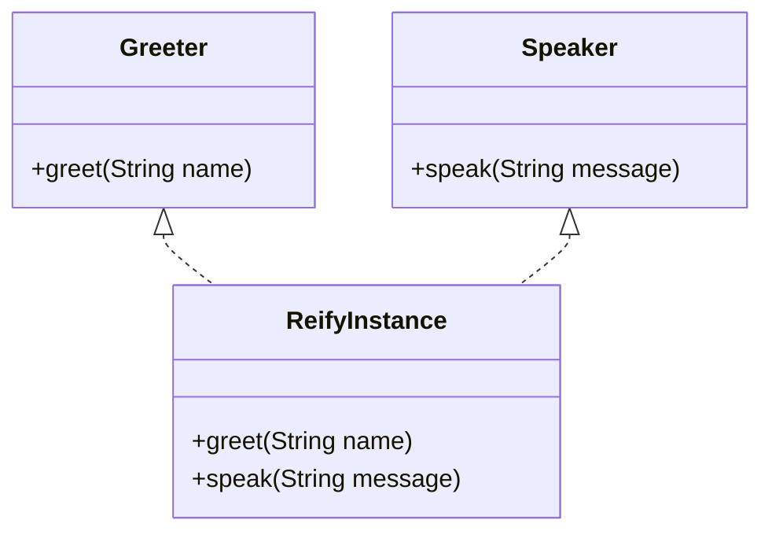

## 10.2.2 Using `reify` for Interface Implementations

As experienced Java developers, you're likely familiar with the process of implementing interfaces to define a contract for classes. In Clojure, the `reify` construct offers a powerful and concise way to implement interfaces or protocols without the need to create a named class. This section will guide you through using `reify`, providing examples and comparisons to Java to illustrate its advantages.

### Understanding `reify`

In Clojure, `reify` is a special form that allows you to create an anonymous instance of one or more interfaces or protocols. Unlike Java, where you typically define a named class to implement an interface, `reify` lets you define the implementation inline, making your code more concise and expressive.

#### Key Features of `reify`:

- **Anonymous Implementation**: `reify` creates an unnamed class that implements the specified interfaces or protocols.
- **Inline Definition**: You can define the methods directly within the `reify` form.
- **Multiple Interfaces**: `reify` can implement multiple interfaces or protocols simultaneously.
- **Local Scope**: The implementation is scoped to the block where `reify` is used, promoting encapsulation.

### Comparing `reify` with Java's Interface Implementation

Let's start by comparing how you would implement an interface in Java versus using `reify` in Clojure.

#### Java Example

In Java, implementing an interface involves creating a named class:

```java
// Java Interface
public interface Greeter {
    void greet(String name);
}

// Java Class Implementing the Interface
public class SimpleGreeter implements Greeter {
    @Override
    public void greet(String name) {
        System.out.println("Hello, " + name + "!");
    }
}

// Usage
Greeter greeter = new SimpleGreeter();
greeter.greet("World");
```

#### Clojure Example with `reify`

In Clojure, you can achieve the same functionality using `reify`:

```clojure
;; Clojure Interface Implementation using reify
(def greeter
  (reify
    Greeter
    (greet [this name]
      (println "Hello," name "!"))))

;; Usage
(.greet greeter "World")
```

**Explanation**:
- **`reify`**: Creates an anonymous instance of the `Greeter` interface.
- **Method Definition**: The `greet` method is defined inline, directly within the `reify` form.
- **Conciseness**: The implementation is more concise compared to Java's named class.

### Detailed Breakdown of `reify`

To better understand `reify`, let's break down its components and explore more complex examples.

#### Implementing Multiple Interfaces

One of the strengths of `reify` is its ability to implement multiple interfaces simultaneously. Let's see how this works:

```clojure
;; Clojure Example: Implementing Multiple Interfaces
(def multi-greeter
  (reify
    Greeter
    (greet [this name]
      (println "Hello," name "!"))
    java.lang.Comparable
    (compareTo [this other]
      (compare (str this) (str other)))))

;; Usage
(.greet multi-greeter "World")
(.compareTo multi-greeter "Another Object")
```

**Explanation**:
- **Multiple Interfaces**: `reify` implements both `Greeter` and `java.lang.Comparable`.
- **Method Definitions**: Each method is defined inline within the `reify` block.

#### Using `reify` with Protocols

Clojure protocols provide a way to define a set of functions that can be implemented by different types. `reify` can also be used to implement protocols:

```clojure
;; Define a Protocol
(defprotocol Speaker
  (speak [this message]))

;; Implementing Protocol with reify
(def speaker
  (reify
    Speaker
    (speak [this message]
      (println "Speaking:" message))))

;; Usage
(speak speaker "Hello, Protocol!")
```

**Explanation**:
- **Protocols**: Similar to interfaces, but specific to Clojure, allowing polymorphic behavior.
- **`reify` with Protocols**: Provides a concise way to implement protocol functions.

### Advantages of Using `reify`

- **Conciseness**: Reduces boilerplate code by eliminating the need for named classes.
- **Flexibility**: Easily implement multiple interfaces or protocols within a single block.
- **Encapsulation**: Keeps the implementation local to the scope where it's used, promoting better encapsulation.

### Try It Yourself

To deepen your understanding, try modifying the examples above:

- **Add More Methods**: Implement additional methods in the `Greeter` or `Speaker` interfaces.
- **Experiment with Protocols**: Define your own protocol and use `reify` to implement it.
- **Combine Interfaces and Protocols**: Use `reify` to implement both an interface and a protocol in the same instance.

### Visualizing `reify` with Diagrams

To further illustrate how `reify` works, let's use a diagram to visualize the flow of data and method calls in a `reify` implementation.



**Diagram Explanation**:
- **Classes**: `Greeter` and `Speaker` represent the interfaces/protocols.
- **ReifyInstance**: Represents the anonymous instance created by `reify`, implementing both `Greeter` and `Speaker`.

### Exercises

1. **Implement a New Interface**: Create a new Java interface and use `reify` to implement it in Clojure.
2. **Protocol Implementation**: Define a protocol with multiple functions and implement it using `reify`.
3. **Complex Scenario**: Combine multiple interfaces and protocols in a single `reify` instance and test its functionality.

### Key Takeaways

- **`reify`** is a powerful tool in Clojure for implementing interfaces and protocols concisely.
- It allows for **anonymous, inline implementations**, reducing boilerplate code.
- `reify` can implement **multiple interfaces or protocols**, offering flexibility and encapsulation.
- By leveraging `reify`, you can create **more expressive and maintainable code** in Clojure.

For further reading, explore the [Official Clojure Documentation on `reify`](https://clojure.org/reference/protocols) and [ClojureDocs](https://clojuredocs.org/clojure.core/reify) for additional examples and use cases.

---

## Quiz: Mastering `reify` in Clojure



### What is the primary purpose of `reify` in Clojure?

- [x] To create anonymous implementations of interfaces or protocols
- [ ] To define new data types
- [ ] To perform asynchronous operations
- [ ] To manage state changes

> **Explanation:** `reify` is used to create anonymous instances of interfaces or protocols, allowing for inline method implementations.

### How does `reify` differ from Java's interface implementation?

- [x] `reify` allows inline, anonymous implementations
- [ ] `reify` requires a named class
- [ ] `reify` cannot implement multiple interfaces
- [ ] `reify` is used for state management

> **Explanation:** Unlike Java, which requires a named class, `reify` allows for inline, anonymous implementations of interfaces.

### Can `reify` implement multiple interfaces or protocols simultaneously?

- [x] Yes
- [ ] No

> **Explanation:** `reify` can implement multiple interfaces or protocols in a single instance, providing flexibility.

### What is a key advantage of using `reify`?

- [x] Reduces boilerplate code
- [ ] Increases code complexity
- [ ] Requires more memory
- [ ] Limits functionality

> **Explanation:** `reify` reduces boilerplate code by allowing for concise, inline implementations of interfaces or protocols.

### Which of the following is true about `reify`?

- [x] It creates an anonymous instance
- [ ] It requires a named class
- [x] It can implement protocols
- [ ] It is used for database operations

> **Explanation:** `reify` creates an anonymous instance and can implement both interfaces and protocols.

### What is the scope of a `reify` implementation?

- [x] Local to the block where it is used
- [ ] Global across the application
- [ ] Limited to a single thread
- [ ] Persistent across sessions

> **Explanation:** The implementation created by `reify` is local to the block where it is used, promoting encapsulation.

### How does `reify` handle method definitions?

- [x] Methods are defined inline within the `reify` block
- [ ] Methods are defined in a separate class
- [ ] Methods are automatically generated
- [ ] Methods are imported from Java

> **Explanation:** Methods are defined inline within the `reify` block, allowing for concise implementations.

### What is a common use case for `reify`?

- [x] Implementing event listeners
- [ ] Managing database connections
- [ ] Performing mathematical calculations
- [ ] Rendering graphics

> **Explanation:** `reify` is commonly used for implementing event listeners and other interfaces that require concise, inline implementations.

### Which Clojure construct is similar to Java's interface?

- [x] Protocol
- [ ] Atom
- [ ] Agent
- [ ] Ref

> **Explanation:** Protocols in Clojure are similar to interfaces in Java, defining a set of functions that can be implemented by different types.

### True or False: `reify` can be used to implement both interfaces and protocols.

- [x] True
- [ ] False

> **Explanation:** `reify` can be used to implement both interfaces and protocols, making it a versatile tool in Clojure.


