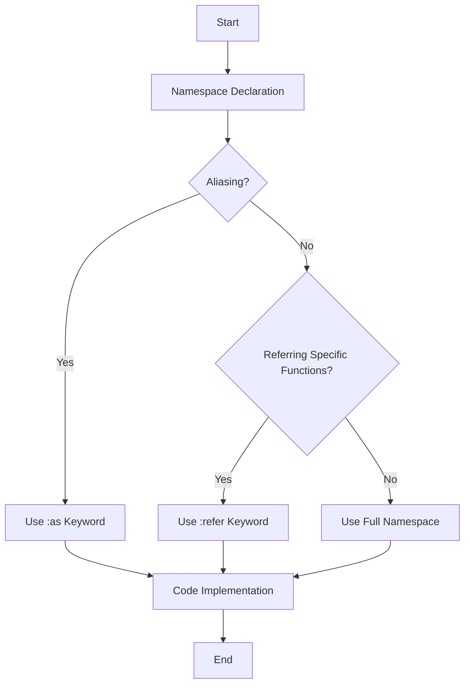

## 10.2.2 Aliasing and Referring Functions

In the realm of Clojure programming, managing namespaces efficiently is crucial for maintaining clean, readable, and maintainable code. As a Java developer transitioning to Clojure, understanding how to use aliasing and referring functions can significantly enhance your ability to organize and streamline your codebase. This section delves into the concepts of aliasing with `:as` and referring specific functions, providing you with the tools to write more concise and expressive Clojure code.

### Understanding Namespaces in Clojure

Before diving into aliasing and referring, it's essential to grasp the concept of namespaces in Clojure. Namespaces are a way to organize code and avoid naming conflicts by grouping related functions, macros, and variables. They are similar to packages in Java, providing a mechanism to manage the scope and visibility of your code components.

In Clojure, a namespace is typically defined at the top of a file using the `ns` macro. For example:

```clojure
(ns myapp.core)
```

This declaration sets the current namespace to `myapp.core`, and any subsequent definitions will belong to this namespace.

### Aliasing with `:as` for Clarity

Aliasing is a powerful feature in Clojure that allows you to create a shorthand reference for a namespace. This is particularly useful when dealing with long or complex namespace names, or when you want to avoid conflicts with similarly named functions from different namespaces.

To alias a namespace, you use the `:as` keyword within the `require` form. Here's a basic example:

```clojure
(ns myapp.core
  (:require [clojure.string :as str]))

(defn example []
  (str/upper-case "hello world"))
```

In this example, the `clojure.string` namespace is aliased as `str`, allowing you to use `str/upper-case` instead of the more verbose `clojure.string/upper-case`. This not only reduces typing but also improves code readability by clearly indicating which namespace a function belongs to.

#### Best Practices for Aliasing

1. **Consistency**: Use consistent aliases across your codebase to avoid confusion. For example, always alias `clojure.string` as `str`.

2. **Clarity**: Choose aliases that are intuitive and convey the purpose of the namespace. Avoid cryptic or overly abbreviated aliases.

3. **Avoid Conflicts**: Ensure that aliases do not conflict with existing symbols in your code. This can lead to unexpected behavior and difficult-to-debug errors.

### Referring Specific Functions

While aliasing is useful for managing entire namespaces, there are cases where you only need to use a few functions from a namespace. In such scenarios, referring specific functions can be more efficient and expressive.

To refer specific functions, use the `:refer` keyword in the `require` form. Here's an example:

```clojure
(ns myapp.core
  (:require [clojure.set :refer [union intersection]]))

(defn example []
  (let [set1 #{1 2 3}
        set2 #{3 4 5}]
    (union set1 set2)))
```

In this example, only the `union` and `intersection` functions from the `clojure.set` namespace are referred. This approach minimizes namespace pollution and makes it clear which functions are being used.

#### Advantages of Referring Functions

1. **Reduced Namespace Clutter**: By referring only the functions you need, you keep your namespace clean and focused.

2. **Improved Readability**: It becomes immediately apparent which functions are being used from external namespaces, aiding code comprehension.

3. **Avoiding Conflicts**: Referring specific functions helps prevent conflicts with similarly named functions in other namespaces.

### Combining Aliasing and Referring

In some cases, you might want to combine aliasing and referring to achieve the best of both worlds. This can be particularly useful when you need to use a few functions frequently and others occasionally.

```clojure
(ns myapp.core
  (:require [clojure.set :as set :refer [union]]))

(defn example []
  (let [set1 #{1 2 3}
        set2 #{3 4 5}]
    (union set1 set2)
    (set/difference set1 set2)))
```

In this example, the `clojure.set` namespace is aliased as `set`, and the `union` function is referred. This allows for concise usage of `union` while still providing access to other functions like `difference` through the alias.

### Practical Code Examples and Snippets

Let's explore some practical examples to solidify your understanding of aliasing and referring functions in Clojure.

#### Example 1: Aliasing for String Manipulation

```clojure
(ns myapp.text
  (:require [clojure.string :as str]))

(defn process-text [text]
  (-> text
      (str/trim)
      (str/lower-case)
      (str/replace " " "-")))
```

In this example, the `clojure.string` namespace is aliased as `str`, allowing for streamlined string manipulation operations.

#### Example 2: Referring Specific Math Functions

```clojure
(ns myapp.math
  (:require [clojure.math.numeric-tower :refer [sqrt pow]]))

(defn calculate-hypotenuse [a b]
  (sqrt (+ (pow a 2) (pow b 2))))
```

Here, only the `sqrt` and `pow` functions are referred from the `clojure.math.numeric-tower` namespace, making the code concise and focused on the required operations.

### Diagrams and Visual Aids

To further enhance your understanding, let's visualize the process of aliasing and referring functions using a flowchart.



This flowchart illustrates the decision-making process when deciding whether to alias a namespace, refer specific functions, or use the full namespace.

### Common Pitfalls and Optimization Tips

1. **Overusing Aliases**: While aliases are convenient, overusing them can lead to confusion, especially in large codebases. Use them judiciously.

2. **Namespace Conflicts**: Be mindful of potential conflicts when referring functions. Always check for existing symbols in your namespace.

3. **Performance Considerations**: Referring specific functions can improve performance by reducing the overhead of loading unnecessary symbols.

### Conclusion

Aliasing and referring functions in Clojure are powerful techniques that can greatly enhance your code's readability, maintainability, and efficiency. By understanding how to effectively manage namespaces, you can write cleaner and more expressive Clojure code, making your transition from Java smoother and more rewarding.

As you continue to explore Clojure, keep experimenting with these techniques to find the balance that works best for your projects. Remember, the goal is to write code that is not only functional but also elegant and easy to understand.

## Quiz Time!



### What is the primary purpose of aliasing a namespace in Clojure?

- [x] To create a shorthand reference for a namespace
- [ ] To rename functions within a namespace
- [ ] To import all functions from a namespace
- [ ] To avoid using the `require` keyword

> **Explanation:** Aliasing a namespace with `:as` allows you to create a shorthand reference, making it easier to use functions from that namespace without typing the full name.

### How do you refer specific functions from a namespace?

- [ ] Using the `:as` keyword
- [x] Using the `:refer` keyword
- [ ] Using the `:import` keyword
- [ ] Using the `:use` keyword

> **Explanation:** The `:refer` keyword is used to refer specific functions from a namespace, allowing you to use them directly without the namespace prefix.

### Which of the following is a benefit of referring specific functions?

- [x] Reduced namespace clutter
- [ ] Increased code verbosity
- [ ] Automatic aliasing of the namespace
- [ ] Importing all functions from a namespace

> **Explanation:** Referring specific functions reduces namespace clutter by only including the functions you need, improving code readability.

### What is a potential pitfall of overusing aliases?

- [ ] Improved code readability
- [ ] Enhanced performance
- [x] Increased confusion in large codebases
- [ ] Automatic conflict resolution

> **Explanation:** Overusing aliases can lead to confusion, especially in large codebases, as it may become unclear which namespace a function belongs to.

### How can you combine aliasing and referring in a single `require` form?

- [x] By using both `:as` and `:refer` keywords
- [ ] By using the `:import` keyword
- [ ] By using the `:use` keyword
- [ ] By using the `:include` keyword

> **Explanation:** You can combine aliasing and referring by using both `:as` for aliasing the namespace and `:refer` for referring specific functions.

### What is the result of referring a function from a namespace?

- [ ] The function is renamed
- [x] The function can be used without the namespace prefix
- [ ] The function is aliased
- [ ] The function is imported into another namespace

> **Explanation:** Referring a function allows you to use it directly without the namespace prefix, making the code more concise.

### Why is it important to avoid namespace conflicts?

- [x] To prevent unexpected behavior and errors
- [ ] To increase code verbosity
- [ ] To automatically alias functions
- [ ] To import all functions from a namespace

> **Explanation:** Avoiding namespace conflicts is crucial to prevent unexpected behavior and errors, ensuring that the correct functions are used.

### Which keyword is used to alias a namespace?

- [x] :as
- [ ] :refer
- [ ] :import
- [ ] :use

> **Explanation:** The `:as` keyword is used to alias a namespace, creating a shorthand reference for easier usage.

### What is the purpose of the `ns` macro in Clojure?

- [ ] To refer specific functions
- [ ] To alias a namespace
- [x] To define the current namespace
- [ ] To import all functions from a namespace

> **Explanation:** The `ns` macro is used to define the current namespace, setting the context for subsequent definitions.

### True or False: Aliasing and referring functions can improve code readability and maintainability.

- [x] True
- [ ] False

> **Explanation:** True. Aliasing and referring functions can significantly improve code readability and maintainability by reducing verbosity and clarifying function origins.


