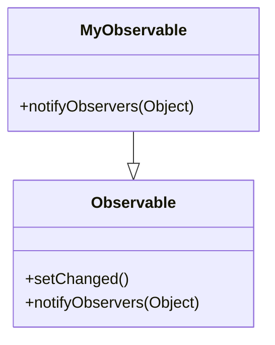

## 10.2.3 Extending Java Classes in Clojure: A Comprehensive Guide

As experienced Java developers, you're familiar with the concept of extending classes to create new functionality. In Clojure, a functional programming language that runs on the Java Virtual Machine (JVM), you can also extend Java classes using the `gen-class` directive. This section will guide you through the process of extending Java classes in Clojure, compiling Clojure code into Java classes, and understanding when to apply these techniques effectively.

### Understanding `gen-class`

The `gen-class` directive in Clojure is a powerful tool that allows you to define a new Java class. This class can extend an existing Java class or implement Java interfaces. The primary use case for `gen-class` is when you need to create a class that will be instantiated and used by Java code. This is particularly useful for integrating Clojure into existing Java applications or libraries.

#### Key Features of `gen-class`

- **Class Definition**: Define a new Java class with specified methods and fields.
- **Inheritance**: Extend an existing Java class.
- **Interface Implementation**: Implement one or more Java interfaces.
- **Static Methods**: Define static methods that can be called from Java.
- **Constructors**: Define constructors for the new class.

### When to Use `gen-class`

While Clojure is primarily a functional language, there are scenarios where extending Java classes is necessary:

- **Interoperability**: When integrating Clojure with existing Java codebases that expect Java classes.
- **Java Libraries**: When using Java libraries that require subclassing.
- **Performance**: In cases where Java's object-oriented features are needed for performance reasons.

### Extending a Java Class with `gen-class`

Let's walk through an example of extending a Java class using `gen-class`. We'll create a simple Clojure class that extends Java's `java.util.Observable`.

#### Step-by-Step Example

1. **Define the Clojure Namespace**

   First, define a Clojure namespace and use the `gen-class` directive to specify the class name, superclass, and methods.

   ```clojure
   (ns myproject.observable
     (:gen-class
      :name myproject.MyObservable
      :extends java.util.Observable
      :methods [[notifyObservers [Object] void]]))
   ```

   In this example, `myproject.MyObservable` is the new class name, and it extends `java.util.Observable`. We also define a method `notifyObservers` that takes an `Object` and returns `void`.

2. **Implement the Methods**

   Next, implement the methods in the namespace. Use the `defn` keyword to define the method logic.

   ```clojure
   (defn -notifyObservers
     [this arg]
     (.setChanged this) ; Call the superclass method
     (.notifyObservers this arg)) ; Call the superclass method
   ```

   Here, `-notifyObservers` is the implementation of the `notifyObservers` method. The `this` parameter refers to the current instance of the class.

3. **Compile the Clojure Code**

   To use the class from Java, compile the Clojure code into Java bytecode. Use the `lein` tool to compile the project.

   ```bash
   lein compile
   ```

   This command generates a `.class` file that can be used in Java applications.

4. **Use the Class in Java**

   Finally, use the generated class in a Java application.

   ```java
   import myproject.MyObservable;

   public class Main {
       public static void main(String[] args) {
           MyObservable observable = new MyObservable();
           observable.addObserver((o, arg) -> System.out.println("Notified with: " + arg));
           observable.notifyObservers("Hello, World!");
       }
   }
   ```

   This Java code creates an instance of `MyObservable`, adds an observer, and calls `notifyObservers`.

### Compiling Clojure Code into Java Classes

Compiling Clojure code into Java classes is essential for interoperability. The `gen-class` directive facilitates this by generating Java-compatible bytecode. Here are the steps to compile Clojure code:

1. **Set Up the Project**

   Use Leiningen, a popular Clojure build tool, to set up the project. Create a `project.clj` file with the necessary dependencies and configurations.

   ```clojure
   (defproject myproject "0.1.0-SNAPSHOT"
     :dependencies [[org.clojure/clojure "1.10.3"]]
     :aot [myproject.observable]
     :main myproject.core)
   ```

   The `:aot` (Ahead-of-Time compilation) directive specifies namespaces to compile.

2. **Compile the Code**

   Run the `lein compile` command to compile the Clojure code into Java bytecode. The compiled classes are stored in the `target/classes` directory.

3. **Integrate with Java**

   Use the compiled classes in Java projects by adding the `target/classes` directory to the Java classpath.

### Comparing `gen-class` with Java Class Extension

To better understand the differences between extending classes in Java and Clojure, let's compare the two approaches.

#### Java Class Extension

In Java, extending a class involves creating a subclass and overriding methods.

```java
public class MyObservable extends Observable {
    @Override
    public void notifyObservers(Object arg) {
        setChanged();
        super.notifyObservers(arg);
    }
}
```

#### Clojure Class Extension

In Clojure, the process is similar but uses the `gen-class` directive and function definitions.

```clojure
(ns myproject.observable
  (:gen-class
   :name myproject.MyObservable
   :extends java.util.Observable
   :methods [[notifyObservers [Object] void]]))

(defn -notifyObservers
  [this arg]
  (.setChanged this)
  (.notifyObservers this arg))
```

**Key Differences:**

- **Syntax**: Clojure uses a more declarative syntax with `gen-class`, while Java uses class declarations.
- **Method Implementation**: Clojure methods are defined as functions, offering more flexibility in handling functional constructs.
- **Compilation**: Clojure code must be compiled into Java bytecode for interoperability.

### Try It Yourself

Experiment with extending different Java classes using `gen-class`. Modify the example to extend other classes, such as `java.util.ArrayList`, and implement additional methods.

### Diagrams and Visual Aids

To visualize the process of extending classes in Clojure, let's use a class diagram to represent the relationship between the Clojure class and the Java superclass.



**Diagram Description**: This class diagram shows `MyObservable` extending `Observable`, indicating the inheritance relationship and the overridden `notifyObservers` method.

### Best Practices for Using `gen-class`

- **Use Sparingly**: Reserve `gen-class` for cases where Java interoperability is necessary.
- **Favor Protocols and Records**: In purely Clojure projects, prefer protocols and records for polymorphism.
- **Maintain Readability**: Keep the Clojure codebase readable by clearly documenting `gen-class` usage.

### Exercises and Practice Problems

1. **Extend a Java Collection**: Create a Clojure class that extends `java.util.ArrayList` and adds a method to print all elements.
2. **Implement a Java Interface**: Use `gen-class` to implement the `java.lang.Runnable` interface and execute a simple task.
3. **Compile and Use in Java**: Compile your Clojure class and use it in a Java application to verify interoperability.

### Key Takeaways

- **`gen-class`**: A powerful tool for extending Java classes and implementing interfaces in Clojure.
- **Interoperability**: Essential for integrating Clojure with existing Java applications.
- **Compilation**: Clojure code must be compiled into Java bytecode for use in Java projects.
- **Best Practices**: Use `gen-class` judiciously and document its usage for maintainability.

By understanding and applying these concepts, you can effectively extend Java classes in Clojure, leveraging the strengths of both languages to build robust, interoperable applications.

### Further Reading

- [Official Clojure Documentation on `gen-class`](https://clojure.org/reference/compilation)
- [ClojureDocs: `gen-class`](https://clojuredocs.org/clojure.core/gen-class)
- [Java Interoperability in Clojure](https://clojure.org/reference/java_interop)

---

## Quiz: Mastering Java Class Extension in Clojure



### What is the primary purpose of the `gen-class` directive in Clojure?

- [x] To define a new Java class that can extend existing Java classes or implement interfaces.
- [ ] To create a new Clojure function.
- [ ] To compile Clojure code into Java bytecode without any class definition.
- [ ] To manage dependencies in a Clojure project.

> **Explanation:** The `gen-class` directive is used to define new Java classes in Clojure, allowing them to extend existing Java classes or implement interfaces.

### Which of the following is a key feature of `gen-class`?

- [x] Ability to define static methods.
- [ ] Automatic memory management.
- [ ] Built-in support for asynchronous programming.
- [ ] Native support for JSON parsing.

> **Explanation:** `gen-class` allows defining static methods, which can be called from Java, making it a key feature for interoperability.

### In which scenario is it appropriate to use `gen-class`?

- [x] When integrating Clojure with existing Java codebases that expect Java classes.
- [ ] When writing purely functional Clojure applications.
- [ ] When developing a Clojure web application using Ring.
- [ ] When performing data analysis with Clojure.

> **Explanation:** `gen-class` is appropriate when integrating Clojure with Java codebases that require Java classes.

### What is the purpose of the `:aot` directive in the `project.clj` file?

- [x] To specify namespaces for Ahead-of-Time compilation.
- [ ] To define the main entry point of the application.
- [ ] To manage project dependencies.
- [ ] To configure the Clojure REPL.

> **Explanation:** The `:aot` directive specifies namespaces for Ahead-of-Time compilation, necessary for generating Java bytecode.

### How does Clojure's method implementation differ from Java's?

- [x] Clojure methods are defined as functions, offering more flexibility.
- [ ] Clojure methods require explicit type declarations.
- [ ] Clojure methods are compiled directly into machine code.
- [ ] Clojure methods cannot interact with Java classes.

> **Explanation:** Clojure methods are defined as functions, providing flexibility in handling functional constructs.

### Which command is used to compile Clojure code into Java bytecode?

- [x] `lein compile`
- [ ] `lein run`
- [ ] `lein test`
- [ ] `lein install`

> **Explanation:** The `lein compile` command is used to compile Clojure code into Java bytecode.

### What is a best practice when using `gen-class`?

- [x] Use `gen-class` sparingly and document its usage.
- [ ] Use `gen-class` for all Clojure functions.
- [ ] Avoid using `gen-class` in any Clojure project.
- [ ] Use `gen-class` only for data processing tasks.

> **Explanation:** It is best to use `gen-class` sparingly and document its usage to maintain code readability and maintainability.

### Which Java class is extended in the provided example?

- [x] `java.util.Observable`
- [ ] `java.util.ArrayList`
- [ ] `java.lang.Runnable`
- [ ] `java.util.HashMap`

> **Explanation:** The example extends `java.util.Observable` to demonstrate class extension in Clojure.

### True or False: `gen-class` can be used to implement Java interfaces in Clojure.

- [x] True
- [ ] False

> **Explanation:** `gen-class` can be used to implement Java interfaces, making it versatile for Java interoperability.

### What is the relationship between `MyObservable` and `Observable` in the class diagram?

- [x] `MyObservable` extends `Observable`.
- [ ] `MyObservable` implements `Observable`.
- [ ] `MyObservable` is a standalone class unrelated to `Observable`.
- [ ] `MyObservable` is an interface implemented by `Observable`.

> **Explanation:** In the class diagram, `MyObservable` extends `Observable`, indicating an inheritance relationship.


