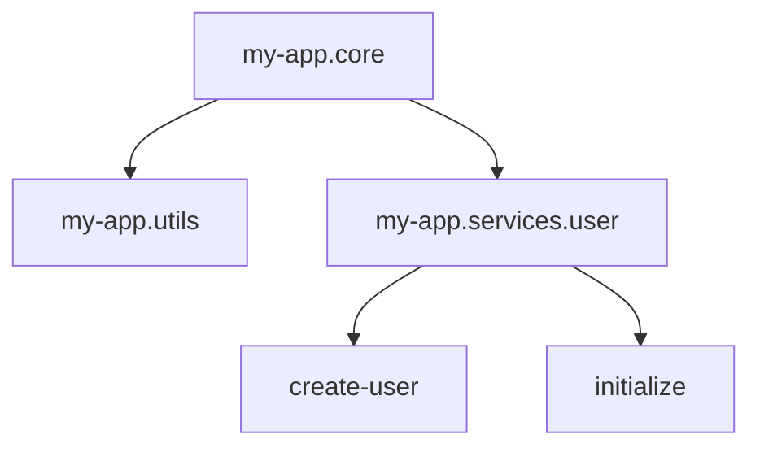

## 10.3.1 Project Structure Best Practices

As a Java developer transitioning to Clojure, understanding how to effectively structure your projects is crucial for maintaining readability, scalability, and ease of collaboration. Clojure, with its emphasis on simplicity and functional programming paradigms, offers a unique approach to project organization that differs from traditional Java practices. This section will guide you through the best practices for structuring Clojure projects, focusing on mirroring namespace structures in the file system, organizing code logically, and leveraging Clojure's strengths to build robust applications.

### Understanding the Importance of Project Structure

A well-organized project structure is the backbone of any successful software development endeavor. It facilitates:

- **Readability and Maintainability:** A clear structure makes it easier for developers to navigate the codebase, understand the flow of the application, and make changes without introducing errors.
- **Scalability:** As projects grow, a logical structure helps in managing complexity by modularizing components and ensuring that new features can be added without disrupting existing functionality.
- **Collaboration:** A consistent structure allows teams to work together more effectively, as it reduces the learning curve for new developers and ensures that everyone follows the same organizational conventions.

### Mirroring Namespace Structure in the File System

In Clojure, namespaces are a fundamental concept that helps in organizing code and avoiding naming conflicts. A namespace in Clojure is similar to a package in Java, and it is essential to mirror this structure in your file system to maintain consistency and clarity.

#### Why Mirror Namespace Structure?

- **Consistency:** By aligning your file system with your namespace structure, you create a predictable and consistent environment that is easy to navigate.
- **Tooling Support:** Many Clojure tools and libraries expect the file system to reflect the namespace structure, making it easier to integrate with build tools, editors, and other development utilities.
- **Ease of Refactoring:** When namespaces and file paths are aligned, refactoring becomes more straightforward, as changes in one are automatically reflected in the other.

#### How to Mirror Namespace Structure

Consider a simple Clojure project with the following namespaces:

- `my-app.core`
- `my-app.utils`
- `my-app.services.user`

The corresponding file structure should look like this:

```
src/
 └── my_app/
     ├── core.clj
     ├── utils.clj
     └── services/
         └── user.clj
```

**Key Points:**

- Use underscores (`_`) in file names to represent dashes (`-`) in namespaces. For example, `my-app.core` becomes `my_app/core.clj`.
- Organize files into directories that reflect the hierarchical structure of your namespaces.

### Organizing Code Logically

Logical organization of code is about grouping related functionalities together and separating concerns to enhance modularity and reusability. Here are some best practices to achieve this:

#### Core Functionality

The core functionality of your application should reside in a namespace that reflects the primary purpose of your project. This is typically where the main entry point of your application is located.

- **Example:** In a web application, `my-app.core` might contain the main function that starts the server.

#### Utility Functions

Utility functions that are used across multiple parts of your application should be placed in a separate namespace, such as `my-app.utils`. This promotes code reuse and reduces duplication.

- **Example:** Common string manipulation functions, logging utilities, or configuration parsers.

#### Domain-Specific Logic

Separate domain-specific logic into distinct namespaces to encapsulate functionality related to specific areas of your application.

- **Example:** In an e-commerce application, you might have namespaces like `my-app.services.user` and `my-app.services.order` to handle user and order-related logic, respectively.

#### Separation of Concerns

Adopt the principle of separation of concerns by dividing your code into layers or modules that handle specific aspects of your application, such as:

- **Data Access Layer:** Handles interactions with databases or external data sources.
- **Business Logic Layer:** Contains the core logic and rules of your application.
- **Presentation Layer:** Manages the user interface and user interactions.

### Effective Project Management with Leiningen

Leiningen is the de facto build tool for Clojure projects, providing a powerful way to manage dependencies, build processes, and project configurations. Here are some tips for using Leiningen effectively:

#### Project Configuration

The `project.clj` file is the heart of a Leiningen project, where you define project metadata, dependencies, and build configurations.

- **Dependencies:** Specify all external libraries and tools your project requires. Use version constraints to ensure compatibility and stability.
- **Profiles:** Use profiles to manage different configurations for development, testing, and production environments.

#### Managing Dependencies

Leverage Leiningen's dependency management capabilities to keep your project up-to-date and minimize conflicts:

- **Maven Repositories:** Leiningen integrates with Maven repositories, allowing you to easily include a wide range of libraries.
- **Dependency Resolution:** Use Leiningen's dependency resolution features to handle transitive dependencies and avoid version conflicts.

#### Building and Running Projects

Leiningen provides a variety of commands to build and run your projects efficiently:

- **`lein run`:** Execute your application from the command line.
- **`lein uberjar`:** Create a standalone JAR file that includes all dependencies, making it easy to deploy your application.

### Practical Code Examples

Let's explore some practical code examples to illustrate these concepts:

#### Example 1: Core Namespace

```clojure
(ns my-app.core
  (:require [my-app.utils :as utils]
            [my-app.services.user :as user-service]))

(defn -main
  "Main entry point for the application."
  [& args]
  (println "Starting application...")
  (user-service/initialize)
  (utils/log "Application started successfully."))
```

#### Example 2: Utility Functions

```clojure
(ns my-app.utils)

(defn log
  "Logs a message to the console."
  [message]
  (println (str (java.time.LocalDateTime/now) " - " message)))

(defn parse-config
  "Parses a configuration file and returns a map of settings."
  [file-path]
  ;; Implementation goes here
  )
```

#### Example 3: User Service

```clojure
(ns my-app.services.user)

(defn initialize
  "Initializes user-related services."
  []
  (println "Initializing user service..."))

(defn create-user
  "Creates a new user with the given details."
  [user-details]
  ;; Implementation goes here
  )
```

### Diagrams and Visual Aids

To further enhance your understanding, let's visualize the project structure using a diagram:



This diagram illustrates the relationships between different namespaces and functions within the project.

### Best Practices, Common Pitfalls, and Optimization Tips

#### Best Practices

- **Consistent Naming Conventions:** Use clear and consistent naming conventions for namespaces, files, and functions to enhance readability.
- **Documentation:** Provide comprehensive documentation for your code, including docstrings for functions and comments for complex logic.
- **Testing:** Implement thorough testing practices to ensure the reliability and correctness of your code. Use `clojure.test` for unit and integration tests.

#### Common Pitfalls

- **Overcomplicating Structure:** Avoid creating overly complex namespace hierarchies that can make navigation difficult. Keep it simple and logical.
- **Ignoring Dependencies:** Failing to manage dependencies properly can lead to version conflicts and runtime errors. Regularly update and review your dependencies.

#### Optimization Tips

- **Leverage Clojure's Strengths:** Take advantage of Clojure's immutable data structures and functional programming paradigms to write concise and efficient code.
- **Profile and Optimize:** Use profiling tools to identify performance bottlenecks and optimize critical sections of your code.

### Conclusion

Structuring a Clojure project effectively is key to harnessing the full potential of the language and building maintainable, scalable applications. By mirroring namespace structures, organizing code logically, and utilizing tools like Leiningen, you can create a robust foundation for your Clojure projects. As you continue to explore Clojure, remember to embrace its functional nature and leverage its powerful features to write clean, efficient code.

## Quiz Time!



### What is the primary purpose of mirroring namespace structures in the file system?

- [x] To maintain consistency and predictability in the project
- [ ] To reduce the number of files in the project
- [ ] To make the project compatible with Java
- [ ] To increase the complexity of the project

> **Explanation:** Mirroring namespace structures in the file system ensures consistency and predictability, making it easier to navigate and maintain the project.

### Which namespace typically contains the main entry point of a Clojure application?

- [x] my-app.core
- [ ] my-app.utils
- [ ] my-app.services.user
- [ ] my-app.config

> **Explanation:** The `my-app.core` namespace usually contains the main entry point of the application, where the primary functionality is initialized.

### What is the benefit of organizing utility functions in a separate namespace?

- [x] It promotes code reuse and reduces duplication
- [ ] It increases the complexity of the project
- [ ] It makes the project less readable
- [ ] It is required by the Clojure compiler

> **Explanation:** Organizing utility functions in a separate namespace promotes code reuse and reduces duplication, making the project more maintainable.

### What is the role of the `project.clj` file in a Leiningen project?

- [x] It defines project metadata, dependencies, and build configurations
- [ ] It contains the main application logic
- [ ] It stores user data and application settings
- [ ] It is used to compile the project into a JAR file

> **Explanation:** The `project.clj` file is central to a Leiningen project, defining metadata, dependencies, and build configurations.

### Which command is used to create a standalone JAR file in Leiningen?

- [x] lein uberjar
- [ ] lein compile
- [ ] lein build
- [ ] lein package

> **Explanation:** The `lein uberjar` command is used to create a standalone JAR file that includes all dependencies, making it easy to deploy the application.

### What is a common pitfall when structuring Clojure projects?

- [x] Overcomplicating the namespace hierarchy
- [ ] Using too few namespaces
- [ ] Writing too many comments
- [ ] Avoiding the use of utility functions

> **Explanation:** Overcomplicating the namespace hierarchy can make navigation difficult and reduce maintainability.

### How can you optimize the performance of a Clojure project?

- [x] Use profiling tools to identify bottlenecks
- [ ] Increase the number of namespaces
- [ ] Avoid using utility functions
- [ ] Write more complex code

> **Explanation:** Profiling tools help identify performance bottlenecks, allowing you to optimize critical sections of your code.

### What is the advantage of using `clojure.test` in a project?

- [x] It provides a framework for unit and integration testing
- [ ] It compiles the project faster
- [ ] It reduces the number of dependencies
- [ ] It makes the project compatible with Java

> **Explanation:** `clojure.test` provides a framework for unit and integration testing, ensuring the reliability and correctness of your code.

### Why is it important to provide documentation and comments in your code?

- [x] To enhance readability and maintainability
- [ ] To increase the complexity of the code
- [ ] To make the code run faster
- [ ] To reduce the number of files in the project

> **Explanation:** Documentation and comments enhance readability and maintainability, making it easier for developers to understand and work with the code.

### True or False: Using underscores in file names represents dashes in namespaces.

- [x] True
- [ ] False

> **Explanation:** In Clojure, underscores in file names are used to represent dashes in namespaces, aligning the file system with the namespace structure.


