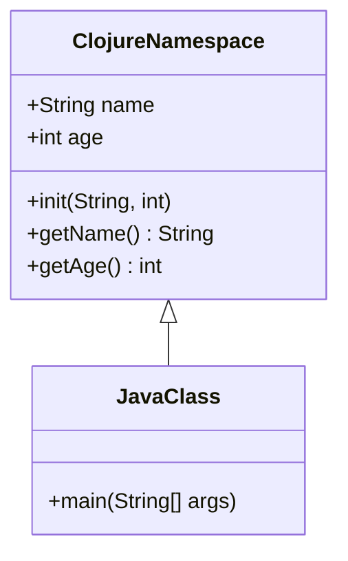

## 10.3.1 Defining Classes with `gen-class`

As experienced Java developers, you're familiar with defining classes, implementing interfaces, and extending classes to create robust applications. In Clojure, the `gen-class` macro provides a powerful way to define classes that can be seamlessly integrated with Java. This section will guide you through the process of using `gen-class` to define classes, specify methods, handle constructors, and create classes that can be instantiated from Java code.

### Understanding `gen-class`

The `gen-class` macro in Clojure is a tool that allows you to generate a Java class from Clojure code. This is particularly useful when you need to create classes that Java code can instantiate and interact with. Unlike Java, where classes are defined explicitly, Clojure uses `gen-class` to dynamically generate bytecode for the class at compile time.

#### Key Features of `gen-class`

- **Method Implementation**: Define methods that can be called from Java.
- **Constructor Specification**: Specify constructors for class instantiation.
- **Inheritance and Interfaces**: Extend Java classes and implement interfaces.
- **Static Methods**: Define static methods accessible from Java.

### Defining a Class with `gen-class`

To define a class using `gen-class`, you need to specify several options that dictate the class's behavior and structure. Here's a basic example to illustrate the concept:

```clojure
(ns mynamespace.MyClass
  (:gen-class
    :name mynamespace.MyClass
    :extends java.lang.Object
    :implements [java.io.Serializable]
    :constructors {[String] [String]}
    :methods [[getName [] String]]))

(defn -getName
  "Returns the name of the instance."
  [this]
  "MyClass Instance")
```

#### Explanation of the Code

- **Namespace Declaration**: The `ns` macro declares the namespace, which is similar to a package in Java.
- **:gen-class Options**:
  - `:name`: Specifies the fully qualified name of the class.
  - `:extends`: Indicates the superclass. Here, it's `java.lang.Object`.
  - `:implements`: Lists interfaces the class implements, such as `java.io.Serializable`.
  - `:constructors`: Maps constructor argument types to their corresponding parameter types.
  - `:methods`: Lists methods with their signatures.

- **Method Definition**: The `-getName` function defines the method's behavior. The `this` parameter refers to the instance of the class.

### Handling Constructors

In Clojure, constructors are specified using the `:constructors` option in `gen-class`. This option maps constructor argument types to their parameter types. Here's an example with a constructor:

```clojure
(ns mynamespace.Person
  (:gen-class
    :name mynamespace.Person
    :constructors {[String int] [String int]}
    :methods [[getName [] String]
              [getAge [] int]]))

(defn -init
  "Constructor for Person class."
  [name age]
  [[name age] nil])

(defn -getName
  [this]
  (first this))

(defn -getAge
  [this]
  (second this))
```

#### Constructor Explanation

- **`-init` Method**: This method acts as the constructor. It returns a vector with the instance variables and `nil` for the superclass constructor.
- **Instance Variables**: The `name` and `age` are stored in a vector, which is accessed by other methods.

### Implementing Interfaces

To implement interfaces, list them in the `:implements` option. Here's an example implementing `java.lang.Comparable`:

```clojure
(ns mynamespace.ComparablePerson
  (:gen-class
    :name mynamespace.ComparablePerson
    :implements [java.lang.Comparable]
    :constructors {[String int] [String int]}
    :methods [[compareTo [Object] int]]))

(defn -init
  [name age]
  [[name age] nil])

(defn -compareTo
  [this other]
  (compare (second this) (second other)))
```

#### Interface Implementation

- **`-compareTo` Method**: Implements the `compareTo` method from `java.lang.Comparable`. It compares the `age` of two `ComparablePerson` instances.

### Defining Static Methods

Static methods can be defined using the `:methods` option with a `static` keyword. Here's how you can define a static method:

```clojure
(ns mynamespace.StaticExample
  (:gen-class
    :name mynamespace.StaticExample
    :methods [[^:static staticMethod [] String]]))

(defn -staticMethod
  []
  "This is a static method.")
```

### Using the Generated Class in Java

Once you've defined your class with `gen-class`, you can compile it and use it in Java like any other Java class. Here's an example of how you might use the `Person` class from Java:

```java
import mynamespace.Person;

public class Main {
    public static void main(String[] args) {
        Person person = new Person("Alice", 30);
        System.out.println("Name: " + person.getName());
        System.out.println("Age: " + person.getAge());
    }
}
```

### Compiling and Running the Code

To compile and run the Clojure code, you'll need to use Leiningen or another build tool that supports Clojure. Here's a basic setup using Leiningen:

1. **Project Setup**: Create a new Leiningen project with `lein new app myapp`.
2. **Add Dependencies**: Ensure your `project.clj` includes necessary dependencies.
3. **Compile the Code**: Use `lein compile` to compile the Clojure code.
4. **Run the Java Code**: Compile and run the Java code using your preferred Java IDE or command line.

### Try It Yourself

Experiment with the `gen-class` macro by modifying the examples above. Try adding additional methods, implementing more interfaces, or creating more complex constructors. This hands-on approach will deepen your understanding of how Clojure and Java can work together seamlessly.

### Diagram: Class Definition with `gen-class`

Below is a diagram illustrating the flow of defining a class with `gen-class` and its interaction with Java code.



**Diagram Description**: This diagram shows a Clojure namespace defining a class with `gen-class`, which is then used by a Java class. The Clojure class has methods `getName` and `getAge`, and a constructor `init`.

### Key Takeaways

- **`gen-class`** is a powerful tool for creating Java-compatible classes in Clojure.
- **Method and Constructor Definitions**: Use `:methods` and `:constructors` to define methods and constructors.
- **Interface Implementation**: Implement Java interfaces using the `:implements` option.
- **Static Methods**: Define static methods accessible from Java.
- **Seamless Integration**: Classes defined with `gen-class` can be used in Java as if they were native Java classes.

### Further Reading

For more information on `gen-class` and Java interoperability, consider exploring the following resources:

- [Official Clojure Documentation on `gen-class`](https://clojure.org/reference/compilation#_gen_class)
- [ClojureDocs: `gen-class`](https://clojuredocs.org/clojure.core/gen-class)
- [Clojure and Java Interoperability Guide](https://clojure.org/reference/java_interop)

### Exercises

1. **Create a Class**: Define a class with `gen-class` that implements multiple interfaces and includes both instance and static methods.
2. **Extend a Java Class**: Use `gen-class` to extend a Java class and override one of its methods.
3. **Compile and Use**: Compile your Clojure class and use it in a simple Java application.

By mastering `gen-class`, you'll enhance your ability to integrate Clojure with Java, leveraging the strengths of both languages to build powerful applications.

## Quiz: Mastering `gen-class` in Clojure for Java Interoperability



### What is the primary purpose of `gen-class` in Clojure?

- [x] To generate Java-compatible classes from Clojure code
- [ ] To compile Clojure code into Java bytecode
- [ ] To define Clojure functions
- [ ] To manage Clojure namespaces

> **Explanation:** `gen-class` is used to generate Java-compatible classes from Clojure code, allowing seamless integration with Java.

### Which option in `gen-class` specifies the superclass?

- [x] `:extends`
- [ ] `:implements`
- [ ] `:name`
- [ ] `:methods`

> **Explanation:** The `:extends` option specifies the superclass that the generated class will extend.

### How do you define a constructor in `gen-class`?

- [x] Using the `:constructors` option
- [ ] Using the `:methods` option
- [ ] Using the `:name` option
- [ ] Using the `:implements` option

> **Explanation:** Constructors are defined using the `:constructors` option, mapping argument types to parameter types.

### What is the role of the `-init` function in `gen-class`?

- [x] It acts as the constructor for the class
- [ ] It defines a static method
- [ ] It implements an interface method
- [ ] It initializes static variables

> **Explanation:** The `-init` function acts as the constructor, initializing the class instance.

### Can `gen-class` be used to define static methods?

- [x] Yes
- [ ] No

> **Explanation:** `gen-class` can define static methods using the `:methods` option with the `static` keyword.

### Which of the following is a correct way to implement an interface in `gen-class`?

- [x] `:implements [java.io.Serializable]`
- [ ] `:extends [java.io.Serializable]`
- [ ] `:name [java.io.Serializable]`
- [ ] `:methods [java.io.Serializable]`

> **Explanation:** Interfaces are implemented using the `:implements` option, listing the interfaces to be implemented.

### How can you access instance variables in a method defined with `gen-class`?

- [x] By using the `this` parameter
- [ ] By using a global variable
- [ ] By using a static method
- [ ] By using a constructor

> **Explanation:** Instance variables can be accessed using the `this` parameter in methods.

### What is the output of the `-getName` method in the provided example?

- [x] "MyClass Instance"
- [ ] "Person Instance"
- [ ] "Alice"
- [ ] "30"

> **Explanation:** The `-getName` method returns the string "MyClass Instance" as defined in the example.

### Is it possible to extend multiple classes using `gen-class`?

- [ ] True
- [x] False

> **Explanation:** In Java and Clojure, a class can only extend one superclass, but it can implement multiple interfaces.

### What is the benefit of using `gen-class` for Java interoperability?

- [x] It allows Clojure classes to be used seamlessly in Java applications
- [ ] It compiles Clojure code faster
- [ ] It simplifies Clojure syntax
- [ ] It enhances Clojure's functional programming capabilities

> **Explanation:** `gen-class` allows Clojure classes to be used seamlessly in Java applications, facilitating interoperability.


