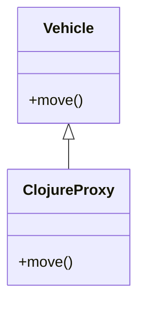

## 10.3.2 Overriding Methods

### Introduction

As experienced Java developers, you're familiar with the concept of method overriding, a cornerstone of object-oriented programming (OOP) that allows subclasses to provide specific implementations of methods defined in their superclasses. In Clojure, a functional programming language that runs on the Java Virtual Machine (JVM), you can also override methods when extending Java classes or implementing interfaces. This section will guide you through the process of overriding methods in Clojure, highlighting the differences and similarities with Java, and providing practical examples to solidify your understanding.

### Understanding Method Overriding

In Java, method overriding is used to achieve runtime polymorphism. It allows a subclass to provide a specific implementation for a method that is already defined in its superclass. The method in the subclass must have the same name, return type, and parameters as the method in the superclass.

**Java Example:**

```java
class Animal {
    void sound() {
        System.out.println("Animal makes a sound");
    }
}

class Dog extends Animal {
    @Override
    void sound() {
        System.out.println("Dog barks");
    }
}
```

In this example, the `Dog` class overrides the `sound` method of the `Animal` class.

### Overriding Methods in Clojure

Clojure, being a functional language, approaches method overriding differently. Instead of using classes and inheritance, Clojure leverages protocols and records, as well as Java interop capabilities, to achieve similar functionality.

#### Using `proxy` for Method Overriding

One of the ways to override methods in Clojure is by using the `proxy` construct. The `proxy` function creates an instance of a class that implements one or more interfaces or extends a class, allowing you to override methods.

**Clojure Example:**

```clojure
(def animal
  (proxy [java.lang.Object] []
    (toString [] "Animal makes a sound")))

(def dog
  (proxy [java.lang.Object] []
    (toString [] "Dog barks")))

(println (.toString animal)) ; Output: Animal makes a sound
(println (.toString dog))    ; Output: Dog barks
```

In this example, we create two proxies, `animal` and `dog`, each overriding the `toString` method of `java.lang.Object`.

#### Implementing Interfaces with `reify`

Clojure's `reify` is another powerful construct that allows you to implement interfaces and override methods. It is more concise than `proxy` and is typically used for implementing interfaces rather than extending classes.

**Clojure Example:**

```clojure
(defn make-dog []
  (reify
    java.lang.Runnable
    (run [this]
      (println "Dog runs"))))

(def dog (make-dog))
(.run dog) ; Output: Dog runs
```

Here, we use `reify` to implement the `Runnable` interface and override its `run` method.

### Comparing Clojure and Java Approaches

While Java uses inheritance and the `@Override` annotation to achieve method overriding, Clojure provides constructs like `proxy` and `reify` to interact with Java classes and interfaces. These constructs allow you to override methods without the need for class inheritance, aligning with Clojure's functional programming paradigm.

#### Key Differences

- **Inheritance vs. Composition**: Java relies on class inheritance, while Clojure emphasizes composition through protocols and records.
- **Annotations**: Java uses annotations like `@Override` to indicate method overriding, whereas Clojure uses constructs like `proxy` and `reify`.
- **Syntax**: Clojure's syntax is more concise and functional, focusing on behavior rather than class hierarchies.

### Practical Examples

Let's explore some practical examples to deepen our understanding of method overriding in Clojure.

#### Example 1: Overriding a Java Method

Suppose we have a Java class `Vehicle` with a method `move`.

**Java Class:**

```java
public class Vehicle {
    public void move() {
        System.out.println("Vehicle is moving");
    }
}
```

We can override the `move` method in Clojure using `proxy`.

**Clojure Code:**

```clojure
(def vehicle
  (proxy [Vehicle] []
    (move []
      (println "Car is moving"))))

(.move vehicle) ; Output: Car is moving
```

In this example, we create a proxy for the `Vehicle` class and override the `move` method to provide a custom implementation.

#### Example 2: Implementing a Java Interface

Consider a Java interface `Flyable` with a method `fly`.

**Java Interface:**

```java
public interface Flyable {
    void fly();
}
```

We can implement this interface in Clojure using `reify`.

**Clojure Code:**

```clojure
(defn make-bird []
  (reify
    Flyable
    (fly [this]
      (println "Bird is flying"))))

(def bird (make-bird))
(.fly bird) ; Output: Bird is flying
```

Here, we use `reify` to implement the `Flyable` interface and override its `fly` method.

### Try It Yourself

To gain hands-on experience, try modifying the examples above:

- Change the messages printed by the overridden methods.
- Create additional methods in the Java classes and override them in Clojure.
- Implement multiple interfaces using `reify`.

### Diagrams and Visual Aids

To better understand the flow of method overriding in Clojure, let's visualize the process using a class diagram.



**Diagram Description**: This diagram illustrates how a Clojure proxy extends a Java class (`Vehicle`) and overrides its method (`move`).

### Further Reading

For more information on Clojure's interoperability with Java, consider exploring the following resources:

- [Official Clojure Documentation](https://clojure.org/reference/java_interop)
- [ClojureDocs](https://clojuredocs.org/)
- [GitHub - Clojure Source Code](https://github.com/clojure/clojure)

### Exercises

1. Create a Java class with multiple methods and override them in Clojure using `proxy`.
2. Implement a Java interface with multiple methods in Clojure using `reify`.
3. Compare the performance of method overriding in Java and Clojure using a simple benchmark.

### Key Takeaways

- Clojure provides constructs like `proxy` and `reify` to override methods and implement interfaces.
- Method overriding in Clojure aligns with its functional programming paradigm, emphasizing composition over inheritance.
- Understanding Clojure's approach to method overriding enhances your ability to integrate Clojure with existing Java codebases.

By mastering method overriding in Clojure, you can effectively leverage the power of both functional and object-oriented programming paradigms, creating robust and flexible applications.

## Quiz: Mastering Method Overriding in Clojure



### What is the primary construct used in Clojure to override methods from a Java class?

- [x] `proxy`
- [ ] `defn`
- [ ] `let`
- [ ] `loop`

> **Explanation:** The `proxy` construct in Clojure is used to create an instance of a class that can override methods from a Java class.

### Which Clojure construct is typically used to implement interfaces?

- [ ] `proxy`
- [x] `reify`
- [ ] `def`
- [ ] `fn`

> **Explanation:** `reify` is used in Clojure to implement interfaces and provide method implementations.

### In Java, what annotation is used to indicate a method is being overridden?

- [ ] `@Implement`
- [x] `@Override`
- [ ] `@Extend`
- [ ] `@Method`

> **Explanation:** The `@Override` annotation in Java is used to indicate that a method is overriding a method in a superclass.

### How does Clojure's approach to method overriding differ from Java's?

- [x] Clojure uses functional constructs like `proxy` and `reify` instead of class inheritance.
- [ ] Clojure requires explicit annotations for overriding methods.
- [ ] Clojure does not support method overriding.
- [ ] Clojure uses the same approach as Java.

> **Explanation:** Clojure uses functional constructs such as `proxy` and `reify` to override methods, aligning with its functional programming paradigm.

### What is the output of the following Clojure code snippet?

```clojure
(def animal
  (proxy [java.lang.Object] []
    (toString [] "Animal makes a sound")))

(println (.toString animal))
```

- [x] "Animal makes a sound"
- [ ] "Object"
- [ ] "Animal"
- [ ] "Sound"

> **Explanation:** The `toString` method is overridden in the `proxy` to return "Animal makes a sound".

### Which of the following is a benefit of using `reify` in Clojure?

- [x] It provides a concise way to implement interfaces.
- [ ] It allows for class inheritance.
- [ ] It requires less memory than `proxy`.
- [ ] It is faster than Java's method overriding.

> **Explanation:** `reify` provides a concise way to implement interfaces in Clojure, making it ideal for functional programming.

### What is the role of the `proxy` construct in Clojure?

- [x] To create an instance of a class that can override methods.
- [ ] To define a new class.
- [ ] To implement a protocol.
- [ ] To create a new namespace.

> **Explanation:** The `proxy` construct is used to create an instance of a class that can override methods in Clojure.

### Which of the following is true about method overriding in Clojure?

- [x] It aligns with Clojure's functional programming paradigm.
- [ ] It requires the use of class inheritance.
- [ ] It is not supported in Clojure.
- [ ] It uses the same syntax as Java.

> **Explanation:** Method overriding in Clojure aligns with its functional programming paradigm, using constructs like `proxy` and `reify`.

### What is the purpose of the `@Override` annotation in Java?

- [x] To indicate that a method is overriding a method in a superclass.
- [ ] To define a new method.
- [ ] To implement an interface.
- [ ] To create a new class.

> **Explanation:** The `@Override` annotation is used in Java to indicate that a method is overriding a method in a superclass.

### True or False: Clojure's `proxy` and `reify` constructs can be used to override methods and implement interfaces, respectively.

- [x] True
- [ ] False

> **Explanation:** True. `proxy` is used to override methods, and `reify` is used to implement interfaces in Clojure.


