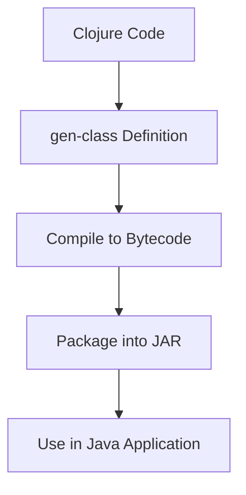

## 10.3.3 Compiling and Using Generated Classes

In this section, we will explore how to compile Clojure code that uses `gen-class` into Java bytecode, package it, and use the generated classes in Java applications. This process is crucial for Java developers who want to leverage Clojure's functional programming capabilities while maintaining compatibility with existing Java systems.

### Understanding `gen-class`

The `gen-class` directive in Clojure is a powerful tool that allows you to define a Java class from Clojure code. This feature is particularly useful when you need to implement Java interfaces or extend Java classes directly from Clojure. By using `gen-class`, you can create classes that can be compiled into Java bytecode and used seamlessly in Java applications.

#### Key Concepts of `gen-class`

- **Class Definition**: `gen-class` allows you to define a class with specified methods, fields, and constructors.
- **Interoperability**: The generated class can implement Java interfaces and extend Java classes, making it fully interoperable with Java code.
- **Compilation**: Once defined, the class can be compiled into Java bytecode, which can be packaged and distributed like any other Java class.

### Defining a Class with `gen-class`

Let's start by defining a simple class using `gen-class`. Suppose we want to create a class `Greeter` that implements a Java interface `IGreet`.

**Java Interface:**

```java
public interface IGreet {
    String greet(String name);
}
```

**Clojure Class Definition:**

```clojure
(ns myapp.greeter
  (:gen-class
   :name myapp.Greeter
   :implements [myapp.IGreet]
   :methods [[greet [String] String]]))

(defn -greet
  [this name]
  (str "Hello, " name "!"))
```

In this example, we define a class `myapp.Greeter` that implements the `IGreet` interface. The `-greet` function provides the implementation for the `greet` method.

### Compiling Clojure Code to Java Bytecode

To compile the Clojure code into Java bytecode, we need to use a build tool like Leiningen or the Clojure CLI with `tools.deps`. Let's explore both methods.

#### Using Leiningen

1. **Project Setup**: Create a new Leiningen project.

   ```bash
   lein new app myapp
   ```

2. **Modify `project.clj`**: Add the `:aot` (ahead-of-time compilation) directive to specify the namespaces to compile.

   ```clojure
   (defproject myapp "0.1.0-SNAPSHOT"
     :dependencies [[org.clojure/clojure "1.10.3"]]
     :aot [myapp.greeter]
     :main ^:skip-aot myapp.core)
   ```

3. **Compile the Project**: Run the following command to compile the project.

   ```bash
   lein compile
   ```

This command compiles the Clojure code into Java bytecode, generating `.class` files in the `target/classes` directory.

#### Using Clojure CLI and `tools.deps`

1. **Create `deps.edn`**: Define your project dependencies and paths.

   ```clojure
   {:deps {org.clojure/clojure {:mvn/version "1.10.3"}}
    :paths ["src"]
    :aliases {:compile {:main-opts ["-e" "(compile 'myapp.greeter)"]}}}
   ```

2. **Compile the Namespace**: Use the following command to compile the namespace.

   ```bash
   clj -M:compile
   ```

This command compiles the specified namespace into Java bytecode.

### Packaging the Compiled Classes

Once the classes are compiled, the next step is to package them into a JAR file for distribution and use in Java applications.

#### Creating a JAR with Leiningen

1. **Build the JAR**: Use the following command to create a JAR file.

   ```bash
   lein uberjar
   ```

This command packages the compiled classes and dependencies into a standalone JAR file.

#### Creating a JAR with Clojure CLI

1. **Use `depstar`**: Add `depstar` as a tool for building JAR files.

   ```clojure
   {:deps {seancorfield/depstar {:mvn/version "2.0.211"}}}
   ```

2. **Build the JAR**: Run the following command to create a JAR file.

   ```bash
   clj -X:uberjar :jar "myapp.jar" :main-class myapp.core
   ```

### Using the Generated Classes in Java

Now that we have a JAR file, we can use the generated classes in a Java application.

**Java Application Example:**

```java
import myapp.Greeter;
import myapp.IGreet;

public class Main {
    public static void main(String[] args) {
        IGreet greeter = new Greeter();
        System.out.println(greeter.greet("World"));
    }
}
```

In this example, we import the `Greeter` class and use it to greet the world. The Clojure-generated class behaves like any other Java class.

### Try It Yourself

To deepen your understanding, try modifying the `Greeter` class to include additional methods or implement another interface. Experiment with different method signatures and observe how the changes affect the Java application.

### Visualizing the Process

Below is a Mermaid diagram illustrating the flow from Clojure code to Java application integration.



**Diagram Caption**: This diagram shows the process of defining a class in Clojure, compiling it to bytecode, packaging it into a JAR, and using it in a Java application.

### Key Takeaways

- **Interoperability**: `gen-class` enables seamless integration between Clojure and Java, allowing you to leverage Clojure's functional programming features in Java applications.
- **Compilation**: Clojure code can be compiled into Java bytecode, making it compatible with Java's ecosystem.
- **Packaging**: Tools like Leiningen and `depstar` facilitate the packaging of Clojure code into JAR files for distribution.
- **Flexibility**: The ability to implement Java interfaces and extend classes from Clojure provides flexibility in application design.

### Further Reading

- [Official Clojure Documentation on `gen-class`](https://clojure.org/reference/compilation)
- [ClojureDocs: `gen-class`](https://clojuredocs.org/clojure.core/gen-class)
- [Leiningen Documentation](https://leiningen.org/)
- [Clojure CLI and `tools.deps`](https://clojure.org/guides/deps_and_cli)

### Exercises

1. **Modify the Greeter Class**: Add a new method to the `Greeter` class and update the Java application to use it.
2. **Implement Another Interface**: Define another Java interface and implement it in Clojure using `gen-class`.
3. **Create a Complex Class**: Use `gen-class` to create a class with multiple methods and fields, and integrate it into a Java application.

## Quiz: Mastering Clojure's `gen-class` for Java Interoperability



### What is the primary purpose of `gen-class` in Clojure?

- [x] To define Java classes from Clojure code
- [ ] To compile Clojure code into JavaScript
- [ ] To create Clojure macros
- [ ] To manage Clojure dependencies

> **Explanation:** `gen-class` is used to define Java classes from Clojure code, enabling interoperability with Java applications.

### Which tool can be used to compile Clojure code into Java bytecode?

- [x] Leiningen
- [ ] Maven
- [ ] Gradle
- [ ] Ant

> **Explanation:** Leiningen is a popular build tool for Clojure that can compile Clojure code into Java bytecode.

### What does the `:aot` directive in `project.clj` specify?

- [x] Namespaces to compile ahead-of-time
- [ ] Dependencies to include
- [ ] Main class for execution
- [ ] Java version compatibility

> **Explanation:** The `:aot` directive specifies namespaces to compile ahead-of-time into Java bytecode.

### How can you package compiled Clojure classes into a JAR file using Leiningen?

- [x] Use the `lein uberjar` command
- [ ] Use the `lein package` command
- [ ] Use the `lein jar` command
- [ ] Use the `lein build` command

> **Explanation:** The `lein uberjar` command packages compiled classes and dependencies into a standalone JAR file.

### What is the role of `depstar` in the Clojure CLI?

- [x] To build JAR files
- [ ] To manage dependencies
- [ ] To run tests
- [ ] To start a REPL

> **Explanation:** `depstar` is a tool used with the Clojure CLI to build JAR files from compiled Clojure code.

### Which of the following is a benefit of using `gen-class`?

- [x] Seamless integration with Java applications
- [ ] Automatic dependency resolution
- [ ] Simplified syntax for Clojure functions
- [ ] Enhanced performance of Clojure code

> **Explanation:** `gen-class` allows for seamless integration with Java applications by generating Java-compatible classes.

### What is the output of the `lein compile` command?

- [x] Java bytecode
- [ ] Clojure source code
- [ ] JavaScript code
- [ ] Python code

> **Explanation:** The `lein compile` command compiles Clojure code into Java bytecode.

### How can you use a Clojure-generated class in a Java application?

- [x] Import the class and use it like any other Java class
- [ ] Convert the class to a JavaScript object
- [ ] Rewrite the class in Java
- [ ] Use a special Clojure interpreter

> **Explanation:** A Clojure-generated class can be imported and used in a Java application like any other Java class.

### What is the purpose of the `-greet` function in the `Greeter` class example?

- [x] To provide the implementation for the `greet` method
- [ ] To compile the Clojure code
- [ ] To package the class into a JAR
- [ ] To manage dependencies

> **Explanation:** The `-greet` function provides the implementation for the `greet` method defined in the `IGreet` interface.

### True or False: `gen-class` can be used to extend Java classes.

- [x] True
- [ ] False

> **Explanation:** `gen-class` can be used to extend Java classes and implement interfaces, making it a versatile tool for Java interoperability.



Now that we've explored how to compile and use generated classes in Clojure, let's apply these concepts to enhance your Java applications with functional programming capabilities.
