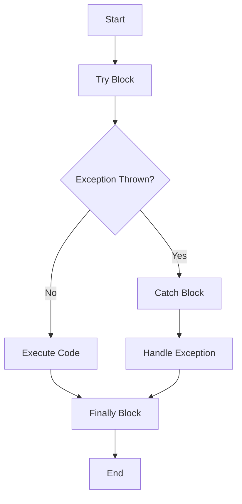

## 10.4.1 Catching Exceptions from Java Code

In this section, we will explore how to catch Java exceptions in Clojure using the `try`, `catch`, and `finally` constructs. As experienced Java developers transitioning to Clojure, you'll find that while Clojure's approach to error handling is similar to Java's, it also offers unique features that align with functional programming principles. Let's delve into the details and see how we can effectively manage exceptions in a Clojure environment.

### Understanding Exception Handling in Clojure

Clojure, being a hosted language on the Java Virtual Machine (JVM), allows seamless interoperability with Java. This includes the ability to handle exceptions thrown by Java code. In Clojure, exception handling is performed using the `try`, `catch`, and `finally` constructs, which are conceptually similar to Java's try-catch-finally blocks.

#### The `try` Construct

The `try` construct in Clojure is used to wrap code that might throw an exception. It is similar to Java's `try` block, where you place code that you want to monitor for exceptions.

#### The `catch` Construct

The `catch` construct is used to handle specific exceptions. You can specify the type of exception you want to catch, similar to Java's catch block. This allows you to handle different exceptions in different ways.

#### The `finally` Construct

The `finally` construct is used to execute code that should run regardless of whether an exception was thrown or not. This is useful for cleanup actions, such as closing resources.

### Basic Syntax for Exception Handling in Clojure

Let's look at the basic syntax for handling exceptions in Clojure:

```clojure
(try
  ;; Code that might throw an exception
  (do-something-risky)
  (catch ExceptionType e
    ;; Handle the exception
    (println "An error occurred:" (.getMessage e)))
  (finally
    ;; Cleanup code
    (println "Cleanup actions")))
```

In this example, `do-something-risky` is a placeholder for any operation that might throw an exception. If an exception of type `ExceptionType` is thrown, it is caught by the `catch` block, and the error message is printed. The `finally` block executes regardless of whether an exception was thrown.

### Handling Specific Exceptions

Just like in Java, you can catch specific exceptions in Clojure by specifying the exception type in the `catch` block. This allows you to handle different exceptions in different ways.

#### Example: Handling a `NullPointerException`

```clojure
(try
  (let [result (some-java-method)]
    (println "Result:" result))
  (catch NullPointerException e
    (println "Caught a NullPointerException:" (.getMessage e)))
  (finally
    (println "Execution completed.")))
```

In this example, we call a hypothetical Java method `some-java-method` that might throw a `NullPointerException`. If such an exception is thrown, it is caught, and a message is printed. The `finally` block ensures that "Execution completed." is printed regardless of whether an exception occurred.

### Performing Cleanup Actions

The `finally` block is particularly useful for performing cleanup actions, such as closing files or releasing resources. This is similar to Java's `finally` block.

#### Example: Closing a File

```clojure
(let [file (java.io.File. "example.txt")
      reader (java.io.BufferedReader. (java.io.FileReader. file))]
  (try
    (println "File content:" (.readLine reader))
    (catch IOException e
      (println "An IOException occurred:" (.getMessage e)))
    (finally
      (.close reader)
      (println "File closed."))))
```

In this example, we open a file and read its content. If an `IOException` occurs, it is caught and handled. The `finally` block ensures that the file is closed, preventing resource leaks.

### Comparing Clojure and Java Exception Handling

Let's compare the exception handling in Clojure with Java to highlight the similarities and differences.

#### Java Example

```java
try {
    String result = someJavaMethod();
    System.out.println("Result: " + result);
} catch (NullPointerException e) {
    System.out.println("Caught a NullPointerException: " + e.getMessage());
} finally {
    System.out.println("Execution completed.");
}
```

#### Clojure Example

```clojure
(try
  (let [result (some-java-method)]
    (println "Result:" result))
  (catch NullPointerException e
    (println "Caught a NullPointerException:" (.getMessage e)))
  (finally
    (println "Execution completed.")))
```

As you can see, the structure is quite similar. Both languages use `try`, `catch`, and `finally` constructs, and the logic for handling exceptions is comparable. However, Clojure's syntax is more concise, and it integrates seamlessly with Java's exception types.

### Best Practices for Exception Handling in Clojure

When handling exceptions in Clojure, consider the following best practices:

- **Catch Specific Exceptions**: Always catch specific exceptions rather than a generic `Exception` to handle different error scenarios appropriately.
- **Use `finally` for Cleanup**: Ensure that resources are released in the `finally` block to prevent resource leaks.
- **Log Exceptions**: Log exceptions for debugging purposes, especially in production environments.
- **Avoid Silent Failures**: Do not ignore exceptions silently. Always handle them or propagate them appropriately.
- **Functional Approach**: Consider using functional constructs to handle errors, such as `either` or `maybe` patterns, for more idiomatic Clojure code.

### Try It Yourself

To get hands-on experience with exception handling in Clojure, try modifying the examples above:

- Change the exception type in the `catch` block to see how different exceptions are handled.
- Add additional `catch` blocks to handle multiple exception types.
- Experiment with different cleanup actions in the `finally` block.

### Diagrams and Visual Aids

To better understand the flow of exception handling in Clojure, let's look at a diagram illustrating the process:



**Diagram Caption**: This flowchart illustrates the flow of control in a Clojure `try-catch-finally` block. The code in the `try` block is executed, and if an exception is thrown, control passes to the `catch` block. Regardless of whether an exception is thrown, the `finally` block is executed.

### External Resources

For further reading on exception handling in Clojure and Java interoperability, consider the following resources:

- [Official Clojure Documentation](https://clojure.org/reference/java_interop)
- [ClojureDocs: Exception Handling](https://clojuredocs.org/clojure.core/try)
- [Java Exception Handling Tutorial](https://docs.oracle.com/javase/tutorial/essential/exceptions/)

### Exercises

To reinforce your understanding of exception handling in Clojure, try the following exercises:

1. **Exercise 1**: Write a Clojure function that reads from a file and handles `FileNotFoundException` and `IOException` separately.
2. **Exercise 2**: Modify the function to include a `finally` block that closes the file reader.
3. **Exercise 3**: Create a Clojure program that interacts with a Java library and handles any exceptions thrown by the library.

### Key Takeaways

- Clojure's `try`, `catch`, and `finally` constructs are similar to Java's, allowing for seamless exception handling.
- Always catch specific exceptions to handle different error scenarios appropriately.
- Use the `finally` block for cleanup actions to prevent resource leaks.
- Consider functional approaches to error handling for more idiomatic Clojure code.
- Practice handling exceptions with hands-on exercises to solidify your understanding.

Now that we've explored how to catch Java exceptions in Clojure, let's apply these concepts to manage errors effectively in your applications. By leveraging Clojure's concise syntax and functional programming principles, you can write robust and maintainable code that seamlessly integrates with Java.

## Quiz: Mastering Exception Handling in Clojure



### What construct is used in Clojure to handle exceptions?

- [x] try
- [ ] catch
- [ ] finally
- [ ] throw

> **Explanation:** The `try` construct is used to handle exceptions in Clojure, similar to Java's try block.

### Which block in Clojure is used to execute code regardless of exceptions?

- [ ] try
- [ ] catch
- [x] finally
- [ ] throw

> **Explanation:** The `finally` block is used to execute code regardless of whether an exception was thrown or not.

### How can you catch a specific exception type in Clojure?

- [x] By specifying the exception type in the catch block
- [ ] By using a generic catch block
- [ ] By using a finally block
- [ ] By using a try block

> **Explanation:** You can catch a specific exception type in Clojure by specifying the exception type in the catch block.

### What is the purpose of the finally block in Clojure?

- [ ] To catch exceptions
- [x] To perform cleanup actions
- [ ] To throw exceptions
- [ ] To log exceptions

> **Explanation:** The `finally` block is used to perform cleanup actions, such as closing resources, regardless of whether an exception was thrown.

### Which of the following is a best practice for exception handling in Clojure?

- [x] Catch specific exceptions
- [ ] Use silent failures
- [ ] Ignore exceptions
- [ ] Avoid logging exceptions

> **Explanation:** It is a best practice to catch specific exceptions to handle different error scenarios appropriately.

### What should you do if you want to handle multiple exception types in Clojure?

- [x] Add additional catch blocks for each exception type
- [ ] Use a single catch block for all exceptions
- [ ] Use a finally block
- [ ] Use a try block

> **Explanation:** To handle multiple exception types in Clojure, you should add additional catch blocks for each exception type.

### How can you log exceptions in Clojure?

- [x] By printing the exception message in the catch block
- [ ] By using a finally block
- [ ] By using a try block
- [ ] By ignoring the exception

> **Explanation:** You can log exceptions in Clojure by printing the exception message in the catch block.

### What is a functional approach to error handling in Clojure?

- [x] Using either or maybe patterns
- [ ] Using silent failures
- [ ] Ignoring exceptions
- [ ] Using a single catch block

> **Explanation:** A functional approach to error handling in Clojure involves using either or maybe patterns for more idiomatic code.

### What is the advantage of using the finally block in Clojure?

- [x] It ensures cleanup actions are performed
- [ ] It catches exceptions
- [ ] It throws exceptions
- [ ] It logs exceptions

> **Explanation:** The advantage of using the finally block in Clojure is that it ensures cleanup actions are performed, preventing resource leaks.

### True or False: Clojure's exception handling constructs are completely different from Java's.

- [ ] True
- [x] False

> **Explanation:** False. Clojure's exception handling constructs are similar to Java's, allowing for seamless interoperability.


