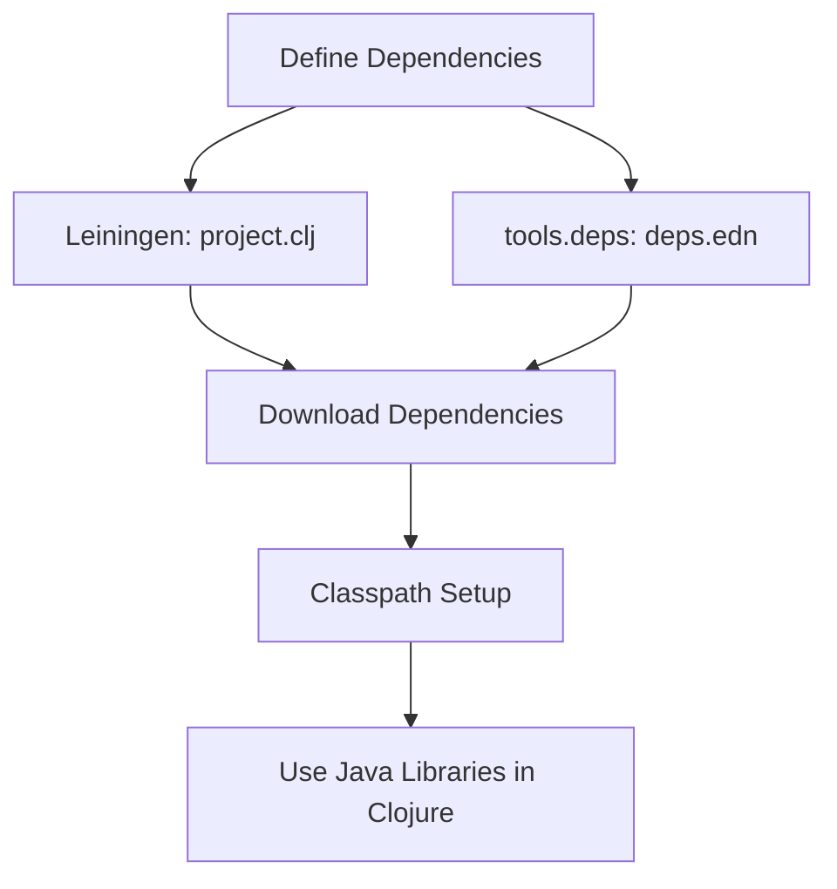

## 10.5.2 Adding External Java Libraries

As experienced Java developers, you are likely familiar with the vast ecosystem of Java libraries available for various tasks, from data processing to web development. One of the strengths of Clojure is its seamless interoperability with Java, allowing you to leverage these libraries within your Clojure projects. In this section, we'll explore how to add external Java libraries to your Clojure projects using two popular dependency management tools: Leiningen and tools.deps. We'll also provide examples of calling code from popular Java libraries to illustrate these concepts.

### Understanding Dependency Management in Clojure

Before diving into the specifics of adding Java libraries, it's important to understand how dependency management works in Clojure. Clojure projects typically use either **Leiningen** or **tools.deps** to manage dependencies. Both tools allow you to specify the libraries your project depends on, automatically downloading and including them in your project's classpath.

#### Leiningen (`project.clj`)

Leiningen is a build automation tool for Clojure that uses a `project.clj` file to define project settings, including dependencies. Here's a basic structure of a `project.clj` file:

```clojure
(defproject my-clojure-project "0.1.0-SNAPSHOT"
  :description "A simple Clojure project"
  :dependencies [[org.clojure/clojure "1.10.3"]
                 [org.some/library "1.2.3"]])
```

- **`:dependencies`**: This vector contains the list of dependencies, each specified as a vector with the library's group ID, artifact ID, and version.

#### tools.deps (`deps.edn`)

tools.deps is a more recent addition to the Clojure ecosystem, providing a flexible way to manage dependencies using a `deps.edn` file. Here's an example of a `deps.edn` file:

```clojure
{:deps {org.clojure/clojure {:mvn/version "1.10.3"}
        org.some/library {:mvn/version "1.2.3"}}}
```

- **`:deps`**: This map contains the dependencies, with each key being the library's coordinate and the value specifying the version.

### Adding Java Libraries to Your Clojure Project

Now that we understand the basics of dependency management, let's explore how to add external Java libraries to your Clojure project using both Leiningen and tools.deps.

#### Adding Java Libraries with Leiningen

To add a Java library using Leiningen, you simply need to include it in the `:dependencies` vector in your `project.clj` file. For example, let's add the popular Apache Commons Lang library:

```clojure
(defproject my-clojure-project "0.1.0-SNAPSHOT"
  :description "A simple Clojure project with Apache Commons Lang"
  :dependencies [[org.clojure/clojure "1.10.3"]
                 [org.apache.commons/commons-lang3 "3.12.0"]])
```

- **Apache Commons Lang**: This library provides utility functions for the Java standard library, such as string manipulation and number utilities.

Once you've added the dependency, run `lein deps` to download and include it in your project's classpath.

#### Adding Java Libraries with tools.deps

With tools.deps, you add a Java library by specifying it in the `:deps` map in your `deps.edn` file. Here's how you can add Apache Commons Lang:

```clojure
{:deps {org.clojure/clojure {:mvn/version "1.10.3"}
        org.apache.commons/commons-lang3 {:mvn/version "3.12.0"}}}
```

After updating your `deps.edn` file, use the `clj` command to resolve and download the dependencies:

```bash
clj -Stree
```

This command will show the dependency tree, confirming that the library has been added successfully.

### Calling Java Code from Clojure

Once you've added a Java library to your project, you can call its code directly from Clojure. Let's explore how to do this with some examples.

#### Example: Using Apache Commons Lang

Suppose you want to use the `StringUtils` class from Apache Commons Lang to check if a string is empty. Here's how you can do it in Clojure:

```clojure
(ns my-clojure-project.core
  (:import [org.apache.commons.lang3 StringUtils]))

(defn is-empty? [s]
  (StringUtils/isEmpty s))

;; Usage
(println (is-empty? ""))  ; true
(println (is-empty? "Clojure"))  ; false
```

- **`:import`**: This directive is used to import Java classes into your Clojure namespace.
- **`StringUtils/isEmpty`**: Calls the static `isEmpty` method from the `StringUtils` class.

#### Example: Using Google Guava

Google Guava is another popular Java library that provides utilities for collections, caching, and more. Let's use Guava's `Joiner` class to join a list of strings:

```clojure
(ns my-clojure-project.core
  (:import [com.google.common.base Joiner]))

(defn join-strings [separator strings]
  (-> (Joiner/on separator)
      (.join strings)))

;; Usage
(println (join-strings ", " ["Clojure" "Java" "Scala"]))  ; "Clojure, Java, Scala"
```

- **`Joiner/on`**: Creates a `Joiner` instance with the specified separator.
- **`.join`**: Joins the strings using the `Joiner` instance.

### Comparing with Java Code

To highlight the differences and similarities between Java and Clojure, let's compare the above examples with their Java counterparts.

#### Java Code for Apache Commons Lang

```java
import org.apache.commons.lang3.StringUtils;

public class Example {
    public static void main(String[] args) {
        System.out.println(StringUtils.isEmpty(""));  // true
        System.out.println(StringUtils.isEmpty("Clojure"));  // false
    }
}
```

#### Java Code for Google Guava

```java
import com.google.common.base.Joiner;

public class Example {
    public static void main(String[] args) {
        Joiner joiner = Joiner.on(", ");
        System.out.println(joiner.join("Clojure", "Java", "Scala"));  // "Clojure, Java, Scala"
    }
}
```

### Try It Yourself

To deepen your understanding, try modifying the examples above:

- **Experiment with different libraries**: Add another Java library to your project and call its methods from Clojure.
- **Change the method calls**: Use different methods from the Apache Commons Lang or Google Guava libraries.
- **Create a new function**: Write a Clojure function that combines methods from multiple Java libraries.

### Visualizing Dependency Management

To better understand how dependencies are managed in Clojure, let's visualize the process using a diagram.



**Diagram Description**: This flowchart illustrates the process of adding external Java libraries to a Clojure project. It starts with defining dependencies in either `project.clj` or `deps.edn`, followed by downloading the dependencies and setting up the classpath, allowing you to use Java libraries in your Clojure code.

### Further Reading

For more information on dependency management and Java interoperability in Clojure, consider exploring the following resources:

- [Official Clojure Documentation](https://clojure.org/reference)
- [Leiningen Documentation](https://leiningen.org/)
- [tools.deps Guide](https://clojure.org/guides/deps_and_cli)
- [Apache Commons Lang](https://commons.apache.org/proper/commons-lang/)
- [Google Guava](https://github.com/google/guava)

### Exercises

1. **Add a New Library**: Choose a Java library you frequently use in your Java projects and add it to a Clojure project. Write a Clojure function that utilizes this library.
2. **Compare Performance**: Implement the same functionality using both Clojure and Java, and compare their performance.
3. **Explore tools.deps**: Experiment with different options in the `deps.edn` file, such as specifying a local path or a Git repository for dependencies.

### Key Takeaways

- **Seamless Interoperability**: Clojure's interoperability with Java allows you to leverage the vast ecosystem of Java libraries.
- **Dependency Management**: Use Leiningen or tools.deps to manage dependencies in your Clojure projects.
- **Calling Java Code**: Import and call Java classes and methods directly from Clojure, making it easy to integrate Java libraries.

Now that we've explored how to add external Java libraries to your Clojure projects, you're well-equipped to enhance your applications with powerful Java tools and libraries.

## Quiz: Mastering Java Library Integration in Clojure



### What is the primary purpose of using Leiningen or tools.deps in a Clojure project?

- [x] To manage project dependencies
- [ ] To compile Clojure code to Java bytecode
- [ ] To create user interfaces
- [ ] To handle HTTP requests

> **Explanation:** Leiningen and tools.deps are used to manage dependencies in Clojure projects, allowing you to specify and automatically download libraries.

### How do you specify a dependency in a `project.clj` file?

- [x] Using a vector with the library's group ID, artifact ID, and version
- [ ] Using a map with the library's name and version
- [ ] Using a string with the library's URL
- [ ] Using a list with the library's details

> **Explanation:** In `project.clj`, dependencies are specified as vectors containing the group ID, artifact ID, and version.

### What is the equivalent of `:dependencies` in a `deps.edn` file?

- [x] `:deps`
- [ ] `:libraries`
- [ ] `:imports`
- [ ] `:requires`

> **Explanation:** In `deps.edn`, dependencies are specified under the `:deps` key.

### Which command is used to download dependencies in a Leiningen project?

- [x] `lein deps`
- [ ] `lein install`
- [ ] `lein build`
- [ ] `lein run`

> **Explanation:** The `lein deps` command downloads and resolves dependencies in a Leiningen project.

### How do you import a Java class in a Clojure namespace?

- [x] Using the `:import` directive
- [ ] Using the `:require` directive
- [ ] Using the `:use` directive
- [ ] Using the `:include` directive

> **Explanation:** The `:import` directive is used to import Java classes into a Clojure namespace.

### What is the purpose of the `clj -Stree` command?

- [x] To display the dependency tree in a tools.deps project
- [ ] To compile Clojure code
- [ ] To start a Clojure REPL
- [ ] To run unit tests

> **Explanation:** The `clj -Stree` command displays the dependency tree, showing the resolved dependencies in a tools.deps project.

### Which Java library provides utility functions for string manipulation?

- [x] Apache Commons Lang
- [ ] Google Guava
- [ ] JUnit
- [ ] Log4j

> **Explanation:** Apache Commons Lang provides utility functions for string manipulation, among other features.

### In Clojure, how do you call a static method from a Java class?

- [x] Using the class name followed by the method name
- [ ] Using the `invoke` function
- [ ] Using the `call` function
- [ ] Using the `apply` function

> **Explanation:** In Clojure, you call a static method from a Java class by using the class name followed by the method name.

### What is the benefit of using Google Guava's `Joiner` class?

- [x] It simplifies joining collections of strings with a separator
- [ ] It provides advanced logging capabilities
- [ ] It enhances database connectivity
- [ ] It offers encryption utilities

> **Explanation:** Google Guava's `Joiner` class simplifies the process of joining collections of strings with a specified separator.

### True or False: Clojure can only use Java libraries that are explicitly designed for Clojure interoperability.

- [ ] True
- [x] False

> **Explanation:** False. Clojure can use any Java library, as it runs on the JVM and can interoperate with Java code directly.


