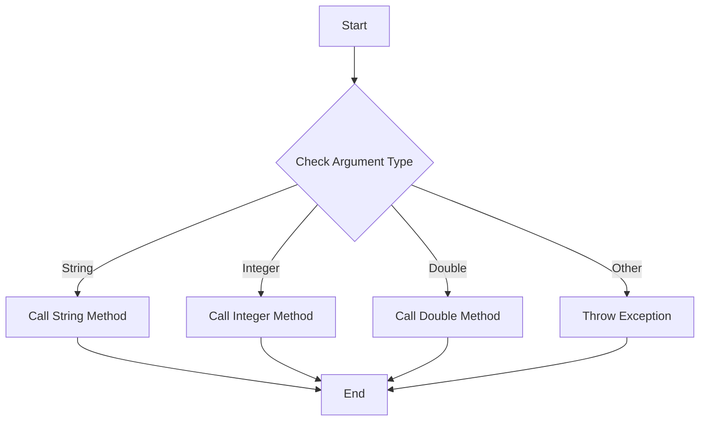

## 10.5.3 Handling Method Overloading

In this section, we will delve into how Clojure handles method overloading in Java classes, a common scenario for Java developers transitioning to Clojure. We'll explore the use of type hints to resolve ambiguities and improve performance, providing you with the tools to effectively integrate Java libraries into your Clojure projects.

### Understanding Method Overloading

**Method overloading** in Java allows multiple methods in the same class to have the same name but different parameter lists. This feature is widely used to provide different ways to initialize objects or perform actions based on varying input types.

#### Java Example of Method Overloading

```java
public class OverloadedMethods {
    public void print(String message) {
        System.out.println("String: " + message);
    }

    public void print(int number) {
        System.out.println("Integer: " + number);
    }

    public void print(double number) {
        System.out.println("Double: " + number);
    }
}
```

In the example above, the `print` method is overloaded to handle `String`, `int`, and `double` types.

### Clojure's Approach to Method Overloading

Clojure, being a dynamic language, does not support method overloading in the same way Java does. Instead, Clojure relies on **polymorphism** and **multimethods** to achieve similar functionality. However, when interoperating with Java, Clojure provides mechanisms to call overloaded methods by using **type hints**.

#### Calling Overloaded Methods in Clojure

When calling overloaded methods from Clojure, the language uses the types of the arguments to determine which method to invoke. However, due to Clojure's dynamic nature, this can sometimes lead to ambiguity or performance issues, as the Clojure compiler may not always infer the correct method signature.

### Using Type Hints to Resolve Ambiguities

**Type hints** in Clojure are metadata annotations that help the compiler resolve ambiguities and optimize performance by specifying the expected type of a variable or expression.

#### Syntax for Type Hints

Type hints are specified using the `^` character followed by the type. Here's how you can use type hints in Clojure:

```clojure
(defn print-message [^String message]
  (.print (OverloadedMethods.) message))
```

In this example, the `^String` type hint informs the Clojure compiler that the `message` parameter is a `String`, ensuring the correct overloaded method is called.

#### Example: Resolving Overloaded Method Calls

Let's see how we can handle method overloading in Clojure using type hints:

```clojure
(ns example.core
  (:import [OverloadedMethods]))

(defn print-value [value]
  (let [om (OverloadedMethods.)]
    (cond
      (string? value) (.print om ^String value)
      (integer? value) (.print om ^Integer value)
      (double? value) (.print om ^Double value)
      :else (throw (IllegalArgumentException. "Unsupported type")))))

;; Usage
(print-value "Hello, Clojure!")  ; Calls the String version
(print-value 42)                 ; Calls the Integer version
(print-value 3.14)               ; Calls the Double version
```

In this example, we use `cond` to check the type of `value` and apply the appropriate type hint to ensure the correct method is called.

### Performance Considerations

Type hints not only resolve ambiguities but also improve performance by reducing the need for reflection. Reflection is a process where the program inspects and manipulates its own structure at runtime, which can be costly in terms of performance.

#### Avoiding Reflection with Type Hints

By providing type hints, you can avoid reflection, leading to faster method calls. The Clojure compiler will emit a warning if it detects reflection, which can be resolved by adding the appropriate type hints.

```clojure
;; Without type hint, reflection warning may occur
(defn print-number [number]
  (.print (OverloadedMethods.) number))

;; With type hint, no reflection warning
(defn print-number [^Integer number]
  (.print (OverloadedMethods.) number))
```

### Try It Yourself

Experiment with the following code by adding and removing type hints to observe the impact on performance and reflection warnings:

```clojure
(defn calculate [^Double x ^Double y]
  (+ x y))

(defn calculate [x y]
  (+ x y))
```

### Diagrams and Visuals

To better understand how Clojure handles method overloading, let's look at a flowchart that illustrates the decision-making process when calling overloaded methods:



**Diagram Description**: This flowchart shows the decision-making process in Clojure when calling overloaded methods based on argument types.

### Comparing with Java

In Java, method overloading is resolved at compile time based on the method signature. In contrast, Clojure relies on runtime type checks and type hints to achieve similar functionality.

#### Java vs. Clojure Code Comparison

**Java Code**:

```java
OverloadedMethods om = new OverloadedMethods();
om.print("Hello, Java!"); // Calls the String method
om.print(42);             // Calls the Integer method
om.print(3.14);           // Calls the Double method
```

**Clojure Code**:

```clojure
(def om (OverloadedMethods.))
(.print om ^String "Hello, Clojure!") ; Calls the String method
(.print om ^Integer 42)               ; Calls the Integer method
(.print om ^Double 3.14)              ; Calls the Double method
```

### Exercises and Practice Problems

1. **Exercise 1**: Create a Clojure function that calls overloaded methods of a Java class with three different parameter types. Use type hints to ensure the correct method is called.

2. **Exercise 2**: Modify the provided Clojure code to handle additional types, such as `float` and `long`. Add type hints and test the function with various inputs.

3. **Exercise 3**: Write a Clojure function that uses reflection to call a method without type hints. Measure the performance difference when type hints are added.

### Key Takeaways

- **Method Overloading**: Clojure handles Java method overloading using type hints to resolve ambiguities and improve performance.
- **Type Hints**: Use type hints to specify the expected type of a variable or expression, reducing reflection and enhancing performance.
- **Performance Optimization**: Type hints help avoid reflection, leading to faster method calls and improved performance.
- **Practical Application**: Apply these concepts to effectively integrate Java libraries into your Clojure projects.

### Further Reading

For more information on Clojure's interoperability with Java, consider exploring the following resources:

- [Official Clojure Documentation on Java Interop](https://clojure.org/reference/java_interop)
- [ClojureDocs: Java Interop Examples](https://clojuredocs.org/quickref#Java%20Interop)
- [Clojure Programming by Chas Emerick, Brian Carper, and Christophe Grand](https://www.oreilly.com/library/view/clojure-programming/9781449310387/)

Now that we've explored how Clojure handles method overloading, let's apply these concepts to enhance your Clojure projects with Java libraries.

## Quiz: Mastering Method Overloading in Clojure



### What is the primary purpose of type hints in Clojure when dealing with Java method overloading?

- [x] To resolve ambiguities and improve performance by reducing reflection
- [ ] To add comments for better code readability
- [ ] To enforce strict typing in Clojure
- [ ] To automatically generate Java code

> **Explanation:** Type hints help the Clojure compiler resolve ambiguities and optimize performance by specifying the expected type, thus reducing reflection.

### How does Clojure determine which overloaded Java method to call?

- [x] By using the types of the arguments and type hints
- [ ] By analyzing the method names
- [ ] By checking the return types of the methods
- [ ] By using a default method if no match is found

> **Explanation:** Clojure uses the types of the arguments and type hints to determine the correct overloaded method to call.

### What happens if you don't provide type hints when calling an overloaded Java method in Clojure?

- [x] The Clojure compiler may emit reflection warnings
- [ ] The program will crash
- [ ] The method call will be ignored
- [ ] The Clojure compiler will automatically choose the correct method

> **Explanation:** Without type hints, the Clojure compiler may resort to reflection, which can lead to performance issues and warnings.

### Which of the following is a correct way to add a type hint in Clojure?

- [x] `^String`
- [ ] `@String`
- [ ] `#String`
- [ ] `&String`

> **Explanation:** Type hints in Clojure are specified using the `^` character followed by the type, such as `^String`.

### What is the benefit of using type hints in Clojure?

- [x] Improved performance by avoiding reflection
- [ ] Automatic code generation
- [x] Resolving method call ambiguities
- [ ] Enhanced error messages

> **Explanation:** Type hints improve performance by avoiding reflection and help resolve method call ambiguities.

### In Clojure, how is method overloading resolved compared to Java?

- [x] At runtime using type checks and type hints
- [ ] At compile time using method signatures
- [ ] By using a separate configuration file
- [ ] By analyzing the method documentation

> **Explanation:** Clojure resolves method overloading at runtime using type checks and type hints, unlike Java, which resolves it at compile time.

### What is a potential downside of not using type hints in Clojure?

- [x] Increased runtime due to reflection
- [ ] Compilation errors
- [x] Ambiguous method calls
- [ ] Automatic type conversion

> **Explanation:** Not using type hints can lead to increased runtime due to reflection and ambiguous method calls.

### Which Clojure construct can be used to handle different types of input for overloaded methods?

- [x] `cond`
- [ ] `if`
- [ ] `case`
- [ ] `loop`

> **Explanation:** The `cond` construct can be used to handle different types of input and call the appropriate overloaded method.

### True or False: Type hints in Clojure enforce strict typing like in Java.

- [ ] True
- [x] False

> **Explanation:** Type hints in Clojure do not enforce strict typing; they are used to guide the compiler for performance optimization and method resolution.

### What is the main advantage of using Clojure's dynamic typing with Java's static typing?

- [x] Flexibility in handling various data types
- [ ] Automatic error correction
- [ ] Simplified syntax
- [ ] Built-in security features

> **Explanation:** Clojure's dynamic typing offers flexibility in handling various data types, complementing Java's static typing.


