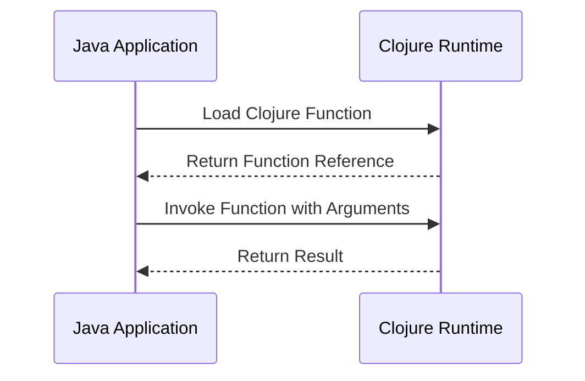

## 10.6.2 Invoking Clojure Functions from Java

As experienced Java developers, you are likely familiar with the challenges and intricacies of integrating different programming languages within a single application. Clojure, a dynamic, functional language that runs on the Java Virtual Machine (JVM), offers robust interoperability with Java. This section will guide you through the process of invoking Clojure functions from Java, using both compiled classes and dynamic invocation via the Clojure Java API.

### Understanding Clojure and Java Interoperability

Clojure's seamless integration with Java is one of its most compelling features. This interoperability allows developers to leverage existing Java libraries and frameworks while taking advantage of Clojure's functional programming paradigms. Let's explore two primary methods for invoking Clojure functions from Java:

1. **Compiled Classes**: This approach involves compiling Clojure code into Java bytecode, which can then be invoked like any other Java class.
2. **Dynamic Invocation**: This method uses the Clojure Java API to dynamically invoke Clojure functions at runtime.

### Compiled Classes Approach

#### Compiling Clojure Code

To invoke Clojure functions from Java using compiled classes, you first need to compile your Clojure code into Java bytecode. This can be done using the `gen-class` directive in Clojure, which generates a Java class file.

Here's a simple example of a Clojure function that we want to call from Java:

```clojure
(ns myproject.core
  (:gen-class
   :name myproject.core.MyClojureClass
   :methods [[greet [String] String]]))

(defn -greet
  "A simple function that greets the user."
  [name]
  (str "Hello, " name "!"))
```

In this example, the `:gen-class` directive specifies the name of the Java class (`myproject.core.MyClojureClass`) and the method signature (`greet`), which takes a `String` argument and returns a `String`.

#### Compiling the Clojure Code

To compile the Clojure code into a Java class, use the following command with Leiningen, a popular Clojure build tool:

```bash
lein uberjar
```

This command will generate a JAR file containing the compiled class. You can then include this JAR in your Java project's classpath.

#### Invoking the Compiled Class from Java

Once the Clojure code is compiled, you can invoke the `greet` method from Java as follows:

```java
import myproject.core.MyClojureClass;

public class JavaCaller {
    public static void main(String[] args) {
        MyClojureClass clojureClass = new MyClojureClass();
        String greeting = clojureClass.greet("Java Developer");
        System.out.println(greeting); // Outputs: Hello, Java Developer!
    }
}
```

This approach is straightforward and leverages the JVM's ability to handle compiled bytecode, making it efficient and easy to integrate into existing Java applications.

### Dynamic Invocation Approach

The dynamic invocation method uses the Clojure Java API to call Clojure functions at runtime. This approach is particularly useful when you need to call Clojure functions without pre-compiling them into classes.

#### Setting Up the Clojure Environment

Before you can dynamically invoke Clojure functions, ensure that the Clojure library is included in your Java project's dependencies. You can add the Clojure JAR to your classpath or use a build tool like Maven or Gradle to manage dependencies.

#### Using the Clojure Java API

The Clojure Java API provides the `RT` and `Var` classes, which are used to load and invoke Clojure functions dynamically.

Here's an example of how to use the Clojure Java API to call a Clojure function:

```java
import clojure.java.api.Clojure;
import clojure.lang.IFn;

public class DynamicClojureCaller {
    public static void main(String[] args) {
        // Load the Clojure function
        IFn greet = Clojure.var("myproject.core", "greet");

        // Invoke the function with an argument
        String greeting = (String) greet.invoke("Java Developer");
        System.out.println(greeting); // Outputs: Hello, Java Developer!
    }
}
```

In this example, the `Clojure.var` method is used to retrieve the Clojure function `greet` from the `myproject.core` namespace. The `invoke` method is then used to call the function with the desired arguments.

#### Handling Clojure Data Structures

When invoking Clojure functions from Java, you may need to handle Clojure-specific data structures such as lists, vectors, and maps. The Clojure Java API provides utilities for converting between Java and Clojure data types.

For example, to pass a Clojure vector to a function, you can use the `PersistentVector` class:

```java
import clojure.lang.PersistentVector;

public class DataStructureExample {
    public static void main(String[] args) {
        IFn processVector = Clojure.var("myproject.core", "process-vector");
        PersistentVector vector = PersistentVector.create("one", "two", "three");
        Object result = processVector.invoke(vector);
        System.out.println(result);
    }
}
```

### Comparing Compiled Classes and Dynamic Invocation

Both approaches have their advantages and trade-offs:

- **Compiled Classes**: This method is efficient and integrates well with existing Java codebases. It is ideal for scenarios where the Clojure code is stable and does not change frequently.
- **Dynamic Invocation**: This approach offers flexibility and is suitable for applications where Clojure code may change or be loaded dynamically. It is also useful for prototyping and exploratory programming.

### Try It Yourself

To deepen your understanding, try modifying the examples above:

- **Experiment with Different Data Types**: Modify the `greet` function to accept and return different data types, such as integers or collections.
- **Create More Complex Functions**: Implement a Clojure function that performs a more complex operation, such as processing a list of numbers or interacting with a database.
- **Explore Error Handling**: Introduce error handling in both Clojure and Java to manage exceptions that may arise during function invocation.

### Diagrams and Visual Aids

Below is a diagram illustrating the flow of invoking a Clojure function from Java using the dynamic invocation approach:



*Diagram 1: Sequence diagram showing the dynamic invocation of a Clojure function from Java.*

### Further Reading

For more information on Clojure and Java interoperability, consider exploring the following resources:

- [Official Clojure Documentation](https://clojure.org/reference/java_interop)
- [ClojureDocs](https://clojuredocs.org/)
- [Leiningen](https://leiningen.org/)

### Exercises

1. **Compile and Invoke**: Write a Clojure function that calculates the factorial of a number and invoke it from Java using the compiled classes approach.
2. **Dynamic Data Processing**: Implement a Clojure function that processes a list of strings and returns the longest string. Call this function from Java using dynamic invocation.
3. **Error Handling**: Modify the `greet` function to throw an exception if the input is null. Handle this exception in Java.

### Key Takeaways

- **Interoperability**: Clojure's seamless integration with Java allows for efficient and flexible invocation of Clojure functions from Java.
- **Compiled Classes vs. Dynamic Invocation**: Choose the approach that best suits your application's needs, considering factors like performance, flexibility, and code stability.
- **Data Handling**: Be mindful of data type conversions between Java and Clojure, leveraging the Clojure Java API for smooth interoperability.

By mastering these techniques, you can effectively integrate Clojure's functional programming capabilities into your Java applications, enhancing their flexibility and expressiveness.

## Quiz: Mastering Clojure Function Invocation from Java



### What is the primary advantage of using compiled classes to invoke Clojure functions from Java?

- [x] Efficiency and integration with existing Java codebases
- [ ] Flexibility in loading Clojure code dynamically
- [ ] Ability to handle Clojure-specific data structures
- [ ] Simplified error handling

> **Explanation:** Compiled classes are efficient and integrate well with existing Java codebases, making them ideal for stable Clojure code.

### Which Clojure directive is used to generate Java class files for compiled classes?

- [x] `:gen-class`
- [ ] `:gen-interface`
- [ ] `:gen-proxy`
- [ ] `:gen-reify`

> **Explanation:** The `:gen-class` directive is used to generate Java class files from Clojure code.

### What is the role of the `IFn` interface in dynamic invocation?

- [x] It represents a Clojure function that can be invoked from Java.
- [ ] It compiles Clojure code into Java bytecode.
- [ ] It manages data type conversions between Java and Clojure.
- [ ] It handles exceptions thrown by Clojure functions.

> **Explanation:** `IFn` is an interface representing a Clojure function that can be invoked from Java.

### How can you handle Clojure-specific data structures in Java?

- [x] Use Clojure's Java API utilities for data type conversion.
- [ ] Convert them manually using Java's reflection API.
- [ ] Use Java's native data structures directly.
- [ ] Avoid using Clojure-specific data structures.

> **Explanation:** Clojure's Java API provides utilities for converting between Java and Clojure data types.

### What is a key benefit of dynamic invocation over compiled classes?

- [x] Flexibility in loading and invoking Clojure code at runtime
- [ ] Improved performance and efficiency
- [ ] Simplified integration with Java libraries
- [ ] Enhanced error handling capabilities

> **Explanation:** Dynamic invocation offers flexibility in loading and invoking Clojure code at runtime.

### Which method is used to retrieve a Clojure function for dynamic invocation?

- [x] `Clojure.var`
- [ ] `Clojure.fn`
- [ ] `Clojure.load`
- [ ] `Clojure.call`

> **Explanation:** `Clojure.var` is used to retrieve a Clojure function for dynamic invocation.

### What is the purpose of the `invoke` method in dynamic invocation?

- [x] It calls the Clojure function with specified arguments.
- [ ] It compiles the Clojure function into a Java class.
- [ ] It converts Java data types to Clojure data types.
- [ ] It handles exceptions thrown by the Clojure function.

> **Explanation:** The `invoke` method calls the Clojure function with specified arguments.

### Which of the following is a valid use case for compiled classes?

- [x] Stable Clojure code that does not change frequently
- [ ] Prototyping and exploratory programming
- [ ] Applications requiring frequent code updates
- [ ] Dynamic loading of Clojure code

> **Explanation:** Compiled classes are suitable for stable Clojure code that does not change frequently.

### What is the primary challenge when handling Clojure data structures in Java?

- [x] Converting between Java and Clojure data types
- [ ] Compiling Clojure code into Java bytecode
- [ ] Loading Clojure functions dynamically
- [ ] Handling exceptions thrown by Clojure functions

> **Explanation:** The primary challenge is converting between Java and Clojure data types.

### True or False: Dynamic invocation allows for invoking Clojure functions without pre-compiling them into classes.

- [x] True
- [ ] False

> **Explanation:** Dynamic invocation allows for invoking Clojure functions without pre-compiling them into classes.


