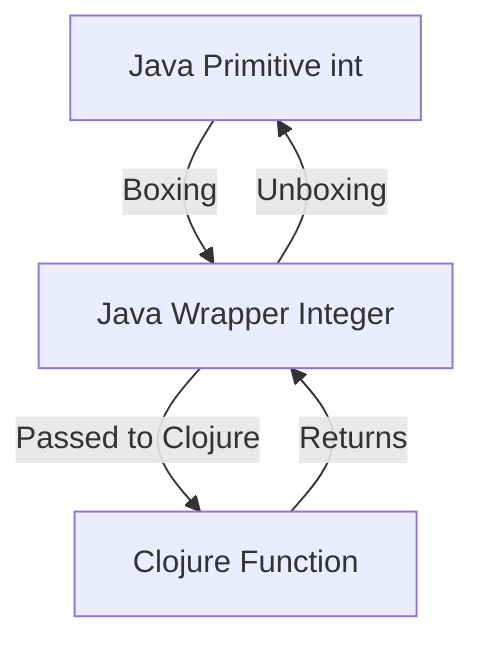

## 10.7.1 Primitive Types and Wrappers

As experienced Java developers, you're already familiar with the concept of primitive types and their corresponding wrapper classes. In Java, primitive types such as `int`, `double`, and `boolean` are the building blocks of data manipulation, while wrapper classes like `Integer`, `Double`, and `Boolean` provide object representations of these primitives. Clojure, being a language that runs on the JVM, interacts with these types in a unique way that leverages both its functional programming paradigm and Java's object-oriented nature. In this section, we'll delve into how Clojure handles Java primitive types and their wrappers, explore automatic boxing and unboxing, and discuss best practices for ensuring correct type usage.

### Understanding Primitive Types in Java

Before we dive into Clojure's handling of Java types, let's briefly revisit Java's primitive types and their characteristics:

- **Primitive Types**: Java has eight primitive data types: `byte`, `short`, `int`, `long`, `float`, `double`, `char`, and `boolean`. These types are not objects and hold their values directly in memory, making them efficient for computation.

- **Wrapper Classes**: Each primitive type has a corresponding wrapper class in Java, such as `Integer` for `int`, `Double` for `double`, etc. These classes provide a way to use primitives as objects, which is necessary for certain operations like collections that require objects.

- **Boxing and Unboxing**: Java automatically converts between primitives and their corresponding wrapper classes through a process known as boxing (converting a primitive to a wrapper) and unboxing (converting a wrapper back to a primitive).

### Clojure's Approach to Java Primitives

Clojure, as a Lisp dialect on the JVM, treats data differently from Java. It emphasizes immutability and functional programming, which influences how it interacts with Java's primitive types.

#### Automatic Boxing and Unboxing in Clojure

Clojure automatically boxes and unboxes Java primitives when interacting with Java code. This means that when you pass a primitive type from Java to Clojure, it is automatically converted to the corresponding wrapper class, and vice versa. This seamless conversion allows Clojure to maintain its functional purity while leveraging Java's performance benefits.

Here's a simple example to illustrate this concept:

```clojure
;; Clojure function that takes a Java Integer and returns its double value
(defn double-value [^Integer x]
  (* 2 x))

;; Calling the function with a primitive int
(double-value 5) ; => 10
```

In this example, the primitive `int` value `5` is automatically boxed into an `Integer` when passed to the `double-value` function.

#### Ensuring Correct Type Usage

While Clojure handles boxing and unboxing automatically, it's important to be mindful of type usage to avoid performance pitfalls and ensure compatibility with Java libraries. Here are some best practices:

- **Type Hinting**: Use type hints to inform the Clojure compiler about the expected types, which can help avoid unnecessary boxing and improve performance. For example, you can use `^int` to indicate that a function parameter should be treated as a primitive `int`.

```clojure
(defn add-integers [^int a ^int b]
  (+ a b))
```

- **Avoiding Reflection**: Clojure uses reflection to determine types at runtime, which can be slow. Type hints help eliminate reflection by providing the necessary type information at compile time.

- **Using Primitives for Performance**: When performance is critical, prefer using primitive types directly in your Clojure code. Clojure provides special forms like `int`, `long`, `float`, etc., to work with primitives directly.

```clojure
;; Using primitive operations for performance
(defn sum-array [arr]
  (loop [i 0 sum 0]
    (if (< i (alength arr))
      (recur (inc i) (+ sum (aget arr i)))
      sum)))
```

### Comparing Clojure and Java Type Handling

To better understand Clojure's approach, let's compare it with Java's handling of types through a series of examples.

#### Example 1: Adding Two Numbers

**Java Code:**

```java
public int add(int a, int b) {
    return a + b;
}
```

**Clojure Code:**

```clojure
(defn add [^int a ^int b]
  (+ a b))
```

In both examples, the addition operation is straightforward. However, Clojure's use of type hints (`^int`) ensures that the addition is performed using primitive operations, similar to Java.

#### Example 2: Working with Collections

**Java Code:**

```java
List<Integer> numbers = Arrays.asList(1, 2, 3, 4);
int sum = numbers.stream().mapToInt(Integer::intValue).sum();
```

**Clojure Code:**

```clojure
(def numbers [1 2 3 4])
(def sum (reduce + numbers))
```

In this example, Clojure's `reduce` function operates on a vector of numbers, automatically handling the conversion between primitives and their wrappers. The code is concise and leverages Clojure's functional capabilities.

### Diagrams and Visualizations

To further illustrate the flow of data and type conversions between Java and Clojure, let's use a diagram to visualize the process of boxing and unboxing.



**Diagram Caption**: This diagram shows the flow of data from a Java primitive `int` to a Clojure function, highlighting the automatic boxing to `Integer` and unboxing back to `int`.

### Try It Yourself

To deepen your understanding, try modifying the code examples above:

1. **Experiment with Type Hints**: Remove the type hints from the `add` function and observe any changes in performance or behavior.
2. **Use Different Primitives**: Modify the `sum-array` function to work with `float` or `double` arrays and compare the results.
3. **Integrate with Java Libraries**: Write a Clojure function that interacts with a Java library requiring specific primitive types and observe how Clojure handles the conversions.

### Exercises and Practice Problems

1. **Exercise 1**: Write a Clojure function that takes a list of Java `Double` objects and returns their average as a primitive `double`.
2. **Exercise 2**: Create a Clojure function that interacts with a Java method requiring a `boolean` parameter. Ensure that the Clojure function correctly handles the conversion.
3. **Exercise 3**: Implement a Clojure function that calculates the factorial of a number using primitive `long` for performance optimization.

### Key Takeaways

- **Automatic Boxing and Unboxing**: Clojure seamlessly converts between Java primitives and their wrapper classes, allowing for smooth interoperability.
- **Type Hinting**: Use type hints to improve performance and avoid reflection in Clojure code.
- **Functional Approach**: Leverage Clojure's functional programming capabilities to write concise and efficient code that interacts with Java types.

By understanding how Clojure handles Java primitive types and wrappers, you can write more efficient and interoperable code, taking full advantage of both languages' strengths. Now that we've explored these concepts, let's apply them to ensure seamless data type conversion in your Clojure applications.

For further reading, consider exploring the [Official Clojure Documentation](https://clojure.org/reference/java_interop) and [ClojureDocs](https://clojuredocs.org/) for more examples and detailed explanations.

## Quiz: Mastering Primitive Types and Wrappers in Clojure



### What is the process of converting a Java primitive to its corresponding wrapper class called?

- [x] Boxing
- [ ] Unboxing
- [ ] Wrapping
- [ ] Casting

> **Explanation:** Boxing is the process of converting a Java primitive to its corresponding wrapper class.

### In Clojure, what is the purpose of type hints?

- [x] To inform the compiler about expected types and avoid reflection
- [ ] To convert data types automatically
- [ ] To provide runtime type checking
- [ ] To enforce immutability

> **Explanation:** Type hints in Clojure inform the compiler about expected types, helping to avoid reflection and improve performance.

### Which Clojure function is used to sum a collection of numbers?

- [x] `reduce`
- [ ] `map`
- [ ] `filter`
- [ ] `apply`

> **Explanation:** The `reduce` function in Clojure is used to aggregate values, such as summing a collection of numbers.

### What is the result of automatic unboxing in Clojure?

- [x] Converting a wrapper class back to a primitive type
- [ ] Converting a primitive type to a wrapper class
- [ ] Converting a string to a number
- [ ] Converting a collection to a sequence

> **Explanation:** Automatic unboxing in Clojure converts a wrapper class back to its corresponding primitive type.

### How can you avoid reflection in Clojure code?

- [x] By using type hints
- [ ] By using macros
- [x] By avoiding dynamic typing
- [ ] By using Java interop

> **Explanation:** Using type hints in Clojure helps avoid reflection, improving performance.

### What is the primary benefit of using primitives in Clojure?

- [x] Improved performance
- [ ] Enhanced readability
- [ ] Increased flexibility
- [ ] Better error handling

> **Explanation:** Using primitives in Clojure can lead to improved performance due to reduced overhead.

### Which of the following is a Clojure special form for working with primitives?

- [x] `int`
- [ ] `def`
- [x] `long`
- [ ] `let`

> **Explanation:** Clojure provides special forms like `int` and `long` for working directly with primitive types.

### What is the role of wrapper classes in Java?

- [x] To provide object representations of primitive types
- [ ] To enforce type safety
- [ ] To improve performance
- [ ] To simplify syntax

> **Explanation:** Wrapper classes in Java provide object representations of primitive types, allowing them to be used in contexts that require objects.

### How does Clojure handle Java primitive types when interacting with Java code?

- [x] Through automatic boxing and unboxing
- [ ] By converting them to strings
- [ ] By ignoring them
- [ ] By using macros

> **Explanation:** Clojure handles Java primitive types through automatic boxing and unboxing when interacting with Java code.

### True or False: Clojure requires explicit type declarations for all variables.

- [ ] True
- [x] False

> **Explanation:** Clojure does not require explicit type declarations for variables, but type hints can be used to improve performance.


