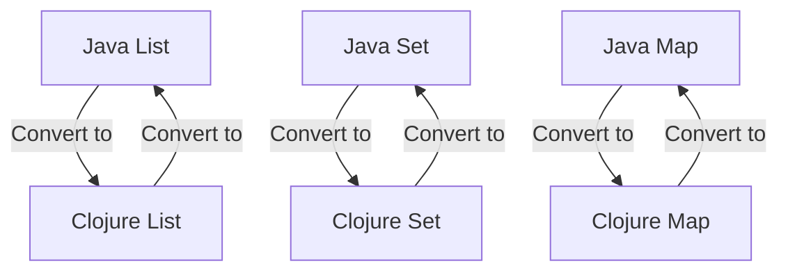

## 10.7.2 Working with Java Collections

As experienced Java developers transitioning to Clojure, understanding how to work with collections across both languages is crucial. Java collections such as `List`, `Set`, and `Map` are ubiquitous in Java applications, while Clojure offers its own rich set of immutable collection types. This section will guide you through the process of converting between these collections, enabling you to leverage the strengths of both languages seamlessly.

### Understanding Java and Clojure Collections

Java collections are part of the Java Collections Framework, which provides a set of interfaces and classes to handle groups of objects. These collections are mutable by default, allowing for dynamic changes. In contrast, Clojure collections are immutable, meaning once a collection is created, it cannot be changed. This immutability is a cornerstone of Clojure's functional programming paradigm, offering benefits such as thread safety and easier reasoning about code.

#### Java Collections Overview

- **List**: An ordered collection that can contain duplicate elements. Common implementations include `ArrayList` and `LinkedList`.
- **Set**: A collection that cannot contain duplicate elements. Common implementations include `HashSet` and `TreeSet`.
- **Map**: An object that maps keys to values, with no duplicate keys allowed. Common implementations include `HashMap` and `TreeMap`.

#### Clojure Collections Overview

- **List**: A singly linked list, optimized for sequential access.
- **Vector**: An indexed collection, optimized for random access.
- **Set**: An unordered collection of unique elements.
- **Map**: An associative data structure mapping keys to values.

### Converting Java Collections to Clojure Collections

To work effectively with Java collections in Clojure, you need to convert them into Clojure's immutable collections. Clojure provides several utility functions to facilitate this conversion.

#### Converting Java Lists to Clojure Lists

Java lists can be converted to Clojure lists using the `clojure.java.api.Clojure` class and its `seq` function.

```clojure
(import '[java.util ArrayList])
(import '[clojure.java.api Clojure])

(defn java-list-to-clojure-list [java-list]
  (Clojure/seq java-list))

;; Example usage
(let [java-list (ArrayList. [1 2 3])]
  (println (java-list-to-clojure-list java-list)))
```

**Explanation**: The `seq` function creates a sequence from the Java list, which can be further manipulated using Clojure's sequence functions.

#### Converting Java Sets to Clojure Sets

Java sets can be converted to Clojure sets using the `set` function.

```clojure
(import '[java.util HashSet])

(defn java-set-to-clojure-set [java-set]
  (set java-set))

;; Example usage
(let [java-set (HashSet. [1 2 3])]
  (println (java-set-to-clojure-set java-set)))
```

**Explanation**: The `set` function takes a Java set and returns a Clojure set, preserving the uniqueness of elements.

#### Converting Java Maps to Clojure Maps

Java maps can be converted to Clojure maps using the `into` function.

```clojure
(import '[java.util HashMap])

(defn java-map-to-clojure-map [java-map]
  (into {} java-map))

;; Example usage
(let [java-map (HashMap. {"a" 1 "b" 2})]
  (println (java-map-to-clojure-map java-map)))
```

**Explanation**: The `into` function takes a Java map and converts it into a Clojure map, maintaining the key-value associations.

### Converting Clojure Collections to Java Collections

Conversely, you may need to convert Clojure collections back to Java collections, especially when interfacing with Java libraries or APIs.

#### Converting Clojure Lists to Java Lists

Clojure lists can be converted to Java lists using the `java.util.ArrayList` constructor.

```clojure
(import '[java.util ArrayList])

(defn clojure-list-to-java-list [clojure-list]
  (ArrayList. clojure-list))

;; Example usage
(let [clojure-list '(1 2 3)]
  (println (clojure-list-to-java-list clojure-list)))
```

**Explanation**: The `ArrayList` constructor takes a Clojure list and creates a mutable Java list.

#### Converting Clojure Sets to Java Sets

Clojure sets can be converted to Java sets using the `java.util.HashSet` constructor.

```clojure
(import '[java.util HashSet])

(defn clojure-set-to-java-set [clojure-set]
  (HashSet. clojure-set))

;; Example usage
(let [clojure-set #{1 2 3}]
  (println (clojure-set-to-java-set clojure-set)))
```

**Explanation**: The `HashSet` constructor takes a Clojure set and creates a mutable Java set.

#### Converting Clojure Maps to Java Maps

Clojure maps can be converted to Java maps using the `java.util.HashMap` constructor.

```clojure
(import '[java.util HashMap])

(defn clojure-map-to-java-map [clojure-map]
  (HashMap. clojure-map))

;; Example usage
(let [clojure-map {"a" 1 "b" 2}]
  (println (clojure-map-to-java-map clojure-map)))
```

**Explanation**: The `HashMap` constructor takes a Clojure map and creates a mutable Java map.

### Utility Functions for Interoperation

To streamline the conversion process, you can create utility functions that handle common conversion tasks. These functions can be part of a utility library that you use across projects.

```clojure
(defn to-clojure-collection [java-collection]
  (cond
    (instance? java.util.List java-collection) (Clojure/seq java-collection)
    (instance? java.util.Set java-collection) (set java-collection)
    (instance? java.util.Map java-collection) (into {} java-collection)
    :else (throw (IllegalArgumentException. "Unsupported collection type"))))

(defn to-java-collection [clojure-collection]
  (cond
    (list? clojure-collection) (ArrayList. clojure-collection)
    (set? clojure-collection) (HashSet. clojure-collection)
    (map? clojure-collection) (HashMap. clojure-collection)
    :else (throw (IllegalArgumentException. "Unsupported collection type"))))
```

**Explanation**: These utility functions use `cond` to check the type of the collection and perform the appropriate conversion.

### Try It Yourself

To deepen your understanding, try modifying the code examples above. For instance, experiment with converting nested collections or handling edge cases such as empty collections. Consider how you might extend these utility functions to support additional collection types or custom data structures.

### Visualizing Collection Conversion

To better understand the conversion process, let's visualize the flow of data between Java and Clojure collections.



**Diagram Explanation**: This flowchart illustrates the bidirectional conversion between Java and Clojure collections, highlighting the seamless interoperability between the two languages.

### Best Practices for Collection Conversion

- **Minimize Conversion**: Convert collections only when necessary to avoid performance overhead.
- **Immutable by Default**: Favor Clojure's immutable collections for thread safety and functional programming benefits.
- **Utility Functions**: Use utility functions to encapsulate conversion logic, promoting code reuse and maintainability.
- **Error Handling**: Implement robust error handling to manage unsupported collection types or conversion failures.

### Exercises and Practice Problems

1. **Exercise 1**: Write a function that converts a nested Java collection (e.g., a list of maps) to a Clojure collection. Test your function with various nested structures.
2. **Exercise 2**: Extend the utility functions to support conversion of Java `LinkedList` and `TreeSet` to Clojure collections.
3. **Exercise 3**: Implement a function that checks if a given Java collection is empty and returns a corresponding empty Clojure collection.
4. **Exercise 4**: Create a benchmarking script to compare the performance of converting large collections between Java and Clojure.

### Key Takeaways

- **Seamless Interoperability**: Clojure provides powerful tools to convert between Java and Clojure collections, enabling seamless interoperability.
- **Functional Programming Benefits**: Leveraging Clojure's immutable collections enhances code safety and maintainability.
- **Utility Functions**: Encapsulating conversion logic in utility functions promotes code reuse and simplifies maintenance.
- **Performance Considerations**: Be mindful of conversion overhead and optimize for performance where necessary.

By mastering the conversion between Java and Clojure collections, you can effectively integrate Clojure into your existing Java projects, leveraging the strengths of both languages to build robust and maintainable applications.

## Quiz: Mastering Java Collections Interoperability in Clojure



### What is the primary benefit of using Clojure's immutable collections over Java's mutable collections?

- [x] Thread safety and easier reasoning about code
- [ ] Faster performance
- [ ] More memory-efficient
- [ ] Better compatibility with Java libraries

> **Explanation:** Clojure's immutable collections provide thread safety and easier reasoning about code, which are key benefits of functional programming.

### Which Clojure function is used to convert a Java `List` to a Clojure list?

- [x] `Clojure/seq`
- [ ] `into`
- [ ] `set`
- [ ] `ArrayList`

> **Explanation:** The `Clojure/seq` function is used to create a sequence from a Java `List`, converting it to a Clojure list.

### How can you convert a Clojure map to a Java map?

- [x] Using the `HashMap` constructor
- [ ] Using the `ArrayList` constructor
- [ ] Using the `set` function
- [ ] Using the `Clojure/seq` function

> **Explanation:** The `HashMap` constructor takes a Clojure map and creates a mutable Java map.

### What is a key advantage of using utility functions for collection conversion?

- [x] Promotes code reuse and maintainability
- [ ] Increases performance
- [ ] Reduces memory usage
- [ ] Simplifies Java code

> **Explanation:** Utility functions encapsulate conversion logic, promoting code reuse and maintainability.

### Which Java collection type is converted using the `set` function in Clojure?

- [x] `Set`
- [ ] `List`
- [ ] `Map`
- [ ] `ArrayList`

> **Explanation:** The `set` function is used to convert a Java `Set` to a Clojure set.

### What should you consider when converting collections between Java and Clojure?

- [x] Performance overhead
- [ ] Memory allocation
- [ ] Java version compatibility
- [ ] Collection size

> **Explanation:** Performance overhead should be considered to ensure efficient conversion between collections.

### Which Clojure collection is optimized for random access?

- [x] Vector
- [ ] List
- [ ] Set
- [ ] Map

> **Explanation:** Clojure's `Vector` is optimized for random access, similar to Java's `ArrayList`.

### What is the result of converting a Java `HashMap` to a Clojure map?

- [x] An immutable Clojure map
- [ ] A mutable Clojure map
- [ ] A Clojure list
- [ ] A Clojure set

> **Explanation:** Converting a Java `HashMap` to a Clojure map results in an immutable Clojure map.

### Which of the following is a best practice for collection conversion?

- [x] Minimize conversion to avoid performance overhead
- [ ] Convert all collections to Java collections
- [ ] Use mutable collections by default
- [ ] Avoid using utility functions

> **Explanation:** Minimizing conversion helps avoid performance overhead and maintains efficient code.

### True or False: Clojure's `into` function can be used to convert a Java map to a Clojure map.

- [x] True
- [ ] False

> **Explanation:** The `into` function can be used to convert a Java map to a Clojure map, maintaining key-value associations.


