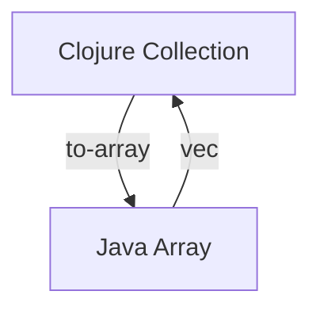

## 10.7.3 Handling Arrays

In this section, we will delve into the intricacies of handling arrays in Clojure, particularly focusing on interoperability with Java. As experienced Java developers, you are already familiar with arrays as a fundamental data structure. In Clojure, while lists, vectors, maps, and sets are more commonly used, understanding how to work with arrays is crucial, especially when interacting with Java libraries and APIs.

### Understanding Arrays in Clojure

Clojure, being a hosted language on the Java Virtual Machine (JVM), provides seamless interoperability with Java. This includes the ability to work with Java arrays. However, Clojure's idiomatic data structures are immutable and persistent, which contrasts with Java's mutable arrays. Let's explore how Clojure handles arrays and how you can leverage them in your applications.

### Creating Arrays in Clojure

In Clojure, arrays can be created using the `make-array` function. This function allows you to specify the type and dimensions of the array, similar to Java's array creation syntax.

```clojure
;; Create a one-dimensional array of integers with 5 elements
(def int-array (make-array Integer/TYPE 5))

;; Create a two-dimensional array of doubles
(def double-array (make-array Double/TYPE 3 3))
```

**Explanation:**
- `make-array` takes the type and dimensions as arguments.
- `Integer/TYPE` and `Double/TYPE` specify the primitive types for the array elements.

### Accessing and Modifying Array Elements

Accessing and modifying elements in an array is done using the `aget` and `aset` functions, respectively. These functions are analogous to Java's array indexing and assignment operations.

```clojure
;; Accessing elements
(def first-element (aget int-array 0))

;; Modifying elements
(aset int-array 0 42)
```

**Explanation:**
- `aget` retrieves the element at the specified index.
- `aset` sets the element at the specified index to a new value.

### Converting Clojure Collections to Java Arrays

Clojure provides the `to-array` function to convert Clojure collections into Java arrays. This is particularly useful when you need to pass data to Java methods that expect arrays.

```clojure
;; Convert a Clojure vector to a Java array
(def clojure-vector [1 2 3 4 5])
(def java-array (to-array clojure-vector))
```

**Explanation:**
- `to-array` takes a Clojure collection and returns a Java array.

### Converting Java Arrays to Clojure Collections

Conversely, you can convert Java arrays back into Clojure collections using the `vec` function, which creates a Clojure vector from an array.

```clojure
;; Convert a Java array to a Clojure vector
(def clojure-vector-from-array (vec java-array))
```

**Explanation:**
- `vec` creates a Clojure vector from a Java array, allowing you to work with the data using Clojure's rich set of collection functions.

### Handling Multidimensional Arrays

Clojure supports multidimensional arrays, which can be created and manipulated similarly to one-dimensional arrays. However, accessing elements in multidimensional arrays requires specifying indices for each dimension.

```clojure
;; Create a 2x2 array of integers
(def multi-array (make-array Integer/TYPE 2 2))

;; Set values in the multidimensional array
(aset multi-array 0 0 10)
(aset multi-array 1 1 20)

;; Access values from the multidimensional array
(def value (aget multi-array 1 1))
```

**Explanation:**
- `aset` and `aget` can be used with multiple indices to access and modify elements in multidimensional arrays.

### Performance Considerations

While arrays in Clojure provide a way to interact with Java APIs, they are mutable and do not benefit from Clojure's persistent data structures' immutability and structural sharing. Therefore, it's essential to use arrays judiciously, especially in concurrent applications.

### Try It Yourself

Experiment with the following modifications to deepen your understanding:
- Create a three-dimensional array and populate it with values.
- Convert a list of strings to a Java array and back to a Clojure vector.
- Measure the performance difference between accessing elements in a Clojure vector and a Java array.

### Diagrams and Visualizations

Below is a diagram illustrating the flow of data between Clojure collections and Java arrays:



**Diagram Explanation:**
- This diagram shows the conversion process between Clojure collections and Java arrays using `to-array` and `vec`.

### Further Reading

For more information on Clojure's interoperability with Java, consider exploring the following resources:
- [Official Clojure Documentation on Java Interop](https://clojure.org/reference/java_interop)
- [ClojureDocs: Java Interop Examples](https://clojuredocs.org/quickref#Java%20Interop)

### Exercises

1. Write a function that takes a Clojure list and returns a Java array of strings.
2. Implement a function that accepts a Java array of integers and returns the sum of its elements using Clojure's `reduce` function.
3. Create a Clojure function that transposes a 2D Java array (i.e., swaps rows and columns).

### Key Takeaways

- Clojure provides functions like `make-array`, `aget`, `aset`, and `to-array` to work with Java arrays.
- Arrays in Clojure are mutable, contrasting with Clojure's idiomatic immutable data structures.
- Understanding how to convert between Clojure collections and Java arrays is crucial for Java interoperability.
- Use arrays judiciously, considering performance and concurrency implications.

Now that we've explored how to handle arrays in Clojure, let's apply these concepts to manage data effectively in your applications.

## Quiz: Mastering Arrays in Clojure and Java Interoperability



### Which function is used to create a Java array in Clojure?

- [x] make-array
- [ ] create-array
- [ ] new-array
- [ ] array-init

> **Explanation:** The `make-array` function is used to create Java arrays in Clojure by specifying the type and dimensions.

### How do you access an element in a Java array in Clojure?

- [x] aget
- [ ] get
- [ ] access
- [ ] retrieve

> **Explanation:** The `aget` function is used to access elements in a Java array in Clojure.

### What function converts a Clojure collection to a Java array?

- [x] to-array
- [ ] arrayify
- [ ] convert-to-array
- [ ] array-from

> **Explanation:** The `to-array` function converts a Clojure collection into a Java array.

### Which function is used to modify an element in a Java array in Clojure?

- [x] aset
- [ ] set
- [ ] modify
- [ ] update

> **Explanation:** The `aset` function is used to modify elements in a Java array in Clojure.

### What is the primary difference between Clojure's vectors and Java arrays?

- [x] Immutability vs. Mutability
- [ ] Size vs. Flexibility
- [ ] Performance vs. Ease of Use
- [ ] Syntax vs. Semantics

> **Explanation:** Clojure's vectors are immutable, while Java arrays are mutable.

### How can you convert a Java array back to a Clojure collection?

- [x] vec
- [ ] to-collection
- [ ] from-array
- [ ] array-to-vec

> **Explanation:** The `vec` function converts a Java array back into a Clojure vector.

### Which of the following is a valid type for `make-array`?

- [x] Integer/TYPE
- [ ] int
- [ ] Integer
- [ ] TYPE/Integer

> **Explanation:** `Integer/TYPE` is used to specify the type of elements in a Java array created with `make-array`.

### What is a key consideration when using Java arrays in Clojure?

- [x] Mutability
- [ ] Syntax
- [ ] Performance
- [ ] Compatibility

> **Explanation:** Java arrays are mutable, which is a key consideration when using them in Clojure.

### Can you use `aget` and `aset` with multidimensional arrays?

- [x] True
- [ ] False

> **Explanation:** `aget` and `aset` can be used with multiple indices to access and modify elements in multidimensional arrays.

### What is the purpose of the `to-array` function?

- [x] Convert Clojure collections to Java arrays
- [ ] Create new Java arrays
- [ ] Access elements in Java arrays
- [ ] Modify elements in Java arrays

> **Explanation:** The `to-array` function is used to convert Clojure collections into Java arrays.


