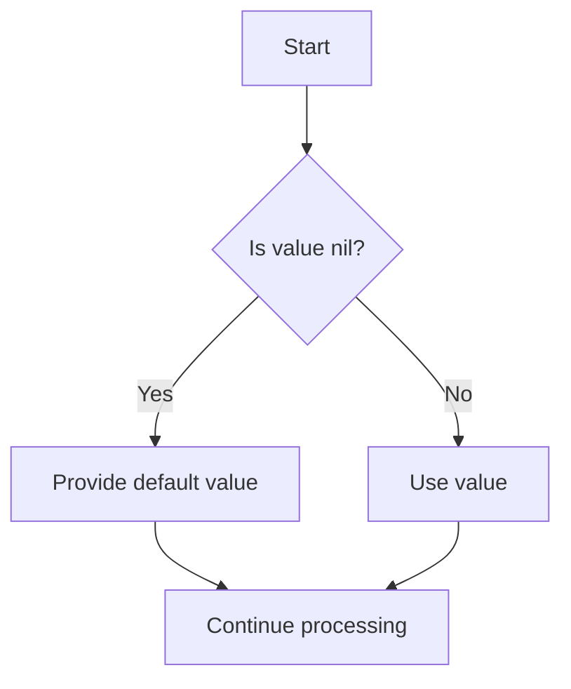

## 10.7.4 Dealing with `null` Values

As experienced Java developers, you're likely familiar with the concept of `null` and the challenges it presents. In Java, `null` often leads to `NullPointerException`, a common runtime error that can be difficult to debug. Clojure, a functional programming language that runs on the JVM, represents Java's `null` as `nil`. This section will explore how Clojure handles `nil`, potential pitfalls, and strategies for managing `nil` safely in your Clojure applications.

### Understanding `nil` in Clojure

In Clojure, `nil` is used to represent the absence of a value, similar to `null` in Java. However, Clojure's approach to `nil` is more integrated into its functional paradigm, offering several advantages and tools for handling `nil` safely.

#### Key Differences Between `null` and `nil`

- **Type System**: In Java, `null` can be assigned to any object reference type, but it often leads to `NullPointerException` if not handled properly. In Clojure, `nil` is a first-class citizen and can be used in place of any object.
- **Collections**: Clojure collections can contain `nil` values, and functions that operate on collections are designed to handle `nil` gracefully.
- **Function Calls**: In Clojure, calling a function with `nil` arguments or returning `nil` from a function is common and often expected.

### Handling `nil` Safely in Clojure

Clojure provides several idiomatic ways to handle `nil` values, reducing the risk of runtime errors and improving code robustness.

#### Using `nil?` for Checking `nil`

The `nil?` function is a straightforward way to check if a value is `nil`.

```clojure
(defn safe-divide [numerator denominator]
  (if (nil? denominator)
    "Denominator cannot be nil"
    (/ numerator denominator)))

(safe-divide 10 nil) ; => "Denominator cannot be nil"
(safe-divide 10 2)   ; => 5
```

#### Leveraging `some` and `some?`

Clojure's `some` function can be used to check for the presence of non-`nil` values in a collection, while `some?` checks if a value is not `nil`.

```clojure
(defn find-first-non-nil [coll]
  (some identity coll))

(find-first-non-nil [nil nil 3 nil]) ; => 3
(find-first-non-nil [nil nil nil])   ; => nil
```

#### Default Values with `or`

The `or` macro can be used to provide default values when encountering `nil`.

```clojure
(defn greet [name]
  (str "Hello, " (or name "Guest") "!"))

(greet nil)   ; => "Hello, Guest!"
(greet "Sam") ; => "Hello, Sam!"
```

### Common Pitfalls with `nil`

While Clojure's handling of `nil` is more robust than Java's `null`, there are still potential pitfalls to be aware of.

#### `nil` in Arithmetic Operations

Attempting arithmetic operations with `nil` will result in an error. Always ensure values are non-`nil` before performing such operations.

```clojure
(defn add [a b]
  (+ (or a 0) (or b 0)))

(add 5 nil) ; => 5
```

#### `nil` in Collections

While Clojure collections can contain `nil`, operations on collections should account for the possibility of `nil` elements.

```clojure
(defn sum-numbers [numbers]
  (reduce + (map #(or % 0) numbers)))

(sum-numbers [1 nil 3]) ; => 4
```

### Clojure's `nil` Handling in Practice

Let's explore a practical example where we handle `nil` values in a Clojure application that interacts with a Java library.

#### Example: Interfacing with a Java Library

Suppose we have a Java library that returns `null` for missing data. In Clojure, we can handle this gracefully using `nil`.

```java
// Java method that may return null
public String getUserEmail(String userId) {
    // Simulate a database lookup
    return userId.equals("123") ? "user@example.com" : null;
}
```

In Clojure, we can wrap this method and handle `nil` safely.

```clojure
(ns myapp.core
  (:import [com.example JavaLibrary]))

(defn get-user-email [user-id]
  (let [email (.getUserEmail (JavaLibrary.) user-id)]
    (or email "Email not found")))

(get-user-email "123") ; => "user@example.com"
(get-user-email "456") ; => "Email not found"
```

### Visualizing `nil` Handling

To better understand how `nil` flows through Clojure functions, let's visualize the process using a flowchart.



**Diagram Description**: This flowchart illustrates the decision-making process when handling `nil` values in Clojure. If a value is `nil`, a default value is provided; otherwise, the value is used directly.

### Best Practices for `nil` Handling

- **Use `nil?` and `some?`**: Always check for `nil` explicitly when necessary.
- **Provide Defaults**: Use `or` to supply default values and avoid `nil` propagation.
- **Graceful Degradation**: Design functions to handle `nil` inputs gracefully, returning meaningful defaults or messages.
- **Avoid `nil` in Critical Paths**: Minimize the use of `nil` in critical application logic to reduce complexity and potential errors.

### Exercises: Practice `nil` Handling

1. **Exercise 1**: Modify the `safe-divide` function to handle division by zero as well as `nil` denominators.
2. **Exercise 2**: Create a function that filters out `nil` values from a collection and returns the sum of the remaining numbers.
3. **Exercise 3**: Write a function that takes a map and returns a new map with all `nil` values replaced by a default value.

### Key Takeaways

- **Clojure's `nil`**: Clojure uses `nil` to represent the absence of a value, similar to Java's `null`, but with more robust handling.
- **Safe Handling**: Use functions like `nil?`, `some`, and `or` to manage `nil` safely in your code.
- **Avoid Pitfalls**: Be mindful of `nil` in arithmetic operations and collections, and design your code to handle these cases gracefully.

By understanding and applying these concepts, you can effectively manage `nil` values in your Clojure applications, reducing errors and improving code reliability.

### Further Reading

- [Official Clojure Documentation on `nil`](https://clojure.org/reference/data_structures#nil)
- [ClojureDocs: `nil?`](https://clojuredocs.org/clojure.core/nil_q)
- [Java Interoperability in Clojure](https://clojure.org/reference/java_interop)

## Quiz: Mastering `nil` Handling in Clojure



### What is the Clojure equivalent of Java's `null`?

- [x] `nil`
- [ ] `null`
- [ ] `void`
- [ ] `none`

> **Explanation:** In Clojure, `nil` is used to represent the absence of a value, similar to Java's `null`.

### Which function is used to check if a value is `nil` in Clojure?

- [x] `nil?`
- [ ] `null?`
- [ ] `empty?`
- [ ] `none?`

> **Explanation:** The `nil?` function is used to check if a value is `nil` in Clojure.

### How can you provide a default value for a `nil` in Clojure?

- [x] Using the `or` macro
- [ ] Using the `and` macro
- [ ] Using the `if` statement
- [ ] Using the `case` statement

> **Explanation:** The `or` macro can be used to provide a default value when encountering `nil`.

### What will `(or nil "default")` return in Clojure?

- [x] "default"
- [ ] `nil`
- [ ] `false`
- [ ] `true`

> **Explanation:** The `or` macro returns the first truthy value, so it will return "default" when `nil` is encountered.

### Which function can be used to find the first non-`nil` value in a collection?

- [x] `some`
- [ ] `first`
- [ ] `last`
- [ ] `find`

> **Explanation:** The `some` function can be used to find the first non-`nil` value in a collection.

### What is a common pitfall when handling `nil` in arithmetic operations?

- [x] It can cause errors if not handled properly.
- [ ] It is automatically converted to zero.
- [ ] It is ignored.
- [ ] It is treated as a string.

> **Explanation:** Attempting arithmetic operations with `nil` will result in an error, so it must be handled properly.

### How can you filter out `nil` values from a collection in Clojure?

- [x] Using `filter` with `identity`
- [ ] Using `remove` with `nil?`
- [ ] Using `map` with `nil?`
- [ ] Using `reduce` with `nil?`

> **Explanation:** You can use `filter` with `identity` to remove `nil` values from a collection.

### What does the `some?` function do in Clojure?

- [x] Checks if a value is not `nil`
- [ ] Checks if a value is `nil`
- [ ] Checks if a collection is empty
- [ ] Checks if a collection contains `nil`

> **Explanation:** The `some?` function checks if a value is not `nil`.

### What is the result of `(some identity [nil nil 3 nil])`?

- [x] 3
- [ ] `nil`
- [ ] `false`
- [ ] `true`

> **Explanation:** The `some` function returns the first non-`nil` value, which is 3 in this case.

### True or False: Clojure functions are designed to handle `nil` values gracefully.

- [x] True
- [ ] False

> **Explanation:** Clojure functions are generally designed to handle `nil` values gracefully, reducing the risk of runtime errors.


