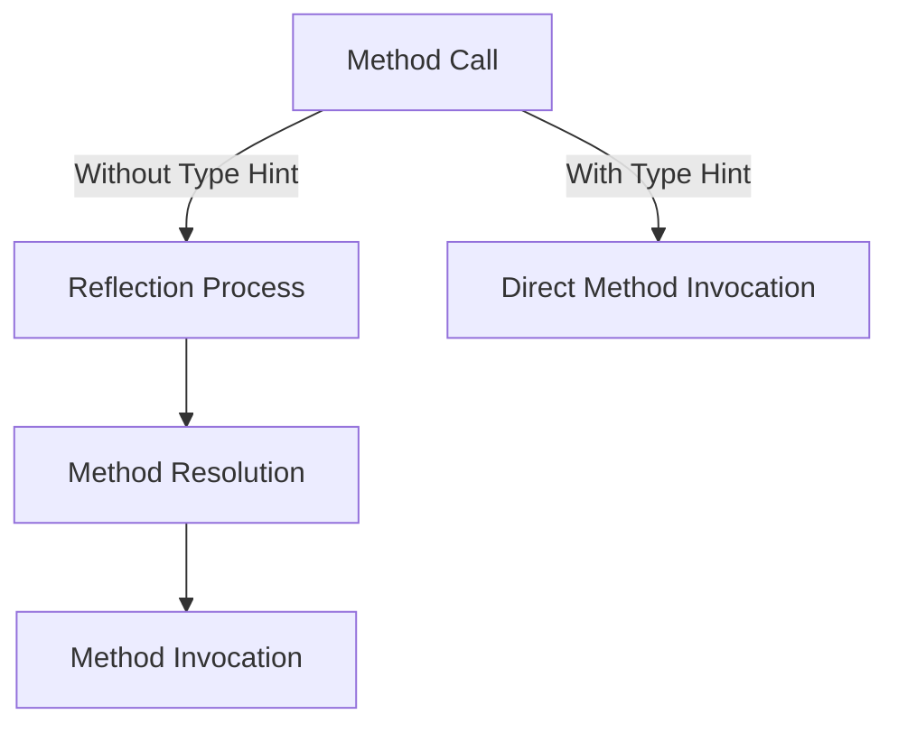

## 10.8.1 Reflection and Performance Overheads

In this section, we will delve into the intricacies of reflection in Clojure, particularly when interacting with Java. Reflection is a powerful feature that allows a program to inspect and modify its own structure and behavior at runtime. However, it comes with performance costs that can be significant, especially in a language like Clojure that runs on the Java Virtual Machine (JVM). Understanding how to manage and mitigate these costs is crucial for developers aiming to write efficient Clojure code that interoperates with Java.

### Understanding Reflection in Clojure

Reflection in Clojure occurs when the language needs to determine the type of an object at runtime to invoke a method or access a field. This process is inherently slower than direct method calls because it involves additional steps to resolve the method or field dynamically.

#### How Reflection Works

When Clojure code calls a Java method without explicit type information, the JVM uses reflection to find the appropriate method to invoke. This involves:

1. **Inspecting the Object**: The JVM examines the object's class to find the method signature.
2. **Matching the Method**: It matches the method name and parameter types.
3. **Invoking the Method**: Once matched, the method is invoked.

This process is repeated every time the method is called, leading to performance overhead.

#### Example of Reflection in Clojure

Consider the following Clojure code snippet that uses reflection:

```clojure
(defn calculate-area [shape]
  (.getArea shape)) ; Reflection occurs here if `shape` type is not hinted
```

In this example, if `shape` is an instance of a Java class with a `getArea` method, Clojure will use reflection to determine the method to call unless we provide a type hint.

### Performance Implications of Reflection

Reflection can significantly impact performance, especially in performance-critical applications. The overhead is due to the dynamic nature of reflection, which involves:

- **Increased CPU Usage**: The JVM must perform additional computations to resolve method calls.
- **Higher Memory Consumption**: Reflection can lead to increased memory usage due to the metadata required for dynamic type resolution.
- **Slower Execution**: Each reflective call is slower than a direct method invocation.

### Mitigating Reflection Overheads with Type Hints

To eliminate the performance overhead of reflection, Clojure provides a mechanism called **type hints**. Type hints are metadata annotations that inform the compiler about the expected type of an expression, allowing it to generate more efficient bytecode.

#### Adding Type Hints

Type hints can be added using the `^` symbol followed by the class name. Here's how you can add a type hint to the previous example:

```clojure
(defn calculate-area [^Shape shape] ; Type hint added
  (.getArea shape))
```

With the type hint `^Shape`, the Clojure compiler can directly generate the bytecode for the method call without using reflection.

#### Benefits of Type Hints

- **Improved Performance**: Eliminates the need for reflection, resulting in faster method calls.
- **Compile-Time Checking**: Provides additional compile-time checks, reducing runtime errors.
- **Better Integration with Java**: Makes Clojure code more predictable and efficient when interoperating with Java.

### Practical Examples and Comparisons

Let's explore some practical examples to illustrate the impact of reflection and the benefits of type hints.

#### Example 1: Without Type Hints

```clojure
(defn sum-lengths [shapes]
  (reduce + (map #(.getLength %) shapes))) ; Reflection used for each call
```

In this example, reflection is used each time `getLength` is called on a shape, which can be costly in a loop.

#### Example 2: With Type Hints

```clojure
(defn sum-lengths [^java.util.List shapes]
  (reduce + (map #(let [^Shape s %] (.getLength s)) shapes))) ; Type hint added
```

By adding type hints, we eliminate reflection, resulting in more efficient execution.

#### Java Comparison

In Java, method calls are resolved at compile time, and reflection is only used explicitly. Here's a Java equivalent:

```java
public int sumLengths(List<Shape> shapes) {
    return shapes.stream().mapToInt(Shape::getLength).sum();
}
```

Java's static typing ensures that method calls are resolved at compile time, avoiding reflection unless explicitly used.

### Try It Yourself

To better understand the impact of reflection, try modifying the following Clojure code:

```clojure
(defn calculate-volume [^Shape shape]
  (.getVolume shape)) ; Add and remove type hints to observe performance changes
```

- **Experiment**: Run the code with and without type hints and measure the execution time.
- **Challenge**: Identify other parts of your Clojure codebase where reflection might occur and optimize them with type hints.

### Visualizing Reflection and Type Hints

To further illustrate the concept, let's use a diagram to show the flow of method calls with and without reflection.



**Diagram Caption**: This flowchart illustrates the difference between method calls with and without type hints. Without type hints, the reflection process is involved, adding overhead.

### Best Practices for Using Type Hints

1. **Identify Critical Paths**: Focus on optimizing performance-critical sections of your code.
2. **Use Type Hints Judiciously**: Overuse can lead to less flexible code, so apply them where performance gains are significant.
3. **Leverage Static Analysis Tools**: Use tools like `Eastwood` to identify potential reflection points in your code.

### Further Reading and Resources

- [Clojure Official Documentation on Type Hints](https://clojure.org/reference/java_interop#type_hints)
- [ClojureDocs: Java Interop](https://clojuredocs.org/quickref#Java%20Interop)
- [Java Reflection API](https://docs.oracle.com/javase/tutorial/reflect/)

### Exercises

1. **Identify Reflection Points**: Analyze a Clojure project to find where reflection is used and add type hints to optimize performance.
2. **Benchmarking**: Create a benchmark to compare the performance of reflective and non-reflective method calls in Clojure.
3. **Code Refactoring**: Refactor a Clojure function that heavily relies on reflection to use type hints and measure the performance improvement.

### Key Takeaways

- **Reflection** in Clojure can lead to significant performance overheads, especially in performance-critical applications.
- **Type Hints** are a powerful tool to eliminate reflection and improve the efficiency of Clojure code interacting with Java.
- **Best Practices** include identifying critical paths, using type hints judiciously, and leveraging static analysis tools to optimize performance.

By understanding and applying these concepts, you can write more efficient and performant Clojure code that seamlessly interoperates with Java, leveraging the strengths of both languages.

## Quiz: Mastering Reflection and Performance in Clojure



### What is the primary purpose of type hints in Clojure?

- [x] To eliminate reflection and improve performance
- [ ] To provide runtime type checking
- [ ] To enhance code readability
- [ ] To enable dynamic typing

> **Explanation:** Type hints in Clojure are used to eliminate reflection, allowing the compiler to generate more efficient bytecode for method calls.

### How does reflection impact performance in Clojure?

- [x] It increases CPU usage and slows down execution
- [ ] It reduces memory consumption
- [ ] It improves compile-time checks
- [ ] It enhances code readability

> **Explanation:** Reflection involves additional computations to resolve method calls at runtime, leading to increased CPU usage and slower execution.

### Which symbol is used to add a type hint in Clojure?

- [x] ^
- [ ] #
- [ ] @
- [ ] $

> **Explanation:** The `^` symbol is used in Clojure to add a type hint to an expression.

### What is a potential downside of overusing type hints?

- [x] Reduced code flexibility
- [ ] Increased memory usage
- [ ] Slower execution
- [ ] More runtime errors

> **Explanation:** Overusing type hints can lead to less flexible code, as it ties the code to specific types.

### In Java, when is reflection typically used?

- [x] When explicitly invoked by the programmer
- [ ] During all method calls
- [ ] To enhance compile-time checks
- [ ] To improve performance

> **Explanation:** In Java, reflection is used explicitly by the programmer, typically for dynamic type inspection and method invocation.

### What tool can help identify reflection points in Clojure code?

- [x] Eastwood
- [ ] Leiningen
- [ ] CIDER
- [ ] Calva

> **Explanation:** Eastwood is a static analysis tool that can help identify potential reflection points in Clojure code.

### Which of the following is NOT a benefit of using type hints?

- [x] Increased memory usage
- [ ] Improved performance
- [ ] Compile-time checking
- [ ] Better Java integration

> **Explanation:** Type hints do not increase memory usage; they improve performance and provide compile-time checks.

### How can you measure the performance impact of reflection in Clojure?

- [x] By benchmarking code with and without type hints
- [ ] By analyzing memory usage
- [ ] By checking compile-time errors
- [ ] By reviewing code readability

> **Explanation:** Benchmarking code with and without type hints can help measure the performance impact of reflection in Clojure.

### What is the role of the `macroexpand` function in Clojure?

- [x] To expand macros for inspection
- [ ] To eliminate reflection
- [ ] To add type hints
- [ ] To improve performance

> **Explanation:** The `macroexpand` function in Clojure is used to expand macros for inspection, not directly related to reflection or performance.

### True or False: Type hints are mandatory in Clojure for all Java interop.

- [ ] True
- [x] False

> **Explanation:** Type hints are not mandatory in Clojure but are used to optimize performance by eliminating reflection.


