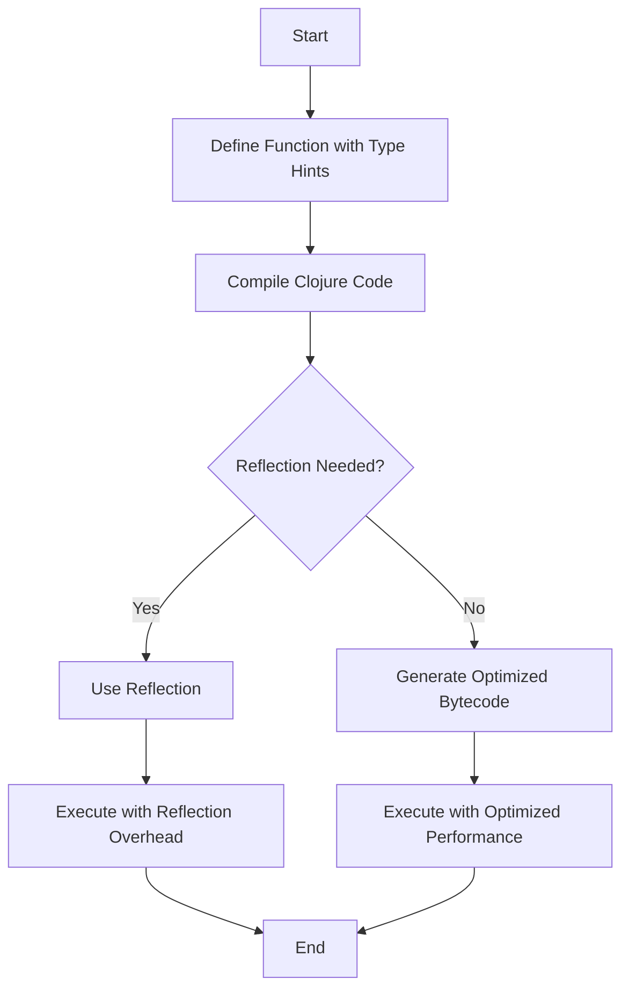

## 10.8.2 Type Hinting and Avoiding Reflection

In this section, we will explore the concept of type hinting in Clojure and its role in optimizing performance when interoperating with Java. As experienced Java developers, you are likely familiar with the importance of type information in Java for both compile-time checks and runtime performance. Clojure, being a dynamically typed language, does not require explicit type declarations. However, when interacting with Java, providing type hints can significantly improve performance by avoiding reflection.

### Understanding Reflection and Its Impact

Reflection in Java allows for dynamic inspection and invocation of classes, methods, and fields at runtime. While powerful, reflection is slower than direct method calls because it bypasses compile-time optimizations and incurs additional overhead.

In Clojure, when you call Java methods without type hints, the Clojure compiler uses reflection to determine the appropriate method to invoke. This can lead to performance bottlenecks, especially in performance-critical sections of your code.

### Type Hinting in Clojure

Type hinting in Clojure involves annotating variables, function parameters, and return types with type information. This guides the Clojure compiler to generate more efficient bytecode by avoiding reflection.

#### Syntax of Type Hints

Type hints in Clojure are specified using the `^` symbol followed by the type. For example:

```clojure
(defn square [^double x]
  (* x x))
```

In this example, `^double` is a type hint indicating that `x` is expected to be a `double`. This allows the Clojure compiler to generate optimized bytecode for arithmetic operations on `x`.

### Best Practices for Type Hinting

1. **Use Type Hints for Java Interop**: When calling Java methods, especially in loops or frequently executed code, use type hints to specify the expected Java types. This reduces the need for reflection.

2. **Annotate Function Parameters and Return Types**: Provide type hints for function parameters and return types when they interact with Java objects. This helps the compiler generate efficient method calls.

3. **Use Type Hints in Local Bindings**: When working with local variables that interact with Java, use `let` bindings with type hints to optimize performance.

4. **Avoid Overusing Type Hints**: While type hints improve performance, they can reduce code readability. Use them judiciously, focusing on performance-critical sections.

5. **Test and Profile**: Use profiling tools to identify reflection-induced bottlenecks and apply type hints where necessary.

### Examples of Type Hinting

Let's explore some examples to illustrate the use of type hints in Clojure.

#### Example 1: Type Hinting in Function Parameters

Consider a function that calculates the area of a circle using Java's `Math.PI`:

```clojure
(defn circle-area [^double radius]
  (* Math/PI (* radius radius)))
```

Here, `^double` is used to hint that `radius` is a double, allowing the compiler to optimize the multiplication operation.

#### Example 2: Type Hinting in Local Bindings

When working with local variables, type hints can be applied within `let` bindings:

```clojure
(defn calculate-distance [^double x1 ^double y1 ^double x2 ^double y2]
  (let [^double dx (- x2 x1)
        ^double dy (- y2 y1)]
    (Math/sqrt (+ (* dx dx) (* dy dy)))))
```

In this example, type hints are used for both function parameters and local variables to optimize arithmetic operations.

#### Example 3: Type Hinting for Java Method Calls

When calling Java methods, type hints can specify the expected return type:

```clojure
(defn get-current-time []
  (let [^java.util.Date now (java.util.Date.)]
    (.getTime now)))
```

Here, `^java.util.Date` hints that `now` is a `Date` object, optimizing the call to `.getTime`.

### Avoiding Reflection in Clojure

Reflection can be avoided by providing explicit type information, as demonstrated in the examples above. However, there are additional strategies to minimize reflection:

1. **Use `set!` for Field Access**: When accessing Java fields, use `set!` with type hints to avoid reflection.

2. **Leverage Java Interop Functions**: Use Clojure's built-in Java interop functions, such as `..` and `doto`, which are optimized for performance.

3. **Profile and Optimize**: Use tools like `clj-refactor` to identify and optimize reflection-heavy code.

### Comparing Clojure and Java Code

Let's compare a simple Java method with its Clojure equivalent to highlight the differences in type handling and performance optimization.

#### Java Code

```java
public double calculateArea(double radius) {
    return Math.PI * radius * radius;
}
```

#### Clojure Code with Type Hinting

```clojure
(defn calculate-area [^double radius]
  (* Math/PI (* radius radius)))
```

In both examples, the type of `radius` is explicitly specified, allowing the compiler to optimize the arithmetic operations. However, in Clojure, type hints are optional and primarily used for performance optimization.

### Diagrams and Visualizations

To better understand the flow of data and the impact of type hinting, let's visualize the process using a flowchart.



**Diagram Caption**: This flowchart illustrates the decision-making process in the Clojure compiler when determining whether to use reflection or generate optimized bytecode based on type hints.

### Try It Yourself

To reinforce your understanding of type hinting, try modifying the examples above:

- Remove type hints and observe the performance impact using a profiler.
- Add type hints to different sections of your code and measure the performance improvements.
- Experiment with different types and see how the compiler optimizes the bytecode.

### Further Reading

For more information on type hinting and performance optimization in Clojure, consider exploring the following resources:

- [Official Clojure Documentation on Java Interop](https://clojure.org/reference/java_interop)
- [ClojureDocs: Type Hinting](https://clojuredocs.org/clojure.core/type-hint)
- [Clojure Performance Guide](https://github.com/athos/clojure-performance)

### Exercises

1. **Exercise 1**: Write a Clojure function that calculates the hypotenuse of a right triangle using type hints. Compare the performance with and without type hints.

2. **Exercise 2**: Create a Clojure program that interacts with a Java library of your choice. Use type hints to optimize method calls and measure the performance impact.

3. **Exercise 3**: Analyze a Clojure project using a profiler to identify reflection-induced bottlenecks. Apply type hints to optimize the code.

### Key Takeaways

- **Type Hinting**: Use type hints in Clojure to optimize performance by avoiding reflection when interoperating with Java.
- **Performance Optimization**: Focus on performance-critical sections of your code and use profiling tools to guide optimization efforts.
- **Best Practices**: Balance the use of type hints with code readability and maintainability.

By understanding and applying type hinting in Clojure, you can significantly enhance the performance of your Java interop code, making your applications more efficient and responsive.

## Quiz: Mastering Type Hinting and Avoiding Reflection in Clojure



### What is the primary purpose of type hinting in Clojure?

- [x] To optimize performance by avoiding reflection
- [ ] To enforce type safety at compile time
- [ ] To improve code readability
- [ ] To enable dynamic typing

> **Explanation:** Type hinting in Clojure is used to optimize performance by avoiding reflection, which incurs runtime overhead.

### How do you specify a type hint for a function parameter in Clojure?

- [x] Using the `^` symbol followed by the type
- [ ] Using the `@` symbol followed by the type
- [ ] Using the `#` symbol followed by the type
- [ ] Using the `&` symbol followed by the type

> **Explanation:** In Clojure, type hints are specified using the `^` symbol followed by the type, such as `^double`.

### Which of the following is a benefit of avoiding reflection in Clojure?

- [x] Improved runtime performance
- [ ] Increased code complexity
- [ ] Enhanced type safety
- [ ] Simplified syntax

> **Explanation:** Avoiding reflection improves runtime performance by allowing the compiler to generate optimized bytecode.

### What is the impact of using type hints on code readability?

- [ ] Type hints always improve code readability
- [x] Type hints can reduce code readability if overused
- [ ] Type hints have no impact on readability
- [ ] Type hints make code unreadable

> **Explanation:** While type hints improve performance, they can reduce code readability if overused, so they should be used judiciously.

### Which tool can help identify reflection-induced bottlenecks in Clojure code?

- [x] clj-refactor
- [ ] clj-lint
- [ ] clj-format
- [ ] clj-debug

> **Explanation:** `clj-refactor` is a tool that can help identify and optimize reflection-induced bottlenecks in Clojure code.

### In which scenarios should you prioritize using type hints?

- [x] In performance-critical sections of code
- [ ] In all sections of code
- [ ] Only in test code
- [ ] Only in non-critical code

> **Explanation:** Type hints should be prioritized in performance-critical sections of code to optimize performance.

### What is the effect of type hinting on the Clojure compiler?

- [x] It allows the compiler to generate optimized bytecode
- [ ] It forces the compiler to use reflection
- [ ] It has no effect on the compiler
- [ ] It makes the compiler slower

> **Explanation:** Type hinting allows the Clojure compiler to generate optimized bytecode, avoiding the need for reflection.

### How does type hinting affect Java method calls in Clojure?

- [x] It optimizes method calls by avoiding reflection
- [ ] It makes method calls slower
- [ ] It has no effect on method calls
- [ ] It enforces type safety for method calls

> **Explanation:** Type hinting optimizes Java method calls in Clojure by avoiding reflection, leading to better performance.

### What is the syntax for type hinting a local variable in a `let` binding?

- [x] `^Type variable`
- [ ] `@Type variable`
- [ ] `#Type variable`
- [ ] `&Type variable`

> **Explanation:** The syntax for type hinting a local variable in a `let` binding is `^Type variable`.

### True or False: Type hinting is mandatory in Clojure for Java interop.

- [ ] True
- [x] False

> **Explanation:** Type hinting is not mandatory in Clojure, but it is recommended for optimizing performance in Java interop scenarios.


