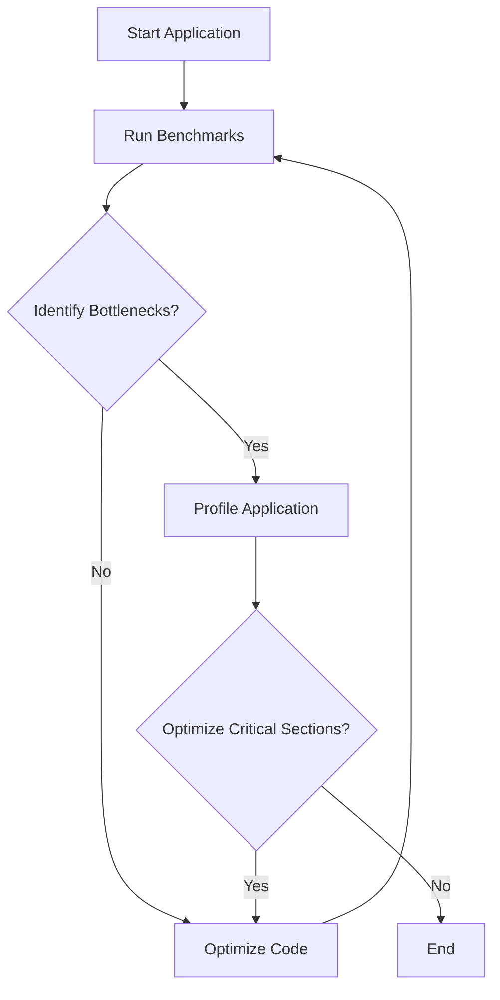

## 10.8.3 Benchmarks and Profiling

In this section, we delve into the critical aspects of benchmarking and profiling Clojure applications, especially when they interact with Java code. As experienced Java developers transitioning to Clojure, understanding how to measure and optimize performance is essential. We'll explore tools and techniques to identify bottlenecks and optimize critical sections of your applications.

### Understanding the Need for Benchmarks and Profiling

Before diving into tools and techniques, let's clarify why benchmarking and profiling are crucial:

- **Performance Measurement**: Benchmarks provide quantitative data on how your application performs under various conditions, helping you set realistic performance goals.
- **Bottleneck Identification**: Profiling helps pinpoint areas of code that consume excessive resources, allowing targeted optimizations.
- **Optimization Validation**: After making changes, benchmarks confirm whether optimizations have the desired effect.

### Key Concepts in Benchmarking and Profiling

#### Benchmarking

Benchmarking involves running a set of tests on your application to measure performance metrics such as execution time, memory usage, and throughput. In Clojure, benchmarking is often used to compare different implementations or to assess the impact of changes.

#### Profiling

Profiling provides detailed insights into how your application uses resources. It helps identify which functions or methods are consuming the most CPU time or memory, enabling you to focus optimization efforts where they will have the most impact.

### Tools for Benchmarking and Profiling Clojure Applications

#### Criterium for Benchmarking

Criterium is a popular library in the Clojure ecosystem for benchmarking. It provides accurate and statistically sound measurements of code performance.

```clojure
(require '[criterium.core :refer [quick-bench]])

(defn example-function []
  (Thread/sleep 1000) ; Simulate a time-consuming operation
  (+ 1 2 3))

(quick-bench (example-function))
```

**Explanation**: The `quick-bench` function from Criterium runs the `example-function` multiple times to provide an average execution time, accounting for JVM warm-up and garbage collection.

#### VisualVM for Profiling

VisualVM is a powerful profiling tool that comes bundled with the JDK. It provides a graphical interface to monitor CPU and memory usage, thread activity, and more.

- **CPU Profiling**: Identify which methods consume the most CPU time.
- **Memory Profiling**: Track memory allocation and identify potential leaks.
- **Thread Analysis**: Monitor thread activity to detect deadlocks or excessive context switching.

**Using VisualVM with Clojure**:
1. Start your Clojure application with the JVM option `-agentlib:jdwp=transport=dt_socket,server=y,suspend=n,address=*:5005`.
2. Open VisualVM and connect to the running JVM process.
3. Use the CPU and Memory profiling tools to gather data.

#### YourKit Java Profiler

YourKit is another excellent tool for profiling Java applications, including those written in Clojure. It offers advanced features such as:

- **CPU and Memory Profiling**: Similar to VisualVM but with more detailed analysis options.
- **Heap Dumps**: Analyze memory usage and detect leaks.
- **Thread Profiling**: Visualize thread states and transitions.

**Integrating YourKit with Clojure**:
- Download and install YourKit.
- Start your Clojure application with the YourKit agent.
- Use the YourKit GUI to connect and profile your application.

### Identifying Bottlenecks in Clojure Applications

#### Common Bottlenecks

- **Inefficient Algorithms**: Suboptimal algorithms can lead to excessive CPU usage.
- **Excessive Memory Allocation**: Frequent object creation can increase garbage collection overhead.
- **Blocking I/O Operations**: Synchronous I/O can stall application threads.

#### Profiling Techniques

- **Sampling vs. Instrumentation**: Sampling provides an overview with minimal overhead, while instrumentation offers detailed insights but can slow down execution.
- **Focus on Hotspots**: Use profiling data to identify "hotspots"—areas of code that consume the most resources.

### Optimizing Critical Sections

#### Code Optimization Strategies

- **Algorithmic Improvements**: Replace inefficient algorithms with more efficient ones.
- **Data Structure Selection**: Choose appropriate data structures for your use case.
- **Concurrency Enhancements**: Use Clojure's concurrency primitives (atoms, refs, agents) to improve parallel execution.

#### Example: Optimizing a Clojure Function

Let's optimize a function that processes a large collection of data.

```clojure
(defn process-data [data]
  (reduce + (map #(* % %) data)))

;; Optimized version using transducers
(defn optimized-process-data [data]
  (transduce (map #(* % %)) + data))
```

**Explanation**: The optimized version uses transducers to eliminate intermediate collections, reducing memory usage and improving performance.

### Comparing Clojure and Java Performance

#### Java's Strengths

- **JIT Compilation**: Java's Just-In-Time (JIT) compiler optimizes bytecode at runtime, improving performance.
- **Concurrency**: Java's concurrency model, with threads and locks, is mature and well-understood.

#### Clojure's Advantages

- **Immutability**: Clojure's immutable data structures reduce the risk of concurrency issues.
- **Functional Paradigm**: Encourages concise and expressive code, often leading to fewer bugs and easier maintenance.

### Try It Yourself: Experimenting with Benchmarks

1. **Modify the Example Function**: Change the `example-function` to perform different operations and observe how it affects benchmark results.
2. **Profile a Real Application**: Use VisualVM or YourKit to profile a Clojure application you're working on. Identify and optimize a bottleneck.
3. **Compare Implementations**: Implement a simple algorithm in both Java and Clojure. Use Criterium to benchmark and compare their performance.

### Diagrams and Visualizations

Below is a flowchart illustrating the process of benchmarking and profiling a Clojure application:



**Caption**: This flowchart outlines the iterative process of benchmarking and profiling, emphasizing the cycle of identifying bottlenecks and optimizing code.

### Further Reading and Resources

- [Clojure Official Documentation](https://clojure.org/reference/documentation)
- [Criterium GitHub Repository](https://github.com/hugoduncan/criterium)
- [VisualVM Official Site](https://visualvm.github.io/)
- [YourKit Java Profiler](https://www.yourkit.com/)

### Exercises and Practice Problems

1. **Benchmark a Clojure Function**: Use Criterium to benchmark a function that processes a large dataset. Experiment with different data sizes and observe the impact on performance.
2. **Profile a Java Interop Scenario**: Create a Clojure application that calls a Java library. Use VisualVM to profile the interaction and identify any performance issues.
3. **Optimize a Real-World Application**: Choose a Clojure application you have access to, profile it, and implement optimizations based on your findings.

### Key Takeaways

- **Benchmarking and profiling are essential** for understanding and optimizing the performance of Clojure applications, especially when interacting with Java code.
- **Tools like Criterium, VisualVM, and YourKit** provide valuable insights into application performance, helping identify bottlenecks and guide optimizations.
- **Clojure's functional paradigm and immutability** offer unique advantages in writing efficient, maintainable code.
- **Iterative optimization** is key: profile, identify bottlenecks, optimize, and repeat.

Now that we've explored benchmarking and profiling in Clojure, let's apply these techniques to enhance the performance of your applications.

## Quiz: Mastering Benchmarks and Profiling in Clojure



### What is the primary purpose of benchmarking in Clojure applications?

- [x] To measure performance metrics such as execution time and memory usage
- [ ] To identify syntax errors in the code
- [ ] To compile Clojure code into Java bytecode
- [ ] To convert Clojure code into Java code

> **Explanation:** Benchmarking is used to measure performance metrics, helping developers understand how their application performs under various conditions.

### Which tool is commonly used for benchmarking Clojure code?

- [x] Criterium
- [ ] JUnit
- [ ] Mockito
- [ ] Maven

> **Explanation:** Criterium is a popular library in the Clojure ecosystem for benchmarking code performance.

### What does profiling help identify in a Clojure application?

- [x] Areas of code that consume excessive resources
- [ ] The number of lines of code in a project
- [ ] The version of Clojure being used
- [ ] The syntax errors in the code

> **Explanation:** Profiling helps identify areas of code that consume excessive resources, allowing targeted optimizations.

### Which tool is bundled with the JDK and used for profiling Java applications?

- [x] VisualVM
- [ ] Eclipse
- [ ] IntelliJ IDEA
- [ ] NetBeans

> **Explanation:** VisualVM is a powerful profiling tool that comes bundled with the JDK, providing insights into CPU and memory usage.

### What is the advantage of using transducers in Clojure?

- [x] They eliminate intermediate collections, reducing memory usage
- [ ] They increase the size of the codebase
- [ ] They convert Clojure code into Java code
- [ ] They are used for error handling

> **Explanation:** Transducers eliminate intermediate collections, reducing memory usage and improving performance.

### What is a common bottleneck in Clojure applications?

- [x] Inefficient algorithms
- [ ] Correct syntax
- [ ] Proper indentation
- [ ] Use of comments

> **Explanation:** Inefficient algorithms can lead to excessive CPU usage, making them a common bottleneck in applications.

### How does Clojure's immutability benefit concurrency?

- [x] It reduces the risk of concurrency issues
- [ ] It increases the risk of data corruption
- [ ] It makes code harder to read
- [ ] It requires more memory

> **Explanation:** Clojure's immutability reduces the risk of concurrency issues by ensuring that data cannot be modified by multiple threads simultaneously.

### What is the role of the `quick-bench` function in Criterium?

- [x] To provide an average execution time for a function
- [ ] To compile Clojure code into Java bytecode
- [ ] To identify syntax errors in the code
- [ ] To convert Clojure code into Java code

> **Explanation:** The `quick-bench` function runs a function multiple times to provide an average execution time, accounting for JVM warm-up and garbage collection.

### Which of the following is a profiling technique?

- [x] Sampling
- [ ] Compiling
- [ ] Debugging
- [ ] Formatting

> **Explanation:** Sampling is a profiling technique that provides an overview of resource usage with minimal overhead.

### True or False: VisualVM can be used to monitor thread activity in a Clojure application.

- [x] True
- [ ] False

> **Explanation:** VisualVM can monitor thread activity, helping detect deadlocks or excessive context switching in applications.


