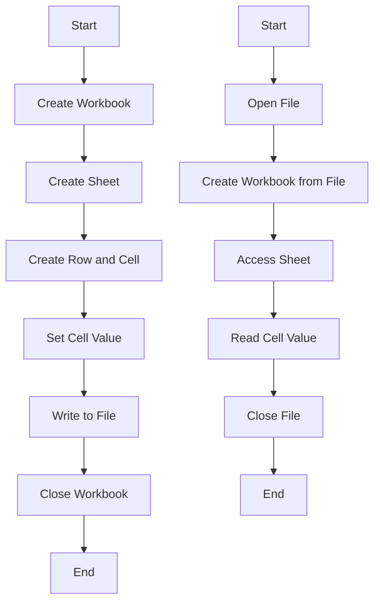

## 10.9.2 Using Java Libraries in a Clojure Project

In this section, we will explore how to leverage Java libraries within a Clojure project, focusing on the integration of Apache POI, a powerful library for manipulating Microsoft Excel files. This example will demonstrate Clojure's interoperability features, enabling you to harness the capabilities of Java's extensive ecosystem while enjoying the benefits of functional programming.

### Introduction to Java Interoperability in Clojure

Clojure is a dynamic, functional programming language that runs on the Java Virtual Machine (JVM). One of its most compelling features is its seamless interoperability with Java. This allows Clojure developers to utilize the vast array of existing Java libraries, frameworks, and tools, thereby extending the functionality of their applications without reinventing the wheel.

**Key Interoperability Features:**

- **Calling Java Methods:** Clojure can directly call Java methods using a concise syntax.
- **Creating Java Objects:** Instantiate Java objects and use them within Clojure code.
- **Handling Java Exceptions:** Catch and handle exceptions thrown by Java code.
- **Type Hinting:** Improve performance by providing type hints to avoid reflection.

### Why Use Java Libraries in Clojure?

Java's ecosystem is mature and extensive, offering libraries for almost any task imaginable, from data processing and web development to machine learning and beyond. By integrating these libraries into Clojure projects, developers can:

- **Leverage Existing Solutions:** Use well-tested, robust libraries to solve complex problems.
- **Enhance Productivity:** Focus on building unique features rather than implementing common functionalities from scratch.
- **Bridge Language Features:** Combine the strengths of Java's object-oriented paradigm with Clojure's functional approach.

### Case Study: Using Apache POI in a Clojure Project

Apache POI is a popular Java library for reading and writing Microsoft Office documents, including Excel spreadsheets. In this case study, we'll demonstrate how to use Apache POI to create and manipulate Excel files within a Clojure application.

#### Setting Up the Project

First, let's set up a new Clojure project using Leiningen, a build automation tool for Clojure.

1. **Create a New Project:**

   ```bash
   lein new poi-example
   ```

2. **Add Apache POI Dependency:**

   Open the `project.clj` file and add Apache POI as a dependency:

   ```clojure
   (defproject poi-example "0.1.0-SNAPSHOT"
     :dependencies [[org.clojure/clojure "1.10.3"]
                    [org.apache.poi/poi "5.2.3"]
                    [org.apache.poi/poi-ooxml "5.2.3"]])
   ```

3. **Run the REPL:**

   Start the REPL to interactively develop and test your code:

   ```bash
   lein repl
   ```

#### Creating and Writing to an Excel File

Let's write a simple function to create an Excel file with Apache POI.

```clojure
(ns poi-example.core
  (:import (org.apache.poi.xssf.usermodel XSSFWorkbook)
           (org.apache.poi.ss.usermodel CellType)))

(defn create-excel-file [filename]
  ;; Create a new workbook
  (let [workbook (XSSFWorkbook.)
        sheet (.createSheet workbook "Sheet1")]
    ;; Create a row and a cell
    (let [row (.createRow sheet 0)
          cell (.createCell row 0 CellType/STRING)]
      ;; Set the cell value
      (.setCellValue cell "Hello, Clojure!"))
    ;; Write the workbook to a file
    (with-open [file-out (java.io.FileOutputStream. filename)]
      (.write workbook file-out))
    ;; Close the workbook
    (.close workbook)))

;; Usage
(create-excel-file "example.xlsx")
```

**Explanation:**

- We import the necessary classes from Apache POI using `:import`.
- We create a new workbook and a sheet named "Sheet1".
- We create a row and a cell, setting the cell's value to "Hello, Clojure!".
- Finally, we write the workbook to a file and close it.

#### Reading from an Excel File

Next, let's read data from an existing Excel file.

```clojure
(ns poi-example.core
  (:import (org.apache.poi.xssf.usermodel XSSFWorkbook)
           (java.io FileInputStream)))

(defn read-excel-file [filename]
  ;; Open the Excel file
  (with-open [file-in (FileInputStream. filename)]
    ;; Create a workbook from the file
    (let [workbook (XSSFWorkbook. file-in)
          sheet (.getSheetAt workbook 0)
          row (.getRow sheet 0)
          cell (.getCell row 0)]
      ;; Return the cell value
      (.getStringCellValue cell))))

;; Usage
(println (read-excel-file "example.xlsx"))
```

**Explanation:**

- We open the Excel file using `FileInputStream`.
- We create a workbook from the input stream and access the first sheet.
- We retrieve the first row and cell, returning the cell's string value.

#### Handling Java Exceptions

When working with Java libraries, it's essential to handle exceptions that may arise. Clojure provides a `try-catch` mechanism similar to Java.

```clojure
(defn safe-read-excel-file [filename]
  (try
    (read-excel-file filename)
    (catch Exception e
      (println "An error occurred:" (.getMessage e)))))
```

**Explanation:**

- We wrap the `read-excel-file` function call in a `try` block.
- If an exception occurs, we catch it and print an error message.

#### Type Hinting for Performance

To avoid reflection and improve performance, we can add type hints to our Clojure code.

```clojure
(defn ^XSSFWorkbook create-workbook []
  (XSSFWorkbook.))
```

**Explanation:**

- We use `^XSSFWorkbook` to hint the return type of the `create-workbook` function, reducing reflection overhead.

### Comparing with Java Code

Let's compare the Clojure code with equivalent Java code to highlight the differences and similarities.

**Java Code for Creating an Excel File:**

```java
import org.apache.poi.xssf.usermodel.XSSFWorkbook;
import org.apache.poi.ss.usermodel.*;

import java.io.FileOutputStream;
import java.io.IOException;

public class ExcelExample {
    public static void main(String[] args) {
        try (XSSFWorkbook workbook = new XSSFWorkbook()) {
            Sheet sheet = workbook.createSheet("Sheet1");
            Row row = sheet.createRow(0);
            Cell cell = row.createCell(0);
            cell.setCellValue("Hello, Java!");

            try (FileOutputStream fileOut = new FileOutputStream("example.xlsx")) {
                workbook.write(fileOut);
            }
        } catch (IOException e) {
            e.printStackTrace();
        }
    }
}
```

**Comparison:**

- **Syntax:** Clojure's syntax is more concise, focusing on expressions rather than statements.
- **Error Handling:** Both languages use `try-catch` for exception handling, but Clojure's approach is more functional.
- **Type System:** Java requires explicit type declarations, while Clojure uses dynamic typing with optional type hints.

### Try It Yourself

Experiment with the following modifications to deepen your understanding:

- **Add More Sheets:** Modify the code to create multiple sheets within the same workbook.
- **Read and Write Different Data Types:** Explore how to handle numeric and date values in Excel cells.
- **Error Handling:** Implement more robust error handling for file I/O operations.

### Diagram: Data Flow in Excel Manipulation

Below is a diagram illustrating the flow of data when creating and reading an Excel file using Apache POI in Clojure.



**Diagram Description:** This flowchart represents the steps involved in creating and reading an Excel file using Apache POI in Clojure. The left path shows the creation process, while the right path illustrates reading from a file.

### Further Reading

- [Official Clojure Documentation](https://clojure.org/reference/java_interop)
- [Apache POI Documentation](https://poi.apache.org/components/spreadsheet/)
- [ClojureDocs: Java Interop](https://clojuredocs.org/quickref#Java%20Interop)

### Exercises

1. **Create a Function to Add Data:** Write a function that adds multiple rows of data to an Excel sheet.
2. **Implement a Data Export Feature:** Use Apache POI to export data from a Clojure data structure (e.g., a map or vector) to an Excel file.
3. **Error Handling Challenge:** Enhance the error handling in the provided examples to cover more edge cases.

### Key Takeaways

- Clojure's interoperability with Java allows you to leverage Java libraries seamlessly, enhancing your application's capabilities.
- Apache POI is a powerful library for Excel manipulation, and integrating it into Clojure projects is straightforward.
- Understanding Java interop features in Clojure can significantly boost your productivity and enable you to build more robust applications.

Now that we've explored how to integrate Java libraries into Clojure projects, you're equipped to enhance your applications with the rich functionality offered by Java's ecosystem. Keep experimenting and applying these concepts to your projects!

## Quiz: Mastering Java Interoperability in Clojure



### What is one of the main benefits of using Java libraries in Clojure?

- [x] Leveraging existing, well-tested solutions
- [ ] Avoiding the need for type hinting
- [ ] Eliminating the need for error handling
- [ ] Simplifying the Clojure syntax

> **Explanation:** Using Java libraries allows Clojure developers to leverage existing, well-tested solutions, enhancing productivity and functionality.

### How does Clojure handle Java exceptions?

- [x] Using a try-catch mechanism
- [ ] Automatically ignoring them
- [ ] Logging them without handling
- [ ] Converting them to Clojure exceptions

> **Explanation:** Clojure uses a try-catch mechanism similar to Java for handling exceptions.

### What is the purpose of type hinting in Clojure?

- [x] To improve performance by avoiding reflection
- [ ] To enforce strict typing
- [ ] To simplify syntax
- [ ] To handle exceptions

> **Explanation:** Type hinting in Clojure improves performance by avoiding reflection, which is a common overhead in dynamic languages.

### Which library is used in the example for Excel manipulation?

- [x] Apache POI
- [ ] JExcelAPI
- [ ] Excel4J
- [ ] ExcelUtils

> **Explanation:** Apache POI is the library used in the example for Excel manipulation.

### What is the main advantage of Clojure's syntax compared to Java's?

- [x] Conciseness and focus on expressions
- [ ] Strong typing
- [ ] Built-in error handling
- [ ] Object-oriented design

> **Explanation:** Clojure's syntax is more concise and focuses on expressions, which is a key advantage over Java's syntax.

### In the provided example, what does the `create-excel-file` function do?

- [x] Creates an Excel file and writes a value to it
- [ ] Reads data from an Excel file
- [ ] Deletes an Excel file
- [ ] Updates an existing Excel file

> **Explanation:** The `create-excel-file` function creates an Excel file and writes a value to it.

### How can you improve performance when using Java libraries in Clojure?

- [x] By using type hints
- [ ] By avoiding Java libraries
- [ ] By using more Clojure-specific libraries
- [ ] By increasing the JVM heap size

> **Explanation:** Using type hints can improve performance by reducing reflection overhead.

### What is a key feature of Clojure's interoperability with Java?

- [x] Directly calling Java methods
- [ ] Automatic conversion of Java code to Clojure
- [ ] Eliminating the need for Java libraries
- [ ] Simplifying Java syntax

> **Explanation:** A key feature of Clojure's interoperability is the ability to directly call Java methods.

### What does the `read-excel-file` function return in the example?

- [x] The value of a cell in the Excel file
- [ ] The entire Excel file as a string
- [ ] The number of sheets in the Excel file
- [ ] The file size of the Excel file

> **Explanation:** The `read-excel-file` function returns the value of a cell in the Excel file.

### True or False: Clojure can only use Java libraries that are specifically designed for it.

- [ ] True
- [x] False

> **Explanation:** False. Clojure can use any Java library, not just those specifically designed for it, thanks to its seamless interoperability with Java.


