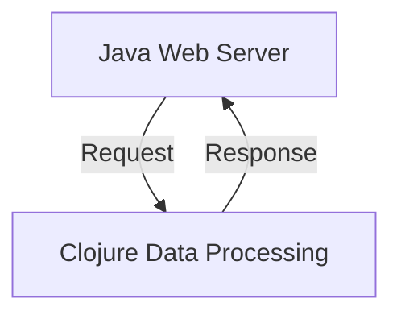

## 10.9.3 Building Hybrid Systems

In today's software development landscape, leveraging multiple programming languages within a single system can offer significant advantages. By combining the strengths of Java and Clojure, developers can create hybrid systems that are both robust and flexible. This section explores the scenarios where such an approach is beneficial, the considerations involved, and how to effectively integrate Java and Clojure components.

### Why Build Hybrid Systems?

Hybrid systems allow developers to utilize the best features of both Java and Clojure. Java's extensive ecosystem, mature libraries, and performance optimizations make it ideal for certain tasks, while Clojure's functional programming paradigm, immutability, and concurrency support offer unique advantages for others. By integrating these languages, developers can:

- **Leverage Existing Java Codebases**: Many organizations have substantial investments in Java code. Integrating Clojure allows them to enhance functionality without rewriting existing systems.
- **Enhance Productivity**: Clojure's concise syntax and powerful abstractions can lead to faster development cycles, especially for complex logic and data transformations.
- **Improve Concurrency**: Clojure's immutable data structures and concurrency primitives simplify the development of concurrent applications, reducing the risk of race conditions and deadlocks.
- **Facilitate Experimentation**: Clojure's REPL (Read-Eval-Print Loop) supports rapid prototyping and experimentation, making it easier to test new ideas and algorithms.

### Key Considerations for Hybrid Systems

When building hybrid systems, several factors must be considered to ensure seamless integration and optimal performance:

- **Interoperability**: Understanding how to call Java methods from Clojure and vice versa is crucial. This includes handling data type conversions and managing exceptions across language boundaries.
- **Performance**: While Clojure offers many advantages, certain operations may be more performant in Java. Profiling and benchmarking are essential to identify bottlenecks and optimize critical paths.
- **Tooling and Build Systems**: Managing dependencies and build processes for both languages can be complex. Tools like Leiningen and Maven can help streamline this process.
- **Testing and Debugging**: Ensuring that both Java and Clojure components are thoroughly tested and can be debugged effectively is vital for maintaining system reliability.

### Integrating Java and Clojure

Let's explore how to integrate Java and Clojure components within a hybrid system. We'll cover calling Java methods from Clojure, creating Java objects in Clojure, and handling exceptions.

#### Calling Java Methods from Clojure

Clojure provides straightforward syntax for calling Java methods, accessing fields, and creating objects. Here's a simple example:

```clojure
(ns hybrid-system.core)

;; Importing a Java class
(import 'java.util.Date)

(defn get-current-time []
  ;; Creating a new Java Date object
  (let [now (Date.)]
    ;; Calling a method on the Java object
    (.toString now)))

(println "Current time:" (get-current-time))
```

**Explanation**: In this example, we import the `java.util.Date` class and create a new instance of it. We then call the `toString` method to get the current date and time as a string.

#### Creating Java Objects in Clojure

Clojure can also create and manipulate Java objects. This is useful when you need to use Java libraries or frameworks within a Clojure application.

```clojure
(ns hybrid-system.core)

;; Importing a Java class
(import 'java.util.ArrayList)

(defn create-java-list [elements]
  ;; Creating a new Java ArrayList
  (let [list (ArrayList.)]
    ;; Adding elements to the list
    (doseq [e elements]
      (.add list e))
    list))

(def my-list (create-java-list ["Clojure" "Java" "Hybrid"]))
(println "Java ArrayList:" my-list)
```

**Explanation**: Here, we import `java.util.ArrayList` and create a new list. We then add elements to the list using the `.add` method. This demonstrates how Clojure can interact with Java collections.

#### Handling Java Exceptions

When calling Java code from Clojure, it's important to handle exceptions appropriately. Clojure provides a `try-catch` mechanism similar to Java's.

```clojure
(ns hybrid-system.core)

(defn divide [a b]
  (try
    ;; Attempt to divide two numbers
    (/ a b)
    (catch ArithmeticException e
      ;; Handle division by zero
      (println "Error: Division by zero"))))

(println "Result:" (divide 10 0))
```

**Explanation**: In this example, we attempt to divide two numbers. If a division by zero occurs, we catch the `ArithmeticException` and print an error message.

### Building a Hybrid Application

Let's consider a practical example of building a hybrid application that uses both Java and Clojure components. We'll create a simple web service that processes data using Clojure and serves it using a Java-based web server.

#### Setting Up the Project

First, we'll set up a project structure that includes both Java and Clojure code. We'll use Leiningen for Clojure dependencies and Maven for Java dependencies.

```shell
lein new app hybrid-system
cd hybrid-system
```

**Project Structure**:
```
hybrid-system/
├── src/
│   ├── clojure/
│   │   └── hybrid_system/
│   │       └── core.clj
│   └── java/
│       └── hybrid_system/
│           └── WebServer.java
├── project.clj
└── pom.xml
```

#### Implementing the Clojure Component

In `src/clojure/hybrid_system/core.clj`, we'll implement a simple data processing function.

```clojure
(ns hybrid-system.core)

(defn process-data [data]
  ;; Process data and return result
  (map clojure.string/upper-case data))
```

**Explanation**: This function takes a collection of strings and converts each string to uppercase.

#### Implementing the Java Component

In `src/java/hybrid_system/WebServer.java`, we'll implement a basic web server using Java.

```java
package hybrid_system;

import java.io.IOException;
import java.net.InetSocketAddress;
import com.sun.net.httpserver.HttpServer;
import com.sun.net.httpserver.HttpHandler;
import com.sun.net.httpserver.HttpExchange;

public class WebServer {
    public static void main(String[] args) throws IOException {
        HttpServer server = HttpServer.create(new InetSocketAddress(8000), 0);
        server.createContext("/process", new ProcessHandler());
        server.setExecutor(null);
        server.start();
        System.out.println("Server started on port 8000");
    }

    static class ProcessHandler implements HttpHandler {
        @Override
        public void handle(HttpExchange exchange) throws IOException {
            String response = "Data processed";
            exchange.sendResponseHeaders(200, response.length());
            exchange.getResponseBody().write(response.getBytes());
            exchange.close();
        }
    }
}
```

**Explanation**: This Java code sets up a simple HTTP server that listens on port 8000 and responds to requests at the `/process` endpoint.

#### Integrating Java and Clojure

To integrate the Java and Clojure components, we'll modify the Java handler to call the Clojure function.

```java
import clojure.java.api.Clojure;
import clojure.lang.IFn;

// Inside the ProcessHandler class
@Override
public void handle(HttpExchange exchange) throws IOException {
    IFn require = Clojure.var("clojure.core", "require");
    require.invoke(Clojure.read("hybrid-system.core"));

    IFn processData = Clojure.var("hybrid-system.core", "process-data");
    Object result = processData.invoke(java.util.Arrays.asList("hello", "world"));

    String response = "Processed Data: " + result.toString();
    exchange.sendResponseHeaders(200, response.length());
    exchange.getResponseBody().write(response.getBytes());
    exchange.close();
}
```

**Explanation**: We use Clojure's Java API to load the Clojure namespace and invoke the `process-data` function. The result is then included in the HTTP response.

### Try It Yourself

Experiment with the hybrid system by modifying the Clojure data processing function to perform different transformations, such as reversing strings or filtering based on certain criteria. Observe how these changes affect the output of the Java web server.

### Diagram: Data Flow in a Hybrid System



**Diagram Explanation**: This flowchart illustrates the interaction between the Java web server and the Clojure data processing component. The server receives requests, processes data using Clojure, and sends responses back to the client.

### Exercises

1. **Extend the Web Server**: Add additional endpoints to the Java web server that perform different data processing tasks using Clojure functions.
2. **Error Handling**: Implement error handling in the Clojure functions and ensure that exceptions are properly communicated to the Java server.
3. **Performance Profiling**: Profile the hybrid system to identify any performance bottlenecks and optimize the integration points.

### Key Takeaways

- Hybrid systems leverage the strengths of both Java and Clojure, offering flexibility and performance benefits.
- Understanding interoperability, performance considerations, and tooling is crucial for successful integration.
- Experimentation and profiling are essential to optimize hybrid systems and ensure they meet performance requirements.

By combining Java's robustness with Clojure's expressiveness, developers can build powerful hybrid systems that are both efficient and maintainable. Now that we've explored how to build hybrid systems, let's apply these concepts to create robust applications that leverage the best of both worlds.

## Quiz: Mastering Hybrid Systems with Java and Clojure



### What is a primary benefit of building hybrid systems with Java and Clojure?

- [x] Leveraging the strengths of both languages
- [ ] Reducing the need for testing
- [ ] Avoiding the use of Java libraries
- [ ] Simplifying the build process

> **Explanation:** Hybrid systems allow developers to utilize the best features of both Java and Clojure, enhancing functionality and performance.

### How can Clojure call Java methods?

- [x] Using the dot operator (.)
- [ ] Through a special Clojure library
- [ ] By converting Java code to Clojure
- [ ] Using a Java-to-Clojure compiler

> **Explanation:** Clojure uses the dot operator to call Java methods, access fields, and create objects.

### What is a key consideration when integrating Java and Clojure?

- [x] Interoperability and data type conversion
- [ ] Avoiding the use of Java exceptions
- [ ] Using only Clojure data structures
- [ ] Ensuring all code is written in Clojure

> **Explanation:** Interoperability, including data type conversion and exception handling, is crucial for seamless integration.

### Which tool can help manage dependencies for both Java and Clojure?

- [x] Leiningen
- [ ] Gradle
- [ ] Ant
- [ ] Eclipse

> **Explanation:** Leiningen is a build automation tool for Clojure that can manage dependencies and build processes.

### What is the role of the `IFn` interface in Clojure's Java API?

- [x] It allows invoking Clojure functions from Java
- [ ] It converts Java objects to Clojure
- [ ] It handles Java exceptions
- [ ] It optimizes Java performance

> **Explanation:** The `IFn` interface is used to invoke Clojure functions from Java code.

### How can you handle Java exceptions in Clojure?

- [x] Using the `try-catch` mechanism
- [ ] By converting them to Clojure exceptions
- [ ] By ignoring them
- [ ] Using a special Clojure library

> **Explanation:** Clojure provides a `try-catch` mechanism similar to Java's for handling exceptions.

### What is a common use case for hybrid systems?

- [x] Enhancing existing Java applications with Clojure
- [ ] Replacing all Java code with Clojure
- [ ] Avoiding the use of Java libraries
- [ ] Simplifying the build process

> **Explanation:** Hybrid systems are often used to enhance existing Java applications with Clojure's features.

### What is an advantage of using Clojure's REPL?

- [x] Rapid prototyping and experimentation
- [ ] Avoiding the need for testing
- [ ] Simplifying Java code
- [ ] Eliminating the need for a build system

> **Explanation:** Clojure's REPL supports rapid prototyping and experimentation, making it easier to test new ideas.

### How can performance be optimized in hybrid systems?

- [x] Profiling and benchmarking
- [ ] Avoiding the use of Java
- [ ] Using only Clojure data structures
- [ ] Ensuring all code is written in Java

> **Explanation:** Profiling and benchmarking are essential to identify bottlenecks and optimize performance in hybrid systems.

### True or False: Hybrid systems can only be built using Java and Clojure.

- [ ] True
- [x] False

> **Explanation:** Hybrid systems can be built using various combinations of languages, not just Java and Clojure.


