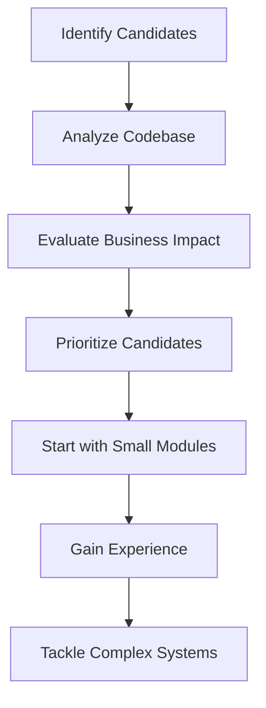

## 11.1.2 Prioritizing Migration Candidates

Migrating a Java codebase to Clojure is a strategic decision that can yield significant benefits in terms of maintainability, performance, and scalability. However, the process requires careful planning and prioritization to ensure a smooth transition. In this section, we will explore strategies for identifying and prioritizing components of your Java application for migration to Clojure. We'll focus on areas that are heavily maintained, present performance bottlenecks, or face scalability challenges. We'll also discuss how to assess the risks and rewards associated with migrating different parts of the application and encourage starting with small, non-critical modules to build confidence and experience before tackling larger, more complex systems.

### Understanding the Migration Landscape

Before diving into the prioritization process, it's essential to understand the landscape of your current Java application. This involves:

1. **Analyzing the Codebase**: Conduct a thorough analysis of your Java codebase to identify areas that are candidates for migration. Look for modules that are frequently updated, have complex logic, or are critical to the application's performance.

2. **Identifying Pain Points**: Determine the pain points in your current system. These could be areas where the code is difficult to maintain, where performance is lacking, or where scalability is a concern.

3. **Evaluating Business Impact**: Consider the business impact of migrating different components. Prioritize areas that will provide the most significant business benefits, such as improved performance or reduced maintenance costs.

### Strategies for Prioritizing Migration Candidates

#### 1. Focus on Heavily Maintained Areas

Modules that require frequent updates and maintenance are prime candidates for migration. Clojure's functional programming paradigm and immutable data structures can simplify code maintenance and reduce the likelihood of bugs.

**Java Example:**

```java
// Java code with mutable state
public class OrderProcessor {
    private List<Order> orders = new ArrayList<>();

    public void addOrder(Order order) {
        orders.add(order);
    }

    public void processOrders() {
        for (Order order : orders) {
            // Process each order
        }
    }
}
```

**Clojure Equivalent:**

```clojure
;; Clojure code with immutable data structures
(defn add-order [orders order]
  (conj orders order))

(defn process-orders [orders]
  (doseq [order orders]
    ;; Process each order
    ))
```

*In Clojure, the use of immutable data structures ensures that the `orders` list is not modified in place, reducing potential side effects and making the code easier to maintain.*

#### 2. Address Performance Bottlenecks

Identify areas of your application that suffer from performance issues. Clojure's lazy sequences and efficient data structures can help optimize performance.

**Java Example:**

```java
// Java code with performance bottleneck
public List<Integer> filterEvenNumbers(List<Integer> numbers) {
    List<Integer> evenNumbers = new ArrayList<>();
    for (Integer number : numbers) {
        if (number % 2 == 0) {
            evenNumbers.add(number);
        }
    }
    return evenNumbers;
}
```

**Clojure Equivalent:**

```clojure
;; Clojure code with lazy sequences
(defn filter-even-numbers [numbers]
  (filter even? numbers))
```

*The use of `filter` in Clojure leverages lazy evaluation, which can improve performance by avoiding unnecessary computations.*

#### 3. Enhance Scalability

Modules that need to scale with increased load are excellent candidates for migration. Clojure's concurrency primitives, such as atoms and agents, provide robust solutions for managing state in a concurrent environment.

**Java Example:**

```java
// Java code with synchronized block
public class Counter {
    private int count = 0;

    public synchronized void increment() {
        count++;
    }

    public synchronized int getCount() {
        return count;
    }
}
```

**Clojure Equivalent:**

```clojure
;; Clojure code with atoms
(def counter (atom 0))

(defn increment []
  (swap! counter inc))

(defn get-count []
  @counter)
```

*Using an atom in Clojure allows for safe concurrent updates without the need for explicit synchronization, enhancing scalability.*

### Assessing Risks and Rewards

When prioritizing migration candidates, it's crucial to assess the risks and rewards associated with each component. Consider the following factors:

- **Complexity**: Evaluate the complexity of the code to be migrated. Complex modules may require more effort but can also yield significant benefits if migrated successfully.

- **Dependencies**: Identify dependencies between modules. Migrating a module with many dependencies may require additional effort to ensure compatibility.

- **Testing and Validation**: Consider the availability of tests for the module. Well-tested modules are easier to migrate and validate post-migration.

- **Business Impact**: Assess the potential business impact of migrating the module. Prioritize modules that will provide the most significant business benefits.

### Starting Small: Building Confidence and Experience

Begin the migration process with small, non-critical modules. This approach allows your team to gain experience with Clojure and build confidence before tackling larger, more complex systems.

**Try It Yourself:**

Experiment with migrating a small utility class from Java to Clojure. Focus on using immutable data structures and functional programming principles. Compare the Java and Clojure implementations to identify areas of improvement.

### Visualizing the Migration Process

To help visualize the migration process, consider the following flowchart:



*This flowchart outlines the steps involved in prioritizing migration candidates, from identifying potential modules to gaining experience and tackling complex systems.*

### Exercises and Practice Problems

1. **Exercise 1**: Identify a module in your Java application that is frequently updated. Analyze its complexity and dependencies. Create a plan for migrating it to Clojure.

2. **Exercise 2**: Select a performance bottleneck in your Java application. Implement a Clojure solution using lazy sequences or concurrency primitives. Compare the performance of the Java and Clojure implementations.

3. **Exercise 3**: Choose a small, non-critical module in your Java application. Migrate it to Clojure, focusing on using immutable data structures and functional programming principles. Validate the migration by running existing tests.

### Key Takeaways

- **Prioritize Heavily Maintained Areas**: Focus on modules that require frequent updates and maintenance to leverage Clojure's benefits in maintainability.

- **Address Performance Bottlenecks**: Use Clojure's lazy sequences and efficient data structures to optimize performance.

- **Enhance Scalability**: Leverage Clojure's concurrency primitives to improve scalability and manage state in a concurrent environment.

- **Assess Risks and Rewards**: Evaluate the complexity, dependencies, testing, and business impact of each module to prioritize migration candidates effectively.

- **Start Small**: Begin with small, non-critical modules to build confidence and experience before tackling larger, more complex systems.

By following these strategies, you can effectively prioritize migration candidates and ensure a successful transition from Java to Clojure. Now that we've explored how to prioritize migration candidates, let's apply these concepts to your application and start reaping the benefits of Clojure's functional programming paradigm.

## Quiz: Prioritizing Java Code for Migration to Clojure



### Which of the following is a key factor in prioritizing migration candidates?

- [x] Frequency of maintenance
- [ ] Number of lines of code
- [ ] Age of the code
- [ ] Number of developers

> **Explanation:** Modules that require frequent maintenance are prime candidates for migration to improve maintainability.

### What is a benefit of starting with small, non-critical modules for migration?

- [x] Builds confidence and experience
- [ ] Reduces the total migration time
- [ ] Increases the complexity of the migration
- [ ] Ensures immediate business impact

> **Explanation:** Starting with small modules allows the team to gain experience and confidence before tackling larger systems.

### How can Clojure's lazy sequences help with performance bottlenecks?

- [x] By avoiding unnecessary computations
- [ ] By increasing memory usage
- [ ] By reducing code readability
- [ ] By complicating the code structure

> **Explanation:** Lazy sequences in Clojure can improve performance by deferring computations until they are needed.

### What is a risk associated with migrating complex modules?

- [x] Increased effort and potential for errors
- [ ] Reduced business impact
- [ ] Decreased code complexity
- [ ] Simplified testing

> **Explanation:** Complex modules may require more effort to migrate and have a higher potential for errors.

### Which Clojure feature is beneficial for enhancing scalability?

- [x] Concurrency primitives
- [ ] Mutable state
- [ ] Synchronized blocks
- [ ] Inheritance

> **Explanation:** Clojure's concurrency primitives, such as atoms and agents, provide robust solutions for managing state in a concurrent environment.

### Why is it important to assess the business impact of migrating a module?

- [x] To prioritize modules that provide significant business benefits
- [ ] To ensure all modules are migrated equally
- [ ] To reduce the migration time
- [ ] To increase the complexity of the migration

> **Explanation:** Assessing the business impact helps prioritize modules that will provide the most significant business benefits.

### What is a potential reward of migrating a performance bottleneck to Clojure?

- [x] Improved application performance
- [ ] Increased code complexity
- [ ] Reduced maintainability
- [ ] Decreased scalability

> **Explanation:** Migrating performance bottlenecks to Clojure can lead to improved application performance.

### How can Clojure's immutable data structures benefit code maintenance?

- [x] By reducing side effects and making the code easier to maintain
- [ ] By increasing the complexity of the code
- [ ] By requiring more memory
- [ ] By complicating the code structure

> **Explanation:** Immutable data structures reduce side effects, making the code easier to maintain.

### What should be considered when evaluating the complexity of a module for migration?

- [x] The effort required and potential for errors
- [ ] The number of developers involved
- [ ] The age of the code
- [ ] The number of lines of code

> **Explanation:** Evaluating complexity involves considering the effort required and the potential for errors during migration.

### True or False: Migrating all modules at once is the best approach.

- [ ] True
- [x] False

> **Explanation:** Starting with small, non-critical modules is recommended to build confidence and experience before tackling larger systems.


