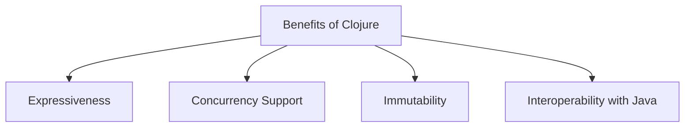

## 11.1.3 Understanding Organizational Constraints

Transitioning from Java to Clojure is not just a technical decision; it involves navigating a complex web of organizational constraints. These constraints can significantly impact the success of your migration project. In this section, we will explore the various organizational factors that influence migration decisions, such as team expertise, project timelines, and stakeholder expectations. We will also discuss the importance of securing buy-in from management and communicating the benefits of migration to key stakeholders. Additionally, we will highlight potential challenges, such as training needs and integration with existing systems.

### The Role of Team Expertise

One of the most critical factors in any migration project is the expertise of the team involved. When transitioning from Java to Clojure, it's essential to assess the current skill set of your team. Java developers are typically well-versed in object-oriented programming, but Clojure's functional programming paradigm can be a significant shift.

#### Assessing Current Skills

Begin by evaluating the current skills of your team members. Identify those who have experience with functional programming or have shown an aptitude for learning new paradigms. This assessment will help you determine the training needs and identify potential leaders who can champion the migration effort.

#### Training and Skill Development

Training is a crucial component of a successful migration. Consider investing in workshops, online courses, or hiring external consultants to provide hands-on training. Encourage your team to explore resources such as the [Official Clojure Documentation](https://clojure.org/) and [ClojureDocs](https://clojuredocs.org/) for self-study.

**Example Code Comparison:**

Let's compare a simple Java and Clojure example to illustrate the paradigm shift:

**Java Example:**

```java
// Java: Imperative style
public class Sum {
    public static int sum(int[] numbers) {
        int total = 0;
        for (int number : numbers) {
            total += number;
        }
        return total;
    }
}
```

**Clojure Example:**

```clojure
;; Clojure: Functional style
(defn sum [numbers]
  (reduce + numbers))
```

*Comment:* The Clojure example uses the `reduce` function, which is a higher-order function that abstracts the iteration process, showcasing the functional approach.

### Project Timelines and Deadlines

Project timelines are another critical constraint. Migrating from Java to Clojure can be time-consuming, especially if your team is new to functional programming. It's essential to set realistic timelines and milestones to ensure the migration stays on track.

#### Planning and Milestones

Develop a detailed project plan that outlines each phase of the migration. Include milestones for training, initial code conversion, testing, and deployment. Regularly review progress against these milestones to identify any potential delays early.

#### Balancing Speed and Quality

While it's important to meet deadlines, rushing the migration can lead to poor code quality and increased technical debt. Strive to balance speed with quality by adopting best practices in functional programming and Clojure development.

### Stakeholder Expectations

Stakeholders play a crucial role in the success of a migration project. It's essential to manage their expectations and communicate the benefits of migrating to Clojure effectively.

#### Communicating Benefits

Highlight the advantages of Clojure, such as its simplicity, expressiveness, and support for concurrency. Use concrete examples and case studies to demonstrate how Clojure can improve productivity and maintainability.

**Diagram: Benefits of Clojure**



*Caption:* This diagram illustrates the key benefits of adopting Clojure, which can be communicated to stakeholders to gain their support.

#### Securing Management Buy-In

Securing buy-in from management is crucial for the success of the migration. Present a compelling business case that outlines the long-term benefits of Clojure, such as reduced maintenance costs and improved scalability. Be prepared to address any concerns or objections they may have.

### Integration with Existing Systems

Integrating Clojure with existing Java systems can be challenging, but it's often necessary to ensure a smooth transition.

#### Interoperability with Java

Clojure's seamless interoperability with Java is one of its strengths. You can call Java methods from Clojure and vice versa, allowing for gradual migration.

**Example Code: Calling Java from Clojure**

```clojure
;; Clojure: Calling a Java method
(import 'java.util.Date)

(defn current-time []
  (.toString (Date.)))
```

*Comment:* This example demonstrates how to import and use Java classes in Clojure, facilitating integration with existing Java systems.

#### Managing Dependencies

Ensure that your Clojure code can coexist with Java dependencies. Use tools like Leiningen or tools.deps to manage dependencies effectively.

### Training Needs and Knowledge Transfer

Training is not a one-time event; it's an ongoing process. Encourage continuous learning and knowledge sharing within your team.

#### Establishing a Learning Culture

Create a culture of learning by encouraging team members to share their experiences and insights. Organize regular knowledge-sharing sessions or "lunch and learn" events to foster collaboration.

#### Mentorship and Pair Programming

Pair programming and mentorship can accelerate the learning process. Pair experienced Clojure developers with those new to the language to facilitate knowledge transfer.

### Potential Challenges and Solutions

Every migration project faces challenges. Anticipating these challenges and developing strategies to address them is crucial.

#### Resistance to Change

Resistance to change is a common challenge in any migration project. Address this by involving team members in the decision-making process and highlighting the benefits of Clojure.

#### Technical Debt

Migrating to Clojure provides an opportunity to address technical debt. Use this as a chance to refactor and improve existing code.

#### Performance Concerns

Performance concerns may arise during migration. Conduct thorough testing and optimization to ensure that the Clojure implementation meets performance requirements.

### Exercises and Practice Problems

To reinforce your understanding of organizational constraints in migration projects, consider the following exercises:

1. **Skill Assessment Exercise:** Conduct a skills assessment of your team and identify training needs. Develop a training plan to address these needs.

2. **Project Planning Exercise:** Create a detailed project plan for a hypothetical migration project, including timelines, milestones, and risk management strategies.

3. **Stakeholder Communication Exercise:** Develop a presentation to communicate the benefits of migrating to Clojure to stakeholders. Include examples and case studies to support your arguments.

4. **Integration Exercise:** Write a Clojure function that calls a Java method, demonstrating interoperability between the two languages.

### Key Takeaways

- **Team Expertise:** Assessing and developing your team's skills is crucial for a successful migration.
- **Project Timelines:** Set realistic timelines and milestones to ensure the migration stays on track.
- **Stakeholder Expectations:** Communicate the benefits of Clojure effectively to gain stakeholder support.
- **Integration:** Leverage Clojure's interoperability with Java to facilitate integration with existing systems.
- **Training Needs:** Establish a learning culture and encourage continuous knowledge sharing.
- **Challenges:** Anticipate potential challenges and develop strategies to address them.

By understanding and addressing these organizational constraints, you can increase the likelihood of a successful migration from Java to Clojure. Now that we've explored these constraints, let's move on to the next section, where we'll delve into the functional equivalent of Java concepts in Clojure.

## Quiz: Understanding Organizational Constraints in Java to Clojure Migration



### What is a critical factor in the success of a migration project from Java to Clojure?

- [x] Team expertise
- [ ] Project budget
- [ ] Office location
- [ ] Hardware specifications

> **Explanation:** Team expertise is crucial because the transition involves a paradigm shift from object-oriented to functional programming.

### Why is it important to secure management buy-in for a migration project?

- [x] To ensure support and resources for the project
- [ ] To avoid legal issues
- [ ] To reduce hardware costs
- [ ] To increase office space

> **Explanation:** Management buy-in is essential to secure the necessary support and resources for the migration project.

### What is a benefit of Clojure that should be communicated to stakeholders?

- [x] Concurrency support
- [ ] Higher hardware requirements
- [ ] Increased complexity
- [ ] Limited library support

> **Explanation:** Clojure's concurrency support is a significant benefit that can improve application performance and scalability.

### How can Clojure's interoperability with Java facilitate migration?

- [x] By allowing gradual migration and integration with existing systems
- [ ] By requiring complete code rewrites
- [ ] By limiting the use of Java libraries
- [ ] By increasing dependency conflicts

> **Explanation:** Clojure's interoperability with Java allows for gradual migration and seamless integration with existing systems.

### What is a common challenge in migration projects?

- [x] Resistance to change
- [ ] Lack of programming languages
- [ ] Excessive hardware resources
- [ ] Overabundance of developers

> **Explanation:** Resistance to change is a common challenge that can be addressed by involving team members in the decision-making process.

### What is a strategy to address training needs during migration?

- [x] Establishing a learning culture
- [ ] Reducing team size
- [ ] Limiting access to resources
- [ ] Avoiding external training

> **Explanation:** Establishing a learning culture encourages continuous learning and knowledge sharing, which is vital during migration.

### How can project timelines impact migration success?

- [x] By ensuring realistic deadlines and milestones
- [ ] By focusing solely on speed
- [ ] By ignoring quality
- [ ] By avoiding planning

> **Explanation:** Setting realistic timelines and milestones helps ensure the migration stays on track and maintains quality.

### What is a potential benefit of addressing technical debt during migration?

- [x] Improved code quality
- [ ] Increased project costs
- [ ] Reduced team morale
- [ ] Longer project timelines

> **Explanation:** Addressing technical debt during migration can lead to improved code quality and maintainability.

### How can pair programming facilitate knowledge transfer?

- [x] By pairing experienced developers with newcomers
- [ ] By reducing collaboration
- [ ] By limiting communication
- [ ] By increasing isolation

> **Explanation:** Pair programming facilitates knowledge transfer by pairing experienced developers with those new to Clojure.

### True or False: Clojure requires a complete rewrite of Java code during migration.

- [ ] True
- [x] False

> **Explanation:** Clojure's interoperability with Java allows for gradual migration without requiring a complete rewrite of Java code.


