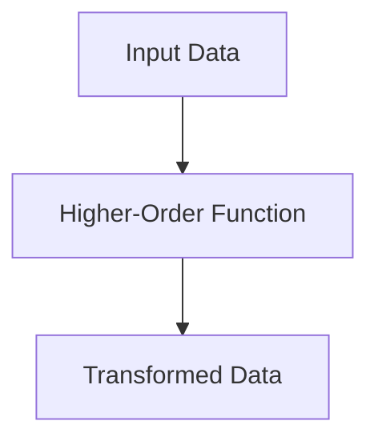
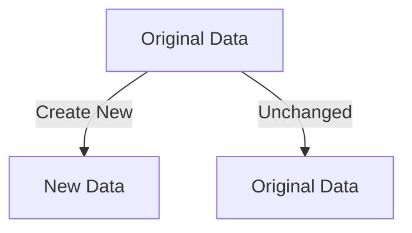

## 11.10.1 Dealing with Paradigm Shift

Transitioning from Java, a predominantly object-oriented programming (OOP) language, to Clojure, a functional programming (FP) language, can be both exciting and challenging. This shift requires not only learning new syntax but also adopting a new mindset. In this section, we'll explore the key differences between these paradigms, discuss the challenges you might face, and provide strategies to ease the transition.

### Understanding the Paradigm Shift

#### Object-Oriented vs. Functional Programming

In Java, the object-oriented paradigm emphasizes encapsulation, inheritance, and polymorphism. Programs are structured around objects that encapsulate state and behavior. In contrast, Clojure's functional paradigm focuses on immutability, first-class functions, and declarative programming.

**Key Differences:**

- **State Management**: Java uses mutable state, while Clojure emphasizes immutable data structures.
- **Functionality**: Java relies on methods within classes, whereas Clojure treats functions as first-class citizens.
- **Concurrency**: Java uses threads and locks, while Clojure offers concurrency primitives like atoms, refs, and agents.

#### Embracing Immutability

One of the most significant shifts is moving from mutable to immutable data structures. In Java, you might frequently modify objects, but in Clojure, data is immutable by default. This immutability simplifies reasoning about code and enhances concurrency.

**Java Example: Mutable List**

```java
import java.util.ArrayList;
import java.util.List;

public class MutableExample {
    public static void main(String[] args) {
        List<String> names = new ArrayList<>();
        names.add("Alice");
        names.add("Bob");
        // Modifying the list
        names.set(1, "Charlie");
        System.out.println(names);
    }
}
```

**Clojure Example: Immutable List**

```clojure
(def names ["Alice" "Bob"])
;; Creating a new list with "Charlie" instead of "Bob"
(def updated-names (assoc names 1 "Charlie"))
(println updated-names)
```

In Clojure, instead of modifying the original list, we create a new list with the desired changes. This approach prevents unintended side effects and makes the code easier to understand and maintain.

### Challenges in Transitioning

#### Mindset Shift

The transition from OOP to FP requires a change in mindset. Instead of thinking in terms of objects and their interactions, you need to think in terms of functions and data transformations.

**Tips for Mindset Shift:**

- **Focus on Functions**: Start by writing small, pure functions that perform specific tasks.
- **Think Declaratively**: Describe what you want to achieve rather than how to achieve it.
- **Embrace Recursion**: Use recursion instead of loops for iteration.

#### Learning New Concepts

Clojure introduces several new concepts that may be unfamiliar to Java developers, such as higher-order functions, lazy sequences, and macros.

**Higher-Order Functions Example:**

In Java, before Java 8, passing functions as arguments was cumbersome. With Clojure, it's straightforward:

```clojure
(defn apply-function [f x]
  (f x))

(apply-function inc 5) ;; Returns 6
```

Here, `apply-function` takes a function `f` and a value `x`, applying `f` to `x`. This flexibility is a hallmark of functional programming.

#### Syntax and Tooling

Clojure's syntax is minimalistic and may seem unfamiliar at first. Additionally, the tooling ecosystem differs from Java's, requiring some adaptation.

**Getting Comfortable with Syntax:**

- **Practice REPL-Driven Development**: Use the Read-Eval-Print Loop (REPL) to experiment with code snippets and get immediate feedback.
- **Leverage Editor Plugins**: Use plugins like Cursive for IntelliJ or Calva for Visual Studio Code to enhance your development experience.

### Strategies for Easing the Transition

#### Training and Practice

- **Online Courses and Tutorials**: Engage with resources like [ClojureDocs](https://clojuredocs.org) and official Clojure documentation.
- **Pair Programming**: Work with experienced Clojure developers to learn best practices and idiomatic code.
- **Code Katas**: Practice coding exercises to reinforce new concepts.

#### Building a Supportive Community

Join Clojure user groups, forums, and online communities to connect with other developers. Sharing experiences and solutions can accelerate your learning process.

#### Incremental Adoption

Instead of rewriting entire applications, start by integrating Clojure into existing Java projects. This approach allows you to gradually adopt functional programming principles without overwhelming your team.

### Try It Yourself

Experiment with the following exercises to reinforce your understanding of the paradigm shift:

1. **Refactor a Java Method**: Choose a method from a Java project and rewrite it in Clojure using pure functions and immutable data structures.
2. **Create a Simple Clojure Application**: Build a small application that performs a common task, such as data processing or web scraping, using Clojure's functional features.

### Diagrams and Visual Aids

#### Flow of Data Through Higher-Order Functions



*Diagram 1: This diagram illustrates how data flows through a higher-order function, transforming input data into output data.*

#### Immutability and Persistent Data Structures



*Diagram 2: This diagram shows how immutable data structures create new versions of data without altering the original.*

### Exercises and Practice Problems

1. **Exercise 1: Immutable Data Structures**
   - Create a Clojure function that takes a list of numbers and returns a new list with each number incremented by one.

2. **Exercise 2: Higher-Order Functions**
   - Write a Clojure function that takes another function and a list, applying the function to each element of the list.

3. **Exercise 3: Recursion**
   - Implement a recursive function in Clojure that calculates the factorial of a number.

### Key Takeaways

- Transitioning from Java to Clojure involves adopting a functional programming mindset, focusing on immutability, and leveraging higher-order functions.
- Embrace the REPL and functional programming concepts to write clean, maintainable code.
- Engage with the Clojure community and practice regularly to ease the transition.

By understanding these concepts and practicing regularly, you'll be well-equipped to navigate the paradigm shift from Java to Clojure.

### Further Reading

For more information on Clojure and functional programming, consider exploring the following resources:

- [Official Clojure Documentation](https://clojure.org)
- [ClojureDocs](https://clojuredocs.org)
- [Functional Programming in Clojure](https://www.braveclojure.com)

## Quiz: Mastering the Paradigm Shift from Java to Clojure



### What is a key difference between Java and Clojure regarding state management?

- [x] Java uses mutable state, while Clojure emphasizes immutability.
- [ ] Java uses immutable state, while Clojure emphasizes mutability.
- [ ] Both Java and Clojure use mutable state.
- [ ] Both Java and Clojure use immutable state.

> **Explanation:** Java typically uses mutable state, allowing objects to be changed after creation. Clojure, on the other hand, emphasizes immutability, where data structures cannot be altered once created.

### How does Clojure handle functions compared to Java?

- [x] Clojure treats functions as first-class citizens.
- [ ] Clojure does not support functions.
- [ ] Java treats functions as first-class citizens.
- [ ] Java does not support functions.

> **Explanation:** In Clojure, functions are first-class citizens, meaning they can be passed as arguments, returned from other functions, and assigned to variables. Java, especially before Java 8, did not treat functions in this way.

### What is a higher-order function?

- [x] A function that takes other functions as arguments or returns a function.
- [ ] A function that only performs arithmetic operations.
- [ ] A function that cannot be passed as an argument.
- [ ] A function that is only used in object-oriented programming.

> **Explanation:** Higher-order functions are functions that can take other functions as arguments or return them as results, a common feature in functional programming languages like Clojure.

### What is the purpose of the REPL in Clojure?

- [x] To provide an interactive environment for evaluating expressions.
- [ ] To compile Clojure code into Java bytecode.
- [ ] To manage dependencies in Clojure projects.
- [ ] To create graphical user interfaces.

> **Explanation:** The REPL (Read-Eval-Print Loop) in Clojure is an interactive environment where developers can evaluate expressions, test code snippets, and explore Clojure features in real-time.

### Which of the following is a benefit of immutability in Clojure?

- [x] Simplified reasoning about code.
- [ ] Increased complexity in managing state.
- [x] Enhanced concurrency.
- [ ] Difficulty in debugging.

> **Explanation:** Immutability simplifies reasoning about code because data cannot change unexpectedly. It also enhances concurrency by eliminating issues related to shared mutable state.

### What is a common challenge when transitioning from Java to Clojure?

- [x] Adapting to a functional programming mindset.
- [ ] Learning object-oriented design patterns.
- [ ] Understanding Java's concurrency model.
- [ ] Using Java's reflection API.

> **Explanation:** One of the main challenges is adapting to the functional programming mindset, which involves thinking in terms of functions and immutability rather than objects and state.

### How can Java developers ease the transition to Clojure?

- [x] Practice REPL-driven development.
- [ ] Avoid using higher-order functions.
- [x] Engage with the Clojure community.
- [ ] Focus solely on object-oriented principles.

> **Explanation:** Practicing REPL-driven development and engaging with the Clojure community can help Java developers learn Clojure's idiomatic practices and ease the transition.

### What is a strategy for adopting Clojure incrementally?

- [x] Integrate Clojure into existing Java projects.
- [ ] Rewrite entire applications in Clojure immediately.
- [ ] Avoid using Clojure's functional features.
- [ ] Focus only on Clojure's object-oriented capabilities.

> **Explanation:** Integrating Clojure into existing Java projects allows developers to gradually adopt functional programming principles without overwhelming their teams.

### What is a common use case for higher-order functions in Clojure?

- [x] Transforming collections of data.
- [ ] Managing object-oriented hierarchies.
- [ ] Implementing Java interfaces.
- [ ] Creating graphical user interfaces.

> **Explanation:** Higher-order functions are often used to transform collections of data, such as mapping a function over a list or filtering elements based on a predicate.

### True or False: Clojure's syntax is more verbose than Java's.

- [ ] True
- [x] False

> **Explanation:** Clojure's syntax is generally more concise than Java's, focusing on minimalism and expressiveness, which can lead to more readable and maintainable code.


