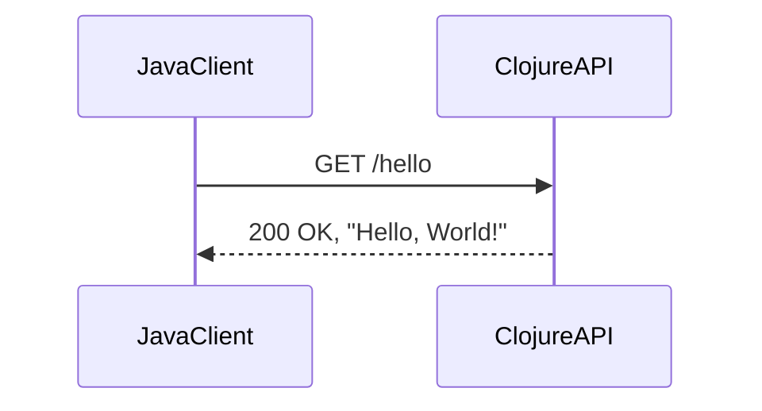
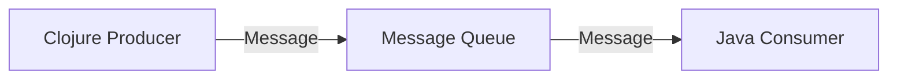
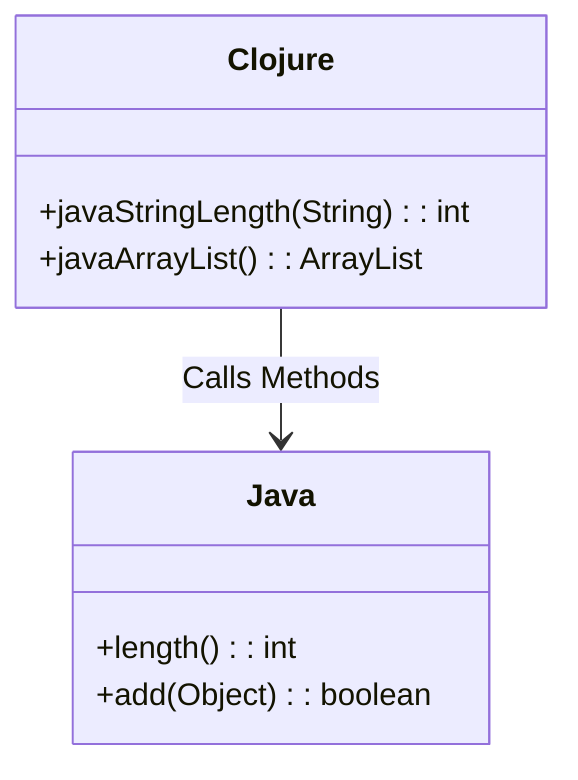

## 11.10.2 Integration with Existing Systems

As experienced Java developers transition to Clojure, one of the significant challenges they face is integrating Clojure code with existing Java systems. This section explores the challenges and solutions for achieving seamless interoperability between Clojure and Java components, as well as other systems. We'll delve into techniques such as using RESTful APIs, message queues, and other integration patterns to ensure smooth communication and data exchange.

### Understanding the Integration Landscape

When integrating Clojure with existing systems, it's crucial to understand the landscape of your current architecture. This involves identifying the components that need to interact, the data flow between them, and the protocols or interfaces already in place. Common integration scenarios include:

- **Interfacing with Java Libraries**: Leveraging existing Java libraries within Clojure applications.
- **Communicating with Java Components**: Enabling Clojure and Java components to communicate effectively.
- **Interacting with External Systems**: Integrating with third-party systems or services using standard protocols.

### Challenges in Integration

Integrating Clojure with existing systems presents several challenges:

1. **Data Type Compatibility**: Ensuring data types are compatible between Clojure and Java.
2. **Concurrency Models**: Reconciling different concurrency models and ensuring thread safety.
3. **Error Handling**: Managing exceptions and error handling across language boundaries.
4. **Performance Overheads**: Minimizing performance overheads due to inter-language calls.
5. **System Complexity**: Managing increased complexity due to heterogeneous systems.

### Solutions for Interoperability

#### 1. Using RESTful APIs

RESTful APIs are a popular choice for integrating disparate systems. They provide a language-agnostic way to communicate over HTTP, making them ideal for Clojure and Java integration.

**Clojure Example: Creating a RESTful API**

```clojure
(ns myapp.api
  (:require [ring.adapter.jetty :refer [run-jetty]]
            [compojure.core :refer [defroutes GET POST]]
            [compojure.route :as route]
            [ring.middleware.json :as middleware]))

(defroutes app-routes
  (GET "/hello" [] {:status 200 :body "Hello, World!"})
  (POST "/data" request
    (let [data (:body request)]
      {:status 200 :body (str "Received: " data)}))
  (route/not-found "Not Found"))

(def app
  (middleware/wrap-json-body
   (middleware/wrap-json-response app-routes)))

(defn -main []
  (run-jetty app {:port 3000}))
```

**Java Example: Consuming a RESTful API**

```java
import java.net.HttpURLConnection;
import java.net.URL;
import java.io.BufferedReader;
import java.io.InputStreamReader;

public class RestClient {
    public static void main(String[] args) {
        try {
            URL url = new URL("http://localhost:3000/hello");
            HttpURLConnection conn = (HttpURLConnection) url.openConnection();
            conn.setRequestMethod("GET");

            BufferedReader in = new BufferedReader(new InputStreamReader(conn.getInputStream()));
            String inputLine;
            StringBuilder content = new StringBuilder();
            while ((inputLine = in.readLine()) != null) {
                content.append(inputLine);
            }

            in.close();
            conn.disconnect();
            System.out.println("Response: " + content.toString());
        } catch (Exception e) {
            e.printStackTrace();
        }
    }
}
```

**Diagram: RESTful API Integration**



*Caption: Sequence diagram illustrating a Java client consuming a Clojure-based RESTful API.*

**Benefits of RESTful APIs:**

- **Language Agnostic**: Facilitates communication between different programming languages.
- **Scalability**: Easily scalable across distributed systems.
- **Standardized Protocol**: Uses HTTP, a well-understood protocol.

**Try It Yourself:**

- Modify the Clojure API to handle additional HTTP methods (e.g., PUT, DELETE).
- Extend the Java client to send data using the POST method.

#### 2. Leveraging Message Queues

Message queues provide a robust mechanism for asynchronous communication between systems. They decouple the sender and receiver, allowing for more flexible integration.

**Clojure Example: Sending Messages to a Queue**

```clojure
(ns myapp.queue
  (:require [clojure.core.async :refer [chan >!! <!! go]]))

(def message-queue (chan 10))

(defn send-message [msg]
  (go (>!! message-queue msg)))

(defn receive-message []
  (go (println "Received:" (<!! message-queue))))

;; Usage
(send-message "Hello from Clojure!")
(receive-message)
```

**Java Example: Consuming Messages from a Queue**

```java
import java.util.concurrent.BlockingQueue;
import java.util.concurrent.LinkedBlockingQueue;

public class MessageQueue {
    private static BlockingQueue<String> queue = new LinkedBlockingQueue<>();

    public static void main(String[] args) {
        try {
            queue.put("Hello from Java!");
            String message = queue.take();
            System.out.println("Received: " + message);
        } catch (InterruptedException e) {
            e.printStackTrace();
        }
    }
}
```

**Diagram: Message Queue Integration**



*Caption: Flowchart showing message exchange between Clojure and Java using a message queue.*

**Benefits of Message Queues:**

- **Asynchronous Communication**: Decouples sender and receiver, allowing for non-blocking operations.
- **Scalability**: Supports distributed systems with multiple producers and consumers.
- **Reliability**: Ensures message delivery even if one system is temporarily unavailable.

**Try It Yourself:**

- Implement a priority queue in Clojure and Java.
- Experiment with different message queue libraries, such as RabbitMQ or Kafka.

#### 3. Direct Java Interoperability

Clojure provides seamless interoperability with Java, allowing you to call Java methods directly from Clojure code. This is particularly useful when you need to leverage existing Java libraries or frameworks.

**Clojure Example: Calling Java Methods**

```clojure
(ns myapp.interop)

(defn java-string-length [s]
  (.length s))

(defn java-array-list []
  (let [list (java.util.ArrayList.)]
    (.add list "Clojure")
    (.add list "Java")
    list))

;; Usage
(println "Length of 'Clojure':" (java-string-length "Clojure"))
(println "ArrayList:" (java-array-list))
```

**Diagram: Java Interoperability**



*Caption: Class diagram illustrating Clojure calling Java methods.*

**Benefits of Direct Java Interoperability:**

- **Reuse Existing Code**: Leverage existing Java libraries and frameworks.
- **Seamless Integration**: Directly call Java methods from Clojure.
- **Performance**: Minimize overhead by avoiding network calls.

**Try It Yourself:**

- Extend the Clojure code to use more complex Java libraries.
- Experiment with Java's reflection API from Clojure.

### Best Practices for Integration

- **Use Interfaces**: Define interfaces for components to ensure loose coupling and flexibility.
- **Encapsulate Logic**: Encapsulate integration logic in dedicated modules or services.
- **Monitor Performance**: Continuously monitor performance to identify and address bottlenecks.
- **Handle Errors Gracefully**: Implement robust error handling and logging mechanisms.
- **Document Interfaces**: Clearly document APIs and integration points for maintainability.

### Exercises and Practice Problems

1. **Exercise 1**: Create a Clojure service that interacts with a Java-based database library. Implement CRUD operations and expose them via a RESTful API.

2. **Exercise 2**: Set up a message queue system where Clojure produces messages and Java consumes them. Implement error handling and retry mechanisms.

3. **Exercise 3**: Develop a small application that uses both Clojure and Java components. Use direct Java interoperability to call Java methods from Clojure.

### Key Takeaways

- **Interoperability**: Clojure's interoperability with Java allows for seamless integration with existing systems.
- **RESTful APIs and Message Queues**: These are effective patterns for integrating heterogeneous systems.
- **Direct Java Calls**: Leverage existing Java libraries and frameworks directly from Clojure.
- **Best Practices**: Follow best practices for integration to ensure maintainability and performance.

By understanding and applying these integration techniques, you can effectively bridge the gap between Clojure and existing Java systems, leveraging the strengths of both languages to build robust, scalable applications.

For further reading, explore the [Official Clojure Documentation](https://clojure.org/reference/java_interop) and [ClojureDocs](https://clojuredocs.org/).

---

## Quiz: Mastering Clojure and Java Integration



### What is a common challenge when integrating Clojure with existing Java systems?

- [x] Data type compatibility
- [ ] Lack of libraries
- [ ] Inability to handle HTTP requests
- [ ] Poor performance of Clojure

> **Explanation:** Ensuring data types are compatible between Clojure and Java is a common challenge in integration.

### Which of the following is a benefit of using RESTful APIs for integration?

- [x] Language agnostic communication
- [ ] Requires no network setup
- [ ] Eliminates the need for error handling
- [ ] Only works with Clojure

> **Explanation:** RESTful APIs facilitate language-agnostic communication over HTTP, making them ideal for integration.

### How do message queues benefit system integration?

- [x] They provide asynchronous communication
- [ ] They require synchronous processing
- [ ] They eliminate the need for data serialization
- [ ] They are only suitable for small systems

> **Explanation:** Message queues enable asynchronous communication, decoupling sender and receiver.

### What is a key advantage of direct Java interoperability in Clojure?

- [x] Reuse of existing Java libraries
- [ ] Requires rewriting Java code
- [ ] Eliminates the need for APIs
- [ ] Only works with Java 8

> **Explanation:** Direct Java interoperability allows Clojure to leverage existing Java libraries and frameworks.

### Which pattern is commonly used for integrating heterogeneous systems?

- [x] RESTful APIs
- [ ] Monolithic architecture
- [ ] Single-threaded processing
- [ ] Hardcoded connections

> **Explanation:** RESTful APIs are a common pattern for integrating systems with different technologies.

### What is the purpose of using interfaces in system integration?

- [x] To ensure loose coupling and flexibility
- [ ] To increase system complexity
- [ ] To eliminate the need for documentation
- [ ] To enforce strict coupling

> **Explanation:** Interfaces help ensure loose coupling and flexibility in system integration.

### What should be monitored continuously to identify integration bottlenecks?

- [x] Performance
- [ ] Code style
- [ ] Number of lines of code
- [ ] Developer productivity

> **Explanation:** Monitoring performance helps identify and address integration bottlenecks.

### Which of the following is a best practice for handling errors in integrated systems?

- [x] Implement robust error handling and logging
- [ ] Ignore errors to maintain performance
- [ ] Only log errors without handling them
- [ ] Use print statements for error handling

> **Explanation:** Implementing robust error handling and logging is a best practice for integrated systems.

### What is a benefit of encapsulating integration logic in dedicated modules?

- [x] Improved maintainability
- [ ] Increased code duplication
- [ ] Reduced system flexibility
- [ ] Elimination of testing

> **Explanation:** Encapsulating integration logic in dedicated modules improves maintainability.

### True or False: Clojure cannot directly call Java methods.

- [ ] True
- [x] False

> **Explanation:** Clojure can directly call Java methods, allowing for seamless interoperability.


