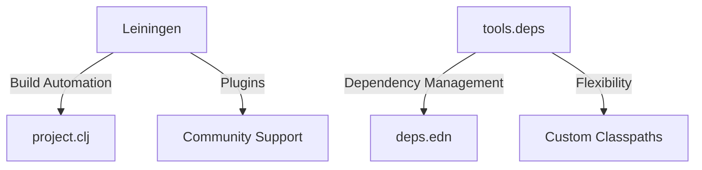
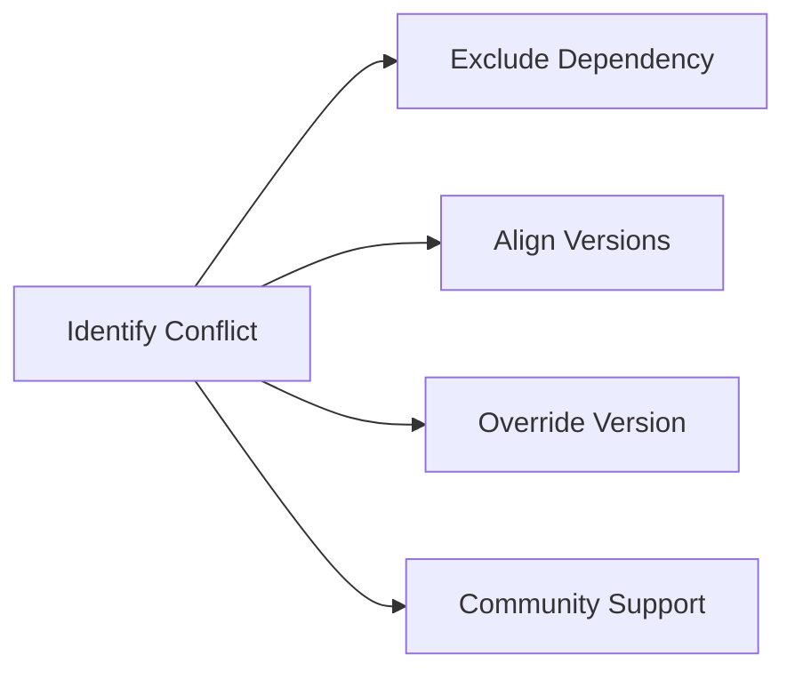
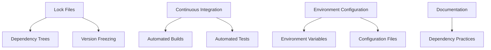

## 11.10.3 Managing Dependencies

As experienced Java developers transitioning to Clojure, managing dependencies is a crucial skill to master. In Java, you might be familiar with tools like Maven or Gradle for dependency management. Clojure offers its own set of tools and practices that can streamline this process, but it also presents unique challenges, such as conflicting library versions and differences in build tools. In this section, we'll explore how to effectively manage dependencies in Clojure, ensuring a consistent and reliable build environment.

### Understanding Dependency Management in Clojure

Dependency management in Clojure revolves around two primary tools: **Leiningen** and **tools.deps**. Both tools serve the purpose of managing project dependencies, but they have different philosophies and use cases.

#### Leiningen

Leiningen is a build automation tool for Clojure, similar to Maven in the Java ecosystem. It uses a `project.clj` file to define project settings, dependencies, and build configurations.

```clojure
;; Example project.clj file
(defproject my-clojure-project "0.1.0-SNAPSHOT"
  :description "A sample Clojure project"
  :dependencies [[org.clojure/clojure "1.10.3"]
                 [ring/ring-core "1.9.0"]]
  :main ^:skip-aot my-clojure-project.core
  :target-path "target/%s"
  :profiles {:uberjar {:aot :all}})
```

**Key Features of Leiningen:**

- **Profiles**: Allows for different configurations for development, testing, and production.
- **Plugins**: Extend functionality with plugins for tasks like testing, packaging, and deployment.
- **Ease of Use**: Simple syntax for defining dependencies and project settings.

#### tools.deps

tools.deps is a more recent addition to the Clojure ecosystem, focusing on simplicity and flexibility. It uses a `deps.edn` file to manage dependencies.

```clojure
;; Example deps.edn file
{:deps {org.clojure/clojure {:mvn/version "1.10.3"}
        ring/ring-core {:mvn/version "1.9.0"}}}
```

**Key Features of tools.deps:**

- **Simplicity**: Minimal configuration, focusing on dependency management.
- **Flexibility**: Allows for more complex dependency graphs and custom classpaths.
- **Integration**: Works well with the Clojure CLI tools for running and building projects.

### Comparing Leiningen and tools.deps

Both tools have their strengths and are suited for different scenarios. Here's a comparison to help you decide which tool to use:

| Feature          | Leiningen                          | tools.deps                      |
|------------------|------------------------------------|---------------------------------|
| Configuration    | project.clj                        | deps.edn                        |
| Build Automation | Built-in                           | Requires additional setup       |
| Dependency Graph | Simple                             | Complex and flexible            |
| Community        | Large, with many plugins available | Growing, with increasing support|

**Diagram: Dependency Management Tools**



*Caption: A comparison of Leiningen and tools.deps, highlighting their key features and use cases.*

### Resolving Dependency Conflicts

Dependency conflicts can arise when different libraries require different versions of the same dependency. This is a common issue in both Java and Clojure projects.

#### Strategies for Resolving Conflicts

1. **Exclusion**: Exclude conflicting dependencies explicitly.

   ```clojure
   ;; Excluding a dependency in Leiningen
   :dependencies [[some-library "1.0.0" :exclusions [conflicting-lib]]]
   ```

2. **Version Alignment**: Align versions across dependencies to ensure compatibility.

3. **Dependency Overrides**: Use dependency overrides to force a specific version.

   ```clojure
   ;; Overriding a dependency version in tools.deps
   :override-deps {conflicting-lib {:mvn/version "2.0.0"}}
   ```

4. **Community Support**: Engage with the community for insights and solutions.

**Diagram: Resolving Dependency Conflicts**



*Caption: A flowchart illustrating strategies for resolving dependency conflicts in Clojure projects.*

### Maintaining a Consistent Build Environment

Consistency in your build environment is crucial for reliable software development. Here are some best practices to maintain consistency:

1. **Lock Files**: Use lock files to freeze dependency versions.

   - **Leiningen**: Use `lein deps :tree` to inspect dependencies.
   - **tools.deps**: Use `clj -Stree` to visualize dependency trees.

2. **Continuous Integration (CI)**: Implement CI pipelines to automate builds and tests.

3. **Environment Configuration**: Use environment variables and configuration files to manage environment-specific settings.

4. **Documentation**: Keep detailed documentation of your dependency management practices.

**Diagram: Consistent Build Environment**



*Caption: A flowchart depicting best practices for maintaining a consistent build environment in Clojure projects.*

### Practical Examples and Exercises

Let's apply these concepts with a practical example. We'll create a simple Clojure project using both Leiningen and tools.deps, resolving a dependency conflict along the way.

#### Example Project with Leiningen

1. **Create a new project**:

   ```bash
   lein new app my-lein-project
   ```

2. **Add dependencies** in `project.clj`:

   ```clojure
   :dependencies [[org.clojure/clojure "1.10.3"]
                  [ring/ring-core "1.9.0"]
                  [conflicting-lib "1.0.0" :exclusions [ring/ring-core]]]
   ```

3. **Run the project**:

   ```bash
   lein run
   ```

#### Example Project with tools.deps

1. **Create a new project directory**:

   ```bash
   mkdir my-tools-deps-project
   cd my-tools-deps-project
   ```

2. **Create a `deps.edn` file**:

   ```clojure
   {:deps {org.clojure/clojure {:mvn/version "1.10.3"}
           ring/ring-core {:mvn/version "1.9.0"}
           conflicting-lib {:mvn/version "1.0.0"}}}
   ```

3. **Resolve conflicts** by overriding dependencies:

   ```clojure
   :override-deps {ring/ring-core {:mvn/version "1.9.0"}}
   ```

4. **Run the project**:

   ```bash
   clj -M -m my-tools-deps-project.core
   ```

**Try It Yourself**: Modify the dependencies to introduce a conflict and resolve it using the strategies discussed.

### Key Takeaways

- **Leiningen and tools.deps** are the primary tools for managing dependencies in Clojure.
- **Dependency conflicts** can be resolved through exclusion, version alignment, and overrides.
- **Maintaining a consistent build environment** involves using lock files, CI pipelines, and thorough documentation.

By mastering these dependency management techniques, you'll be well-equipped to handle the challenges of building robust Clojure applications. Now that we've explored managing dependencies, let's apply these concepts to ensure a smooth transition from Java to Clojure.

### Further Reading

- [Official Clojure Documentation](https://clojure.org/)
- [Leiningen Documentation](https://leiningen.org/)
- [tools.deps Guide](https://clojure.org/guides/deps_and_cli)

## Quiz: Mastering Dependency Management in Clojure



### Which tool is primarily used for build automation in Clojure?

- [x] Leiningen
- [ ] tools.deps
- [ ] Gradle
- [ ] Maven

> **Explanation:** Leiningen is the primary tool for build automation in Clojure, similar to Maven in Java.

### What file does tools.deps use to manage dependencies?

- [ ] project.clj
- [x] deps.edn
- [ ] build.gradle
- [ ] pom.xml

> **Explanation:** tools.deps uses a `deps.edn` file to manage dependencies, focusing on simplicity and flexibility.

### How can you exclude a conflicting dependency in Leiningen?

- [x] By using the `:exclusions` keyword in the `project.clj` file
- [ ] By removing the dependency from the `deps.edn` file
- [ ] By using the `exclude` function in Clojure code
- [ ] By setting an environment variable

> **Explanation:** In Leiningen, you can exclude a conflicting dependency by using the `:exclusions` keyword in the `project.clj` file.

### What is a key feature of tools.deps?

- [ ] Built-in build automation
- [x] Flexible dependency graphs
- [ ] Large plugin ecosystem
- [ ] Profile management

> **Explanation:** tools.deps offers flexible dependency graphs, allowing for complex and custom classpath configurations.

### Which strategy can be used to resolve dependency conflicts?

- [x] Exclusion
- [x] Version Alignment
- [ ] Ignoring the conflict
- [ ] Using only one dependency manager

> **Explanation:** Exclusion and version alignment are strategies to resolve dependency conflicts, ensuring compatibility across libraries.

### What command can you use to visualize dependency trees in tools.deps?

- [ ] lein deps :tree
- [x] clj -Stree
- [ ] mvn dependency:tree
- [ ] gradle dependencies

> **Explanation:** The `clj -Stree` command is used in tools.deps to visualize dependency trees.

### Why is maintaining a consistent build environment important?

- [x] To ensure reliable software development
- [x] To prevent dependency conflicts
- [ ] To increase code complexity
- [ ] To reduce documentation efforts

> **Explanation:** Maintaining a consistent build environment is crucial for reliable software development and preventing dependency conflicts.

### What is a benefit of using lock files?

- [x] They freeze dependency versions
- [ ] They increase build times
- [ ] They reduce code readability
- [ ] They eliminate the need for CI

> **Explanation:** Lock files freeze dependency versions, ensuring consistency across different environments.

### Which tool is known for its large plugin ecosystem?

- [x] Leiningen
- [ ] tools.deps
- [ ] Gradle
- [ ] Maven

> **Explanation:** Leiningen is known for its large plugin ecosystem, which extends its functionality for various tasks.

### True or False: tools.deps requires additional setup for build automation.

- [x] True
- [ ] False

> **Explanation:** tools.deps focuses on dependency management and requires additional setup for build automation tasks.


