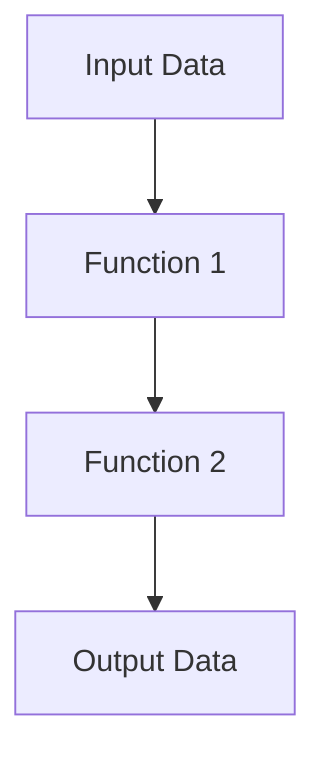

## 11.2.1 Mapping Java Concepts to Clojure

As experienced Java developers, we are accustomed to the object-oriented paradigm, where classes and objects are the building blocks of our applications. Transitioning to Clojure, a functional programming language, requires a shift in thinking. In this section, we will explore how Java's object-oriented concepts map to Clojure's functional paradigms, focusing on classes, objects, methods, and state management. We will provide side-by-side comparisons of common Java patterns and their Clojure counterparts, along with clear, well-commented code examples.

### Classes and Objects vs. Namespaces and Data Structures

In Java, classes are the primary means of defining data and behavior. Clojure, on the other hand, uses namespaces and data structures to achieve similar goals. Let's explore these concepts in detail.

#### Java Classes and Objects

In Java, a class defines a blueprint for creating objects, encapsulating data and behavior. Here's a simple Java class example:

```java
public class Person {
    private String name;
    private int age;

    public Person(String name, int age) {
        this.name = name;
        this.age = age;
    }

    public String getName() {
        return name;
    }

    public int getAge() {
        return age;
    }
}
```

#### Clojure Namespaces and Data Structures

In Clojure, we use namespaces to organize code and data structures to represent data. Here's how we can represent the same concept in Clojure:

```clojure
(ns myapp.person)

(defn create-person [name age]
  {:name name :age age})

(defn get-name [person]
  (:name person))

(defn get-age [person]
  (:age person))
```

**Key Differences:**

- **Encapsulation**: Java uses encapsulation to hide data, while Clojure uses maps to store data, providing direct access to fields.
- **Immutability**: Clojure's data structures are immutable by default, promoting safer concurrent programming.

### Methods vs. Functions

In Java, methods are functions associated with a class. In Clojure, functions are first-class citizens and can be defined independently of data structures.

#### Java Methods

Methods in Java are defined within a class and can operate on the class's fields:

```java
public class Calculator {
    public int add(int a, int b) {
        return a + b;
    }
}
```

#### Clojure Functions

In Clojure, functions are defined using the `defn` keyword and can be used independently:

```clojure
(defn add [a b]
  (+ a b))
```

**Key Differences:**

- **First-Class Functions**: Clojure treats functions as first-class citizens, allowing them to be passed as arguments, returned from other functions, and stored in data structures.
- **Statelessness**: Clojure functions are typically stateless, operating only on their inputs and returning new data.

### State Management

State management is a critical aspect of programming. Java uses mutable state, while Clojure emphasizes immutability and functional state management.

#### Java State Management

Java uses mutable fields and objects to manage state:

```java
public class Counter {
    private int count = 0;

    public void increment() {
        count++;
    }

    public int getCount() {
        return count;
    }
}
```

#### Clojure State Management

Clojure uses immutable data structures and atoms for state management:

```clojure
(def counter (atom 0))

(defn increment []
  (swap! counter inc))

(defn get-count []
  @counter)
```

**Key Differences:**

- **Immutability**: Clojure's immutable data structures prevent accidental state changes, making code easier to reason about.
- **Concurrency**: Clojure's concurrency primitives, such as atoms, refs, and agents, provide safe and efficient state management in concurrent applications.

### Side-by-Side Comparison

Let's compare some common Java patterns with their Clojure counterparts:

#### Singleton Pattern

**Java Singleton:**

```java
public class Singleton {
    private static Singleton instance;

    private Singleton() {}

    public static Singleton getInstance() {
        if (instance == null) {
            instance = new Singleton();
        }
        return instance;
    }
}
```

**Clojure Singleton:**

Clojure's immutability and functional nature often eliminate the need for singletons. However, if needed, we can use atoms:

```clojure
(def singleton (atom nil))

(defn get-instance []
  (if (nil? @singleton)
    (reset! singleton (create-instance)))
  @singleton)
```

#### Factory Pattern

**Java Factory:**

```java
public class ShapeFactory {
    public Shape getShape(String shapeType) {
        if (shapeType == null) {
            return null;
        }
        if (shapeType.equalsIgnoreCase("CIRCLE")) {
            return new Circle();
        } else if (shapeType.equalsIgnoreCase("RECTANGLE")) {
            return new Rectangle();
        }
        return null;
    }
}
```

**Clojure Factory:**

In Clojure, we can use a map to achieve a similar effect:

```clojure
(def shape-factory
  {"circle" (fn [] (create-circle))
   "rectangle" (fn [] (create-rectangle))})

(defn get-shape [shape-type]
  ((get shape-factory shape-type)))
```

### Try It Yourself

Experiment with the Clojure code examples by modifying them to suit different scenarios. For instance, try adding new fields to the `create-person` function or implementing additional shapes in the factory pattern.

### Diagrams and Visualizations

To aid understanding, let's visualize the flow of data through Clojure functions and the structure of immutable data.



**Diagram Description**: This flowchart illustrates how data flows through a series of Clojure functions, transforming input data into output data.

### Exercises

1. **Refactor a Java Class**: Take a simple Java class and refactor it into a Clojure namespace with functions and data structures.
2. **Implement a Clojure Factory**: Create a Clojure factory function that can generate different types of data structures based on input parameters.

### Key Takeaways

- **Functional Paradigm**: Clojure's functional paradigm emphasizes immutability, first-class functions, and statelessness.
- **Data Structures**: Clojure uses immutable data structures, promoting safer and more predictable code.
- **Concurrency**: Clojure provides powerful concurrency primitives that simplify state management in concurrent applications.

By understanding these mappings, we can effectively translate Java concepts into Clojure, leveraging the strengths of functional programming to build robust and maintainable applications.

### Further Reading

- [Official Clojure Documentation](https://clojure.org/)
- [ClojureDocs](https://clojuredocs.org/)

Now that we've explored how Java concepts map to Clojure, let's apply these insights to refactor existing Java code and embrace the functional paradigm.

## Quiz: Mapping Java Concepts to Clojure



### Which of the following best describes how classes in Java are represented in Clojure?

- [x] Namespaces and data structures
- [ ] Classes and objects
- [ ] Methods and functions
- [ ] Interfaces and implementations

> **Explanation:** In Clojure, classes are represented by namespaces and data structures, which organize code and data.

### What is a key difference between methods in Java and functions in Clojure?

- [x] Functions in Clojure are first-class citizens
- [ ] Methods in Java are first-class citizens
- [ ] Functions in Clojure are always mutable
- [ ] Methods in Java are always immutable

> **Explanation:** Functions in Clojure are first-class citizens, meaning they can be passed as arguments, returned from other functions, and stored in data structures.

### How does Clojure handle state management differently from Java?

- [x] Clojure uses immutable data structures
- [ ] Clojure uses mutable fields
- [ ] Clojure uses synchronized methods
- [ ] Clojure uses volatile variables

> **Explanation:** Clojure emphasizes immutability, using immutable data structures to manage state safely and predictably.

### In Clojure, what is the equivalent of a Java singleton pattern?

- [x] Using an atom to store a single instance
- [ ] Using a class with a private constructor
- [ ] Using a synchronized method
- [ ] Using a static field

> **Explanation:** In Clojure, an atom can be used to store a single instance, providing a functional equivalent to the Java singleton pattern.

### What is a common use case for Clojure's factory pattern?

- [x] Creating different types of data structures
- [ ] Managing database connections
- [ ] Implementing user authentication
- [ ] Handling network requests

> **Explanation:** Clojure's factory pattern is commonly used to create different types of data structures based on input parameters.

### Which of the following is a benefit of Clojure's immutable data structures?

- [x] Safer concurrent programming
- [ ] Easier debugging
- [ ] Faster execution
- [ ] Reduced memory usage

> **Explanation:** Immutable data structures in Clojure promote safer concurrent programming by preventing accidental state changes.

### How do Clojure's concurrency primitives differ from Java's?

- [x] Clojure provides atoms, refs, and agents
- [ ] Clojure uses synchronized methods
- [ ] Clojure relies on volatile variables
- [ ] Clojure uses thread pools

> **Explanation:** Clojure provides concurrency primitives like atoms, refs, and agents, which simplify state management in concurrent applications.

### What is a key advantage of using functions as first-class citizens in Clojure?

- [x] They can be passed as arguments and returned from other functions
- [ ] They are always faster than Java methods
- [ ] They are automatically synchronized
- [ ] They require less memory

> **Explanation:** Functions as first-class citizens in Clojure can be passed as arguments, returned from other functions, and stored in data structures, providing flexibility and power.

### How does Clojure's approach to encapsulation differ from Java's?

- [x] Clojure uses maps to store data, providing direct access to fields
- [ ] Clojure uses private fields and methods
- [ ] Clojure uses synchronized methods
- [ ] Clojure uses interfaces

> **Explanation:** Clojure uses maps to store data, providing direct access to fields, unlike Java's encapsulation through private fields and methods.

### True or False: Clojure's functional paradigm eliminates the need for design patterns.

- [ ] True
- [x] False

> **Explanation:** While Clojure's functional paradigm simplifies some design patterns, it does not eliminate the need for them entirely. Patterns can still be useful for organizing code and solving common problems.


