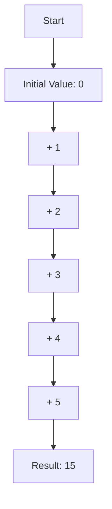

## 11.2.2 Replacing Imperative Constructs

As experienced Java developers, we are accustomed to imperative programming paradigms that rely heavily on loops, mutable variables, and state changes. Transitioning to Clojure involves embracing functional programming principles, which emphasize immutability and recursion. In this section, we will explore how to replace imperative constructs with functional equivalents, enhancing code readability and maintainability.

### Understanding Imperative Constructs

In Java, imperative constructs are prevalent. Consider the following Java example that calculates the sum of an array:

```java
int[] numbers = {1, 2, 3, 4, 5};
int sum = 0;
for (int number : numbers) {
    sum += number;
}
System.out.println("Sum: " + sum);
```

This code uses a mutable variable `sum` and a loop to iterate over the array. While this approach is straightforward, it can lead to issues with state management and concurrency.

### Transitioning to Functional Constructs

Functional programming in Clojure offers alternatives to these imperative constructs. Let's explore how we can transform the above Java code into a functional Clojure equivalent.

#### Using Recursion

Clojure encourages the use of recursion over loops. Here's how we can calculate the sum of a list using recursion:

```clojure
(defn sum-list [numbers]
  (if (empty? numbers)
    0
    (+ (first numbers) (sum-list (rest numbers)))))

(def numbers [1 2 3 4 5])
(println "Sum:" (sum-list numbers))
```

**Explanation:**

- **Base Case:** If the list is empty, return 0.
- **Recursive Case:** Add the first element to the result of the recursive call on the rest of the list.

#### Tail Recursion with `recur`

Clojure optimizes tail-recursive functions using the `recur` keyword, which prevents stack overflow by reusing the current function's stack frame.

```clojure
(defn sum-list-tail-rec [numbers]
  (letfn [(helper [nums acc]
            (if (empty? nums)
              acc
              (recur (rest nums) (+ acc (first nums)))))]
    (helper numbers 0)))

(println "Sum with tail recursion:" (sum-list-tail-rec numbers))
```

**Explanation:**

- **Helper Function:** Uses an accumulator `acc` to keep track of the sum.
- **Tail Recursion:** The `recur` keyword is used to call the helper function with updated arguments.

### Embracing Immutability

In Java, mutable variables are common, but Clojure's immutable data structures offer significant advantages in terms of safety and concurrency.

#### Immutable Data Structures

Clojure's data structures (lists, vectors, maps, and sets) are immutable by default. This immutability ensures that data cannot be changed once created, leading to safer and more predictable code.

```clojure
(def numbers [1 2 3 4 5])
(def updated-numbers (conj numbers 6))

(println "Original numbers:" numbers)
(println "Updated numbers:" updated-numbers)
```

**Explanation:**

- **`conj` Function:** Adds an element to a collection, returning a new collection without modifying the original.

### Higher-Order Functions

Clojure provides powerful higher-order functions like `map`, `reduce`, and `filter` that replace common imperative patterns.

#### Using `reduce` for Summation

The `reduce` function can replace loops for aggregating data:

```clojure
(def sum (reduce + 0 numbers))
(println "Sum using reduce:" sum)
```

**Explanation:**

- **`reduce` Function:** Applies a function cumulatively to the elements of a collection, from left to right, reducing the collection to a single value.

### Comparing Java and Clojure

Let's compare the imperative and functional approaches side by side:

| Aspect                | Java (Imperative)                          | Clojure (Functional)                          |
|-----------------------|--------------------------------------------|-----------------------------------------------|
| **State Management**  | Mutable variables                          | Immutable data structures                     |
| **Looping**           | `for` and `while` loops                    | Recursion and higher-order functions          |
| **Concurrency**       | Requires explicit synchronization          | Immutability simplifies concurrency           |
| **Code Readability**  | Can become complex with state changes      | Clear and concise with functional constructs  |

### Try It Yourself

Experiment with the following modifications to deepen your understanding:

- Modify the `sum-list` function to calculate the product of the numbers.
- Use `reduce` to find the maximum value in a list.
- Implement a recursive function to reverse a list.

### Visualizing Data Flow

To better understand the flow of data in functional programming, consider the following diagram illustrating the use of `reduce`:



**Diagram Explanation:** This flowchart represents the process of reducing a list `[1, 2, 3, 4, 5]` to a single value using the `+` function, starting with an initial value of 0.

### Benefits of Functional Constructs

- **Readability:** Functional code is often more concise and easier to understand.
- **Maintainability:** Immutability and pure functions lead to fewer bugs and easier refactoring.
- **Concurrency:** Immutable data structures simplify concurrent programming by eliminating race conditions.

### Exercises

1. Transform a Java `while` loop that calculates the factorial of a number into a Clojure recursive function.
2. Use Clojure's `map` function to square each element in a list.
3. Implement a Clojure function that filters out even numbers from a list using `filter`.

### Key Takeaways

- Replacing imperative constructs with functional equivalents in Clojure enhances code readability and maintainability.
- Recursion and higher-order functions are powerful tools for transforming data without mutable state.
- Embracing immutability leads to safer and more predictable code, especially in concurrent environments.

By transitioning from imperative to functional constructs, we can leverage Clojure's strengths to write more robust and efficient code. Now that we've explored how to replace loops and mutable variables, let's apply these concepts to manage state effectively in your applications.

### Further Reading

- [Official Clojure Documentation](https://clojure.org/reference/documentation)
- [ClojureDocs](https://clojuredocs.org/)
- [Functional Programming Principles](https://www.functionalprogramming.com/)

## Quiz: Mastering Functional Constructs in Clojure



### What is the primary advantage of using recursion over loops in Clojure?

- [x] Recursion avoids mutable state and is more idiomatic in functional programming.
- [ ] Recursion is faster than loops in all cases.
- [ ] Recursion uses less memory than loops.
- [ ] Recursion is easier to write than loops.

> **Explanation:** Recursion avoids mutable state, which aligns with functional programming principles, making it more idiomatic in Clojure.

### How does Clojure handle data immutability?

- [x] By using immutable data structures that cannot be changed after creation.
- [ ] By using mutable data structures with locks.
- [ ] By copying data structures on every change.
- [ ] By using global variables.

> **Explanation:** Clojure uses immutable data structures, ensuring data cannot be changed once created, promoting safer and more predictable code.

### Which Clojure function is commonly used to aggregate data?

- [x] `reduce`
- [ ] `map`
- [ ] `filter`
- [ ] `for`

> **Explanation:** The `reduce` function is used to aggregate data by applying a function cumulatively to the elements of a collection.

### What keyword does Clojure use to optimize tail-recursive functions?

- [x] `recur`
- [ ] `loop`
- [ ] `defn`
- [ ] `let`

> **Explanation:** The `recur` keyword is used in Clojure to optimize tail-recursive functions, preventing stack overflow.

### Which of the following is a benefit of using immutable data structures?

- [x] Simplified concurrency
- [ ] Faster data access
- [x] Easier debugging
- [ ] Reduced memory usage

> **Explanation:** Immutable data structures simplify concurrency by eliminating race conditions and make debugging easier due to predictable state.

### What is the result of using the `conj` function in Clojure?

- [x] It returns a new collection with the added element.
- [ ] It modifies the original collection.
- [ ] It removes an element from the collection.
- [ ] It sorts the collection.

> **Explanation:** The `conj` function returns a new collection with the added element, leaving the original collection unchanged.

### How does Clojure's `reduce` function differ from Java's loops?

- [x] `reduce` is a higher-order function that abstracts iteration.
- [ ] `reduce` is slower than loops.
- [x] `reduce` eliminates the need for mutable accumulators.
- [ ] `reduce` can only be used with numbers.

> **Explanation:** `reduce` abstracts iteration and eliminates the need for mutable accumulators, aligning with functional programming principles.

### What is a key difference between Java's `for` loop and Clojure's recursion?

- [x] Clojure's recursion avoids mutable state.
- [ ] Java's `for` loop is more concise.
- [ ] Clojure's recursion is less efficient.
- [ ] Java's `for` loop supports higher-order functions.

> **Explanation:** Clojure's recursion avoids mutable state, which is a key principle of functional programming.

### Which Clojure function is used to apply a function to each element of a collection?

- [x] `map`
- [ ] `reduce`
- [ ] `filter`
- [ ] `for`

> **Explanation:** The `map` function applies a given function to each element of a collection, returning a new collection of results.

### True or False: Clojure's immutable data structures can be modified after creation.

- [ ] True
- [x] False

> **Explanation:** Clojure's immutable data structures cannot be modified after creation, ensuring data integrity and safety.


