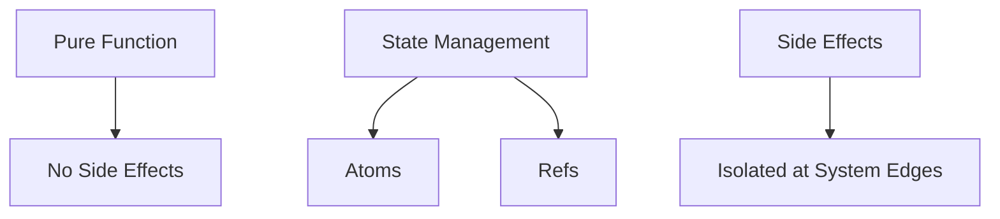

## 11.2.3 Handling Side Effects

In the world of functional programming, managing side effects is crucial to writing clean, maintainable, and predictable code. As Java developers transitioning to Clojure, understanding how to handle side effects effectively will help you leverage the full power of functional programming. In this section, we'll explore how Clojure manages side effects differently from Java, techniques for isolating them, and how to refactor Java code that relies on side effects into Clojure code that minimizes them.

### Understanding Side Effects

A side effect occurs when a function interacts with the outside world or changes the state of the system. Common examples include modifying a global variable, writing to a file, or updating a database. In Java, side effects are often intertwined with business logic, making code harder to test and reason about.

**Key Characteristics of Side Effects:**
- **State Mutation**: Changing the value of a variable or data structure.
- **I/O Operations**: Reading from or writing to files, databases, or network sockets.
- **Exceptions**: Throwing or catching exceptions that alter the control flow.

### Clojure's Approach to Side Effects

Clojure, as a functional language, encourages the use of pure functions—functions that do not have side effects and always produce the same output for the same input. This makes reasoning about code easier and enhances testability.

**Pure Functions in Clojure:**
- **No Side Effects**: They do not alter any state or perform I/O operations.
- **Deterministic**: Given the same input, they always return the same output.

**Example of a Pure Function:**

```clojure
(defn add [x y]
  (+ x y))
```

This function simply adds two numbers without any side effects.

### Isolating Side Effects

In Clojure, side effects are often isolated to the edges of the system. This means that the core logic of your application remains pure, while side effects are handled separately.

**Techniques for Isolating Side Effects:**
1. **Use Pure Functions**: Keep the core logic pure and free of side effects.
2. **Separate I/O from Logic**: Perform I/O operations in specific functions that are called only when necessary.
3. **Use Controlled State Management**: Utilize Clojure's concurrency primitives like atoms and refs to manage state changes.

### Managing State Changes with Atoms and Refs

Clojure provides several constructs to manage state changes in a controlled manner, ensuring that side effects are predictable and manageable.

#### Atoms

Atoms provide a way to manage shared, mutable state in a thread-safe manner. They are ideal for managing independent state changes.

**Example of Using Atoms:**

```clojure
(def counter (atom 0))

(defn increment-counter []
  (swap! counter inc))

;; Usage
(increment-counter)
(println @counter) ; Output: 1
```

In this example, `swap!` is used to update the atom's state in a thread-safe way.

#### Refs and Software Transactional Memory (STM)

Refs are used for coordinated, synchronous changes to multiple pieces of state. They leverage Software Transactional Memory (STM) to ensure consistency.

**Example of Using Refs:**

```clojure
(def account-balance (ref 1000))

(defn withdraw [amount]
  (dosync
    (alter account-balance - amount)))

;; Usage
(withdraw 100)
(println @account-balance) ; Output: 900
```

Here, `dosync` ensures that the transaction is atomic and consistent.

### Refactoring Java Code to Minimize Side Effects

Let's consider a simple Java example that involves side effects and refactor it into Clojure.

**Java Code Example:**

```java
public class Counter {
    private int count = 0;

    public void increment() {
        count++;
    }

    public int getCount() {
        return count;
    }
}
```

This Java class has mutable state and side effects. Let's refactor it into Clojure.

**Clojure Refactored Code:**

```clojure
(def counter (atom 0))

(defn increment-counter []
  (swap! counter inc))

(defn get-count []
  @counter)

;; Usage
(increment-counter)
(println (get-count)) ; Output: 1
```

In the Clojure version, we use an atom to manage state changes, making the code more functional and thread-safe.

### Try It Yourself

Experiment with the following modifications to deepen your understanding:

- Change the `increment-counter` function to accept a parameter and increment the counter by that amount.
- Create a function that resets the counter to zero.
- Implement a similar example using refs instead of atoms.

### Diagrams and Visualizations

To better understand how Clojure handles side effects, let's visualize the flow of data and state management.



**Diagram Description:** This flowchart illustrates how Clojure separates pure functions from state management and isolates side effects at the system edges.

### Further Reading

For more information on managing side effects in Clojure, consider exploring the following resources:

- [Official Clojure Documentation](https://clojure.org/reference/atoms)
- [ClojureDocs on Atoms](https://clojuredocs.org/clojure.core/atom)
- [Clojure's Software Transactional Memory](https://clojure.org/reference/refs)

### Exercises

1. Refactor a Java class that uses mutable state into a Clojure program using atoms.
2. Implement a simple banking system in Clojure using refs to manage account balances.
3. Create a Clojure function that performs I/O operations and isolates side effects.

### Key Takeaways

- **Pure Functions**: Keep your core logic pure and free of side effects.
- **State Management**: Use atoms and refs to manage state changes in a controlled manner.
- **Isolation**: Isolate side effects to the edges of your system to maintain clean and maintainable code.

By understanding and applying these concepts, you'll be well-equipped to handle side effects in Clojure and write more functional, maintainable code.

## Quiz: Mastering Side Effects in Clojure



### What is a side effect in programming?

- [x] An operation that changes the state of the system or interacts with the outside world
- [ ] A function that returns a value
- [ ] A variable that is immutable
- [ ] A loop that iterates over a collection

> **Explanation:** A side effect is an operation that changes the state of the system or interacts with the outside world, such as modifying a variable or performing I/O.

### Which Clojure construct is used for managing independent state changes?

- [x] Atom
- [ ] Ref
- [ ] Agent
- [ ] Var

> **Explanation:** Atoms are used in Clojure for managing independent state changes in a thread-safe manner.

### What is the purpose of the `dosync` block in Clojure?

- [x] To ensure atomic and consistent transactions with refs
- [ ] To create a new thread
- [ ] To define a pure function
- [ ] To perform I/O operations

> **Explanation:** The `dosync` block is used in Clojure to ensure atomic and consistent transactions when working with refs.

### How does Clojure encourage the use of pure functions?

- [x] By discouraging side effects and promoting deterministic functions
- [ ] By allowing mutable state
- [ ] By using loops for iteration
- [ ] By providing a garbage collector

> **Explanation:** Clojure encourages the use of pure functions by discouraging side effects and promoting deterministic functions that always produce the same output for the same input.

### What is a key benefit of isolating side effects in Clojure?

- [x] Enhanced testability and maintainability of code
- [ ] Increased memory usage
- [ ] Slower execution time
- [ ] More complex code

> **Explanation:** Isolating side effects in Clojure enhances the testability and maintainability of code by keeping the core logic pure.

### Which Clojure construct is used for coordinated state changes?

- [x] Ref
- [ ] Atom
- [ ] Agent
- [ ] Var

> **Explanation:** Refs are used in Clojure for coordinated, synchronous state changes, ensuring consistency through transactions.

### What is the role of `swap!` in Clojure?

- [x] To update the state of an atom in a thread-safe manner
- [ ] To create a new atom
- [ ] To perform I/O operations
- [ ] To define a macro

> **Explanation:** `swap!` is used in Clojure to update the state of an atom in a thread-safe manner.

### How can side effects be managed in Clojure?

- [x] By isolating them to specific functions and using controlled state management
- [ ] By using global variables
- [ ] By performing I/O operations in every function
- [ ] By avoiding the use of functions

> **Explanation:** Side effects in Clojure can be managed by isolating them to specific functions and using controlled state management techniques like atoms and refs.

### What is a pure function?

- [x] A function that has no side effects and always returns the same output for the same input
- [ ] A function that modifies global state
- [ ] A function that performs I/O operations
- [ ] A function that uses loops

> **Explanation:** A pure function is one that has no side effects and always returns the same output for the same input, making it deterministic.

### True or False: Clojure encourages the use of mutable state.

- [ ] True
- [x] False

> **Explanation:** False. Clojure discourages the use of mutable state and promotes immutability and functional programming principles.


