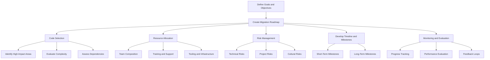

## 11.3.1 Planning the Migration

Transitioning from Java to Clojure is a significant undertaking that requires careful planning and execution. This section will guide you through the essential steps involved in planning a migration from Java to Clojure, emphasizing the importance of setting clear goals, timelines, and success criteria. We will discuss how to create a migration roadmap that includes code selection, resource allocation, and risk management.

### Setting Clear Goals and Objectives

Before embarking on the migration journey, it's crucial to define clear goals and objectives. These will serve as the foundation for your migration plan and help ensure that all stakeholders are aligned.

#### Key Considerations for Goal Setting

- **Business Objectives**: Understand the business drivers behind the migration. Are you aiming to improve performance, reduce costs, or enhance maintainability?
- **Technical Goals**: Identify specific technical improvements you hope to achieve, such as increased concurrency, better code readability, or easier integration with modern technologies.
- **Success Criteria**: Define what success looks like for your migration. This could include metrics like reduced bug rates, improved performance benchmarks, or faster development cycles.

### Creating a Migration Roadmap

A well-structured roadmap is essential for guiding your migration process. It should outline the key phases of the migration, including code selection, resource allocation, and risk management.

#### Code Selection

Choosing the right code to migrate is a critical step. Not all Java code is suitable for immediate migration to Clojure, and some parts of your codebase may benefit more from the transition than others.

- **Identify High-Impact Areas**: Focus on areas where Clojure's strengths, such as concurrency and immutability, can provide the most benefit.
- **Evaluate Complexity**: Start with less complex modules to build confidence and experience before tackling more challenging parts of the codebase.
- **Assess Dependencies**: Consider the dependencies of the code you plan to migrate. Ensure that any third-party libraries or frameworks are compatible with Clojure.

#### Resource Allocation

Effective resource allocation is crucial for a successful migration. This includes both human resources and technical resources.

- **Team Composition**: Assemble a team with a mix of Java and Clojure expertise. This will facilitate knowledge transfer and ensure that both languages' best practices are considered.
- **Training and Support**: Provide training for team members who are new to Clojure. Consider pairing experienced Clojure developers with those less familiar with the language.
- **Tooling and Infrastructure**: Ensure that your development environment is set up to support Clojure development, including IDEs, build tools, and continuous integration systems.

#### Risk Management

Identifying and managing risks is a critical component of migration planning. This involves anticipating potential challenges and developing strategies to mitigate them.

- **Technical Risks**: Consider the technical challenges that may arise, such as performance issues or integration difficulties. Develop contingency plans to address these risks.
- **Project Risks**: Assess project-related risks, such as timeline delays or resource constraints. Establish clear communication channels to address these issues promptly.
- **Cultural Risks**: Recognize the potential for resistance to change within your organization. Engage stakeholders early and often to build buy-in and support for the migration.

### Developing a Timeline and Milestones

A detailed timeline with clear milestones will help keep your migration on track. This should include both short-term and long-term goals.

- **Short-Term Milestones**: Set achievable short-term goals to maintain momentum and demonstrate progress. These could include completing initial training, migrating a pilot module, or achieving a performance benchmark.
- **Long-Term Milestones**: Define long-term objectives that align with your overall migration goals. This might involve completing the migration of a critical system or achieving full integration with Clojure-based tools.

### Monitoring and Evaluation

Regular monitoring and evaluation are essential for ensuring that your migration stays on track and meets its objectives.

- **Progress Tracking**: Use project management tools to track progress against your roadmap and timeline. Regularly review milestones and adjust plans as needed.
- **Performance Evaluation**: Continuously evaluate the performance of migrated code to ensure it meets your success criteria. Use metrics to assess improvements in areas like speed, reliability, and maintainability.
- **Feedback Loops**: Establish feedback loops with stakeholders to gather input and make necessary adjustments. This will help ensure that the migration meets both technical and business objectives.

### Code Examples and Comparisons

To illustrate the migration process, let's compare a simple Java code snippet with its Clojure equivalent. This will help highlight the differences and similarities between the two languages.

#### Java Code Example

```java
// Java code to calculate the sum of an array
public class SumArray {
    public static int sum(int[] numbers) {
        int total = 0;
        for (int number : numbers) {
            total += number;
        }
        return total;
    }

    public static void main(String[] args) {
        int[] numbers = {1, 2, 3, 4, 5};
        System.out.println("Sum: " + sum(numbers));
    }
}
```

#### Clojure Code Example

```clojure
;; Clojure code to calculate the sum of a vector
(defn sum [numbers]
  ;; Use the reduce function to sum the numbers
  (reduce + numbers))

(defn -main []
  ;; Define a vector of numbers
  (let [numbers [1 2 3 4 5]]
    ;; Print the sum of the numbers
    (println "Sum:" (sum numbers))))
```

**Key Differences:**

- **Immutability**: Clojure's `reduce` function operates on immutable data structures, whereas Java uses mutable variables.
- **Conciseness**: Clojure's code is more concise, leveraging higher-order functions like `reduce`.
- **Functional Approach**: Clojure embraces a functional programming paradigm, focusing on functions and data transformations.

### Try It Yourself

Experiment with the Clojure code example by modifying the vector of numbers or using different functions with `reduce`. For instance, try calculating the product of the numbers instead of the sum.

### Diagrams and Visualizations

To further illustrate the migration process, let's use a flowchart to depict the steps involved in planning a migration from Java to Clojure.



**Diagram Description**: This flowchart outlines the key steps in planning a migration from Java to Clojure, including defining goals, creating a roadmap, and managing risks.

### Additional Resources

For further reading on Clojure and migration strategies, consider the following resources:

- [Official Clojure Documentation](https://clojure.org/)
- [ClojureDocs](https://clojuredocs.org/)
- [Clojure for the Brave and True](https://www.braveclojure.com/)

### Exercises and Practice Problems

1. **Define Success Criteria**: Identify three success criteria for your migration project and explain why they are important.
2. **Create a Migration Roadmap**: Draft a high-level roadmap for migrating a small Java application to Clojure. Include key phases and milestones.
3. **Risk Assessment**: List potential risks for your migration project and propose strategies to mitigate them.

### Key Takeaways

- **Clear Goals**: Setting clear goals and success criteria is essential for guiding your migration process.
- **Structured Roadmap**: A well-defined roadmap helps ensure that all aspects of the migration are considered, from code selection to risk management.
- **Resource Allocation**: Effective resource allocation, including team composition and tooling, is crucial for a successful migration.
- **Continuous Monitoring**: Regular monitoring and evaluation help keep the migration on track and ensure that it meets its objectives.

Now that we've explored the planning phase of migrating from Java to Clojure, let's delve into the step-by-step migration process in the next section.

## Quiz: Planning the Migration from Java to Clojure



### What is the first step in planning a migration from Java to Clojure?

- [x] Setting clear goals and objectives
- [ ] Allocating resources
- [ ] Developing a timeline
- [ ] Identifying risks

> **Explanation:** Setting clear goals and objectives is the foundation for any migration plan, as it aligns stakeholders and defines success criteria.

### Which of the following is a key consideration when selecting code for migration?

- [x] Evaluating complexity
- [ ] Developing a timeline
- [ ] Allocating resources
- [ ] Monitoring progress

> **Explanation:** Evaluating the complexity of the code helps determine the feasibility and order of migration.

### What is a critical component of resource allocation during migration?

- [x] Team composition
- [ ] Risk management
- [ ] Code selection
- [ ] Feedback loops

> **Explanation:** Assembling a team with the right mix of skills is crucial for a successful migration.

### Why is risk management important in migration planning?

- [x] It helps anticipate challenges and develop mitigation strategies.
- [ ] It defines success criteria.
- [ ] It allocates resources.
- [ ] It tracks progress.

> **Explanation:** Risk management is essential for identifying potential challenges and preparing strategies to address them.

### What should be included in a migration roadmap?

- [x] Code selection, resource allocation, and risk management
- [ ] Only code selection
- [ ] Only resource allocation
- [ ] Only risk management

> **Explanation:** A comprehensive roadmap includes all aspects of the migration process.

### What is the purpose of setting short-term milestones?

- [x] To maintain momentum and demonstrate progress
- [ ] To allocate resources
- [ ] To identify risks
- [ ] To evaluate complexity

> **Explanation:** Short-term milestones help keep the project on track and provide measurable progress.

### How can feedback loops benefit the migration process?

- [x] By gathering input and making necessary adjustments
- [ ] By allocating resources
- [ ] By evaluating complexity
- [ ] By selecting code

> **Explanation:** Feedback loops allow for continuous improvement and alignment with stakeholder expectations.

### What is a key difference between Java and Clojure code in the provided examples?

- [x] Clojure uses immutable data structures.
- [ ] Java uses immutable data structures.
- [ ] Clojure is more verbose.
- [ ] Java embraces a functional programming paradigm.

> **Explanation:** Clojure's use of immutable data structures is a key differentiator from Java.

### Which resource is recommended for further reading on Clojure?

- [x] Official Clojure Documentation
- [ ] JavaDocs
- [ ] Python Documentation
- [ ] Ruby on Rails Guides

> **Explanation:** The Official Clojure Documentation is a valuable resource for learning more about Clojure.

### True or False: Continuous monitoring is not necessary once the migration plan is in place.

- [ ] True
- [x] False

> **Explanation:** Continuous monitoring is essential to ensure the migration stays on track and meets its objectives.


