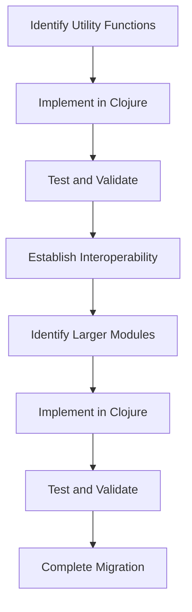

## 11.3.3 Incremental Migration Strategies

Migrating an existing Java codebase to Clojure can be a daunting task. However, by adopting incremental migration strategies, you can minimize disruption and ensure a smooth transition. This section will guide you through the process, leveraging the interoperability features between Java and Clojure to facilitate a seamless migration. We'll explore techniques such as starting with utility functions and gradually moving to larger modules, ensuring that your migration is both efficient and effective.

### Understanding Incremental Migration

Incremental migration involves gradually transitioning parts of your codebase from Java to Clojure. This approach allows you to test and validate each step, reducing the risk of introducing errors and ensuring that your application remains functional throughout the process. By breaking down the migration into smaller, manageable tasks, you can focus on specific areas of your codebase, making the transition more manageable and less overwhelming.

#### Benefits of Incremental Migration

- **Reduced Risk**: By migrating in small increments, you can identify and address issues early, minimizing the risk of large-scale failures.
- **Continuous Integration**: Incremental migration allows for continuous integration and testing, ensuring that your application remains stable throughout the transition.
- **Resource Management**: Smaller tasks are easier to manage and allocate resources to, making the migration process more efficient.
- **Knowledge Transfer**: As you migrate, your team can gradually learn and adapt to Clojure, building expertise over time.

### Starting with Utility Functions

One effective strategy for incremental migration is to begin with utility functions. These are typically small, self-contained pieces of code that perform specific tasks, making them ideal candidates for migration.

#### Example: Migrating a Utility Function

Let's consider a simple utility function in Java that calculates the factorial of a number:

```java
public class MathUtils {
    public static long factorial(int n) {
        if (n <= 1) return 1;
        else return n * factorial(n - 1);
    }
}
```

We can migrate this function to Clojure as follows:

```clojure
(ns math-utils)

(defn factorial [n]
  (if (<= n 1)
    1
    (* n (factorial (dec n)))))
```

**Explanation**: In Clojure, we define the `factorial` function using `defn`. The logic remains the same, but the syntax is more concise and expressive, leveraging Clojure's functional programming paradigm.

#### Try It Yourself

Experiment with modifying the `factorial` function to handle edge cases, such as negative numbers or non-integer inputs. Consider how Clojure's immutability and error handling can enhance the robustness of your utility functions.

### Leveraging Java-Clojure Interoperability

During the migration process, it's crucial to maintain interoperability between Java and Clojure code. This allows you to gradually replace Java components with Clojure equivalents without disrupting the entire application.

#### Calling Java from Clojure

Clojure provides seamless interoperability with Java, allowing you to call Java methods directly from Clojure code. Here's an example:

```clojure
(ns example.core
  (:import [java.util Date]))

(defn current-time []
  (.toString (Date.)))
```

**Explanation**: In this example, we import the `Date` class from Java's `java.util` package and use it to get the current time. The `(.toString (Date.))` syntax demonstrates how to call Java methods from Clojure.

#### Calling Clojure from Java

Conversely, you can also call Clojure functions from Java. This is particularly useful when you want to gradually introduce Clojure code into an existing Java application.

```java
import clojure.java.api.Clojure;
import clojure.lang.IFn;

public class ClojureInterop {
    public static void main(String[] args) {
        IFn factorial = Clojure.var("math-utils", "factorial");
        System.out.println(factorial.invoke(5)); // Output: 120
    }
}
```

**Explanation**: In this Java code, we use the `clojure.java.api.Clojure` class to load the `factorial` function from the `math-utils` namespace and invoke it with an argument.

### Migrating Larger Modules

Once you have successfully migrated utility functions and established interoperability, you can begin migrating larger modules. This involves identifying cohesive units of functionality that can be transitioned to Clojure.

#### Identifying Modules for Migration

- **Low Dependency**: Start with modules that have fewer dependencies on other parts of the codebase.
- **High Impact**: Focus on modules that will benefit most from Clojure's features, such as concurrency or immutability.
- **Frequent Changes**: Consider migrating modules that are frequently updated, as this will reduce the need for future migrations.

#### Example: Migrating a Service Layer

Let's consider a simple service layer in Java that handles user authentication:

```java
public class AuthService {
    public boolean authenticate(String username, String password) {
        // Authentication logic
        return true;
    }
}
```

We can migrate this service to Clojure as follows:

```clojure
(ns auth-service)

(defn authenticate [username password]
  ;; Authentication logic
  true)
```

**Explanation**: The `authenticate` function in Clojure mirrors the Java method, but with a more concise syntax. As you migrate larger modules, consider how Clojure's features can enhance the functionality and maintainability of your code.

### Techniques for Seamless Transition

To ensure a seamless transition, consider the following techniques:

- **Dual Implementation**: Maintain both Java and Clojure implementations during the migration phase, allowing you to switch between them as needed.
- **Feature Flags**: Use feature flags to toggle between Java and Clojure implementations, enabling gradual rollout and testing.
- **Automated Testing**: Implement automated tests to validate the functionality of both Java and Clojure code, ensuring consistency and correctness.

### Visualizing the Migration Process

To better understand the flow of an incremental migration, let's visualize the process using a flowchart:



**Diagram Explanation**: This flowchart illustrates the incremental migration process, starting with utility functions and progressing to larger modules. Each step involves testing and validation to ensure a smooth transition.

### Challenges and Solutions

#### Challenge: Managing Dependencies

**Solution**: Use dependency injection and modular design to decouple components, making it easier to migrate individual modules.

#### Challenge: Performance Considerations

**Solution**: Profile and benchmark both Java and Clojure implementations to identify performance bottlenecks and optimize accordingly.

#### Challenge: Team Adaptation

**Solution**: Provide training and resources to help your team adapt to Clojure's functional programming paradigm and build expertise over time.

### Exercises and Practice Problems

1. **Exercise**: Migrate a simple Java utility function to Clojure, ensuring that it handles edge cases and integrates with existing Java code.
2. **Practice Problem**: Identify a module in your Java codebase that would benefit from Clojure's concurrency features. Plan and execute an incremental migration for this module.
3. **Challenge**: Implement a feature flag system to toggle between Java and Clojure implementations, allowing for gradual rollout and testing.

### Key Takeaways

- Incremental migration reduces risk and ensures a smooth transition from Java to Clojure.
- Start with utility functions and gradually move to larger modules, leveraging interoperability features.
- Use techniques like dual implementation and feature flags to facilitate a seamless transition.
- Address challenges such as dependency management and team adaptation to ensure a successful migration.

By following these strategies, you can effectively migrate your Java codebase to Clojure, taking advantage of its powerful features and improving the maintainability and performance of your application.

## Quiz: Test Your Understanding of Incremental Migration Strategies



### What is the primary benefit of incremental migration?

- [x] Reduced risk of large-scale failures
- [ ] Faster migration process
- [ ] Complete codebase overhaul
- [ ] Immediate performance improvements

> **Explanation:** Incremental migration reduces the risk of large-scale failures by allowing for gradual testing and validation of each step.

### Which of the following is an ideal starting point for migration?

- [x] Utility functions
- [ ] Entire application
- [ ] Database schema
- [ ] User interface

> **Explanation:** Utility functions are small, self-contained, and ideal for initial migration efforts.

### How can you call a Java method from Clojure?

- [x] Using the `(.methodName object)` syntax
- [ ] Using the `import` keyword
- [ ] Using the `defn` keyword
- [ ] Using the `require` keyword

> **Explanation:** The `(.methodName object)` syntax is used to call Java methods from Clojure.

### What is a feature flag used for in migration?

- [x] Toggling between Java and Clojure implementations
- [ ] Enhancing performance
- [ ] Managing dependencies
- [ ] Improving code readability

> **Explanation:** Feature flags allow toggling between Java and Clojure implementations, facilitating gradual rollout and testing.

### Which technique helps in maintaining both Java and Clojure implementations?

- [x] Dual Implementation
- [ ] Code Overhaul
- [ ] Immediate Replacement
- [ ] Manual Testing

> **Explanation:** Dual implementation allows maintaining both Java and Clojure versions during migration.

### What is the role of automated testing in migration?

- [x] Validating functionality and ensuring consistency
- [ ] Replacing manual testing
- [ ] Enhancing code readability
- [ ] Managing dependencies

> **Explanation:** Automated testing validates functionality and ensures consistency between Java and Clojure code.

### Which of the following is a challenge in incremental migration?

- [x] Managing dependencies
- [ ] Immediate performance improvements
- [ ] Complete codebase overhaul
- [ ] Faster migration process

> **Explanation:** Managing dependencies is a challenge that needs to be addressed during incremental migration.

### How can you address performance considerations during migration?

- [x] Profile and benchmark implementations
- [ ] Use feature flags
- [ ] Implement dual versions
- [ ] Focus on utility functions

> **Explanation:** Profiling and benchmarking help identify performance bottlenecks and optimize implementations.

### What is the purpose of establishing interoperability?

- [x] Allowing Java and Clojure code to work together
- [ ] Enhancing code readability
- [ ] Managing dependencies
- [ ] Improving performance

> **Explanation:** Interoperability allows Java and Clojure code to work together during the migration process.

### True or False: Incremental migration involves migrating the entire codebase at once.

- [ ] True
- [x] False

> **Explanation:** Incremental migration involves gradually transitioning parts of the codebase, not the entire codebase at once.


