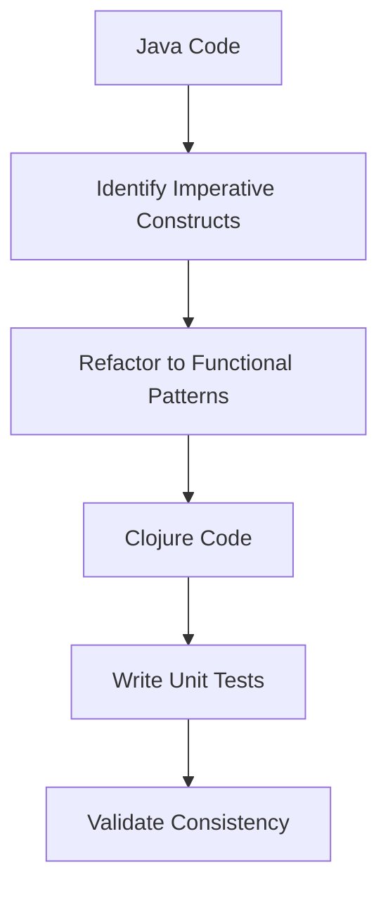

## 11.3.4 Refactoring and Testing

As we embark on the journey of migrating Java code to Clojure, refactoring and testing become crucial steps to ensure that the transition is smooth and that the application behaves consistently before and after the migration. This section will guide you through the process of refactoring Java code into idiomatic Clojure and writing comprehensive tests to validate the functionality of your application.

### Understanding the Importance of Refactoring

Refactoring is the process of restructuring existing code without changing its external behavior. It is essential during migration to improve the code's readability, maintainability, and performance. In the context of migrating from Java to Clojure, refactoring involves transforming imperative Java constructs into functional Clojure patterns.

#### Key Refactoring Goals:

- **Enhance Readability**: Clojure's concise syntax allows for more readable code, which is easier to understand and maintain.
- **Improve Maintainability**: By adopting functional programming principles, we can create modular and reusable code components.
- **Optimize Performance**: Leveraging Clojure's immutable data structures and concurrency primitives can lead to more efficient code execution.

### Refactoring Java Code to Clojure

Let's explore some common refactoring scenarios when migrating Java code to Clojure.

#### Example 1: Refactoring a Java Loop to a Clojure Higher-Order Function

**Java Code:**

```java
// Java: Summing an array of integers
int[] numbers = {1, 2, 3, 4, 5};
int sum = 0;
for (int number : numbers) {
    sum += number;
}
System.out.println("Sum: " + sum);
```

**Clojure Code:**

```clojure
;; Clojure: Summing a collection of integers
(def numbers [1 2 3 4 5])
(def sum (reduce + numbers))
(println "Sum:" sum)
```

**Explanation:**

- **Java**: Uses a loop to iterate over the array and accumulate the sum.
- **Clojure**: Utilizes the `reduce` function, a higher-order function, to achieve the same result in a more concise and expressive manner.

#### Example 2: Refactoring Java Conditionals to Clojure's `cond`

**Java Code:**

```java
// Java: Determine grade based on score
int score = 85;
String grade;
if (score >= 90) {
    grade = "A";
} else if (score >= 80) {
    grade = "B";
} else if (score >= 70) {
    grade = "C";
} else {
    grade = "D";
}
System.out.println("Grade: " + grade);
```

**Clojure Code:**

```clojure
;; Clojure: Determine grade based on score
(def score 85)
(def grade
  (cond
    (>= score 90) "A"
    (>= score 80) "B"
    (>= score 70) "C"
    :else "D"))
(println "Grade:" grade)
```

**Explanation:**

- **Java**: Uses a series of `if-else` statements to determine the grade.
- **Clojure**: Employs the `cond` macro, which provides a more readable and declarative approach to handling multiple conditions.

### Testing in Clojure

Testing is a critical component of the migration process. It ensures that the refactored code behaves as expected and that any changes do not introduce regressions.

#### Writing Unit Tests in Clojure

Clojure provides the `clojure.test` library for writing unit tests. Let's explore how to write tests for our refactored Clojure code.

**Example: Testing the Sum Function**

```clojure
(ns myapp.core-test
  (:require [clojure.test :refer :all]
            [myapp.core :refer :all]))

(deftest test-sum
  (testing "Sum of numbers"
    (is (= 15 (reduce + [1 2 3 4 5])))))
```

**Explanation:**

- **`deftest`**: Defines a test function.
- **`testing`**: Provides a description for the test case.
- **`is`**: Asserts that the expression evaluates to true.

#### Refactoring Java Tests to Clojure

When migrating, it's often necessary to refactor existing Java tests to Clojure. This involves translating JUnit or TestNG tests into `clojure.test` format.

**Java Test Example:**

```java
// Java: JUnit test for sum function
@Test
public void testSum() {
    int[] numbers = {1, 2, 3, 4, 5};
    int expectedSum = 15;
    assertEquals(expectedSum, sum(numbers));
}
```

**Clojure Test Example:**

```clojure
(deftest test-sum
  (testing "Sum of numbers"
    (is (= 15 (reduce + [1 2 3 4 5])))))
```

### Ensuring Consistent Behavior

To ensure consistent behavior before and after migration, it's important to:

- **Run Tests Regularly**: Execute tests frequently to catch any discrepancies early.
- **Compare Outputs**: Validate that the outputs of the Java and Clojure implementations match.
- **Use Property-Based Testing**: Leverage libraries like `test.check` for more comprehensive testing by generating a wide range of inputs.

### Try It Yourself

Experiment with the following exercises to deepen your understanding of refactoring and testing in Clojure:

1. **Refactor a Java Method**: Choose a simple Java method and refactor it into Clojure. Write unit tests to validate its functionality.
2. **Translate Java Tests**: Take an existing Java test case and convert it into a Clojure test using `clojure.test`.
3. **Explore Property-Based Testing**: Use `test.check` to write property-based tests for a Clojure function.

### Visualizing the Refactoring Process

Below is a diagram illustrating the flow of data through the refactoring process, highlighting the transition from imperative Java constructs to functional Clojure patterns.



**Diagram Description**: This flowchart represents the refactoring process, starting with Java code, identifying imperative constructs, refactoring to functional patterns, writing unit tests, and validating consistency.

### Further Reading

For more information on refactoring and testing in Clojure, consider exploring the following resources:

- [Official Clojure Documentation](https://clojure.org/)
- [ClojureDocs](https://clojuredocs.org/)
- [Clojure Testing Guide](https://clojure.org/guides/testing)

### Exercises and Practice Problems

1. **Refactor a Java Class**: Choose a Java class with multiple methods and refactor it into a Clojure namespace. Write tests for each method.
2. **Implement a Clojure Test Suite**: Create a comprehensive test suite for a Clojure project, covering edge cases and potential failure points.
3. **Compare Java and Clojure Implementations**: Implement the same functionality in both Java and Clojure, then compare the code for readability, maintainability, and performance.

### Key Takeaways

- **Refactoring**: Transform imperative Java constructs into functional Clojure patterns to enhance readability and maintainability.
- **Testing**: Write comprehensive tests to ensure consistent behavior before and after migration.
- **Consistency**: Regularly validate that the refactored code produces the same results as the original Java implementation.

By following these guidelines, you'll be well-equipped to refactor and test your code effectively during the migration from Java to Clojure, ensuring a seamless transition and leveraging the strengths of functional programming.

---

## Quiz: Mastering Refactoring and Testing in Clojure



### What is the primary goal of refactoring during code migration?

- [x] To improve code readability and maintainability without changing its external behavior.
- [ ] To add new features to the codebase.
- [ ] To rewrite the code in a different programming language.
- [ ] To remove all comments from the code.

> **Explanation:** Refactoring aims to improve the internal structure of the code without altering its external behavior, making it more readable and maintainable.

### Which Clojure function is commonly used to replace Java loops for summing a collection?

- [x] `reduce`
- [ ] `map`
- [ ] `filter`
- [ ] `for`

> **Explanation:** The `reduce` function in Clojure is used to accumulate values, making it suitable for tasks like summing a collection.

### In Clojure, which macro is used to handle multiple conditional expressions?

- [x] `cond`
- [ ] `if`
- [ ] `case`
- [ ] `when`

> **Explanation:** The `cond` macro in Clojure is used for handling multiple conditional expressions in a more readable and declarative way.

### What is the purpose of the `clojure.test` library?

- [x] To provide a framework for writing unit tests in Clojure.
- [ ] To compile Clojure code into Java bytecode.
- [ ] To manage dependencies in Clojure projects.
- [ ] To optimize Clojure code for performance.

> **Explanation:** The `clojure.test` library is used for writing and running unit tests in Clojure, ensuring code correctness.

### How can you ensure consistent behavior before and after migration?

- [x] By running tests regularly and comparing outputs.
- [ ] By rewriting all code from scratch.
- [ ] By ignoring edge cases.
- [ ] By using only manual testing.

> **Explanation:** Running tests regularly and comparing outputs helps ensure that the refactored code behaves consistently with the original implementation.

### What is a benefit of using property-based testing?

- [x] It generates a wide range of inputs to test the code more comprehensively.
- [ ] It eliminates the need for unit tests.
- [ ] It simplifies the codebase by removing complex logic.
- [ ] It focuses only on edge cases.

> **Explanation:** Property-based testing generates a wide range of inputs, allowing for more comprehensive testing of the code's behavior.

### Which tool can be used for property-based testing in Clojure?

- [x] `test.check`
- [ ] `leiningen`
- [ ] `clojure.core`
- [ ] `ring`

> **Explanation:** `test.check` is a library in Clojure used for property-based testing, allowing for the generation of random test cases.

### What is a key advantage of refactoring Java conditionals to Clojure's `cond`?

- [x] Improved readability and maintainability.
- [ ] Faster execution time.
- [ ] Reduced memory usage.
- [ ] Automatic parallelization.

> **Explanation:** Refactoring Java conditionals to Clojure's `cond` improves the readability and maintainability of the code by providing a more declarative syntax.

### Which Clojure function is used to assert that an expression evaluates to true in a test?

- [x] `is`
- [ ] `assert`
- [ ] `check`
- [ ] `verify`

> **Explanation:** The `is` function in `clojure.test` is used to assert that an expression evaluates to true, serving as the primary assertion mechanism in tests.

### True or False: Refactoring should change the external behavior of the code.

- [ ] True
- [x] False

> **Explanation:** Refactoring should not change the external behavior of the code; it focuses on improving the internal structure while maintaining the same functionality.


